cola Report for Hierarchical Partitioning - 'TCGA_GBM_microarray'
==================

**Date**: 2021-07-22 16:12:35 CEST, **cola version**: 1.9.4

----------------------------------------------------------------

<style type='text/css'>

body, td, th {
   font-family: Arial,Helvetica,sans-serif;
   background-color: white;
   font-size: 13px;
  max-width: 800px;
  margin: auto;
  margin-left:210px;
  padding: 0px 10px 0px 10px;
  border-left: 1px solid #EEEEEE;
  line-height: 150%;
}

tt, code, pre {
   font-family: 'DejaVu Sans Mono', 'Droid Sans Mono', 'Lucida Console', Consolas, Monaco, 

monospace;
}

h1 {
   font-size:2.2em;
}

h2 {
   font-size:1.8em;
}

h3 {
   font-size:1.4em;
}

h4 {
   font-size:1.0em;
}

h5 {
   font-size:0.9em;
}

h6 {
   font-size:0.8em;
}

a {
  text-decoration: none;
  color: #0366d6;
}

a:hover {
  text-decoration: underline;
}

a:visited {
   color: #0366d6;
}

pre, img {
  max-width: 100%;
}
pre {
  overflow-x: auto;
}
pre code {
   display: block; padding: 0.5em;
}

code {
  font-size: 92%;
  border: 1px solid #ccc;
}

code[class] {
  background-color: #F8F8F8;
}

table, td, th {
  border: 1px solid #ccc;
}

blockquote {
   color:#666666;
   margin:0;
   padding-left: 1em;
   border-left: 0.5em #EEE solid;
}

hr {
   height: 0px;
   border-bottom: none;
   border-top-width: thin;
   border-top-style: dotted;
   border-top-color: #999999;
}

@media print {
   * {
      background: transparent !important;
      color: black !important;
      filter:none !important;
      -ms-filter: none !important;
   }

   body {
      font-size:12pt;
      max-width:100%;
   }

   a, a:visited {
      text-decoration: underline;
   }

   hr {
      visibility: hidden;
      page-break-before: always;
   }

   pre, blockquote {
      padding-right: 1em;
      page-break-inside: avoid;
   }

   tr, img {
      page-break-inside: avoid;
   }

   img {
      max-width: 100% !important;
   }

   @page :left {
      margin: 15mm 20mm 15mm 10mm;
   }

   @page :right {
      margin: 15mm 10mm 15mm 20mm;
   }

   p, h2, h3 {
      orphans: 3; widows: 3;
   }

   h2, h3 {
      page-break-after: avoid;
   }
}
</style>


## Summary


First the variable is renamed to `res_rh`.


```r
res_rh = rh
```


The partition hierarchy and all available functions which can be applied to `res_rh` object.


```r
res_rh
```

```
#> A 'HierarchicalPartition' object with 'ATC:skmeans' method.
#>   On a matrix with 11267 rows and 173 columns.
#>   Performed in total 3600 partitions.
#>   There are 16 groups under the following parameters:
#>     - min_samples: 6
#>     - mean_silhouette_cutoff: 0.9
#>     - min_n_signatures: 483 (signatures are selected based on:)
#>       - fdr_cutoff: 0.05
#>       - group_diff (scaled values): 0.5
#> 
#> Hierarchy of the partition:
#>   0, 173 cols
#>   |-- 01, 52 cols, 4051 signatures
#>   |   |-- 011, 17 cols, 55 signatures (c)
#>   |   |-- 012, 21 cols, 625 signatures
#>   |   |   |-- 0121, 10 cols (b)
#>   |   |   `-- 0122, 11 cols (b)
#>   |   `-- 013, 14 cols, 0 signatures (c)
#>   |-- 02, 66 cols, 4781 signatures
#>   |   |-- 021, 25 cols, 806 signatures
#>   |   |   |-- 0211, 11 cols (b)
#>   |   |   |-- 0212, 9 cols (b)
#>   |   |   `-- 0213, 5 cols (b)
#>   |   |-- 022, 24 cols, 666 signatures
#>   |   |   |-- 0221, 14 cols, 30 signatures (c)
#>   |   |   `-- 0222, 10 cols (b)
#>   |   `-- 023, 17 cols, 227 signatures (c)
#>   |-- 03, 24 cols, 1376 signatures
#>   |   |-- 031, 7 cols (b)
#>   |   |-- 032, 6 cols (b)
#>   |   |-- 033, 6 cols (b)
#>   |   `-- 034, 5 cols (b)
#>   `-- 04, 31 cols, 1954 signatures
#>       |-- 041, 18 cols, 257 signatures (c)
#>       `-- 042, 13 cols, 175 signatures (c)
#> Stop reason:
#>   b) Subgroup had too few columns.
#>   c) There were too few signatures.
#> 
#> Following methods can be applied to this 'HierarchicalPartition' object:
#>  [1] "all_leaves"            "all_nodes"             "cola_report"           "collect_classes"      
#>  [5] "colnames"              "compare_signatures"    "dimension_reduction"   "functional_enrichment"
#>  [9] "get_anno_col"          "get_anno"              "get_children_nodes"    "get_classes"          
#> [13] "get_matrix"            "get_signatures"        "is_leaf_node"          "max_depth"            
#> [17] "merge_node"            "ncol"                  "node_info"             "node_level"           
#> [21] "nrow"                  "rownames"              "show"                  "split_node"           
#> [25] "suggest_best_k"        "test_to_known_factors" "top_rows_heatmap"      "top_rows_overlap"     
#> 
#> You can get result for a single node by e.g. object["01"]
```

The call of `hierarchical_partition()` was:


```
#> hierarchical_partition(data = m, anno = subtype, anno_col = subtype_col, cores = 4)
```

Dimension of the input matrix:


```r
mat = get_matrix(res_rh)
dim(mat)
```

```
#> [1] 11267   173
```

All the methods that were tried:


```r
res_rh@param$combination_method
```

```
#> [[1]]
#> [1] "ATC"     "skmeans"
```

### Density distribution

The density distribution for each sample is visualized as one column in the following heatmap.
The clustering is based on the distance which is the Kolmogorov-Smirnov statistic between two distributions.


```r
library(ComplexHeatmap)
densityHeatmap(mat, top_annotation = HeatmapAnnotation(df = get_anno(res_rh), 
    col = get_anno_col(res_rh)), ylab = "value", cluster_columns = TRUE, show_column_names = FALSE,
    mc.cores = 1)
```


Some values about the hierarchy:


```r
all_nodes(res_rh)
```

```
#>  [1] "0"    "01"   "011"  "012"  "0121" "0122" "013"  "02"   "021"  "0211" "0212" "0213" "022" 
#> [14] "0221" "0222" "023"  "03"   "031"  "032"  "033"  "034"  "04"   "041"  "042"
```

```r
all_leaves(res_rh)
```

```
#>  [1] "011"  "0121" "0122" "013"  "0211" "0212" "0213" "0221" "0222" "023"  "031"  "032"  "033" 
#> [14] "034"  "041"  "042"
```

```r
node_info(res_rh)
```

```
#>      id best_method depth best_k n_columns n_signatures p_signatures is_leaf
#> 1     0 ATC:skmeans     1      4       173         9664      0.85773   FALSE
#> 2    01 ATC:skmeans     2      3        52         4051      0.35955   FALSE
#> 3   011 ATC:skmeans     3      2        17           55      0.00488    TRUE
#> 4   012 ATC:skmeans     3      2        21          625      0.05547   FALSE
#> 5  0121 not applied     4     NA        10           NA           NA    TRUE
#> 6  0122 not applied     4     NA        11           NA           NA    TRUE
#> 7   013 ATC:skmeans     3      2        14            0      0.00000    TRUE
#> 8    02 ATC:skmeans     2      3        66         4781      0.42434   FALSE
#> 9   021 ATC:skmeans     3      3        25          806      0.07154   FALSE
#> 10 0211 not applied     4     NA        11           NA           NA    TRUE
#> 11 0212 not applied     4     NA         9           NA           NA    TRUE
#> 12 0213 not applied     4     NA         5           NA           NA    TRUE
#> 13  022 ATC:skmeans     3      2        24          666      0.05911   FALSE
#> 14 0221 ATC:skmeans     4      2        14           30      0.00266    TRUE
#> 15 0222 not applied     4     NA        10           NA           NA    TRUE
#> 16  023 ATC:skmeans     3      2        17          227      0.02015    TRUE
#> 17   03 ATC:skmeans     2      4        24         1376      0.12213   FALSE
#> 18  031 not applied     3     NA         7           NA           NA    TRUE
#> 19  032 not applied     3     NA         6           NA           NA    TRUE
#> 20  033 not applied     3     NA         6           NA           NA    TRUE
#> 21  034 not applied     3     NA         5           NA           NA    TRUE
#> 22   04 ATC:skmeans     2      2        31         1954      0.17343   FALSE
#> 23  041 ATC:skmeans     3      2        18          257      0.02281    TRUE
#> 24  042 ATC:skmeans     3      2        13          175      0.01553    TRUE
```

In the output from `node_info()`, there are the following columns:

- `id`: The node id.
- `best_method`: The best method selected.
- `depth`: Depth of the node in the hierarchy.
- `best_k`: Best number of groups of the partition on that node.
- `n_columns`: Number of columns in the submatrix.
- `n_signatures`: Number of signatures with the `best_k`.
- `p_signatures`: Proportion of hte signatures in total number of rows in the matrix.
- `is_leaf`: Whether the node is a leaf.

Labels of nodes are encoded in a special way. The number of digits
correspond to the depth of the node in the hierarchy and the value of the
digits correspond to the index of the subgroup in the current node, E.g. a label
of “012” means the node is the second subgroup of the partition which is the
first subgroup of the root node.

### Suggest the best k


Following table shows the best `k` (number of partitions) for each node in the
partition hierarchy. Clicking on the node name in the table goes to the
corresponding section for the partitioning on that node.

[The cola vignette](https://jokergoo.github.io/cola_vignettes/cola.html#toc_13)
explains the definition of the metrics used for determining the best
number of partitions.


```r
suggest_best_k(res_rh)
```


|Node                |Best method                                         |Is leaf   |Best k |1-PAC |Mean silhouette |Concordance | #samples|   |
|:-------------------|:---------------------------------------------------|:---------|:------|:-----|:---------------|:-----------|--------:|:--|
|[Node0](#Node0)     |ATC:skmeans                                         |          |4      |1.00  |0.98            |0.99        |      173|** |
|[Node01](#Node01)   |ATC:skmeans                                         |          |4      |0.91  |0.88            |0.94        |       52|*  |
|Node011-leaf        |ATC:skmeans                                         |✓ (&#99;) |2      |1.00  |1.00            |1.00        |       17|** |
|[Node012](#Node012) |ATC:skmeans                                         |          |3      |0.97  |0.96            |0.96        |       21|** |
|Node0121-leaf       |<span style='color:grey;'><i>not applied</i></span> |✓ (b)     |       |      |                |            |       10|   |
|Node0122-leaf       |<span style='color:grey;'><i>not applied</i></span> |✓ (b)     |       |      |                |            |       11|   |
|Node013-leaf        |ATC:skmeans                                         |✓ (&#99;) |2      |0.86  |0.92            |0.97        |       14|   |
|[Node02](#Node02)   |ATC:skmeans                                         |          |3      |0.98  |0.96            |0.98        |       66|** |
|[Node021](#Node021) |ATC:skmeans                                         |          |3      |1.00  |0.97            |0.98        |       25|** |
|Node0211-leaf       |<span style='color:grey;'><i>not applied</i></span> |✓ (b)     |       |      |                |            |       11|   |
|Node0212-leaf       |<span style='color:grey;'><i>not applied</i></span> |✓ (b)     |       |      |                |            |        9|   |
|Node0213-leaf       |<span style='color:grey;'><i>not applied</i></span> |✓ (b)     |       |      |                |            |        5|   |
|[Node022](#Node022) |ATC:skmeans                                         |          |3      |1.00  |0.98            |0.99        |       24|** |
|Node0221-leaf       |ATC:skmeans                                         |✓ (&#99;) |2      |1.00  |1.00            |1.00        |       14|** |
|Node0222-leaf       |<span style='color:grey;'><i>not applied</i></span> |✓ (b)     |       |      |                |            |       10|   |
|Node023-leaf        |ATC:skmeans                                         |✓ (&#99;) |3      |1.00  |0.99            |1.00        |       17|** |
|[Node03](#Node03)   |ATC:skmeans                                         |          |4      |0.93  |0.96            |0.96        |       24|*  |
|Node031-leaf        |<span style='color:grey;'><i>not applied</i></span> |✓ (b)     |       |      |                |            |        7|   |
|Node032-leaf        |<span style='color:grey;'><i>not applied</i></span> |✓ (b)     |       |      |                |            |        6|   |
|Node033-leaf        |<span style='color:grey;'><i>not applied</i></span> |✓ (b)     |       |      |                |            |        6|   |
|Node034-leaf        |<span style='color:grey;'><i>not applied</i></span> |✓ (b)     |       |      |                |            |        5|   |
|[Node04](#Node04)   |ATC:skmeans                                         |          |2      |1.00  |1.00            |1.00        |       31|** |
|Node041-leaf        |ATC:skmeans                                         |✓ (&#99;) |2      |1.00  |1.00            |1.00        |       18|** |
|Node042-leaf        |ATC:skmeans                                         |✓ (&#99;) |2      |1.00  |1.00            |1.00        |       13|** |


Stop reason: b) Subgroup had too few columns. c) There were too few signatures. 

\*\*: 1-PAC > 0.95, \*: 1-PAC > 0.9


### Partition hierarchy

The nodes of the hierarchy can be merged by setting the `merge_node` parameters. Here we 
control the hierarchy with the `min_n_signatures` parameter. The value of `min_n_signatures` is
from `node_info()`.


<style type='text/css'>


.ui-helper-hidden {
	display: none;
}
.ui-helper-hidden-accessible {
	border: 0;
	clip: rect(0 0 0 0);
	height: 1px;
	margin: -1px;
	overflow: hidden;
	padding: 0;
	position: absolute;
	width: 1px;
}
.ui-helper-reset {
	margin: 0;
	padding: 0;
	border: 0;
	outline: 0;
	line-height: 1.3;
	text-decoration: none;
	font-size: 100%;
	list-style: none;
}
.ui-helper-clearfix:before,
.ui-helper-clearfix:after {
	content: "";
	display: table;
	border-collapse: collapse;
}
.ui-helper-clearfix:after {
	clear: both;
}
.ui-helper-zfix {
	width: 100%;
	height: 100%;
	top: 0;
	left: 0;
	position: absolute;
	opacity: 0;
	filter:Alpha(Opacity=0); 
}

.ui-front {
	z-index: 100;
}


.ui-state-disabled {
	cursor: default !important;
	pointer-events: none;
}


.ui-icon {
	display: inline-block;
	vertical-align: middle;
	margin-top: -.25em;
	position: relative;
	text-indent: -99999px;
	overflow: hidden;
	background-repeat: no-repeat;
}

.ui-widget-icon-block {
	left: 50%;
	margin-left: -8px;
	display: block;
}


.ui-widget-overlay {
	position: fixed;
	top: 0;
	left: 0;
	width: 100%;
	height: 100%;
}
.ui-accordion .ui-accordion-header {
	display: block;
	cursor: pointer;
	position: relative;
	margin: 2px 0 0 0;
	padding: .5em .5em .5em .7em;
	font-size: 100%;
}
.ui-accordion .ui-accordion-content {
	padding: 1em 2.2em;
	border-top: 0;
	overflow: auto;
}
.ui-autocomplete {
	position: absolute;
	top: 0;
	left: 0;
	cursor: default;
}
.ui-menu {
	list-style: none;
	padding: 0;
	margin: 0;
	display: block;
	outline: 0;
}
.ui-menu .ui-menu {
	position: absolute;
}
.ui-menu .ui-menu-item {
	margin: 0;
	cursor: pointer;
	
	list-style-image: url("data:image/gif;base64,R0lGODlhAQABAIAAAAAAAP///yH5BAEAAAAALAAAAAABAAEAAAIBRAA7");
}
.ui-menu .ui-menu-item-wrapper {
	position: relative;
	padding: 3px 1em 3px .4em;
}
.ui-menu .ui-menu-divider {
	margin: 5px 0;
	height: 0;
	font-size: 0;
	line-height: 0;
	border-width: 1px 0 0 0;
}
.ui-menu .ui-state-focus,
.ui-menu .ui-state-active {
	margin: -1px;
}


.ui-menu-icons {
	position: relative;
}
.ui-menu-icons .ui-menu-item-wrapper {
	padding-left: 2em;
}


.ui-menu .ui-icon {
	position: absolute;
	top: 0;
	bottom: 0;
	left: .2em;
	margin: auto 0;
}


.ui-menu .ui-menu-icon {
	left: auto;
	right: 0;
}
.ui-button {
	padding: .4em 1em;
	display: inline-block;
	position: relative;
	line-height: normal;
	margin-right: .1em;
	cursor: pointer;
	vertical-align: middle;
	text-align: center;
	-webkit-user-select: none;
	-moz-user-select: none;
	-ms-user-select: none;
	user-select: none;

	
	overflow: visible;
}

.ui-button,
.ui-button:link,
.ui-button:visited,
.ui-button:hover,
.ui-button:active {
	text-decoration: none;
}


.ui-button-icon-only {
	width: 2em;
	box-sizing: border-box;
	text-indent: -9999px;
	white-space: nowrap;
}


input.ui-button.ui-button-icon-only {
	text-indent: 0;
}


.ui-button-icon-only .ui-icon {
	position: absolute;
	top: 50%;
	left: 50%;
	margin-top: -8px;
	margin-left: -8px;
}

.ui-button.ui-icon-notext .ui-icon {
	padding: 0;
	width: 2.1em;
	height: 2.1em;
	text-indent: -9999px;
	white-space: nowrap;

}

input.ui-button.ui-icon-notext .ui-icon {
	width: auto;
	height: auto;
	text-indent: 0;
	white-space: normal;
	padding: .4em 1em;
}


input.ui-button::-moz-focus-inner,
button.ui-button::-moz-focus-inner {
	border: 0;
	padding: 0;
}
.ui-controlgroup {
	vertical-align: middle;
	display: inline-block;
}
.ui-controlgroup > .ui-controlgroup-item {
	float: left;
	margin-left: 0;
	margin-right: 0;
}
.ui-controlgroup > .ui-controlgroup-item:focus,
.ui-controlgroup > .ui-controlgroup-item.ui-visual-focus {
	z-index: 9999;
}
.ui-controlgroup-vertical > .ui-controlgroup-item {
	display: block;
	float: none;
	width: 100%;
	margin-top: 0;
	margin-bottom: 0;
	text-align: left;
}
.ui-controlgroup-vertical .ui-controlgroup-item {
	box-sizing: border-box;
}
.ui-controlgroup .ui-controlgroup-label {
	padding: .4em 1em;
}
.ui-controlgroup .ui-controlgroup-label span {
	font-size: 80%;
}
.ui-controlgroup-horizontal .ui-controlgroup-label + .ui-controlgroup-item {
	border-left: none;
}
.ui-controlgroup-vertical .ui-controlgroup-label + .ui-controlgroup-item {
	border-top: none;
}
.ui-controlgroup-horizontal .ui-controlgroup-label.ui-widget-content {
	border-right: none;
}
.ui-controlgroup-vertical .ui-controlgroup-label.ui-widget-content {
	border-bottom: none;
}


.ui-controlgroup-vertical .ui-spinner-input {

	
	width: 75%;
	width: calc( 100% - 2.4em );
}
.ui-controlgroup-vertical .ui-spinner .ui-spinner-up {
	border-top-style: solid;
}

.ui-checkboxradio-label .ui-icon-background {
	box-shadow: inset 1px 1px 1px #ccc;
	border-radius: .12em;
	border: none;
}
.ui-checkboxradio-radio-label .ui-icon-background {
	width: 16px;
	height: 16px;
	border-radius: 1em;
	overflow: visible;
	border: none;
}
.ui-checkboxradio-radio-label.ui-checkboxradio-checked .ui-icon,
.ui-checkboxradio-radio-label.ui-checkboxradio-checked:hover .ui-icon {
	background-image: none;
	width: 8px;
	height: 8px;
	border-width: 4px;
	border-style: solid;
}
.ui-checkboxradio-disabled {
	pointer-events: none;
}
.ui-datepicker {
	width: 17em;
	padding: .2em .2em 0;
	display: none;
}
.ui-datepicker .ui-datepicker-header {
	position: relative;
	padding: .2em 0;
}
.ui-datepicker .ui-datepicker-prev,
.ui-datepicker .ui-datepicker-next {
	position: absolute;
	top: 2px;
	width: 1.8em;
	height: 1.8em;
}
.ui-datepicker .ui-datepicker-prev-hover,
.ui-datepicker .ui-datepicker-next-hover {
	top: 1px;
}
.ui-datepicker .ui-datepicker-prev {
	left: 2px;
}
.ui-datepicker .ui-datepicker-next {
	right: 2px;
}
.ui-datepicker .ui-datepicker-prev-hover {
	left: 1px;
}
.ui-datepicker .ui-datepicker-next-hover {
	right: 1px;
}
.ui-datepicker .ui-datepicker-prev span,
.ui-datepicker .ui-datepicker-next span {
	display: block;
	position: absolute;
	left: 50%;
	margin-left: -8px;
	top: 50%;
	margin-top: -8px;
}
.ui-datepicker .ui-datepicker-title {
	margin: 0 2.3em;
	line-height: 1.8em;
	text-align: center;
}
.ui-datepicker .ui-datepicker-title select {
	font-size: 1em;
	margin: 1px 0;
}
.ui-datepicker select.ui-datepicker-month,
.ui-datepicker select.ui-datepicker-year {
	width: 45%;
}
.ui-datepicker table {
	width: 100%;
	font-size: .9em;
	border-collapse: collapse;
	margin: 0 0 .4em;
}
.ui-datepicker th {
	padding: .7em .3em;
	text-align: center;
	font-weight: bold;
	border: 0;
}
.ui-datepicker td {
	border: 0;
	padding: 1px;
}
.ui-datepicker td span,
.ui-datepicker td a {
	display: block;
	padding: .2em;
	text-align: right;
	text-decoration: none;
}
.ui-datepicker .ui-datepicker-buttonpane {
	background-image: none;
	margin: .7em 0 0 0;
	padding: 0 .2em;
	border-left: 0;
	border-right: 0;
	border-bottom: 0;
}
.ui-datepicker .ui-datepicker-buttonpane button {
	float: right;
	margin: .5em .2em .4em;
	cursor: pointer;
	padding: .2em .6em .3em .6em;
	width: auto;
	overflow: visible;
}
.ui-datepicker .ui-datepicker-buttonpane button.ui-datepicker-current {
	float: left;
}


.ui-datepicker.ui-datepicker-multi {
	width: auto;
}
.ui-datepicker-multi .ui-datepicker-group {
	float: left;
}
.ui-datepicker-multi .ui-datepicker-group table {
	width: 95%;
	margin: 0 auto .4em;
}
.ui-datepicker-multi-2 .ui-datepicker-group {
	width: 50%;
}
.ui-datepicker-multi-3 .ui-datepicker-group {
	width: 33.3%;
}
.ui-datepicker-multi-4 .ui-datepicker-group {
	width: 25%;
}
.ui-datepicker-multi .ui-datepicker-group-last .ui-datepicker-header,
.ui-datepicker-multi .ui-datepicker-group-middle .ui-datepicker-header {
	border-left-width: 0;
}
.ui-datepicker-multi .ui-datepicker-buttonpane {
	clear: left;
}
.ui-datepicker-row-break {
	clear: both;
	width: 100%;
	font-size: 0;
}


.ui-datepicker-rtl {
	direction: rtl;
}
.ui-datepicker-rtl .ui-datepicker-prev {
	right: 2px;
	left: auto;
}
.ui-datepicker-rtl .ui-datepicker-next {
	left: 2px;
	right: auto;
}
.ui-datepicker-rtl .ui-datepicker-prev:hover {
	right: 1px;
	left: auto;
}
.ui-datepicker-rtl .ui-datepicker-next:hover {
	left: 1px;
	right: auto;
}
.ui-datepicker-rtl .ui-datepicker-buttonpane {
	clear: right;
}
.ui-datepicker-rtl .ui-datepicker-buttonpane button {
	float: left;
}
.ui-datepicker-rtl .ui-datepicker-buttonpane button.ui-datepicker-current,
.ui-datepicker-rtl .ui-datepicker-group {
	float: right;
}
.ui-datepicker-rtl .ui-datepicker-group-last .ui-datepicker-header,
.ui-datepicker-rtl .ui-datepicker-group-middle .ui-datepicker-header {
	border-right-width: 0;
	border-left-width: 1px;
}


.ui-datepicker .ui-icon {
	display: block;
	text-indent: -99999px;
	overflow: hidden;
	background-repeat: no-repeat;
	left: .5em;
	top: .3em;
}
.ui-dialog {
	position: absolute;
	top: 0;
	left: 0;
	padding: .2em;
	outline: 0;
}
.ui-dialog .ui-dialog-titlebar {
	padding: .4em 1em;
	position: relative;
}
.ui-dialog .ui-dialog-title {
	float: left;
	margin: .1em 0;
	white-space: nowrap;
	width: 90%;
	overflow: hidden;
	text-overflow: ellipsis;
}
.ui-dialog .ui-dialog-titlebar-close {
	position: absolute;
	right: .3em;
	top: 50%;
	width: 20px;
	margin: -10px 0 0 0;
	padding: 1px;
	height: 20px;
}
.ui-dialog .ui-dialog-content {
	position: relative;
	border: 0;
	padding: .5em 1em;
	background: none;
	overflow: auto;
}
.ui-dialog .ui-dialog-buttonpane {
	text-align: left;
	border-width: 1px 0 0 0;
	background-image: none;
	margin-top: .5em;
	padding: .3em 1em .5em .4em;
}
.ui-dialog .ui-dialog-buttonpane .ui-dialog-buttonset {
	float: right;
}
.ui-dialog .ui-dialog-buttonpane button {
	margin: .5em .4em .5em 0;
	cursor: pointer;
}
.ui-dialog .ui-resizable-n {
	height: 2px;
	top: 0;
}
.ui-dialog .ui-resizable-e {
	width: 2px;
	right: 0;
}
.ui-dialog .ui-resizable-s {
	height: 2px;
	bottom: 0;
}
.ui-dialog .ui-resizable-w {
	width: 2px;
	left: 0;
}
.ui-dialog .ui-resizable-se,
.ui-dialog .ui-resizable-sw,
.ui-dialog .ui-resizable-ne,
.ui-dialog .ui-resizable-nw {
	width: 7px;
	height: 7px;
}
.ui-dialog .ui-resizable-se {
	right: 0;
	bottom: 0;
}
.ui-dialog .ui-resizable-sw {
	left: 0;
	bottom: 0;
}
.ui-dialog .ui-resizable-ne {
	right: 0;
	top: 0;
}
.ui-dialog .ui-resizable-nw {
	left: 0;
	top: 0;
}
.ui-draggable .ui-dialog-titlebar {
	cursor: move;
}
.ui-draggable-handle {
	-ms-touch-action: none;
	touch-action: none;
}
.ui-resizable {
	position: relative;
}
.ui-resizable-handle {
	position: absolute;
	font-size: 0.1px;
	display: block;
	-ms-touch-action: none;
	touch-action: none;
}
.ui-resizable-disabled .ui-resizable-handle,
.ui-resizable-autohide .ui-resizable-handle {
	display: none;
}
.ui-resizable-n {
	cursor: n-resize;
	height: 7px;
	width: 100%;
	top: -5px;
	left: 0;
}
.ui-resizable-s {
	cursor: s-resize;
	height: 7px;
	width: 100%;
	bottom: -5px;
	left: 0;
}
.ui-resizable-e {
	cursor: e-resize;
	width: 7px;
	right: -5px;
	top: 0;
	height: 100%;
}
.ui-resizable-w {
	cursor: w-resize;
	width: 7px;
	left: -5px;
	top: 0;
	height: 100%;
}
.ui-resizable-se {
	cursor: se-resize;
	width: 12px;
	height: 12px;
	right: 1px;
	bottom: 1px;
}
.ui-resizable-sw {
	cursor: sw-resize;
	width: 9px;
	height: 9px;
	left: -5px;
	bottom: -5px;
}
.ui-resizable-nw {
	cursor: nw-resize;
	width: 9px;
	height: 9px;
	left: -5px;
	top: -5px;
}
.ui-resizable-ne {
	cursor: ne-resize;
	width: 9px;
	height: 9px;
	right: -5px;
	top: -5px;
}
.ui-progressbar {
	height: 2em;
	text-align: left;
	overflow: hidden;
}
.ui-progressbar .ui-progressbar-value {
	margin: -1px;
	height: 100%;
}
.ui-progressbar .ui-progressbar-overlay {
	background: url("");
	height: 100%;
	filter: alpha(opacity=25); 
	opacity: 0.25;
}
.ui-progressbar-indeterminate .ui-progressbar-value {
	background-image: none;
}
.ui-selectable {
	-ms-touch-action: none;
	touch-action: none;
}
.ui-selectable-helper {
	position: absolute;
	z-index: 100;
	border: 1px dotted black;
}
.ui-selectmenu-menu {
	padding: 0;
	margin: 0;
	position: absolute;
	top: 0;
	left: 0;
	display: none;
}
.ui-selectmenu-menu .ui-menu {
	overflow: auto;
	overflow-x: hidden;
	padding-bottom: 1px;
}
.ui-selectmenu-menu .ui-menu .ui-selectmenu-optgroup {
	font-size: 1em;
	font-weight: bold;
	line-height: 1.5;
	padding: 2px 0.4em;
	margin: 0.5em 0 0 0;
	height: auto;
	border: 0;
}
.ui-selectmenu-open {
	display: block;
}
.ui-selectmenu-text {
	display: block;
	margin-right: 20px;
	overflow: hidden;
	text-overflow: ellipsis;
}
.ui-selectmenu-button.ui-button {
	text-align: left;
	white-space: nowrap;
	width: 14em;
}
.ui-selectmenu-icon.ui-icon {
	float: right;
	margin-top: 0;
}
.ui-slider {
	position: relative;
	text-align: left;
}
.ui-slider .ui-slider-handle {
	position: absolute;
	z-index: 2;
	width: 1.2em;
	height: 1.2em;
	cursor: default;
	-ms-touch-action: none;
	touch-action: none;
}
.ui-slider .ui-slider-range {
	position: absolute;
	z-index: 1;
	font-size: .7em;
	display: block;
	border: 0;
	background-position: 0 0;
}


.ui-slider.ui-state-disabled .ui-slider-handle,
.ui-slider.ui-state-disabled .ui-slider-range {
	filter: inherit;
}

.ui-slider-horizontal {
	height: .8em;
}
.ui-slider-horizontal .ui-slider-handle {
	top: -.3em;
	margin-left: -.6em;
}
.ui-slider-horizontal .ui-slider-range {
	top: 0;
	height: 100%;
}
.ui-slider-horizontal .ui-slider-range-min {
	left: 0;
}
.ui-slider-horizontal .ui-slider-range-max {
	right: 0;
}

.ui-slider-vertical {
	width: .8em;
	height: 100px;
}
.ui-slider-vertical .ui-slider-handle {
	left: -.3em;
	margin-left: 0;
	margin-bottom: -.6em;
}
.ui-slider-vertical .ui-slider-range {
	left: 0;
	width: 100%;
}
.ui-slider-vertical .ui-slider-range-min {
	bottom: 0;
}
.ui-slider-vertical .ui-slider-range-max {
	top: 0;
}
.ui-sortable-handle {
	-ms-touch-action: none;
	touch-action: none;
}
.ui-spinner {
	position: relative;
	display: inline-block;
	overflow: hidden;
	padding: 0;
	vertical-align: middle;
}
.ui-spinner-input {
	border: none;
	background: none;
	color: inherit;
	padding: .222em 0;
	margin: .2em 0;
	vertical-align: middle;
	margin-left: .4em;
	margin-right: 2em;
}
.ui-spinner-button {
	width: 1.6em;
	height: 50%;
	font-size: .5em;
	padding: 0;
	margin: 0;
	text-align: center;
	position: absolute;
	cursor: default;
	display: block;
	overflow: hidden;
	right: 0;
}

.ui-spinner a.ui-spinner-button {
	border-top-style: none;
	border-bottom-style: none;
	border-right-style: none;
}
.ui-spinner-up {
	top: 0;
}
.ui-spinner-down {
	bottom: 0;
}
.ui-tabs {
	position: relative;
	padding: .2em;
}
.ui-tabs .ui-tabs-nav {
	margin: 0;
	padding: .2em .2em 0;
}
.ui-tabs .ui-tabs-nav li {
	list-style: none;
	float: left;
	position: relative;
	top: 0;
	margin: 1px .2em 0 0;
	border-bottom-width: 0;
	padding: 0;
	white-space: nowrap;
}
.ui-tabs .ui-tabs-nav .ui-tabs-anchor {
	float: left;
	padding: .5em 1em;
	text-decoration: none;
}
.ui-tabs .ui-tabs-nav li.ui-tabs-active {
	margin-bottom: -1px;
	padding-bottom: 1px;
}
.ui-tabs .ui-tabs-nav li.ui-tabs-active .ui-tabs-anchor,
.ui-tabs .ui-tabs-nav li.ui-state-disabled .ui-tabs-anchor,
.ui-tabs .ui-tabs-nav li.ui-tabs-loading .ui-tabs-anchor {
	cursor: text;
}
.ui-tabs-collapsible .ui-tabs-nav li.ui-tabs-active .ui-tabs-anchor {
	cursor: pointer;
}
.ui-tabs .ui-tabs-panel {
	display: block;
	border-width: 0;
	padding: 1em 1.4em;
	background: none;
}
.ui-tooltip {
	padding: 8px;
	position: absolute;
	z-index: 9999;
	max-width: 300px;
}
body .ui-tooltip {
	border-width: 2px;
}

.ui-widget {
	font-family: Arial,Helvetica,sans-serif;
	font-size: 1em;
}
.ui-widget .ui-widget {
	font-size: 1em;
}
.ui-widget input,
.ui-widget select,
.ui-widget textarea,
.ui-widget button {
	font-family: Arial,Helvetica,sans-serif;
	font-size: 1em;
}
.ui-widget.ui-widget-content {
	border: 1px solid #c5c5c5;
}
.ui-widget-content {
	border: 1px solid #dddddd;
	background: #ffffff;
	color: #333333;
}
.ui-widget-content a {
	color: #333333;
}
.ui-widget-header {
	border: 1px solid #dddddd;
	background: #e9e9e9;
	color: #333333;
	font-weight: bold;
}
.ui-widget-header a {
	color: #333333;
}


.ui-state-default,
.ui-widget-content .ui-state-default,
.ui-widget-header .ui-state-default,
.ui-button,


html .ui-button.ui-state-disabled:hover,
html .ui-button.ui-state-disabled:active {
	border: 1px solid #c5c5c5;
	background: #f6f6f6;
	font-weight: normal;
	color: #454545;
}
.ui-state-default a,
.ui-state-default a:link,
.ui-state-default a:visited,
a.ui-button,
a:link.ui-button,
a:visited.ui-button,
.ui-button {
	color: #454545;
	text-decoration: none;
}
.ui-state-hover,
.ui-widget-content .ui-state-hover,
.ui-widget-header .ui-state-hover,
.ui-state-focus,
.ui-widget-content .ui-state-focus,
.ui-widget-header .ui-state-focus,
.ui-button:hover,
.ui-button:focus {
	border: 1px solid #cccccc;
	background: #ededed;
	font-weight: normal;
	color: #2b2b2b;
}
.ui-state-hover a,
.ui-state-hover a:hover,
.ui-state-hover a:link,
.ui-state-hover a:visited,
.ui-state-focus a,
.ui-state-focus a:hover,
.ui-state-focus a:link,
.ui-state-focus a:visited,
a.ui-button:hover,
a.ui-button:focus {
	color: #2b2b2b;
	text-decoration: none;
}

.ui-visual-focus {
	box-shadow: 0 0 3px 1px rgb(94, 158, 214);
}
.ui-state-active,
.ui-widget-content .ui-state-active,
.ui-widget-header .ui-state-active,
a.ui-button:active,
.ui-button:active,
.ui-button.ui-state-active:hover {
	border: 1px solid #003eff;
	background: #007fff;
	font-weight: normal;
	color: #ffffff;
}
.ui-icon-background,
.ui-state-active .ui-icon-background {
	border: #003eff;
	background-color: #ffffff;
}
.ui-state-active a,
.ui-state-active a:link,
.ui-state-active a:visited {
	color: #ffffff;
	text-decoration: none;
}


.ui-state-highlight,
.ui-widget-content .ui-state-highlight,
.ui-widget-header .ui-state-highlight {
	border: 1px solid #dad55e;
	background: #fffa90;
	color: #777620;
}
.ui-state-checked {
	border: 1px solid #dad55e;
	background: #fffa90;
}
.ui-state-highlight a,
.ui-widget-content .ui-state-highlight a,
.ui-widget-header .ui-state-highlight a {
	color: #777620;
}
.ui-state-error,
.ui-widget-content .ui-state-error,
.ui-widget-header .ui-state-error {
	border: 1px solid #f1a899;
	background: #fddfdf;
	color: #5f3f3f;
}
.ui-state-error a,
.ui-widget-content .ui-state-error a,
.ui-widget-header .ui-state-error a {
	color: #5f3f3f;
}
.ui-state-error-text,
.ui-widget-content .ui-state-error-text,
.ui-widget-header .ui-state-error-text {
	color: #5f3f3f;
}
.ui-priority-primary,
.ui-widget-content .ui-priority-primary,
.ui-widget-header .ui-priority-primary {
	font-weight: bold;
}
.ui-priority-secondary,
.ui-widget-content .ui-priority-secondary,
.ui-widget-header .ui-priority-secondary {
	opacity: .7;
	filter:Alpha(Opacity=70); 
	font-weight: normal;
}
.ui-state-disabled,
.ui-widget-content .ui-state-disabled,
.ui-widget-header .ui-state-disabled {
	opacity: .35;
	filter:Alpha(Opacity=35); 
	background-image: none;
}
.ui-state-disabled .ui-icon {
	filter:Alpha(Opacity=35); 
}


.ui-icon {
	width: 16px;
	height: 16px;
}
.ui-icon,
.ui-widget-content .ui-icon {
	background-image: url("images/ui-icons_444444_256x240.png");
}
.ui-widget-header .ui-icon {
	background-image: url("images/ui-icons_444444_256x240.png");
}
.ui-state-hover .ui-icon,
.ui-state-focus .ui-icon,
.ui-button:hover .ui-icon,
.ui-button:focus .ui-icon {
	background-image: url("images/ui-icons_555555_256x240.png");
}
.ui-state-active .ui-icon,
.ui-button:active .ui-icon {
	background-image: url("images/ui-icons_ffffff_256x240.png");
}
.ui-state-highlight .ui-icon,
.ui-button .ui-state-highlight.ui-icon {
	background-image: url("images/ui-icons_777620_256x240.png");
}
.ui-state-error .ui-icon,
.ui-state-error-text .ui-icon {
	background-image: url("images/ui-icons_cc0000_256x240.png");
}
.ui-button .ui-icon {
	background-image: url("images/ui-icons_777777_256x240.png");
}


.ui-icon-blank { background-position: 16px 16px; }
.ui-icon-caret-1-n { background-position: 0 0; }
.ui-icon-caret-1-ne { background-position: -16px 0; }
.ui-icon-caret-1-e { background-position: -32px 0; }
.ui-icon-caret-1-se { background-position: -48px 0; }
.ui-icon-caret-1-s { background-position: -65px 0; }
.ui-icon-caret-1-sw { background-position: -80px 0; }
.ui-icon-caret-1-w { background-position: -96px 0; }
.ui-icon-caret-1-nw { background-position: -112px 0; }
.ui-icon-caret-2-n-s { background-position: -128px 0; }
.ui-icon-caret-2-e-w { background-position: -144px 0; }
.ui-icon-triangle-1-n { background-position: 0 -16px; }
.ui-icon-triangle-1-ne { background-position: -16px -16px; }
.ui-icon-triangle-1-e { background-position: -32px -16px; }
.ui-icon-triangle-1-se { background-position: -48px -16px; }
.ui-icon-triangle-1-s { background-position: -65px -16px; }
.ui-icon-triangle-1-sw { background-position: -80px -16px; }
.ui-icon-triangle-1-w { background-position: -96px -16px; }
.ui-icon-triangle-1-nw { background-position: -112px -16px; }
.ui-icon-triangle-2-n-s { background-position: -128px -16px; }
.ui-icon-triangle-2-e-w { background-position: -144px -16px; }
.ui-icon-arrow-1-n { background-position: 0 -32px; }
.ui-icon-arrow-1-ne { background-position: -16px -32px; }
.ui-icon-arrow-1-e { background-position: -32px -32px; }
.ui-icon-arrow-1-se { background-position: -48px -32px; }
.ui-icon-arrow-1-s { background-position: -65px -32px; }
.ui-icon-arrow-1-sw { background-position: -80px -32px; }
.ui-icon-arrow-1-w { background-position: -96px -32px; }
.ui-icon-arrow-1-nw { background-position: -112px -32px; }
.ui-icon-arrow-2-n-s { background-position: -128px -32px; }
.ui-icon-arrow-2-ne-sw { background-position: -144px -32px; }
.ui-icon-arrow-2-e-w { background-position: -160px -32px; }
.ui-icon-arrow-2-se-nw { background-position: -176px -32px; }
.ui-icon-arrowstop-1-n { background-position: -192px -32px; }
.ui-icon-arrowstop-1-e { background-position: -208px -32px; }
.ui-icon-arrowstop-1-s { background-position: -224px -32px; }
.ui-icon-arrowstop-1-w { background-position: -240px -32px; }
.ui-icon-arrowthick-1-n { background-position: 1px -48px; }
.ui-icon-arrowthick-1-ne { background-position: -16px -48px; }
.ui-icon-arrowthick-1-e { background-position: -32px -48px; }
.ui-icon-arrowthick-1-se { background-position: -48px -48px; }
.ui-icon-arrowthick-1-s { background-position: -64px -48px; }
.ui-icon-arrowthick-1-sw { background-position: -80px -48px; }
.ui-icon-arrowthick-1-w { background-position: -96px -48px; }
.ui-icon-arrowthick-1-nw { background-position: -112px -48px; }
.ui-icon-arrowthick-2-n-s { background-position: -128px -48px; }
.ui-icon-arrowthick-2-ne-sw { background-position: -144px -48px; }
.ui-icon-arrowthick-2-e-w { background-position: -160px -48px; }
.ui-icon-arrowthick-2-se-nw { background-position: -176px -48px; }
.ui-icon-arrowthickstop-1-n { background-position: -192px -48px; }
.ui-icon-arrowthickstop-1-e { background-position: -208px -48px; }
.ui-icon-arrowthickstop-1-s { background-position: -224px -48px; }
.ui-icon-arrowthickstop-1-w { background-position: -240px -48px; }
.ui-icon-arrowreturnthick-1-w { background-position: 0 -64px; }
.ui-icon-arrowreturnthick-1-n { background-position: -16px -64px; }
.ui-icon-arrowreturnthick-1-e { background-position: -32px -64px; }
.ui-icon-arrowreturnthick-1-s { background-position: -48px -64px; }
.ui-icon-arrowreturn-1-w { background-position: -64px -64px; }
.ui-icon-arrowreturn-1-n { background-position: -80px -64px; }
.ui-icon-arrowreturn-1-e { background-position: -96px -64px; }
.ui-icon-arrowreturn-1-s { background-position: -112px -64px; }
.ui-icon-arrowrefresh-1-w { background-position: -128px -64px; }
.ui-icon-arrowrefresh-1-n { background-position: -144px -64px; }
.ui-icon-arrowrefresh-1-e { background-position: -160px -64px; }
.ui-icon-arrowrefresh-1-s { background-position: -176px -64px; }
.ui-icon-arrow-4 { background-position: 0 -80px; }
.ui-icon-arrow-4-diag { background-position: -16px -80px; }
.ui-icon-extlink { background-position: -32px -80px; }
.ui-icon-newwin { background-position: -48px -80px; }
.ui-icon-refresh { background-position: -64px -80px; }
.ui-icon-shuffle { background-position: -80px -80px; }
.ui-icon-transfer-e-w { background-position: -96px -80px; }
.ui-icon-transferthick-e-w { background-position: -112px -80px; }
.ui-icon-folder-collapsed { background-position: 0 -96px; }
.ui-icon-folder-open { background-position: -16px -96px; }
.ui-icon-document { background-position: -32px -96px; }
.ui-icon-document-b { background-position: -48px -96px; }
.ui-icon-note { background-position: -64px -96px; }
.ui-icon-mail-closed { background-position: -80px -96px; }
.ui-icon-mail-open { background-position: -96px -96px; }
.ui-icon-suitcase { background-position: -112px -96px; }
.ui-icon-comment { background-position: -128px -96px; }
.ui-icon-person { background-position: -144px -96px; }
.ui-icon-print { background-position: -160px -96px; }
.ui-icon-trash { background-position: -176px -96px; }
.ui-icon-locked { background-position: -192px -96px; }
.ui-icon-unlocked { background-position: -208px -96px; }
.ui-icon-bookmark { background-position: -224px -96px; }
.ui-icon-tag { background-position: -240px -96px; }
.ui-icon-home { background-position: 0 -112px; }
.ui-icon-flag { background-position: -16px -112px; }
.ui-icon-calendar { background-position: -32px -112px; }
.ui-icon-cart { background-position: -48px -112px; }
.ui-icon-pencil { background-position: -64px -112px; }
.ui-icon-clock { background-position: -80px -112px; }
.ui-icon-disk { background-position: -96px -112px; }
.ui-icon-calculator { background-position: -112px -112px; }
.ui-icon-zoomin { background-position: -128px -112px; }
.ui-icon-zoomout { background-position: -144px -112px; }
.ui-icon-search { background-position: -160px -112px; }
.ui-icon-wrench { background-position: -176px -112px; }
.ui-icon-gear { background-position: -192px -112px; }
.ui-icon-heart { background-position: -208px -112px; }
.ui-icon-star { background-position: -224px -112px; }
.ui-icon-link { background-position: -240px -112px; }
.ui-icon-cancel { background-position: 0 -128px; }
.ui-icon-plus { background-position: -16px -128px; }
.ui-icon-plusthick { background-position: -32px -128px; }
.ui-icon-minus { background-position: -48px -128px; }
.ui-icon-minusthick { background-position: -64px -128px; }
.ui-icon-close { background-position: -80px -128px; }
.ui-icon-closethick { background-position: -96px -128px; }
.ui-icon-key { background-position: -112px -128px; }
.ui-icon-lightbulb { background-position: -128px -128px; }
.ui-icon-scissors { background-position: -144px -128px; }
.ui-icon-clipboard { background-position: -160px -128px; }
.ui-icon-copy { background-position: -176px -128px; }
.ui-icon-contact { background-position: -192px -128px; }
.ui-icon-image { background-position: -208px -128px; }
.ui-icon-video { background-position: -224px -128px; }
.ui-icon-script { background-position: -240px -128px; }
.ui-icon-alert { background-position: 0 -144px; }
.ui-icon-info { background-position: -16px -144px; }
.ui-icon-notice { background-position: -32px -144px; }
.ui-icon-help { background-position: -48px -144px; }
.ui-icon-check { background-position: -64px -144px; }
.ui-icon-bullet { background-position: -80px -144px; }
.ui-icon-radio-on { background-position: -96px -144px; }
.ui-icon-radio-off { background-position: -112px -144px; }
.ui-icon-pin-w { background-position: -128px -144px; }
.ui-icon-pin-s { background-position: -144px -144px; }
.ui-icon-play { background-position: 0 -160px; }
.ui-icon-pause { background-position: -16px -160px; }
.ui-icon-seek-next { background-position: -32px -160px; }
.ui-icon-seek-prev { background-position: -48px -160px; }
.ui-icon-seek-end { background-position: -64px -160px; }
.ui-icon-seek-start { background-position: -80px -160px; }

.ui-icon-seek-first { background-position: -80px -160px; }
.ui-icon-stop { background-position: -96px -160px; }
.ui-icon-eject { background-position: -112px -160px; }
.ui-icon-volume-off { background-position: -128px -160px; }
.ui-icon-volume-on { background-position: -144px -160px; }
.ui-icon-power { background-position: 0 -176px; }
.ui-icon-signal-diag { background-position: -16px -176px; }
.ui-icon-signal { background-position: -32px -176px; }
.ui-icon-battery-0 { background-position: -48px -176px; }
.ui-icon-battery-1 { background-position: -64px -176px; }
.ui-icon-battery-2 { background-position: -80px -176px; }
.ui-icon-battery-3 { background-position: -96px -176px; }
.ui-icon-circle-plus { background-position: 0 -192px; }
.ui-icon-circle-minus { background-position: -16px -192px; }
.ui-icon-circle-close { background-position: -32px -192px; }
.ui-icon-circle-triangle-e { background-position: -48px -192px; }
.ui-icon-circle-triangle-s { background-position: -64px -192px; }
.ui-icon-circle-triangle-w { background-position: -80px -192px; }
.ui-icon-circle-triangle-n { background-position: -96px -192px; }
.ui-icon-circle-arrow-e { background-position: -112px -192px; }
.ui-icon-circle-arrow-s { background-position: -128px -192px; }
.ui-icon-circle-arrow-w { background-position: -144px -192px; }
.ui-icon-circle-arrow-n { background-position: -160px -192px; }
.ui-icon-circle-zoomin { background-position: -176px -192px; }
.ui-icon-circle-zoomout { background-position: -192px -192px; }
.ui-icon-circle-check { background-position: -208px -192px; }
.ui-icon-circlesmall-plus { background-position: 0 -208px; }
.ui-icon-circlesmall-minus { background-position: -16px -208px; }
.ui-icon-circlesmall-close { background-position: -32px -208px; }
.ui-icon-squaresmall-plus { background-position: -48px -208px; }
.ui-icon-squaresmall-minus { background-position: -64px -208px; }
.ui-icon-squaresmall-close { background-position: -80px -208px; }
.ui-icon-grip-dotted-vertical { background-position: 0 -224px; }
.ui-icon-grip-dotted-horizontal { background-position: -16px -224px; }
.ui-icon-grip-solid-vertical { background-position: -32px -224px; }
.ui-icon-grip-solid-horizontal { background-position: -48px -224px; }
.ui-icon-gripsmall-diagonal-se { background-position: -64px -224px; }
.ui-icon-grip-diagonal-se { background-position: -80px -224px; }


.ui-corner-all,
.ui-corner-top,
.ui-corner-left,
.ui-corner-tl {
	border-top-left-radius: 3px;
}
.ui-corner-all,
.ui-corner-top,
.ui-corner-right,
.ui-corner-tr {
	border-top-right-radius: 3px;
}
.ui-corner-all,
.ui-corner-bottom,
.ui-corner-left,
.ui-corner-bl {
	border-bottom-left-radius: 3px;
}
.ui-corner-all,
.ui-corner-bottom,
.ui-corner-right,
.ui-corner-br {
	border-bottom-right-radius: 3px;
}


.ui-widget-overlay {
	background: #aaaaaa;
	opacity: .3;
	filter: Alpha(Opacity=30); 
}
.ui-widget-shadow {
	-webkit-box-shadow: 0px 0px 5px #666666;
	box-shadow: 0px 0px 5px #666666;
} 
</style>
<script src='js/jquery-1.12.4.js'></script>
<script src='js/jquery-ui.js'></script>

<script>
$( function() {
	$( '#tabs-collect-classes-from-hierarchical-partition' ).tabs();
} );
</script>
<div id='tabs-collect-classes-from-hierarchical-partition'>
<ul>
<li><a href='#tab-collect-classes-from-hierarchical-partition-1'>n_signatures ≥ 625</a></li>
<li><a href='#tab-collect-classes-from-hierarchical-partition-2'>n_signatures ≥ 666</a></li>
<li><a href='#tab-collect-classes-from-hierarchical-partition-3'>n_signatures ≥ 806</a></li>
<li><a href='#tab-collect-classes-from-hierarchical-partition-4'>n_signatures ≥ 1376</a></li>
<li><a href='#tab-collect-classes-from-hierarchical-partition-5'>n_signatures ≥ 1954</a></li>
<li><a href='#tab-collect-classes-from-hierarchical-partition-6'>n_signatures ≥ 4051</a></li>
<li><a href='#tab-collect-classes-from-hierarchical-partition-7'>n_signatures ≥ 4781</a></li>
<li><a href='#tab-collect-classes-from-hierarchical-partition-8'>n_signatures ≥ 9664</a></li>
</ul>
<div id='tab-collect-classes-from-hierarchical-partition-1'>
<pre><code class="r">collect_classes(res_rh, merge_node = merge_node_param(min_n_signatures = 625))
</code></pre>

<p></p>

</div>
<div id='tab-collect-classes-from-hierarchical-partition-2'>
<pre><code class="r">collect_classes(res_rh, merge_node = merge_node_param(min_n_signatures = 666))
</code></pre>

<p>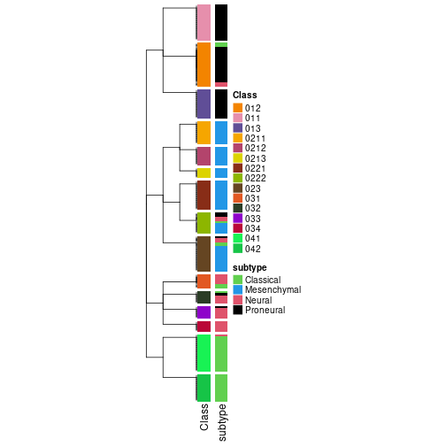</p>

</div>
<div id='tab-collect-classes-from-hierarchical-partition-3'>
<pre><code class="r">collect_classes(res_rh, merge_node = merge_node_param(min_n_signatures = 806))
</code></pre>

<p>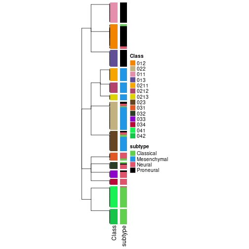</p>

</div>
<div id='tab-collect-classes-from-hierarchical-partition-4'>
<pre><code class="r">collect_classes(res_rh, merge_node = merge_node_param(min_n_signatures = 1376))
</code></pre>

<p>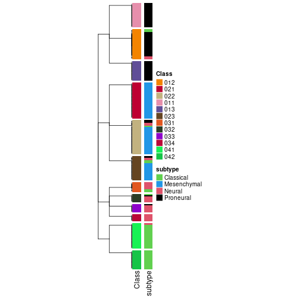</p>

</div>
<div id='tab-collect-classes-from-hierarchical-partition-5'>
<pre><code class="r">collect_classes(res_rh, merge_node = merge_node_param(min_n_signatures = 1954))
</code></pre>

<p>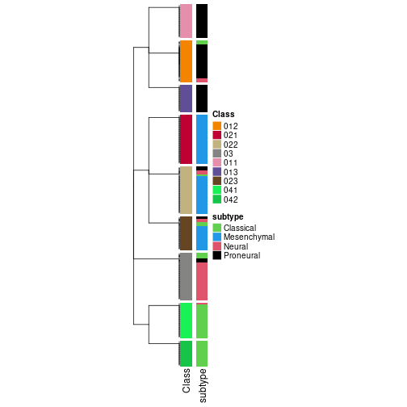</p>

</div>
<div id='tab-collect-classes-from-hierarchical-partition-6'>
<pre><code class="r">collect_classes(res_rh, merge_node = merge_node_param(min_n_signatures = 4051))
</code></pre>

<p>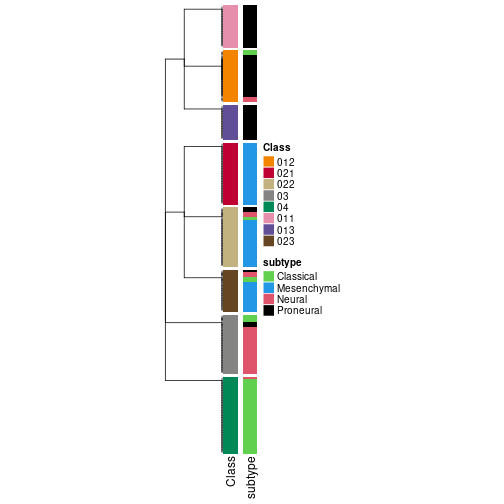</p>

</div>
<div id='tab-collect-classes-from-hierarchical-partition-7'>
<pre><code class="r">collect_classes(res_rh, merge_node = merge_node_param(min_n_signatures = 4781))
</code></pre>

<p>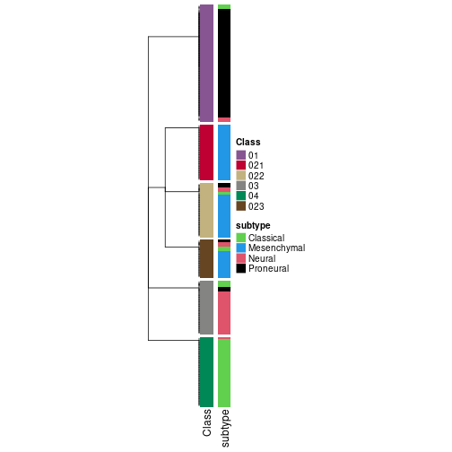</p>

</div>
<div id='tab-collect-classes-from-hierarchical-partition-8'>
<pre><code class="r">collect_classes(res_rh, merge_node = merge_node_param(min_n_signatures = 9664))
</code></pre>

<p>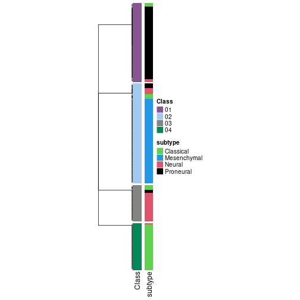</p>

</div>
</div>

Following shows the table of the partitions (You need to click the **show/hide
code output** link to see it).


<script>
$( function() {
	$( '#tabs-get-classes-from-hierarchical-partition' ).tabs();
} );
</script>
<div id='tabs-get-classes-from-hierarchical-partition'>
<ul>
<li><a href='#tab-get-classes-from-hierarchical-partition-1'>n_signatures ≥ 625</a></li>
<li><a href='#tab-get-classes-from-hierarchical-partition-2'>n_signatures ≥ 666</a></li>
<li><a href='#tab-get-classes-from-hierarchical-partition-3'>n_signatures ≥ 806</a></li>
<li><a href='#tab-get-classes-from-hierarchical-partition-4'>n_signatures ≥ 1376</a></li>
<li><a href='#tab-get-classes-from-hierarchical-partition-5'>n_signatures ≥ 1954</a></li>
<li><a href='#tab-get-classes-from-hierarchical-partition-6'>n_signatures ≥ 4051</a></li>
<li><a href='#tab-get-classes-from-hierarchical-partition-7'>n_signatures ≥ 4781</a></li>
<li><a href='#tab-get-classes-from-hierarchical-partition-8'>n_signatures ≥ 9664</a></li>
</ul>

<div id='tab-get-classes-from-hierarchical-partition-1'>
<p><a id='tab-get-classes-from-hierarchical-partition-1-a' style='color:#0366d6' href='#'>show/hide code output</a></p>
<pre><code class="r">get_classes(res_rh, merge_node = merge_node_param(min_n_signatures = 625))
</code></pre>

<pre><code>#&gt; TCGA-02-0003-01A-01 TCGA-02-0010-01A-01 TCGA-02-0011-01B-01 TCGA-02-0014-01A-01 TCGA-02-0024-01B-01 
#&gt;               &quot;011&quot;               &quot;013&quot;              &quot;0122&quot;               &quot;013&quot;               &quot;013&quot; 
#&gt; TCGA-02-0026-01B-01 TCGA-02-0028-01A-01 TCGA-02-0046-01A-01 TCGA-02-0047-01A-01 TCGA-02-0048-01A-01 
#&gt;               &quot;013&quot;               &quot;013&quot;               &quot;011&quot;               &quot;032&quot;               &quot;011&quot; 
#&gt; TCGA-02-0060-01A-01 TCGA-02-0069-01A-01 TCGA-02-0074-01A-01 TCGA-02-0080-01A-01 TCGA-02-0084-01A-03 
#&gt;              &quot;0122&quot;               &quot;013&quot;               &quot;013&quot;              &quot;0122&quot;               &quot;023&quot; 
#&gt; TCGA-02-0087-01A-01 TCGA-02-0104-01A-01 TCGA-02-0114-01A-01 TCGA-02-0281-01A-01 TCGA-02-0321-01A-01 
#&gt;              &quot;0122&quot;               &quot;011&quot;               &quot;011&quot;               &quot;013&quot;              &quot;0121&quot; 
#&gt; TCGA-02-0325-01A-01 TCGA-02-0338-01A-01 TCGA-02-0339-01A-01 TCGA-02-0432-01A-02 TCGA-02-0439-01A-01 
#&gt;              &quot;0122&quot;               &quot;013&quot;               &quot;013&quot;              &quot;0122&quot;              &quot;0122&quot; 
#&gt; TCGA-02-0440-01A-01 TCGA-02-0446-01A-01 TCGA-06-0128-01A-01 TCGA-06-0129-01A-01 TCGA-06-0146-01A-01 
#&gt;               &quot;011&quot;              &quot;0222&quot;               &quot;011&quot;               &quot;013&quot;              &quot;0122&quot; 
#&gt; TCGA-06-0156-01A-01 TCGA-06-0166-01A-01 TCGA-06-0174-01A-01 TCGA-06-0177-01A-01 TCGA-06-0238-01A-02 
#&gt;               &quot;011&quot;               &quot;011&quot;               &quot;011&quot;               &quot;013&quot;               &quot;033&quot; 
#&gt; TCGA-06-0241-01A-02 TCGA-06-0410-01A-01 TCGA-06-0413-01A-01 TCGA-06-0414-01A-01 TCGA-06-0646-01A-01 
#&gt;               &quot;011&quot;               &quot;011&quot;               &quot;013&quot;               &quot;011&quot;              &quot;0222&quot; 
#&gt; TCGA-06-0648-01A-01 TCGA-08-0245-01A-01 TCGA-08-0344-01A-01 TCGA-08-0347-01A-01 TCGA-08-0348-01A-01 
#&gt;              &quot;0121&quot;               &quot;011&quot;              &quot;0121&quot;              &quot;0121&quot;              &quot;0121&quot; 
#&gt; TCGA-08-0350-01A-01 TCGA-08-0353-01A-01 TCGA-08-0359-01A-01 TCGA-08-0385-01A-01 TCGA-08-0517-01A-01 
#&gt;              &quot;0121&quot;               &quot;011&quot;              &quot;0121&quot;              &quot;0121&quot;               &quot;011&quot; 
#&gt; TCGA-08-0524-01A-01 TCGA-12-0616-01A-01 TCGA-12-0618-01A-01 TCGA-02-0089-01A-01 TCGA-02-0113-01A-01 
#&gt;               &quot;013&quot;               &quot;011&quot;              &quot;0121&quot;              &quot;0222&quot;               &quot;032&quot; 
#&gt; TCGA-02-0115-01A-01 TCGA-02-0451-01A-01 TCGA-06-0132-01A-02 TCGA-06-0133-01A-02 TCGA-06-0138-01A-02 
#&gt;               &quot;032&quot;              &quot;0222&quot;               &quot;023&quot;               &quot;034&quot;               &quot;033&quot; 
#&gt; TCGA-06-0160-01A-01 TCGA-06-0162-01A-01 TCGA-06-0167-01A-01 TCGA-06-0171-01A-02 TCGA-06-0173-01A-01 
#&gt;              &quot;0122&quot;               &quot;033&quot;              &quot;0122&quot;               &quot;034&quot;               &quot;032&quot; 
#&gt; TCGA-06-0179-01A-02 TCGA-06-0182-01A-01 TCGA-06-0185-01A-01 TCGA-06-0195-01B-01 TCGA-06-0208-01B-01 
#&gt;               &quot;034&quot;               &quot;031&quot;               &quot;031&quot;               &quot;034&quot;               &quot;034&quot; 
#&gt; TCGA-06-0214-01A-02 TCGA-06-0219-01A-01 TCGA-06-0221-01A-01 TCGA-06-0237-01A-02 TCGA-06-0240-01A-02 
#&gt;               &quot;032&quot;               &quot;033&quot;               &quot;033&quot;               &quot;031&quot;               &quot;033&quot; 
#&gt; TCGA-08-0349-01A-01 TCGA-08-0380-01A-01 TCGA-08-0386-01A-01 TCGA-08-0520-01A-01 TCGA-02-0007-01A-01 
#&gt;               &quot;031&quot;               &quot;023&quot;               &quot;041&quot;               &quot;031&quot;               &quot;041&quot; 
#&gt; TCGA-02-0009-01A-01 TCGA-02-0016-01A-01 TCGA-02-0021-01A-01 TCGA-02-0023-01B-01 TCGA-02-0027-01A-01 
#&gt;               &quot;041&quot;               &quot;042&quot;               &quot;041&quot;               &quot;042&quot;              &quot;0122&quot; 
#&gt; TCGA-02-0038-01A-01 TCGA-02-0043-01A-01 TCGA-02-0070-01A-01 TCGA-02-0102-01A-01 TCGA-02-0260-01A-03 
#&gt;               &quot;032&quot;               &quot;041&quot;               &quot;042&quot;               &quot;041&quot;               &quot;042&quot; 
#&gt; TCGA-02-0269-01B-01 TCGA-02-0285-01A-01 TCGA-02-0289-01A-01 TCGA-02-0290-01A-01 TCGA-02-0317-01A-01 
#&gt;               &quot;042&quot;               &quot;042&quot;               &quot;042&quot;               &quot;031&quot;               &quot;042&quot; 
#&gt; TCGA-02-0333-01A-02 TCGA-02-0422-01A-01 TCGA-02-0430-01A-01 TCGA-06-0125-01A-01 TCGA-06-0126-01A-01 
#&gt;               &quot;042&quot;               &quot;042&quot;               &quot;041&quot;               &quot;041&quot;               &quot;041&quot; 
#&gt; TCGA-06-0137-01A-03 TCGA-06-0145-01A-04 TCGA-06-0148-01A-01 TCGA-06-0187-01A-01 TCGA-06-0211-01B-01 
#&gt;               &quot;041&quot;               &quot;041&quot;               &quot;042&quot;              &quot;0222&quot;               &quot;041&quot; 
#&gt; TCGA-06-0402-01A-01 TCGA-08-0246-01A-01 TCGA-08-0354-01A-01 TCGA-08-0355-01A-01 TCGA-08-0357-01A-01 
#&gt;               &quot;041&quot;               &quot;023&quot;               &quot;031&quot;               &quot;023&quot;               &quot;042&quot; 
#&gt; TCGA-08-0358-01A-01 TCGA-08-0375-01A-01 TCGA-08-0511-01A-01 TCGA-08-0514-01A-01 TCGA-08-0518-01A-01 
#&gt;               &quot;042&quot;              &quot;0121&quot;               &quot;041&quot;               &quot;041&quot;               &quot;041&quot; 
#&gt; TCGA-08-0529-01A-02 TCGA-08-0531-01A-01 TCGA-02-0057-01A-01 TCGA-02-0004-01A-01 TCGA-02-0006-01B-01 
#&gt;               &quot;041&quot;               &quot;041&quot;              &quot;0221&quot;              &quot;0212&quot;              &quot;0222&quot; 
#&gt; TCGA-02-0025-01A-01 TCGA-02-0033-01A-01 TCGA-02-0034-01A-01 TCGA-02-0039-01A-01 TCGA-02-0051-01A-01 
#&gt;               &quot;023&quot;              &quot;0211&quot;              &quot;0211&quot;               &quot;023&quot;              &quot;0212&quot; 
#&gt; TCGA-02-0054-01A-01 TCGA-02-0055-01A-01 TCGA-02-0059-01A-01 TCGA-02-0064-01A-01 TCGA-02-0075-01A-01 
#&gt;              &quot;0222&quot;              &quot;0212&quot;              &quot;0212&quot;              &quot;0221&quot;              &quot;0221&quot; 
#&gt; TCGA-02-0079-01A-03 TCGA-02-0085-01A-01 TCGA-02-0086-01A-01 TCGA-02-0099-01A-01 TCGA-02-0106-01A-01 
#&gt;               &quot;023&quot;              &quot;0221&quot;              &quot;0213&quot;              &quot;0222&quot;              &quot;0211&quot; 
#&gt; TCGA-02-0107-01A-01 TCGA-02-0111-01A-01 TCGA-02-0326-01A-01 TCGA-02-0337-01A-01 TCGA-06-0122-01A-01 
#&gt;              &quot;0221&quot;               &quot;023&quot;               &quot;023&quot;               &quot;023&quot;              &quot;0221&quot; 
#&gt; TCGA-06-0124-01A-01 TCGA-06-0130-01A-01 TCGA-06-0139-01A-01 TCGA-06-0143-01A-01 TCGA-06-0147-01A-01 
#&gt;              &quot;0221&quot;              &quot;0211&quot;              &quot;0213&quot;              &quot;0221&quot;              &quot;0221&quot; 
#&gt; TCGA-06-0149-01A-05 TCGA-06-0152-01A-02 TCGA-06-0154-01A-02 TCGA-06-0164-01A-01 TCGA-06-0175-01A-01 
#&gt;               &quot;023&quot;               &quot;023&quot;              &quot;0211&quot;              &quot;0213&quot;              &quot;0222&quot; 
#&gt; TCGA-06-0176-01A-03 TCGA-06-0184-01A-01 TCGA-06-0189-01A-05 TCGA-06-0190-01A-01 TCGA-06-0194-01A-01 
#&gt;              &quot;0211&quot;               &quot;023&quot;              &quot;0212&quot;              &quot;0211&quot;              &quot;0213&quot; 
#&gt; TCGA-06-0197-01A-02 TCGA-06-0210-01A-01 TCGA-06-0397-01A-01 TCGA-06-0409-01A-02 TCGA-06-0412-01A-01 
#&gt;              &quot;0212&quot;              &quot;0213&quot;              &quot;0211&quot;              &quot;0221&quot;              &quot;0222&quot; 
#&gt; TCGA-06-0644-01A-02 TCGA-06-0645-01A-01 TCGA-08-0346-01A-01 TCGA-08-0352-01A-01 TCGA-08-0360-01A-01 
#&gt;              &quot;0212&quot;               &quot;023&quot;               &quot;023&quot;              &quot;0221&quot;              &quot;0221&quot; 
#&gt; TCGA-08-0390-01A-01 TCGA-08-0392-01A-01 TCGA-08-0509-01A-01 TCGA-08-0510-01A-01 TCGA-08-0512-01A-01 
#&gt;              &quot;0212&quot;              &quot;0212&quot;              &quot;0221&quot;              &quot;0221&quot;              &quot;0211&quot; 
#&gt; TCGA-08-0522-01A-01 TCGA-12-0619-01A-01 TCGA-12-0620-01A-01 
#&gt;              &quot;0211&quot;              &quot;0211&quot;               &quot;023&quot;
</code></pre>

<script>
$('#tab-get-classes-from-hierarchical-partition-1-a').parent().next().next().hide();
$('#tab-get-classes-from-hierarchical-partition-1-a').click(function(){
  $('#tab-get-classes-from-hierarchical-partition-1-a').parent().next().next().toggle();
  return(false);
});
</script>
</div>

<div id='tab-get-classes-from-hierarchical-partition-2'>
<p><a id='tab-get-classes-from-hierarchical-partition-2-a' style='color:#0366d6' href='#'>show/hide code output</a></p>
<pre><code class="r">get_classes(res_rh, merge_node = merge_node_param(min_n_signatures = 666))
</code></pre>

<pre><code>#&gt; TCGA-02-0003-01A-01 TCGA-02-0010-01A-01 TCGA-02-0011-01B-01 TCGA-02-0014-01A-01 TCGA-02-0024-01B-01 
#&gt;               &quot;011&quot;               &quot;013&quot;               &quot;012&quot;               &quot;013&quot;               &quot;013&quot; 
#&gt; TCGA-02-0026-01B-01 TCGA-02-0028-01A-01 TCGA-02-0046-01A-01 TCGA-02-0047-01A-01 TCGA-02-0048-01A-01 
#&gt;               &quot;013&quot;               &quot;013&quot;               &quot;011&quot;               &quot;032&quot;               &quot;011&quot; 
#&gt; TCGA-02-0060-01A-01 TCGA-02-0069-01A-01 TCGA-02-0074-01A-01 TCGA-02-0080-01A-01 TCGA-02-0084-01A-03 
#&gt;               &quot;012&quot;               &quot;013&quot;               &quot;013&quot;               &quot;012&quot;               &quot;023&quot; 
#&gt; TCGA-02-0087-01A-01 TCGA-02-0104-01A-01 TCGA-02-0114-01A-01 TCGA-02-0281-01A-01 TCGA-02-0321-01A-01 
#&gt;               &quot;012&quot;               &quot;011&quot;               &quot;011&quot;               &quot;013&quot;               &quot;012&quot; 
#&gt; TCGA-02-0325-01A-01 TCGA-02-0338-01A-01 TCGA-02-0339-01A-01 TCGA-02-0432-01A-02 TCGA-02-0439-01A-01 
#&gt;               &quot;012&quot;               &quot;013&quot;               &quot;013&quot;               &quot;012&quot;               &quot;012&quot; 
#&gt; TCGA-02-0440-01A-01 TCGA-02-0446-01A-01 TCGA-06-0128-01A-01 TCGA-06-0129-01A-01 TCGA-06-0146-01A-01 
#&gt;               &quot;011&quot;              &quot;0222&quot;               &quot;011&quot;               &quot;013&quot;               &quot;012&quot; 
#&gt; TCGA-06-0156-01A-01 TCGA-06-0166-01A-01 TCGA-06-0174-01A-01 TCGA-06-0177-01A-01 TCGA-06-0238-01A-02 
#&gt;               &quot;011&quot;               &quot;011&quot;               &quot;011&quot;               &quot;013&quot;               &quot;033&quot; 
#&gt; TCGA-06-0241-01A-02 TCGA-06-0410-01A-01 TCGA-06-0413-01A-01 TCGA-06-0414-01A-01 TCGA-06-0646-01A-01 
#&gt;               &quot;011&quot;               &quot;011&quot;               &quot;013&quot;               &quot;011&quot;              &quot;0222&quot; 
#&gt; TCGA-06-0648-01A-01 TCGA-08-0245-01A-01 TCGA-08-0344-01A-01 TCGA-08-0347-01A-01 TCGA-08-0348-01A-01 
#&gt;               &quot;012&quot;               &quot;011&quot;               &quot;012&quot;               &quot;012&quot;               &quot;012&quot; 
#&gt; TCGA-08-0350-01A-01 TCGA-08-0353-01A-01 TCGA-08-0359-01A-01 TCGA-08-0385-01A-01 TCGA-08-0517-01A-01 
#&gt;               &quot;012&quot;               &quot;011&quot;               &quot;012&quot;               &quot;012&quot;               &quot;011&quot; 
#&gt; TCGA-08-0524-01A-01 TCGA-12-0616-01A-01 TCGA-12-0618-01A-01 TCGA-02-0089-01A-01 TCGA-02-0113-01A-01 
#&gt;               &quot;013&quot;               &quot;011&quot;               &quot;012&quot;              &quot;0222&quot;               &quot;032&quot; 
#&gt; TCGA-02-0115-01A-01 TCGA-02-0451-01A-01 TCGA-06-0132-01A-02 TCGA-06-0133-01A-02 TCGA-06-0138-01A-02 
#&gt;               &quot;032&quot;              &quot;0222&quot;               &quot;023&quot;               &quot;034&quot;               &quot;033&quot; 
#&gt; TCGA-06-0160-01A-01 TCGA-06-0162-01A-01 TCGA-06-0167-01A-01 TCGA-06-0171-01A-02 TCGA-06-0173-01A-01 
#&gt;               &quot;012&quot;               &quot;033&quot;               &quot;012&quot;               &quot;034&quot;               &quot;032&quot; 
#&gt; TCGA-06-0179-01A-02 TCGA-06-0182-01A-01 TCGA-06-0185-01A-01 TCGA-06-0195-01B-01 TCGA-06-0208-01B-01 
#&gt;               &quot;034&quot;               &quot;031&quot;               &quot;031&quot;               &quot;034&quot;               &quot;034&quot; 
#&gt; TCGA-06-0214-01A-02 TCGA-06-0219-01A-01 TCGA-06-0221-01A-01 TCGA-06-0237-01A-02 TCGA-06-0240-01A-02 
#&gt;               &quot;032&quot;               &quot;033&quot;               &quot;033&quot;               &quot;031&quot;               &quot;033&quot; 
#&gt; TCGA-08-0349-01A-01 TCGA-08-0380-01A-01 TCGA-08-0386-01A-01 TCGA-08-0520-01A-01 TCGA-02-0007-01A-01 
#&gt;               &quot;031&quot;               &quot;023&quot;               &quot;041&quot;               &quot;031&quot;               &quot;041&quot; 
#&gt; TCGA-02-0009-01A-01 TCGA-02-0016-01A-01 TCGA-02-0021-01A-01 TCGA-02-0023-01B-01 TCGA-02-0027-01A-01 
#&gt;               &quot;041&quot;               &quot;042&quot;               &quot;041&quot;               &quot;042&quot;               &quot;012&quot; 
#&gt; TCGA-02-0038-01A-01 TCGA-02-0043-01A-01 TCGA-02-0070-01A-01 TCGA-02-0102-01A-01 TCGA-02-0260-01A-03 
#&gt;               &quot;032&quot;               &quot;041&quot;               &quot;042&quot;               &quot;041&quot;               &quot;042&quot; 
#&gt; TCGA-02-0269-01B-01 TCGA-02-0285-01A-01 TCGA-02-0289-01A-01 TCGA-02-0290-01A-01 TCGA-02-0317-01A-01 
#&gt;               &quot;042&quot;               &quot;042&quot;               &quot;042&quot;               &quot;031&quot;               &quot;042&quot; 
#&gt; TCGA-02-0333-01A-02 TCGA-02-0422-01A-01 TCGA-02-0430-01A-01 TCGA-06-0125-01A-01 TCGA-06-0126-01A-01 
#&gt;               &quot;042&quot;               &quot;042&quot;               &quot;041&quot;               &quot;041&quot;               &quot;041&quot; 
#&gt; TCGA-06-0137-01A-03 TCGA-06-0145-01A-04 TCGA-06-0148-01A-01 TCGA-06-0187-01A-01 TCGA-06-0211-01B-01 
#&gt;               &quot;041&quot;               &quot;041&quot;               &quot;042&quot;              &quot;0222&quot;               &quot;041&quot; 
#&gt; TCGA-06-0402-01A-01 TCGA-08-0246-01A-01 TCGA-08-0354-01A-01 TCGA-08-0355-01A-01 TCGA-08-0357-01A-01 
#&gt;               &quot;041&quot;               &quot;023&quot;               &quot;031&quot;               &quot;023&quot;               &quot;042&quot; 
#&gt; TCGA-08-0358-01A-01 TCGA-08-0375-01A-01 TCGA-08-0511-01A-01 TCGA-08-0514-01A-01 TCGA-08-0518-01A-01 
#&gt;               &quot;042&quot;               &quot;012&quot;               &quot;041&quot;               &quot;041&quot;               &quot;041&quot; 
#&gt; TCGA-08-0529-01A-02 TCGA-08-0531-01A-01 TCGA-02-0057-01A-01 TCGA-02-0004-01A-01 TCGA-02-0006-01B-01 
#&gt;               &quot;041&quot;               &quot;041&quot;              &quot;0221&quot;              &quot;0212&quot;              &quot;0222&quot; 
#&gt; TCGA-02-0025-01A-01 TCGA-02-0033-01A-01 TCGA-02-0034-01A-01 TCGA-02-0039-01A-01 TCGA-02-0051-01A-01 
#&gt;               &quot;023&quot;              &quot;0211&quot;              &quot;0211&quot;               &quot;023&quot;              &quot;0212&quot; 
#&gt; TCGA-02-0054-01A-01 TCGA-02-0055-01A-01 TCGA-02-0059-01A-01 TCGA-02-0064-01A-01 TCGA-02-0075-01A-01 
#&gt;              &quot;0222&quot;              &quot;0212&quot;              &quot;0212&quot;              &quot;0221&quot;              &quot;0221&quot; 
#&gt; TCGA-02-0079-01A-03 TCGA-02-0085-01A-01 TCGA-02-0086-01A-01 TCGA-02-0099-01A-01 TCGA-02-0106-01A-01 
#&gt;               &quot;023&quot;              &quot;0221&quot;              &quot;0213&quot;              &quot;0222&quot;              &quot;0211&quot; 
#&gt; TCGA-02-0107-01A-01 TCGA-02-0111-01A-01 TCGA-02-0326-01A-01 TCGA-02-0337-01A-01 TCGA-06-0122-01A-01 
#&gt;              &quot;0221&quot;               &quot;023&quot;               &quot;023&quot;               &quot;023&quot;              &quot;0221&quot; 
#&gt; TCGA-06-0124-01A-01 TCGA-06-0130-01A-01 TCGA-06-0139-01A-01 TCGA-06-0143-01A-01 TCGA-06-0147-01A-01 
#&gt;              &quot;0221&quot;              &quot;0211&quot;              &quot;0213&quot;              &quot;0221&quot;              &quot;0221&quot; 
#&gt; TCGA-06-0149-01A-05 TCGA-06-0152-01A-02 TCGA-06-0154-01A-02 TCGA-06-0164-01A-01 TCGA-06-0175-01A-01 
#&gt;               &quot;023&quot;               &quot;023&quot;              &quot;0211&quot;              &quot;0213&quot;              &quot;0222&quot; 
#&gt; TCGA-06-0176-01A-03 TCGA-06-0184-01A-01 TCGA-06-0189-01A-05 TCGA-06-0190-01A-01 TCGA-06-0194-01A-01 
#&gt;              &quot;0211&quot;               &quot;023&quot;              &quot;0212&quot;              &quot;0211&quot;              &quot;0213&quot; 
#&gt; TCGA-06-0197-01A-02 TCGA-06-0210-01A-01 TCGA-06-0397-01A-01 TCGA-06-0409-01A-02 TCGA-06-0412-01A-01 
#&gt;              &quot;0212&quot;              &quot;0213&quot;              &quot;0211&quot;              &quot;0221&quot;              &quot;0222&quot; 
#&gt; TCGA-06-0644-01A-02 TCGA-06-0645-01A-01 TCGA-08-0346-01A-01 TCGA-08-0352-01A-01 TCGA-08-0360-01A-01 
#&gt;              &quot;0212&quot;               &quot;023&quot;               &quot;023&quot;              &quot;0221&quot;              &quot;0221&quot; 
#&gt; TCGA-08-0390-01A-01 TCGA-08-0392-01A-01 TCGA-08-0509-01A-01 TCGA-08-0510-01A-01 TCGA-08-0512-01A-01 
#&gt;              &quot;0212&quot;              &quot;0212&quot;              &quot;0221&quot;              &quot;0221&quot;              &quot;0211&quot; 
#&gt; TCGA-08-0522-01A-01 TCGA-12-0619-01A-01 TCGA-12-0620-01A-01 
#&gt;              &quot;0211&quot;              &quot;0211&quot;               &quot;023&quot;
</code></pre>

<script>
$('#tab-get-classes-from-hierarchical-partition-2-a').parent().next().next().hide();
$('#tab-get-classes-from-hierarchical-partition-2-a').click(function(){
  $('#tab-get-classes-from-hierarchical-partition-2-a').parent().next().next().toggle();
  return(false);
});
</script>
</div>

<div id='tab-get-classes-from-hierarchical-partition-3'>
<p><a id='tab-get-classes-from-hierarchical-partition-3-a' style='color:#0366d6' href='#'>show/hide code output</a></p>
<pre><code class="r">get_classes(res_rh, merge_node = merge_node_param(min_n_signatures = 806))
</code></pre>

<pre><code>#&gt; TCGA-02-0003-01A-01 TCGA-02-0010-01A-01 TCGA-02-0011-01B-01 TCGA-02-0014-01A-01 TCGA-02-0024-01B-01 
#&gt;               &quot;011&quot;               &quot;013&quot;               &quot;012&quot;               &quot;013&quot;               &quot;013&quot; 
#&gt; TCGA-02-0026-01B-01 TCGA-02-0028-01A-01 TCGA-02-0046-01A-01 TCGA-02-0047-01A-01 TCGA-02-0048-01A-01 
#&gt;               &quot;013&quot;               &quot;013&quot;               &quot;011&quot;               &quot;032&quot;               &quot;011&quot; 
#&gt; TCGA-02-0060-01A-01 TCGA-02-0069-01A-01 TCGA-02-0074-01A-01 TCGA-02-0080-01A-01 TCGA-02-0084-01A-03 
#&gt;               &quot;012&quot;               &quot;013&quot;               &quot;013&quot;               &quot;012&quot;               &quot;023&quot; 
#&gt; TCGA-02-0087-01A-01 TCGA-02-0104-01A-01 TCGA-02-0114-01A-01 TCGA-02-0281-01A-01 TCGA-02-0321-01A-01 
#&gt;               &quot;012&quot;               &quot;011&quot;               &quot;011&quot;               &quot;013&quot;               &quot;012&quot; 
#&gt; TCGA-02-0325-01A-01 TCGA-02-0338-01A-01 TCGA-02-0339-01A-01 TCGA-02-0432-01A-02 TCGA-02-0439-01A-01 
#&gt;               &quot;012&quot;               &quot;013&quot;               &quot;013&quot;               &quot;012&quot;               &quot;012&quot; 
#&gt; TCGA-02-0440-01A-01 TCGA-02-0446-01A-01 TCGA-06-0128-01A-01 TCGA-06-0129-01A-01 TCGA-06-0146-01A-01 
#&gt;               &quot;011&quot;               &quot;022&quot;               &quot;011&quot;               &quot;013&quot;               &quot;012&quot; 
#&gt; TCGA-06-0156-01A-01 TCGA-06-0166-01A-01 TCGA-06-0174-01A-01 TCGA-06-0177-01A-01 TCGA-06-0238-01A-02 
#&gt;               &quot;011&quot;               &quot;011&quot;               &quot;011&quot;               &quot;013&quot;               &quot;033&quot; 
#&gt; TCGA-06-0241-01A-02 TCGA-06-0410-01A-01 TCGA-06-0413-01A-01 TCGA-06-0414-01A-01 TCGA-06-0646-01A-01 
#&gt;               &quot;011&quot;               &quot;011&quot;               &quot;013&quot;               &quot;011&quot;               &quot;022&quot; 
#&gt; TCGA-06-0648-01A-01 TCGA-08-0245-01A-01 TCGA-08-0344-01A-01 TCGA-08-0347-01A-01 TCGA-08-0348-01A-01 
#&gt;               &quot;012&quot;               &quot;011&quot;               &quot;012&quot;               &quot;012&quot;               &quot;012&quot; 
#&gt; TCGA-08-0350-01A-01 TCGA-08-0353-01A-01 TCGA-08-0359-01A-01 TCGA-08-0385-01A-01 TCGA-08-0517-01A-01 
#&gt;               &quot;012&quot;               &quot;011&quot;               &quot;012&quot;               &quot;012&quot;               &quot;011&quot; 
#&gt; TCGA-08-0524-01A-01 TCGA-12-0616-01A-01 TCGA-12-0618-01A-01 TCGA-02-0089-01A-01 TCGA-02-0113-01A-01 
#&gt;               &quot;013&quot;               &quot;011&quot;               &quot;012&quot;               &quot;022&quot;               &quot;032&quot; 
#&gt; TCGA-02-0115-01A-01 TCGA-02-0451-01A-01 TCGA-06-0132-01A-02 TCGA-06-0133-01A-02 TCGA-06-0138-01A-02 
#&gt;               &quot;032&quot;               &quot;022&quot;               &quot;023&quot;               &quot;034&quot;               &quot;033&quot; 
#&gt; TCGA-06-0160-01A-01 TCGA-06-0162-01A-01 TCGA-06-0167-01A-01 TCGA-06-0171-01A-02 TCGA-06-0173-01A-01 
#&gt;               &quot;012&quot;               &quot;033&quot;               &quot;012&quot;               &quot;034&quot;               &quot;032&quot; 
#&gt; TCGA-06-0179-01A-02 TCGA-06-0182-01A-01 TCGA-06-0185-01A-01 TCGA-06-0195-01B-01 TCGA-06-0208-01B-01 
#&gt;               &quot;034&quot;               &quot;031&quot;               &quot;031&quot;               &quot;034&quot;               &quot;034&quot; 
#&gt; TCGA-06-0214-01A-02 TCGA-06-0219-01A-01 TCGA-06-0221-01A-01 TCGA-06-0237-01A-02 TCGA-06-0240-01A-02 
#&gt;               &quot;032&quot;               &quot;033&quot;               &quot;033&quot;               &quot;031&quot;               &quot;033&quot; 
#&gt; TCGA-08-0349-01A-01 TCGA-08-0380-01A-01 TCGA-08-0386-01A-01 TCGA-08-0520-01A-01 TCGA-02-0007-01A-01 
#&gt;               &quot;031&quot;               &quot;023&quot;               &quot;041&quot;               &quot;031&quot;               &quot;041&quot; 
#&gt; TCGA-02-0009-01A-01 TCGA-02-0016-01A-01 TCGA-02-0021-01A-01 TCGA-02-0023-01B-01 TCGA-02-0027-01A-01 
#&gt;               &quot;041&quot;               &quot;042&quot;               &quot;041&quot;               &quot;042&quot;               &quot;012&quot; 
#&gt; TCGA-02-0038-01A-01 TCGA-02-0043-01A-01 TCGA-02-0070-01A-01 TCGA-02-0102-01A-01 TCGA-02-0260-01A-03 
#&gt;               &quot;032&quot;               &quot;041&quot;               &quot;042&quot;               &quot;041&quot;               &quot;042&quot; 
#&gt; TCGA-02-0269-01B-01 TCGA-02-0285-01A-01 TCGA-02-0289-01A-01 TCGA-02-0290-01A-01 TCGA-02-0317-01A-01 
#&gt;               &quot;042&quot;               &quot;042&quot;               &quot;042&quot;               &quot;031&quot;               &quot;042&quot; 
#&gt; TCGA-02-0333-01A-02 TCGA-02-0422-01A-01 TCGA-02-0430-01A-01 TCGA-06-0125-01A-01 TCGA-06-0126-01A-01 
#&gt;               &quot;042&quot;               &quot;042&quot;               &quot;041&quot;               &quot;041&quot;               &quot;041&quot; 
#&gt; TCGA-06-0137-01A-03 TCGA-06-0145-01A-04 TCGA-06-0148-01A-01 TCGA-06-0187-01A-01 TCGA-06-0211-01B-01 
#&gt;               &quot;041&quot;               &quot;041&quot;               &quot;042&quot;               &quot;022&quot;               &quot;041&quot; 
#&gt; TCGA-06-0402-01A-01 TCGA-08-0246-01A-01 TCGA-08-0354-01A-01 TCGA-08-0355-01A-01 TCGA-08-0357-01A-01 
#&gt;               &quot;041&quot;               &quot;023&quot;               &quot;031&quot;               &quot;023&quot;               &quot;042&quot; 
#&gt; TCGA-08-0358-01A-01 TCGA-08-0375-01A-01 TCGA-08-0511-01A-01 TCGA-08-0514-01A-01 TCGA-08-0518-01A-01 
#&gt;               &quot;042&quot;               &quot;012&quot;               &quot;041&quot;               &quot;041&quot;               &quot;041&quot; 
#&gt; TCGA-08-0529-01A-02 TCGA-08-0531-01A-01 TCGA-02-0057-01A-01 TCGA-02-0004-01A-01 TCGA-02-0006-01B-01 
#&gt;               &quot;041&quot;               &quot;041&quot;               &quot;022&quot;              &quot;0212&quot;               &quot;022&quot; 
#&gt; TCGA-02-0025-01A-01 TCGA-02-0033-01A-01 TCGA-02-0034-01A-01 TCGA-02-0039-01A-01 TCGA-02-0051-01A-01 
#&gt;               &quot;023&quot;              &quot;0211&quot;              &quot;0211&quot;               &quot;023&quot;              &quot;0212&quot; 
#&gt; TCGA-02-0054-01A-01 TCGA-02-0055-01A-01 TCGA-02-0059-01A-01 TCGA-02-0064-01A-01 TCGA-02-0075-01A-01 
#&gt;               &quot;022&quot;              &quot;0212&quot;              &quot;0212&quot;               &quot;022&quot;               &quot;022&quot; 
#&gt; TCGA-02-0079-01A-03 TCGA-02-0085-01A-01 TCGA-02-0086-01A-01 TCGA-02-0099-01A-01 TCGA-02-0106-01A-01 
#&gt;               &quot;023&quot;               &quot;022&quot;              &quot;0213&quot;               &quot;022&quot;              &quot;0211&quot; 
#&gt; TCGA-02-0107-01A-01 TCGA-02-0111-01A-01 TCGA-02-0326-01A-01 TCGA-02-0337-01A-01 TCGA-06-0122-01A-01 
#&gt;               &quot;022&quot;               &quot;023&quot;               &quot;023&quot;               &quot;023&quot;               &quot;022&quot; 
#&gt; TCGA-06-0124-01A-01 TCGA-06-0130-01A-01 TCGA-06-0139-01A-01 TCGA-06-0143-01A-01 TCGA-06-0147-01A-01 
#&gt;               &quot;022&quot;              &quot;0211&quot;              &quot;0213&quot;               &quot;022&quot;               &quot;022&quot; 
#&gt; TCGA-06-0149-01A-05 TCGA-06-0152-01A-02 TCGA-06-0154-01A-02 TCGA-06-0164-01A-01 TCGA-06-0175-01A-01 
#&gt;               &quot;023&quot;               &quot;023&quot;              &quot;0211&quot;              &quot;0213&quot;               &quot;022&quot; 
#&gt; TCGA-06-0176-01A-03 TCGA-06-0184-01A-01 TCGA-06-0189-01A-05 TCGA-06-0190-01A-01 TCGA-06-0194-01A-01 
#&gt;              &quot;0211&quot;               &quot;023&quot;              &quot;0212&quot;              &quot;0211&quot;              &quot;0213&quot; 
#&gt; TCGA-06-0197-01A-02 TCGA-06-0210-01A-01 TCGA-06-0397-01A-01 TCGA-06-0409-01A-02 TCGA-06-0412-01A-01 
#&gt;              &quot;0212&quot;              &quot;0213&quot;              &quot;0211&quot;               &quot;022&quot;               &quot;022&quot; 
#&gt; TCGA-06-0644-01A-02 TCGA-06-0645-01A-01 TCGA-08-0346-01A-01 TCGA-08-0352-01A-01 TCGA-08-0360-01A-01 
#&gt;              &quot;0212&quot;               &quot;023&quot;               &quot;023&quot;               &quot;022&quot;               &quot;022&quot; 
#&gt; TCGA-08-0390-01A-01 TCGA-08-0392-01A-01 TCGA-08-0509-01A-01 TCGA-08-0510-01A-01 TCGA-08-0512-01A-01 
#&gt;              &quot;0212&quot;              &quot;0212&quot;               &quot;022&quot;               &quot;022&quot;              &quot;0211&quot; 
#&gt; TCGA-08-0522-01A-01 TCGA-12-0619-01A-01 TCGA-12-0620-01A-01 
#&gt;              &quot;0211&quot;              &quot;0211&quot;               &quot;023&quot;
</code></pre>

<script>
$('#tab-get-classes-from-hierarchical-partition-3-a').parent().next().next().hide();
$('#tab-get-classes-from-hierarchical-partition-3-a').click(function(){
  $('#tab-get-classes-from-hierarchical-partition-3-a').parent().next().next().toggle();
  return(false);
});
</script>
</div>

<div id='tab-get-classes-from-hierarchical-partition-4'>
<p><a id='tab-get-classes-from-hierarchical-partition-4-a' style='color:#0366d6' href='#'>show/hide code output</a></p>
<pre><code class="r">get_classes(res_rh, merge_node = merge_node_param(min_n_signatures = 1376))
</code></pre>

<pre><code>#&gt; TCGA-02-0003-01A-01 TCGA-02-0010-01A-01 TCGA-02-0011-01B-01 TCGA-02-0014-01A-01 TCGA-02-0024-01B-01 
#&gt;               &quot;011&quot;               &quot;013&quot;               &quot;012&quot;               &quot;013&quot;               &quot;013&quot; 
#&gt; TCGA-02-0026-01B-01 TCGA-02-0028-01A-01 TCGA-02-0046-01A-01 TCGA-02-0047-01A-01 TCGA-02-0048-01A-01 
#&gt;               &quot;013&quot;               &quot;013&quot;               &quot;011&quot;               &quot;032&quot;               &quot;011&quot; 
#&gt; TCGA-02-0060-01A-01 TCGA-02-0069-01A-01 TCGA-02-0074-01A-01 TCGA-02-0080-01A-01 TCGA-02-0084-01A-03 
#&gt;               &quot;012&quot;               &quot;013&quot;               &quot;013&quot;               &quot;012&quot;               &quot;023&quot; 
#&gt; TCGA-02-0087-01A-01 TCGA-02-0104-01A-01 TCGA-02-0114-01A-01 TCGA-02-0281-01A-01 TCGA-02-0321-01A-01 
#&gt;               &quot;012&quot;               &quot;011&quot;               &quot;011&quot;               &quot;013&quot;               &quot;012&quot; 
#&gt; TCGA-02-0325-01A-01 TCGA-02-0338-01A-01 TCGA-02-0339-01A-01 TCGA-02-0432-01A-02 TCGA-02-0439-01A-01 
#&gt;               &quot;012&quot;               &quot;013&quot;               &quot;013&quot;               &quot;012&quot;               &quot;012&quot; 
#&gt; TCGA-02-0440-01A-01 TCGA-02-0446-01A-01 TCGA-06-0128-01A-01 TCGA-06-0129-01A-01 TCGA-06-0146-01A-01 
#&gt;               &quot;011&quot;               &quot;022&quot;               &quot;011&quot;               &quot;013&quot;               &quot;012&quot; 
#&gt; TCGA-06-0156-01A-01 TCGA-06-0166-01A-01 TCGA-06-0174-01A-01 TCGA-06-0177-01A-01 TCGA-06-0238-01A-02 
#&gt;               &quot;011&quot;               &quot;011&quot;               &quot;011&quot;               &quot;013&quot;               &quot;033&quot; 
#&gt; TCGA-06-0241-01A-02 TCGA-06-0410-01A-01 TCGA-06-0413-01A-01 TCGA-06-0414-01A-01 TCGA-06-0646-01A-01 
#&gt;               &quot;011&quot;               &quot;011&quot;               &quot;013&quot;               &quot;011&quot;               &quot;022&quot; 
#&gt; TCGA-06-0648-01A-01 TCGA-08-0245-01A-01 TCGA-08-0344-01A-01 TCGA-08-0347-01A-01 TCGA-08-0348-01A-01 
#&gt;               &quot;012&quot;               &quot;011&quot;               &quot;012&quot;               &quot;012&quot;               &quot;012&quot; 
#&gt; TCGA-08-0350-01A-01 TCGA-08-0353-01A-01 TCGA-08-0359-01A-01 TCGA-08-0385-01A-01 TCGA-08-0517-01A-01 
#&gt;               &quot;012&quot;               &quot;011&quot;               &quot;012&quot;               &quot;012&quot;               &quot;011&quot; 
#&gt; TCGA-08-0524-01A-01 TCGA-12-0616-01A-01 TCGA-12-0618-01A-01 TCGA-02-0089-01A-01 TCGA-02-0113-01A-01 
#&gt;               &quot;013&quot;               &quot;011&quot;               &quot;012&quot;               &quot;022&quot;               &quot;032&quot; 
#&gt; TCGA-02-0115-01A-01 TCGA-02-0451-01A-01 TCGA-06-0132-01A-02 TCGA-06-0133-01A-02 TCGA-06-0138-01A-02 
#&gt;               &quot;032&quot;               &quot;022&quot;               &quot;023&quot;               &quot;034&quot;               &quot;033&quot; 
#&gt; TCGA-06-0160-01A-01 TCGA-06-0162-01A-01 TCGA-06-0167-01A-01 TCGA-06-0171-01A-02 TCGA-06-0173-01A-01 
#&gt;               &quot;012&quot;               &quot;033&quot;               &quot;012&quot;               &quot;034&quot;               &quot;032&quot; 
#&gt; TCGA-06-0179-01A-02 TCGA-06-0182-01A-01 TCGA-06-0185-01A-01 TCGA-06-0195-01B-01 TCGA-06-0208-01B-01 
#&gt;               &quot;034&quot;               &quot;031&quot;               &quot;031&quot;               &quot;034&quot;               &quot;034&quot; 
#&gt; TCGA-06-0214-01A-02 TCGA-06-0219-01A-01 TCGA-06-0221-01A-01 TCGA-06-0237-01A-02 TCGA-06-0240-01A-02 
#&gt;               &quot;032&quot;               &quot;033&quot;               &quot;033&quot;               &quot;031&quot;               &quot;033&quot; 
#&gt; TCGA-08-0349-01A-01 TCGA-08-0380-01A-01 TCGA-08-0386-01A-01 TCGA-08-0520-01A-01 TCGA-02-0007-01A-01 
#&gt;               &quot;031&quot;               &quot;023&quot;               &quot;041&quot;               &quot;031&quot;               &quot;041&quot; 
#&gt; TCGA-02-0009-01A-01 TCGA-02-0016-01A-01 TCGA-02-0021-01A-01 TCGA-02-0023-01B-01 TCGA-02-0027-01A-01 
#&gt;               &quot;041&quot;               &quot;042&quot;               &quot;041&quot;               &quot;042&quot;               &quot;012&quot; 
#&gt; TCGA-02-0038-01A-01 TCGA-02-0043-01A-01 TCGA-02-0070-01A-01 TCGA-02-0102-01A-01 TCGA-02-0260-01A-03 
#&gt;               &quot;032&quot;               &quot;041&quot;               &quot;042&quot;               &quot;041&quot;               &quot;042&quot; 
#&gt; TCGA-02-0269-01B-01 TCGA-02-0285-01A-01 TCGA-02-0289-01A-01 TCGA-02-0290-01A-01 TCGA-02-0317-01A-01 
#&gt;               &quot;042&quot;               &quot;042&quot;               &quot;042&quot;               &quot;031&quot;               &quot;042&quot; 
#&gt; TCGA-02-0333-01A-02 TCGA-02-0422-01A-01 TCGA-02-0430-01A-01 TCGA-06-0125-01A-01 TCGA-06-0126-01A-01 
#&gt;               &quot;042&quot;               &quot;042&quot;               &quot;041&quot;               &quot;041&quot;               &quot;041&quot; 
#&gt; TCGA-06-0137-01A-03 TCGA-06-0145-01A-04 TCGA-06-0148-01A-01 TCGA-06-0187-01A-01 TCGA-06-0211-01B-01 
#&gt;               &quot;041&quot;               &quot;041&quot;               &quot;042&quot;               &quot;022&quot;               &quot;041&quot; 
#&gt; TCGA-06-0402-01A-01 TCGA-08-0246-01A-01 TCGA-08-0354-01A-01 TCGA-08-0355-01A-01 TCGA-08-0357-01A-01 
#&gt;               &quot;041&quot;               &quot;023&quot;               &quot;031&quot;               &quot;023&quot;               &quot;042&quot; 
#&gt; TCGA-08-0358-01A-01 TCGA-08-0375-01A-01 TCGA-08-0511-01A-01 TCGA-08-0514-01A-01 TCGA-08-0518-01A-01 
#&gt;               &quot;042&quot;               &quot;012&quot;               &quot;041&quot;               &quot;041&quot;               &quot;041&quot; 
#&gt; TCGA-08-0529-01A-02 TCGA-08-0531-01A-01 TCGA-02-0057-01A-01 TCGA-02-0004-01A-01 TCGA-02-0006-01B-01 
#&gt;               &quot;041&quot;               &quot;041&quot;               &quot;022&quot;               &quot;021&quot;               &quot;022&quot; 
#&gt; TCGA-02-0025-01A-01 TCGA-02-0033-01A-01 TCGA-02-0034-01A-01 TCGA-02-0039-01A-01 TCGA-02-0051-01A-01 
#&gt;               &quot;023&quot;               &quot;021&quot;               &quot;021&quot;               &quot;023&quot;               &quot;021&quot; 
#&gt; TCGA-02-0054-01A-01 TCGA-02-0055-01A-01 TCGA-02-0059-01A-01 TCGA-02-0064-01A-01 TCGA-02-0075-01A-01 
#&gt;               &quot;022&quot;               &quot;021&quot;               &quot;021&quot;               &quot;022&quot;               &quot;022&quot; 
#&gt; TCGA-02-0079-01A-03 TCGA-02-0085-01A-01 TCGA-02-0086-01A-01 TCGA-02-0099-01A-01 TCGA-02-0106-01A-01 
#&gt;               &quot;023&quot;               &quot;022&quot;               &quot;021&quot;               &quot;022&quot;               &quot;021&quot; 
#&gt; TCGA-02-0107-01A-01 TCGA-02-0111-01A-01 TCGA-02-0326-01A-01 TCGA-02-0337-01A-01 TCGA-06-0122-01A-01 
#&gt;               &quot;022&quot;               &quot;023&quot;               &quot;023&quot;               &quot;023&quot;               &quot;022&quot; 
#&gt; TCGA-06-0124-01A-01 TCGA-06-0130-01A-01 TCGA-06-0139-01A-01 TCGA-06-0143-01A-01 TCGA-06-0147-01A-01 
#&gt;               &quot;022&quot;               &quot;021&quot;               &quot;021&quot;               &quot;022&quot;               &quot;022&quot; 
#&gt; TCGA-06-0149-01A-05 TCGA-06-0152-01A-02 TCGA-06-0154-01A-02 TCGA-06-0164-01A-01 TCGA-06-0175-01A-01 
#&gt;               &quot;023&quot;               &quot;023&quot;               &quot;021&quot;               &quot;021&quot;               &quot;022&quot; 
#&gt; TCGA-06-0176-01A-03 TCGA-06-0184-01A-01 TCGA-06-0189-01A-05 TCGA-06-0190-01A-01 TCGA-06-0194-01A-01 
#&gt;               &quot;021&quot;               &quot;023&quot;               &quot;021&quot;               &quot;021&quot;               &quot;021&quot; 
#&gt; TCGA-06-0197-01A-02 TCGA-06-0210-01A-01 TCGA-06-0397-01A-01 TCGA-06-0409-01A-02 TCGA-06-0412-01A-01 
#&gt;               &quot;021&quot;               &quot;021&quot;               &quot;021&quot;               &quot;022&quot;               &quot;022&quot; 
#&gt; TCGA-06-0644-01A-02 TCGA-06-0645-01A-01 TCGA-08-0346-01A-01 TCGA-08-0352-01A-01 TCGA-08-0360-01A-01 
#&gt;               &quot;021&quot;               &quot;023&quot;               &quot;023&quot;               &quot;022&quot;               &quot;022&quot; 
#&gt; TCGA-08-0390-01A-01 TCGA-08-0392-01A-01 TCGA-08-0509-01A-01 TCGA-08-0510-01A-01 TCGA-08-0512-01A-01 
#&gt;               &quot;021&quot;               &quot;021&quot;               &quot;022&quot;               &quot;022&quot;               &quot;021&quot; 
#&gt; TCGA-08-0522-01A-01 TCGA-12-0619-01A-01 TCGA-12-0620-01A-01 
#&gt;               &quot;021&quot;               &quot;021&quot;               &quot;023&quot;
</code></pre>

<script>
$('#tab-get-classes-from-hierarchical-partition-4-a').parent().next().next().hide();
$('#tab-get-classes-from-hierarchical-partition-4-a').click(function(){
  $('#tab-get-classes-from-hierarchical-partition-4-a').parent().next().next().toggle();
  return(false);
});
</script>
</div>

<div id='tab-get-classes-from-hierarchical-partition-5'>
<p><a id='tab-get-classes-from-hierarchical-partition-5-a' style='color:#0366d6' href='#'>show/hide code output</a></p>
<pre><code class="r">get_classes(res_rh, merge_node = merge_node_param(min_n_signatures = 1954))
</code></pre>

<pre><code>#&gt; TCGA-02-0003-01A-01 TCGA-02-0010-01A-01 TCGA-02-0011-01B-01 TCGA-02-0014-01A-01 TCGA-02-0024-01B-01 
#&gt;               &quot;011&quot;               &quot;013&quot;               &quot;012&quot;               &quot;013&quot;               &quot;013&quot; 
#&gt; TCGA-02-0026-01B-01 TCGA-02-0028-01A-01 TCGA-02-0046-01A-01 TCGA-02-0047-01A-01 TCGA-02-0048-01A-01 
#&gt;               &quot;013&quot;               &quot;013&quot;               &quot;011&quot;                &quot;03&quot;               &quot;011&quot; 
#&gt; TCGA-02-0060-01A-01 TCGA-02-0069-01A-01 TCGA-02-0074-01A-01 TCGA-02-0080-01A-01 TCGA-02-0084-01A-03 
#&gt;               &quot;012&quot;               &quot;013&quot;               &quot;013&quot;               &quot;012&quot;               &quot;023&quot; 
#&gt; TCGA-02-0087-01A-01 TCGA-02-0104-01A-01 TCGA-02-0114-01A-01 TCGA-02-0281-01A-01 TCGA-02-0321-01A-01 
#&gt;               &quot;012&quot;               &quot;011&quot;               &quot;011&quot;               &quot;013&quot;               &quot;012&quot; 
#&gt; TCGA-02-0325-01A-01 TCGA-02-0338-01A-01 TCGA-02-0339-01A-01 TCGA-02-0432-01A-02 TCGA-02-0439-01A-01 
#&gt;               &quot;012&quot;               &quot;013&quot;               &quot;013&quot;               &quot;012&quot;               &quot;012&quot; 
#&gt; TCGA-02-0440-01A-01 TCGA-02-0446-01A-01 TCGA-06-0128-01A-01 TCGA-06-0129-01A-01 TCGA-06-0146-01A-01 
#&gt;               &quot;011&quot;               &quot;022&quot;               &quot;011&quot;               &quot;013&quot;               &quot;012&quot; 
#&gt; TCGA-06-0156-01A-01 TCGA-06-0166-01A-01 TCGA-06-0174-01A-01 TCGA-06-0177-01A-01 TCGA-06-0238-01A-02 
#&gt;               &quot;011&quot;               &quot;011&quot;               &quot;011&quot;               &quot;013&quot;                &quot;03&quot; 
#&gt; TCGA-06-0241-01A-02 TCGA-06-0410-01A-01 TCGA-06-0413-01A-01 TCGA-06-0414-01A-01 TCGA-06-0646-01A-01 
#&gt;               &quot;011&quot;               &quot;011&quot;               &quot;013&quot;               &quot;011&quot;               &quot;022&quot; 
#&gt; TCGA-06-0648-01A-01 TCGA-08-0245-01A-01 TCGA-08-0344-01A-01 TCGA-08-0347-01A-01 TCGA-08-0348-01A-01 
#&gt;               &quot;012&quot;               &quot;011&quot;               &quot;012&quot;               &quot;012&quot;               &quot;012&quot; 
#&gt; TCGA-08-0350-01A-01 TCGA-08-0353-01A-01 TCGA-08-0359-01A-01 TCGA-08-0385-01A-01 TCGA-08-0517-01A-01 
#&gt;               &quot;012&quot;               &quot;011&quot;               &quot;012&quot;               &quot;012&quot;               &quot;011&quot; 
#&gt; TCGA-08-0524-01A-01 TCGA-12-0616-01A-01 TCGA-12-0618-01A-01 TCGA-02-0089-01A-01 TCGA-02-0113-01A-01 
#&gt;               &quot;013&quot;               &quot;011&quot;               &quot;012&quot;               &quot;022&quot;                &quot;03&quot; 
#&gt; TCGA-02-0115-01A-01 TCGA-02-0451-01A-01 TCGA-06-0132-01A-02 TCGA-06-0133-01A-02 TCGA-06-0138-01A-02 
#&gt;                &quot;03&quot;               &quot;022&quot;               &quot;023&quot;                &quot;03&quot;                &quot;03&quot; 
#&gt; TCGA-06-0160-01A-01 TCGA-06-0162-01A-01 TCGA-06-0167-01A-01 TCGA-06-0171-01A-02 TCGA-06-0173-01A-01 
#&gt;               &quot;012&quot;                &quot;03&quot;               &quot;012&quot;                &quot;03&quot;                &quot;03&quot; 
#&gt; TCGA-06-0179-01A-02 TCGA-06-0182-01A-01 TCGA-06-0185-01A-01 TCGA-06-0195-01B-01 TCGA-06-0208-01B-01 
#&gt;                &quot;03&quot;                &quot;03&quot;                &quot;03&quot;                &quot;03&quot;                &quot;03&quot; 
#&gt; TCGA-06-0214-01A-02 TCGA-06-0219-01A-01 TCGA-06-0221-01A-01 TCGA-06-0237-01A-02 TCGA-06-0240-01A-02 
#&gt;                &quot;03&quot;                &quot;03&quot;                &quot;03&quot;                &quot;03&quot;                &quot;03&quot; 
#&gt; TCGA-08-0349-01A-01 TCGA-08-0380-01A-01 TCGA-08-0386-01A-01 TCGA-08-0520-01A-01 TCGA-02-0007-01A-01 
#&gt;                &quot;03&quot;               &quot;023&quot;               &quot;041&quot;                &quot;03&quot;               &quot;041&quot; 
#&gt; TCGA-02-0009-01A-01 TCGA-02-0016-01A-01 TCGA-02-0021-01A-01 TCGA-02-0023-01B-01 TCGA-02-0027-01A-01 
#&gt;               &quot;041&quot;               &quot;042&quot;               &quot;041&quot;               &quot;042&quot;               &quot;012&quot; 
#&gt; TCGA-02-0038-01A-01 TCGA-02-0043-01A-01 TCGA-02-0070-01A-01 TCGA-02-0102-01A-01 TCGA-02-0260-01A-03 
#&gt;                &quot;03&quot;               &quot;041&quot;               &quot;042&quot;               &quot;041&quot;               &quot;042&quot; 
#&gt; TCGA-02-0269-01B-01 TCGA-02-0285-01A-01 TCGA-02-0289-01A-01 TCGA-02-0290-01A-01 TCGA-02-0317-01A-01 
#&gt;               &quot;042&quot;               &quot;042&quot;               &quot;042&quot;                &quot;03&quot;               &quot;042&quot; 
#&gt; TCGA-02-0333-01A-02 TCGA-02-0422-01A-01 TCGA-02-0430-01A-01 TCGA-06-0125-01A-01 TCGA-06-0126-01A-01 
#&gt;               &quot;042&quot;               &quot;042&quot;               &quot;041&quot;               &quot;041&quot;               &quot;041&quot; 
#&gt; TCGA-06-0137-01A-03 TCGA-06-0145-01A-04 TCGA-06-0148-01A-01 TCGA-06-0187-01A-01 TCGA-06-0211-01B-01 
#&gt;               &quot;041&quot;               &quot;041&quot;               &quot;042&quot;               &quot;022&quot;               &quot;041&quot; 
#&gt; TCGA-06-0402-01A-01 TCGA-08-0246-01A-01 TCGA-08-0354-01A-01 TCGA-08-0355-01A-01 TCGA-08-0357-01A-01 
#&gt;               &quot;041&quot;               &quot;023&quot;                &quot;03&quot;               &quot;023&quot;               &quot;042&quot; 
#&gt; TCGA-08-0358-01A-01 TCGA-08-0375-01A-01 TCGA-08-0511-01A-01 TCGA-08-0514-01A-01 TCGA-08-0518-01A-01 
#&gt;               &quot;042&quot;               &quot;012&quot;               &quot;041&quot;               &quot;041&quot;               &quot;041&quot; 
#&gt; TCGA-08-0529-01A-02 TCGA-08-0531-01A-01 TCGA-02-0057-01A-01 TCGA-02-0004-01A-01 TCGA-02-0006-01B-01 
#&gt;               &quot;041&quot;               &quot;041&quot;               &quot;022&quot;               &quot;021&quot;               &quot;022&quot; 
#&gt; TCGA-02-0025-01A-01 TCGA-02-0033-01A-01 TCGA-02-0034-01A-01 TCGA-02-0039-01A-01 TCGA-02-0051-01A-01 
#&gt;               &quot;023&quot;               &quot;021&quot;               &quot;021&quot;               &quot;023&quot;               &quot;021&quot; 
#&gt; TCGA-02-0054-01A-01 TCGA-02-0055-01A-01 TCGA-02-0059-01A-01 TCGA-02-0064-01A-01 TCGA-02-0075-01A-01 
#&gt;               &quot;022&quot;               &quot;021&quot;               &quot;021&quot;               &quot;022&quot;               &quot;022&quot; 
#&gt; TCGA-02-0079-01A-03 TCGA-02-0085-01A-01 TCGA-02-0086-01A-01 TCGA-02-0099-01A-01 TCGA-02-0106-01A-01 
#&gt;               &quot;023&quot;               &quot;022&quot;               &quot;021&quot;               &quot;022&quot;               &quot;021&quot; 
#&gt; TCGA-02-0107-01A-01 TCGA-02-0111-01A-01 TCGA-02-0326-01A-01 TCGA-02-0337-01A-01 TCGA-06-0122-01A-01 
#&gt;               &quot;022&quot;               &quot;023&quot;               &quot;023&quot;               &quot;023&quot;               &quot;022&quot; 
#&gt; TCGA-06-0124-01A-01 TCGA-06-0130-01A-01 TCGA-06-0139-01A-01 TCGA-06-0143-01A-01 TCGA-06-0147-01A-01 
#&gt;               &quot;022&quot;               &quot;021&quot;               &quot;021&quot;               &quot;022&quot;               &quot;022&quot; 
#&gt; TCGA-06-0149-01A-05 TCGA-06-0152-01A-02 TCGA-06-0154-01A-02 TCGA-06-0164-01A-01 TCGA-06-0175-01A-01 
#&gt;               &quot;023&quot;               &quot;023&quot;               &quot;021&quot;               &quot;021&quot;               &quot;022&quot; 
#&gt; TCGA-06-0176-01A-03 TCGA-06-0184-01A-01 TCGA-06-0189-01A-05 TCGA-06-0190-01A-01 TCGA-06-0194-01A-01 
#&gt;               &quot;021&quot;               &quot;023&quot;               &quot;021&quot;               &quot;021&quot;               &quot;021&quot; 
#&gt; TCGA-06-0197-01A-02 TCGA-06-0210-01A-01 TCGA-06-0397-01A-01 TCGA-06-0409-01A-02 TCGA-06-0412-01A-01 
#&gt;               &quot;021&quot;               &quot;021&quot;               &quot;021&quot;               &quot;022&quot;               &quot;022&quot; 
#&gt; TCGA-06-0644-01A-02 TCGA-06-0645-01A-01 TCGA-08-0346-01A-01 TCGA-08-0352-01A-01 TCGA-08-0360-01A-01 
#&gt;               &quot;021&quot;               &quot;023&quot;               &quot;023&quot;               &quot;022&quot;               &quot;022&quot; 
#&gt; TCGA-08-0390-01A-01 TCGA-08-0392-01A-01 TCGA-08-0509-01A-01 TCGA-08-0510-01A-01 TCGA-08-0512-01A-01 
#&gt;               &quot;021&quot;               &quot;021&quot;               &quot;022&quot;               &quot;022&quot;               &quot;021&quot; 
#&gt; TCGA-08-0522-01A-01 TCGA-12-0619-01A-01 TCGA-12-0620-01A-01 
#&gt;               &quot;021&quot;               &quot;021&quot;               &quot;023&quot;
</code></pre>

<script>
$('#tab-get-classes-from-hierarchical-partition-5-a').parent().next().next().hide();
$('#tab-get-classes-from-hierarchical-partition-5-a').click(function(){
  $('#tab-get-classes-from-hierarchical-partition-5-a').parent().next().next().toggle();
  return(false);
});
</script>
</div>

<div id='tab-get-classes-from-hierarchical-partition-6'>
<p><a id='tab-get-classes-from-hierarchical-partition-6-a' style='color:#0366d6' href='#'>show/hide code output</a></p>
<pre><code class="r">get_classes(res_rh, merge_node = merge_node_param(min_n_signatures = 4051))
</code></pre>

<pre><code>#&gt; TCGA-02-0003-01A-01 TCGA-02-0010-01A-01 TCGA-02-0011-01B-01 TCGA-02-0014-01A-01 TCGA-02-0024-01B-01 
#&gt;               &quot;011&quot;               &quot;013&quot;               &quot;012&quot;               &quot;013&quot;               &quot;013&quot; 
#&gt; TCGA-02-0026-01B-01 TCGA-02-0028-01A-01 TCGA-02-0046-01A-01 TCGA-02-0047-01A-01 TCGA-02-0048-01A-01 
#&gt;               &quot;013&quot;               &quot;013&quot;               &quot;011&quot;                &quot;03&quot;               &quot;011&quot; 
#&gt; TCGA-02-0060-01A-01 TCGA-02-0069-01A-01 TCGA-02-0074-01A-01 TCGA-02-0080-01A-01 TCGA-02-0084-01A-03 
#&gt;               &quot;012&quot;               &quot;013&quot;               &quot;013&quot;               &quot;012&quot;               &quot;023&quot; 
#&gt; TCGA-02-0087-01A-01 TCGA-02-0104-01A-01 TCGA-02-0114-01A-01 TCGA-02-0281-01A-01 TCGA-02-0321-01A-01 
#&gt;               &quot;012&quot;               &quot;011&quot;               &quot;011&quot;               &quot;013&quot;               &quot;012&quot; 
#&gt; TCGA-02-0325-01A-01 TCGA-02-0338-01A-01 TCGA-02-0339-01A-01 TCGA-02-0432-01A-02 TCGA-02-0439-01A-01 
#&gt;               &quot;012&quot;               &quot;013&quot;               &quot;013&quot;               &quot;012&quot;               &quot;012&quot; 
#&gt; TCGA-02-0440-01A-01 TCGA-02-0446-01A-01 TCGA-06-0128-01A-01 TCGA-06-0129-01A-01 TCGA-06-0146-01A-01 
#&gt;               &quot;011&quot;               &quot;022&quot;               &quot;011&quot;               &quot;013&quot;               &quot;012&quot; 
#&gt; TCGA-06-0156-01A-01 TCGA-06-0166-01A-01 TCGA-06-0174-01A-01 TCGA-06-0177-01A-01 TCGA-06-0238-01A-02 
#&gt;               &quot;011&quot;               &quot;011&quot;               &quot;011&quot;               &quot;013&quot;                &quot;03&quot; 
#&gt; TCGA-06-0241-01A-02 TCGA-06-0410-01A-01 TCGA-06-0413-01A-01 TCGA-06-0414-01A-01 TCGA-06-0646-01A-01 
#&gt;               &quot;011&quot;               &quot;011&quot;               &quot;013&quot;               &quot;011&quot;               &quot;022&quot; 
#&gt; TCGA-06-0648-01A-01 TCGA-08-0245-01A-01 TCGA-08-0344-01A-01 TCGA-08-0347-01A-01 TCGA-08-0348-01A-01 
#&gt;               &quot;012&quot;               &quot;011&quot;               &quot;012&quot;               &quot;012&quot;               &quot;012&quot; 
#&gt; TCGA-08-0350-01A-01 TCGA-08-0353-01A-01 TCGA-08-0359-01A-01 TCGA-08-0385-01A-01 TCGA-08-0517-01A-01 
#&gt;               &quot;012&quot;               &quot;011&quot;               &quot;012&quot;               &quot;012&quot;               &quot;011&quot; 
#&gt; TCGA-08-0524-01A-01 TCGA-12-0616-01A-01 TCGA-12-0618-01A-01 TCGA-02-0089-01A-01 TCGA-02-0113-01A-01 
#&gt;               &quot;013&quot;               &quot;011&quot;               &quot;012&quot;               &quot;022&quot;                &quot;03&quot; 
#&gt; TCGA-02-0115-01A-01 TCGA-02-0451-01A-01 TCGA-06-0132-01A-02 TCGA-06-0133-01A-02 TCGA-06-0138-01A-02 
#&gt;                &quot;03&quot;               &quot;022&quot;               &quot;023&quot;                &quot;03&quot;                &quot;03&quot; 
#&gt; TCGA-06-0160-01A-01 TCGA-06-0162-01A-01 TCGA-06-0167-01A-01 TCGA-06-0171-01A-02 TCGA-06-0173-01A-01 
#&gt;               &quot;012&quot;                &quot;03&quot;               &quot;012&quot;                &quot;03&quot;                &quot;03&quot; 
#&gt; TCGA-06-0179-01A-02 TCGA-06-0182-01A-01 TCGA-06-0185-01A-01 TCGA-06-0195-01B-01 TCGA-06-0208-01B-01 
#&gt;                &quot;03&quot;                &quot;03&quot;                &quot;03&quot;                &quot;03&quot;                &quot;03&quot; 
#&gt; TCGA-06-0214-01A-02 TCGA-06-0219-01A-01 TCGA-06-0221-01A-01 TCGA-06-0237-01A-02 TCGA-06-0240-01A-02 
#&gt;                &quot;03&quot;                &quot;03&quot;                &quot;03&quot;                &quot;03&quot;                &quot;03&quot; 
#&gt; TCGA-08-0349-01A-01 TCGA-08-0380-01A-01 TCGA-08-0386-01A-01 TCGA-08-0520-01A-01 TCGA-02-0007-01A-01 
#&gt;                &quot;03&quot;               &quot;023&quot;                &quot;04&quot;                &quot;03&quot;                &quot;04&quot; 
#&gt; TCGA-02-0009-01A-01 TCGA-02-0016-01A-01 TCGA-02-0021-01A-01 TCGA-02-0023-01B-01 TCGA-02-0027-01A-01 
#&gt;                &quot;04&quot;                &quot;04&quot;                &quot;04&quot;                &quot;04&quot;               &quot;012&quot; 
#&gt; TCGA-02-0038-01A-01 TCGA-02-0043-01A-01 TCGA-02-0070-01A-01 TCGA-02-0102-01A-01 TCGA-02-0260-01A-03 
#&gt;                &quot;03&quot;                &quot;04&quot;                &quot;04&quot;                &quot;04&quot;                &quot;04&quot; 
#&gt; TCGA-02-0269-01B-01 TCGA-02-0285-01A-01 TCGA-02-0289-01A-01 TCGA-02-0290-01A-01 TCGA-02-0317-01A-01 
#&gt;                &quot;04&quot;                &quot;04&quot;                &quot;04&quot;                &quot;03&quot;                &quot;04&quot; 
#&gt; TCGA-02-0333-01A-02 TCGA-02-0422-01A-01 TCGA-02-0430-01A-01 TCGA-06-0125-01A-01 TCGA-06-0126-01A-01 
#&gt;                &quot;04&quot;                &quot;04&quot;                &quot;04&quot;                &quot;04&quot;                &quot;04&quot; 
#&gt; TCGA-06-0137-01A-03 TCGA-06-0145-01A-04 TCGA-06-0148-01A-01 TCGA-06-0187-01A-01 TCGA-06-0211-01B-01 
#&gt;                &quot;04&quot;                &quot;04&quot;                &quot;04&quot;               &quot;022&quot;                &quot;04&quot; 
#&gt; TCGA-06-0402-01A-01 TCGA-08-0246-01A-01 TCGA-08-0354-01A-01 TCGA-08-0355-01A-01 TCGA-08-0357-01A-01 
#&gt;                &quot;04&quot;               &quot;023&quot;                &quot;03&quot;               &quot;023&quot;                &quot;04&quot; 
#&gt; TCGA-08-0358-01A-01 TCGA-08-0375-01A-01 TCGA-08-0511-01A-01 TCGA-08-0514-01A-01 TCGA-08-0518-01A-01 
#&gt;                &quot;04&quot;               &quot;012&quot;                &quot;04&quot;                &quot;04&quot;                &quot;04&quot; 
#&gt; TCGA-08-0529-01A-02 TCGA-08-0531-01A-01 TCGA-02-0057-01A-01 TCGA-02-0004-01A-01 TCGA-02-0006-01B-01 
#&gt;                &quot;04&quot;                &quot;04&quot;               &quot;022&quot;               &quot;021&quot;               &quot;022&quot; 
#&gt; TCGA-02-0025-01A-01 TCGA-02-0033-01A-01 TCGA-02-0034-01A-01 TCGA-02-0039-01A-01 TCGA-02-0051-01A-01 
#&gt;               &quot;023&quot;               &quot;021&quot;               &quot;021&quot;               &quot;023&quot;               &quot;021&quot; 
#&gt; TCGA-02-0054-01A-01 TCGA-02-0055-01A-01 TCGA-02-0059-01A-01 TCGA-02-0064-01A-01 TCGA-02-0075-01A-01 
#&gt;               &quot;022&quot;               &quot;021&quot;               &quot;021&quot;               &quot;022&quot;               &quot;022&quot; 
#&gt; TCGA-02-0079-01A-03 TCGA-02-0085-01A-01 TCGA-02-0086-01A-01 TCGA-02-0099-01A-01 TCGA-02-0106-01A-01 
#&gt;               &quot;023&quot;               &quot;022&quot;               &quot;021&quot;               &quot;022&quot;               &quot;021&quot; 
#&gt; TCGA-02-0107-01A-01 TCGA-02-0111-01A-01 TCGA-02-0326-01A-01 TCGA-02-0337-01A-01 TCGA-06-0122-01A-01 
#&gt;               &quot;022&quot;               &quot;023&quot;               &quot;023&quot;               &quot;023&quot;               &quot;022&quot; 
#&gt; TCGA-06-0124-01A-01 TCGA-06-0130-01A-01 TCGA-06-0139-01A-01 TCGA-06-0143-01A-01 TCGA-06-0147-01A-01 
#&gt;               &quot;022&quot;               &quot;021&quot;               &quot;021&quot;               &quot;022&quot;               &quot;022&quot; 
#&gt; TCGA-06-0149-01A-05 TCGA-06-0152-01A-02 TCGA-06-0154-01A-02 TCGA-06-0164-01A-01 TCGA-06-0175-01A-01 
#&gt;               &quot;023&quot;               &quot;023&quot;               &quot;021&quot;               &quot;021&quot;               &quot;022&quot; 
#&gt; TCGA-06-0176-01A-03 TCGA-06-0184-01A-01 TCGA-06-0189-01A-05 TCGA-06-0190-01A-01 TCGA-06-0194-01A-01 
#&gt;               &quot;021&quot;               &quot;023&quot;               &quot;021&quot;               &quot;021&quot;               &quot;021&quot; 
#&gt; TCGA-06-0197-01A-02 TCGA-06-0210-01A-01 TCGA-06-0397-01A-01 TCGA-06-0409-01A-02 TCGA-06-0412-01A-01 
#&gt;               &quot;021&quot;               &quot;021&quot;               &quot;021&quot;               &quot;022&quot;               &quot;022&quot; 
#&gt; TCGA-06-0644-01A-02 TCGA-06-0645-01A-01 TCGA-08-0346-01A-01 TCGA-08-0352-01A-01 TCGA-08-0360-01A-01 
#&gt;               &quot;021&quot;               &quot;023&quot;               &quot;023&quot;               &quot;022&quot;               &quot;022&quot; 
#&gt; TCGA-08-0390-01A-01 TCGA-08-0392-01A-01 TCGA-08-0509-01A-01 TCGA-08-0510-01A-01 TCGA-08-0512-01A-01 
#&gt;               &quot;021&quot;               &quot;021&quot;               &quot;022&quot;               &quot;022&quot;               &quot;021&quot; 
#&gt; TCGA-08-0522-01A-01 TCGA-12-0619-01A-01 TCGA-12-0620-01A-01 
#&gt;               &quot;021&quot;               &quot;021&quot;               &quot;023&quot;
</code></pre>

<script>
$('#tab-get-classes-from-hierarchical-partition-6-a').parent().next().next().hide();
$('#tab-get-classes-from-hierarchical-partition-6-a').click(function(){
  $('#tab-get-classes-from-hierarchical-partition-6-a').parent().next().next().toggle();
  return(false);
});
</script>
</div>

<div id='tab-get-classes-from-hierarchical-partition-7'>
<p><a id='tab-get-classes-from-hierarchical-partition-7-a' style='color:#0366d6' href='#'>show/hide code output</a></p>
<pre><code class="r">get_classes(res_rh, merge_node = merge_node_param(min_n_signatures = 4781))
</code></pre>

<pre><code>#&gt; TCGA-02-0003-01A-01 TCGA-02-0010-01A-01 TCGA-02-0011-01B-01 TCGA-02-0014-01A-01 TCGA-02-0024-01B-01 
#&gt;                &quot;01&quot;                &quot;01&quot;                &quot;01&quot;                &quot;01&quot;                &quot;01&quot; 
#&gt; TCGA-02-0026-01B-01 TCGA-02-0028-01A-01 TCGA-02-0046-01A-01 TCGA-02-0047-01A-01 TCGA-02-0048-01A-01 
#&gt;                &quot;01&quot;                &quot;01&quot;                &quot;01&quot;                &quot;03&quot;                &quot;01&quot; 
#&gt; TCGA-02-0060-01A-01 TCGA-02-0069-01A-01 TCGA-02-0074-01A-01 TCGA-02-0080-01A-01 TCGA-02-0084-01A-03 
#&gt;                &quot;01&quot;                &quot;01&quot;                &quot;01&quot;                &quot;01&quot;               &quot;023&quot; 
#&gt; TCGA-02-0087-01A-01 TCGA-02-0104-01A-01 TCGA-02-0114-01A-01 TCGA-02-0281-01A-01 TCGA-02-0321-01A-01 
#&gt;                &quot;01&quot;                &quot;01&quot;                &quot;01&quot;                &quot;01&quot;                &quot;01&quot; 
#&gt; TCGA-02-0325-01A-01 TCGA-02-0338-01A-01 TCGA-02-0339-01A-01 TCGA-02-0432-01A-02 TCGA-02-0439-01A-01 
#&gt;                &quot;01&quot;                &quot;01&quot;                &quot;01&quot;                &quot;01&quot;                &quot;01&quot; 
#&gt; TCGA-02-0440-01A-01 TCGA-02-0446-01A-01 TCGA-06-0128-01A-01 TCGA-06-0129-01A-01 TCGA-06-0146-01A-01 
#&gt;                &quot;01&quot;               &quot;022&quot;                &quot;01&quot;                &quot;01&quot;                &quot;01&quot; 
#&gt; TCGA-06-0156-01A-01 TCGA-06-0166-01A-01 TCGA-06-0174-01A-01 TCGA-06-0177-01A-01 TCGA-06-0238-01A-02 
#&gt;                &quot;01&quot;                &quot;01&quot;                &quot;01&quot;                &quot;01&quot;                &quot;03&quot; 
#&gt; TCGA-06-0241-01A-02 TCGA-06-0410-01A-01 TCGA-06-0413-01A-01 TCGA-06-0414-01A-01 TCGA-06-0646-01A-01 
#&gt;                &quot;01&quot;                &quot;01&quot;                &quot;01&quot;                &quot;01&quot;               &quot;022&quot; 
#&gt; TCGA-06-0648-01A-01 TCGA-08-0245-01A-01 TCGA-08-0344-01A-01 TCGA-08-0347-01A-01 TCGA-08-0348-01A-01 
#&gt;                &quot;01&quot;                &quot;01&quot;                &quot;01&quot;                &quot;01&quot;                &quot;01&quot; 
#&gt; TCGA-08-0350-01A-01 TCGA-08-0353-01A-01 TCGA-08-0359-01A-01 TCGA-08-0385-01A-01 TCGA-08-0517-01A-01 
#&gt;                &quot;01&quot;                &quot;01&quot;                &quot;01&quot;                &quot;01&quot;                &quot;01&quot; 
#&gt; TCGA-08-0524-01A-01 TCGA-12-0616-01A-01 TCGA-12-0618-01A-01 TCGA-02-0089-01A-01 TCGA-02-0113-01A-01 
#&gt;                &quot;01&quot;                &quot;01&quot;                &quot;01&quot;               &quot;022&quot;                &quot;03&quot; 
#&gt; TCGA-02-0115-01A-01 TCGA-02-0451-01A-01 TCGA-06-0132-01A-02 TCGA-06-0133-01A-02 TCGA-06-0138-01A-02 
#&gt;                &quot;03&quot;               &quot;022&quot;               &quot;023&quot;                &quot;03&quot;                &quot;03&quot; 
#&gt; TCGA-06-0160-01A-01 TCGA-06-0162-01A-01 TCGA-06-0167-01A-01 TCGA-06-0171-01A-02 TCGA-06-0173-01A-01 
#&gt;                &quot;01&quot;                &quot;03&quot;                &quot;01&quot;                &quot;03&quot;                &quot;03&quot; 
#&gt; TCGA-06-0179-01A-02 TCGA-06-0182-01A-01 TCGA-06-0185-01A-01 TCGA-06-0195-01B-01 TCGA-06-0208-01B-01 
#&gt;                &quot;03&quot;                &quot;03&quot;                &quot;03&quot;                &quot;03&quot;                &quot;03&quot; 
#&gt; TCGA-06-0214-01A-02 TCGA-06-0219-01A-01 TCGA-06-0221-01A-01 TCGA-06-0237-01A-02 TCGA-06-0240-01A-02 
#&gt;                &quot;03&quot;                &quot;03&quot;                &quot;03&quot;                &quot;03&quot;                &quot;03&quot; 
#&gt; TCGA-08-0349-01A-01 TCGA-08-0380-01A-01 TCGA-08-0386-01A-01 TCGA-08-0520-01A-01 TCGA-02-0007-01A-01 
#&gt;                &quot;03&quot;               &quot;023&quot;                &quot;04&quot;                &quot;03&quot;                &quot;04&quot; 
#&gt; TCGA-02-0009-01A-01 TCGA-02-0016-01A-01 TCGA-02-0021-01A-01 TCGA-02-0023-01B-01 TCGA-02-0027-01A-01 
#&gt;                &quot;04&quot;                &quot;04&quot;                &quot;04&quot;                &quot;04&quot;                &quot;01&quot; 
#&gt; TCGA-02-0038-01A-01 TCGA-02-0043-01A-01 TCGA-02-0070-01A-01 TCGA-02-0102-01A-01 TCGA-02-0260-01A-03 
#&gt;                &quot;03&quot;                &quot;04&quot;                &quot;04&quot;                &quot;04&quot;                &quot;04&quot; 
#&gt; TCGA-02-0269-01B-01 TCGA-02-0285-01A-01 TCGA-02-0289-01A-01 TCGA-02-0290-01A-01 TCGA-02-0317-01A-01 
#&gt;                &quot;04&quot;                &quot;04&quot;                &quot;04&quot;                &quot;03&quot;                &quot;04&quot; 
#&gt; TCGA-02-0333-01A-02 TCGA-02-0422-01A-01 TCGA-02-0430-01A-01 TCGA-06-0125-01A-01 TCGA-06-0126-01A-01 
#&gt;                &quot;04&quot;                &quot;04&quot;                &quot;04&quot;                &quot;04&quot;                &quot;04&quot; 
#&gt; TCGA-06-0137-01A-03 TCGA-06-0145-01A-04 TCGA-06-0148-01A-01 TCGA-06-0187-01A-01 TCGA-06-0211-01B-01 
#&gt;                &quot;04&quot;                &quot;04&quot;                &quot;04&quot;               &quot;022&quot;                &quot;04&quot; 
#&gt; TCGA-06-0402-01A-01 TCGA-08-0246-01A-01 TCGA-08-0354-01A-01 TCGA-08-0355-01A-01 TCGA-08-0357-01A-01 
#&gt;                &quot;04&quot;               &quot;023&quot;                &quot;03&quot;               &quot;023&quot;                &quot;04&quot; 
#&gt; TCGA-08-0358-01A-01 TCGA-08-0375-01A-01 TCGA-08-0511-01A-01 TCGA-08-0514-01A-01 TCGA-08-0518-01A-01 
#&gt;                &quot;04&quot;                &quot;01&quot;                &quot;04&quot;                &quot;04&quot;                &quot;04&quot; 
#&gt; TCGA-08-0529-01A-02 TCGA-08-0531-01A-01 TCGA-02-0057-01A-01 TCGA-02-0004-01A-01 TCGA-02-0006-01B-01 
#&gt;                &quot;04&quot;                &quot;04&quot;               &quot;022&quot;               &quot;021&quot;               &quot;022&quot; 
#&gt; TCGA-02-0025-01A-01 TCGA-02-0033-01A-01 TCGA-02-0034-01A-01 TCGA-02-0039-01A-01 TCGA-02-0051-01A-01 
#&gt;               &quot;023&quot;               &quot;021&quot;               &quot;021&quot;               &quot;023&quot;               &quot;021&quot; 
#&gt; TCGA-02-0054-01A-01 TCGA-02-0055-01A-01 TCGA-02-0059-01A-01 TCGA-02-0064-01A-01 TCGA-02-0075-01A-01 
#&gt;               &quot;022&quot;               &quot;021&quot;               &quot;021&quot;               &quot;022&quot;               &quot;022&quot; 
#&gt; TCGA-02-0079-01A-03 TCGA-02-0085-01A-01 TCGA-02-0086-01A-01 TCGA-02-0099-01A-01 TCGA-02-0106-01A-01 
#&gt;               &quot;023&quot;               &quot;022&quot;               &quot;021&quot;               &quot;022&quot;               &quot;021&quot; 
#&gt; TCGA-02-0107-01A-01 TCGA-02-0111-01A-01 TCGA-02-0326-01A-01 TCGA-02-0337-01A-01 TCGA-06-0122-01A-01 
#&gt;               &quot;022&quot;               &quot;023&quot;               &quot;023&quot;               &quot;023&quot;               &quot;022&quot; 
#&gt; TCGA-06-0124-01A-01 TCGA-06-0130-01A-01 TCGA-06-0139-01A-01 TCGA-06-0143-01A-01 TCGA-06-0147-01A-01 
#&gt;               &quot;022&quot;               &quot;021&quot;               &quot;021&quot;               &quot;022&quot;               &quot;022&quot; 
#&gt; TCGA-06-0149-01A-05 TCGA-06-0152-01A-02 TCGA-06-0154-01A-02 TCGA-06-0164-01A-01 TCGA-06-0175-01A-01 
#&gt;               &quot;023&quot;               &quot;023&quot;               &quot;021&quot;               &quot;021&quot;               &quot;022&quot; 
#&gt; TCGA-06-0176-01A-03 TCGA-06-0184-01A-01 TCGA-06-0189-01A-05 TCGA-06-0190-01A-01 TCGA-06-0194-01A-01 
#&gt;               &quot;021&quot;               &quot;023&quot;               &quot;021&quot;               &quot;021&quot;               &quot;021&quot; 
#&gt; TCGA-06-0197-01A-02 TCGA-06-0210-01A-01 TCGA-06-0397-01A-01 TCGA-06-0409-01A-02 TCGA-06-0412-01A-01 
#&gt;               &quot;021&quot;               &quot;021&quot;               &quot;021&quot;               &quot;022&quot;               &quot;022&quot; 
#&gt; TCGA-06-0644-01A-02 TCGA-06-0645-01A-01 TCGA-08-0346-01A-01 TCGA-08-0352-01A-01 TCGA-08-0360-01A-01 
#&gt;               &quot;021&quot;               &quot;023&quot;               &quot;023&quot;               &quot;022&quot;               &quot;022&quot; 
#&gt; TCGA-08-0390-01A-01 TCGA-08-0392-01A-01 TCGA-08-0509-01A-01 TCGA-08-0510-01A-01 TCGA-08-0512-01A-01 
#&gt;               &quot;021&quot;               &quot;021&quot;               &quot;022&quot;               &quot;022&quot;               &quot;021&quot; 
#&gt; TCGA-08-0522-01A-01 TCGA-12-0619-01A-01 TCGA-12-0620-01A-01 
#&gt;               &quot;021&quot;               &quot;021&quot;               &quot;023&quot;
</code></pre>

<script>
$('#tab-get-classes-from-hierarchical-partition-7-a').parent().next().next().hide();
$('#tab-get-classes-from-hierarchical-partition-7-a').click(function(){
  $('#tab-get-classes-from-hierarchical-partition-7-a').parent().next().next().toggle();
  return(false);
});
</script>
</div>

<div id='tab-get-classes-from-hierarchical-partition-8'>
<p><a id='tab-get-classes-from-hierarchical-partition-8-a' style='color:#0366d6' href='#'>show/hide code output</a></p>
<pre><code class="r">get_classes(res_rh, merge_node = merge_node_param(min_n_signatures = 9664))
</code></pre>

<pre><code>#&gt; TCGA-02-0003-01A-01 TCGA-02-0010-01A-01 TCGA-02-0011-01B-01 TCGA-02-0014-01A-01 TCGA-02-0024-01B-01 
#&gt;                &quot;01&quot;                &quot;01&quot;                &quot;01&quot;                &quot;01&quot;                &quot;01&quot; 
#&gt; TCGA-02-0026-01B-01 TCGA-02-0028-01A-01 TCGA-02-0046-01A-01 TCGA-02-0047-01A-01 TCGA-02-0048-01A-01 
#&gt;                &quot;01&quot;                &quot;01&quot;                &quot;01&quot;                &quot;03&quot;                &quot;01&quot; 
#&gt; TCGA-02-0060-01A-01 TCGA-02-0069-01A-01 TCGA-02-0074-01A-01 TCGA-02-0080-01A-01 TCGA-02-0084-01A-03 
#&gt;                &quot;01&quot;                &quot;01&quot;                &quot;01&quot;                &quot;01&quot;                &quot;02&quot; 
#&gt; TCGA-02-0087-01A-01 TCGA-02-0104-01A-01 TCGA-02-0114-01A-01 TCGA-02-0281-01A-01 TCGA-02-0321-01A-01 
#&gt;                &quot;01&quot;                &quot;01&quot;                &quot;01&quot;                &quot;01&quot;                &quot;01&quot; 
#&gt; TCGA-02-0325-01A-01 TCGA-02-0338-01A-01 TCGA-02-0339-01A-01 TCGA-02-0432-01A-02 TCGA-02-0439-01A-01 
#&gt;                &quot;01&quot;                &quot;01&quot;                &quot;01&quot;                &quot;01&quot;                &quot;01&quot; 
#&gt; TCGA-02-0440-01A-01 TCGA-02-0446-01A-01 TCGA-06-0128-01A-01 TCGA-06-0129-01A-01 TCGA-06-0146-01A-01 
#&gt;                &quot;01&quot;                &quot;02&quot;                &quot;01&quot;                &quot;01&quot;                &quot;01&quot; 
#&gt; TCGA-06-0156-01A-01 TCGA-06-0166-01A-01 TCGA-06-0174-01A-01 TCGA-06-0177-01A-01 TCGA-06-0238-01A-02 
#&gt;                &quot;01&quot;                &quot;01&quot;                &quot;01&quot;                &quot;01&quot;                &quot;03&quot; 
#&gt; TCGA-06-0241-01A-02 TCGA-06-0410-01A-01 TCGA-06-0413-01A-01 TCGA-06-0414-01A-01 TCGA-06-0646-01A-01 
#&gt;                &quot;01&quot;                &quot;01&quot;                &quot;01&quot;                &quot;01&quot;                &quot;02&quot; 
#&gt; TCGA-06-0648-01A-01 TCGA-08-0245-01A-01 TCGA-08-0344-01A-01 TCGA-08-0347-01A-01 TCGA-08-0348-01A-01 
#&gt;                &quot;01&quot;                &quot;01&quot;                &quot;01&quot;                &quot;01&quot;                &quot;01&quot; 
#&gt; TCGA-08-0350-01A-01 TCGA-08-0353-01A-01 TCGA-08-0359-01A-01 TCGA-08-0385-01A-01 TCGA-08-0517-01A-01 
#&gt;                &quot;01&quot;                &quot;01&quot;                &quot;01&quot;                &quot;01&quot;                &quot;01&quot; 
#&gt; TCGA-08-0524-01A-01 TCGA-12-0616-01A-01 TCGA-12-0618-01A-01 TCGA-02-0089-01A-01 TCGA-02-0113-01A-01 
#&gt;                &quot;01&quot;                &quot;01&quot;                &quot;01&quot;                &quot;02&quot;                &quot;03&quot; 
#&gt; TCGA-02-0115-01A-01 TCGA-02-0451-01A-01 TCGA-06-0132-01A-02 TCGA-06-0133-01A-02 TCGA-06-0138-01A-02 
#&gt;                &quot;03&quot;                &quot;02&quot;                &quot;02&quot;                &quot;03&quot;                &quot;03&quot; 
#&gt; TCGA-06-0160-01A-01 TCGA-06-0162-01A-01 TCGA-06-0167-01A-01 TCGA-06-0171-01A-02 TCGA-06-0173-01A-01 
#&gt;                &quot;01&quot;                &quot;03&quot;                &quot;01&quot;                &quot;03&quot;                &quot;03&quot; 
#&gt; TCGA-06-0179-01A-02 TCGA-06-0182-01A-01 TCGA-06-0185-01A-01 TCGA-06-0195-01B-01 TCGA-06-0208-01B-01 
#&gt;                &quot;03&quot;                &quot;03&quot;                &quot;03&quot;                &quot;03&quot;                &quot;03&quot; 
#&gt; TCGA-06-0214-01A-02 TCGA-06-0219-01A-01 TCGA-06-0221-01A-01 TCGA-06-0237-01A-02 TCGA-06-0240-01A-02 
#&gt;                &quot;03&quot;                &quot;03&quot;                &quot;03&quot;                &quot;03&quot;                &quot;03&quot; 
#&gt; TCGA-08-0349-01A-01 TCGA-08-0380-01A-01 TCGA-08-0386-01A-01 TCGA-08-0520-01A-01 TCGA-02-0007-01A-01 
#&gt;                &quot;03&quot;                &quot;02&quot;                &quot;04&quot;                &quot;03&quot;                &quot;04&quot; 
#&gt; TCGA-02-0009-01A-01 TCGA-02-0016-01A-01 TCGA-02-0021-01A-01 TCGA-02-0023-01B-01 TCGA-02-0027-01A-01 
#&gt;                &quot;04&quot;                &quot;04&quot;                &quot;04&quot;                &quot;04&quot;                &quot;01&quot; 
#&gt; TCGA-02-0038-01A-01 TCGA-02-0043-01A-01 TCGA-02-0070-01A-01 TCGA-02-0102-01A-01 TCGA-02-0260-01A-03 
#&gt;                &quot;03&quot;                &quot;04&quot;                &quot;04&quot;                &quot;04&quot;                &quot;04&quot; 
#&gt; TCGA-02-0269-01B-01 TCGA-02-0285-01A-01 TCGA-02-0289-01A-01 TCGA-02-0290-01A-01 TCGA-02-0317-01A-01 
#&gt;                &quot;04&quot;                &quot;04&quot;                &quot;04&quot;                &quot;03&quot;                &quot;04&quot; 
#&gt; TCGA-02-0333-01A-02 TCGA-02-0422-01A-01 TCGA-02-0430-01A-01 TCGA-06-0125-01A-01 TCGA-06-0126-01A-01 
#&gt;                &quot;04&quot;                &quot;04&quot;                &quot;04&quot;                &quot;04&quot;                &quot;04&quot; 
#&gt; TCGA-06-0137-01A-03 TCGA-06-0145-01A-04 TCGA-06-0148-01A-01 TCGA-06-0187-01A-01 TCGA-06-0211-01B-01 
#&gt;                &quot;04&quot;                &quot;04&quot;                &quot;04&quot;                &quot;02&quot;                &quot;04&quot; 
#&gt; TCGA-06-0402-01A-01 TCGA-08-0246-01A-01 TCGA-08-0354-01A-01 TCGA-08-0355-01A-01 TCGA-08-0357-01A-01 
#&gt;                &quot;04&quot;                &quot;02&quot;                &quot;03&quot;                &quot;02&quot;                &quot;04&quot; 
#&gt; TCGA-08-0358-01A-01 TCGA-08-0375-01A-01 TCGA-08-0511-01A-01 TCGA-08-0514-01A-01 TCGA-08-0518-01A-01 
#&gt;                &quot;04&quot;                &quot;01&quot;                &quot;04&quot;                &quot;04&quot;                &quot;04&quot; 
#&gt; TCGA-08-0529-01A-02 TCGA-08-0531-01A-01 TCGA-02-0057-01A-01 TCGA-02-0004-01A-01 TCGA-02-0006-01B-01 
#&gt;                &quot;04&quot;                &quot;04&quot;                &quot;02&quot;                &quot;02&quot;                &quot;02&quot; 
#&gt; TCGA-02-0025-01A-01 TCGA-02-0033-01A-01 TCGA-02-0034-01A-01 TCGA-02-0039-01A-01 TCGA-02-0051-01A-01 
#&gt;                &quot;02&quot;                &quot;02&quot;                &quot;02&quot;                &quot;02&quot;                &quot;02&quot; 
#&gt; TCGA-02-0054-01A-01 TCGA-02-0055-01A-01 TCGA-02-0059-01A-01 TCGA-02-0064-01A-01 TCGA-02-0075-01A-01 
#&gt;                &quot;02&quot;                &quot;02&quot;                &quot;02&quot;                &quot;02&quot;                &quot;02&quot; 
#&gt; TCGA-02-0079-01A-03 TCGA-02-0085-01A-01 TCGA-02-0086-01A-01 TCGA-02-0099-01A-01 TCGA-02-0106-01A-01 
#&gt;                &quot;02&quot;                &quot;02&quot;                &quot;02&quot;                &quot;02&quot;                &quot;02&quot; 
#&gt; TCGA-02-0107-01A-01 TCGA-02-0111-01A-01 TCGA-02-0326-01A-01 TCGA-02-0337-01A-01 TCGA-06-0122-01A-01 
#&gt;                &quot;02&quot;                &quot;02&quot;                &quot;02&quot;                &quot;02&quot;                &quot;02&quot; 
#&gt; TCGA-06-0124-01A-01 TCGA-06-0130-01A-01 TCGA-06-0139-01A-01 TCGA-06-0143-01A-01 TCGA-06-0147-01A-01 
#&gt;                &quot;02&quot;                &quot;02&quot;                &quot;02&quot;                &quot;02&quot;                &quot;02&quot; 
#&gt; TCGA-06-0149-01A-05 TCGA-06-0152-01A-02 TCGA-06-0154-01A-02 TCGA-06-0164-01A-01 TCGA-06-0175-01A-01 
#&gt;                &quot;02&quot;                &quot;02&quot;                &quot;02&quot;                &quot;02&quot;                &quot;02&quot; 
#&gt; TCGA-06-0176-01A-03 TCGA-06-0184-01A-01 TCGA-06-0189-01A-05 TCGA-06-0190-01A-01 TCGA-06-0194-01A-01 
#&gt;                &quot;02&quot;                &quot;02&quot;                &quot;02&quot;                &quot;02&quot;                &quot;02&quot; 
#&gt; TCGA-06-0197-01A-02 TCGA-06-0210-01A-01 TCGA-06-0397-01A-01 TCGA-06-0409-01A-02 TCGA-06-0412-01A-01 
#&gt;                &quot;02&quot;                &quot;02&quot;                &quot;02&quot;                &quot;02&quot;                &quot;02&quot; 
#&gt; TCGA-06-0644-01A-02 TCGA-06-0645-01A-01 TCGA-08-0346-01A-01 TCGA-08-0352-01A-01 TCGA-08-0360-01A-01 
#&gt;                &quot;02&quot;                &quot;02&quot;                &quot;02&quot;                &quot;02&quot;                &quot;02&quot; 
#&gt; TCGA-08-0390-01A-01 TCGA-08-0392-01A-01 TCGA-08-0509-01A-01 TCGA-08-0510-01A-01 TCGA-08-0512-01A-01 
#&gt;                &quot;02&quot;                &quot;02&quot;                &quot;02&quot;                &quot;02&quot;                &quot;02&quot; 
#&gt; TCGA-08-0522-01A-01 TCGA-12-0619-01A-01 TCGA-12-0620-01A-01 
#&gt;                &quot;02&quot;                &quot;02&quot;                &quot;02&quot;
</code></pre>

<script>
$('#tab-get-classes-from-hierarchical-partition-8-a').parent().next().next().hide();
$('#tab-get-classes-from-hierarchical-partition-8-a').click(function(){
  $('#tab-get-classes-from-hierarchical-partition-8-a').parent().next().next().toggle();
  return(false);
});
</script>
</div>
</div>


### Top rows heatmap

Heatmaps of the top rows:


```r
top_rows_heatmap(res_rh)
```

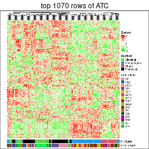

Top rows on each node:


```r
top_rows_overlap(res_rh, method = "upset")
```

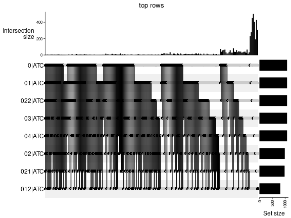


### UMAP plot

UMAP plot which shows how samples are separated.


<script>
$( function() {
	$( '#tabs-dimension-reduction-by-depth' ).tabs();
} );
</script>
<div id='tabs-dimension-reduction-by-depth'>
<ul>
<li><a href='#tab-dimension-reduction-by-depth-1'>n_signatures ≥ 625</a></li>
<li><a href='#tab-dimension-reduction-by-depth-2'>n_signatures ≥ 666</a></li>
<li><a href='#tab-dimension-reduction-by-depth-3'>n_signatures ≥ 806</a></li>
<li><a href='#tab-dimension-reduction-by-depth-4'>n_signatures ≥ 1376</a></li>
<li><a href='#tab-dimension-reduction-by-depth-5'>n_signatures ≥ 1954</a></li>
<li><a href='#tab-dimension-reduction-by-depth-6'>n_signatures ≥ 4051</a></li>
<li><a href='#tab-dimension-reduction-by-depth-7'>n_signatures ≥ 4781</a></li>
<li><a href='#tab-dimension-reduction-by-depth-8'>n_signatures ≥ 9664</a></li>
</ul>
<div id='tab-dimension-reduction-by-depth-1'>
<pre><code class="r">par(mfrow = c(1, 2))
dimension_reduction(res_rh, merge_node = merge_node_param(min_n_signatures = 625),
    method = &quot;UMAP&quot;, top_value_method = &quot;SD&quot;, top_n = 1200, scale_rows = FALSE)
dimension_reduction(res_rh, merge_node = merge_node_param(min_n_signatures = 625),
    method = &quot;UMAP&quot;, top_value_method = &quot;ATC&quot;, top_n = 1200, scale_rows = TRUE)
</code></pre>

<p>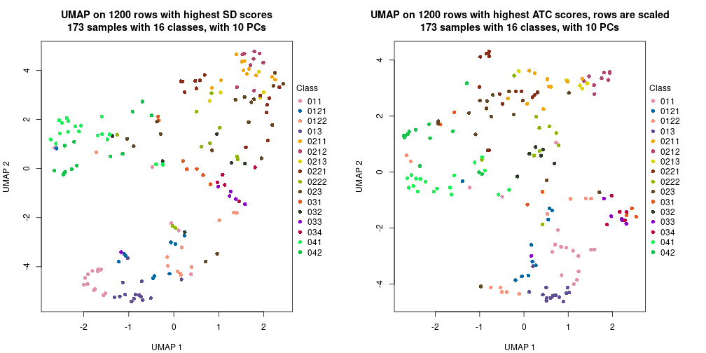</p>

</div>
<div id='tab-dimension-reduction-by-depth-2'>
<pre><code class="r">par(mfrow = c(1, 2))
dimension_reduction(res_rh, merge_node = merge_node_param(min_n_signatures = 666),
    method = &quot;UMAP&quot;, top_value_method = &quot;SD&quot;, top_n = 1200, scale_rows = FALSE)
dimension_reduction(res_rh, merge_node = merge_node_param(min_n_signatures = 666),
    method = &quot;UMAP&quot;, top_value_method = &quot;ATC&quot;, top_n = 1200, scale_rows = TRUE)
</code></pre>

<p>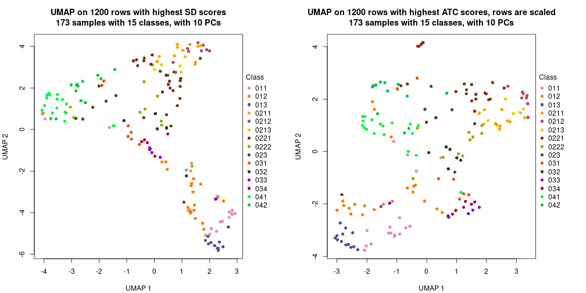</p>

</div>
<div id='tab-dimension-reduction-by-depth-3'>
<pre><code class="r">par(mfrow = c(1, 2))
dimension_reduction(res_rh, merge_node = merge_node_param(min_n_signatures = 806),
    method = &quot;UMAP&quot;, top_value_method = &quot;SD&quot;, top_n = 1200, scale_rows = FALSE)
dimension_reduction(res_rh, merge_node = merge_node_param(min_n_signatures = 806),
    method = &quot;UMAP&quot;, top_value_method = &quot;ATC&quot;, top_n = 1200, scale_rows = TRUE)
</code></pre>

<p>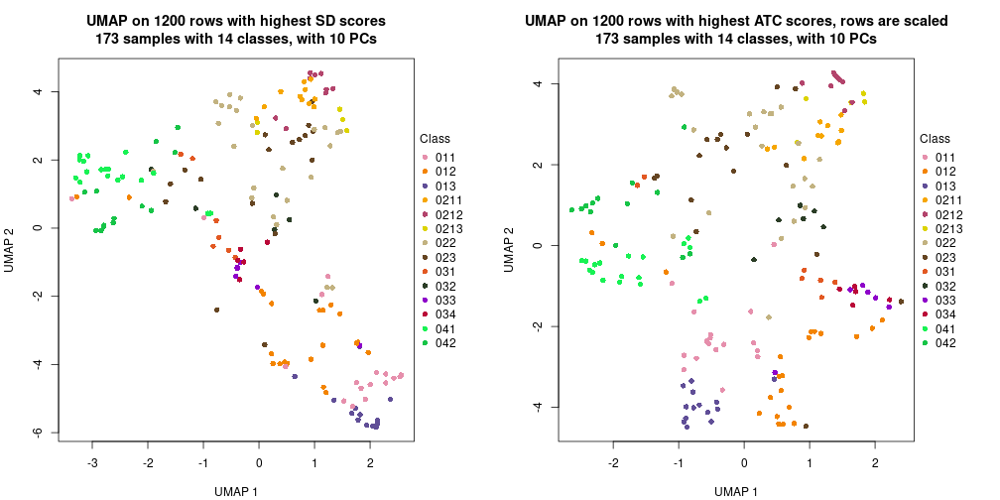</p>

</div>
<div id='tab-dimension-reduction-by-depth-4'>
<pre><code class="r">par(mfrow = c(1, 2))
dimension_reduction(res_rh, merge_node = merge_node_param(min_n_signatures = 1376),
    method = &quot;UMAP&quot;, top_value_method = &quot;SD&quot;, top_n = 1200, scale_rows = FALSE)
dimension_reduction(res_rh, merge_node = merge_node_param(min_n_signatures = 1376),
    method = &quot;UMAP&quot;, top_value_method = &quot;ATC&quot;, top_n = 1200, scale_rows = TRUE)
</code></pre>

<p>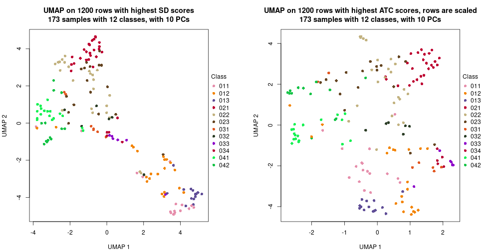</p>

</div>
<div id='tab-dimension-reduction-by-depth-5'>
<pre><code class="r">par(mfrow = c(1, 2))
dimension_reduction(res_rh, merge_node = merge_node_param(min_n_signatures = 1954),
    method = &quot;UMAP&quot;, top_value_method = &quot;SD&quot;, top_n = 1200, scale_rows = FALSE)
dimension_reduction(res_rh, merge_node = merge_node_param(min_n_signatures = 1954),
    method = &quot;UMAP&quot;, top_value_method = &quot;ATC&quot;, top_n = 1200, scale_rows = TRUE)
</code></pre>

<p>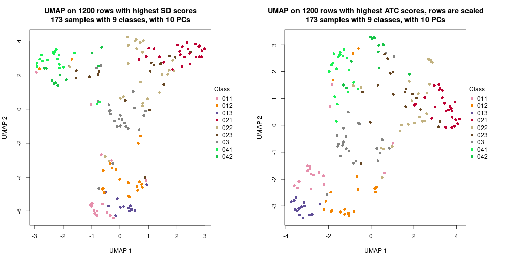</p>

</div>
<div id='tab-dimension-reduction-by-depth-6'>
<pre><code class="r">par(mfrow = c(1, 2))
dimension_reduction(res_rh, merge_node = merge_node_param(min_n_signatures = 4051),
    method = &quot;UMAP&quot;, top_value_method = &quot;SD&quot;, top_n = 1200, scale_rows = FALSE)
dimension_reduction(res_rh, merge_node = merge_node_param(min_n_signatures = 4051),
    method = &quot;UMAP&quot;, top_value_method = &quot;ATC&quot;, top_n = 1200, scale_rows = TRUE)
</code></pre>

<p>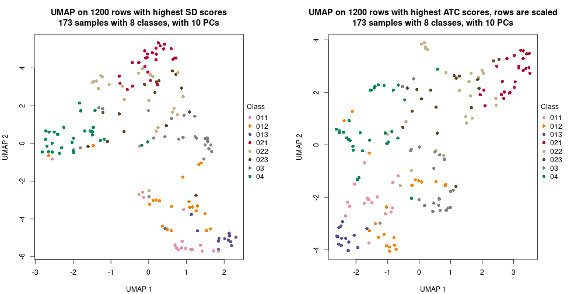</p>

</div>
<div id='tab-dimension-reduction-by-depth-7'>
<pre><code class="r">par(mfrow = c(1, 2))
dimension_reduction(res_rh, merge_node = merge_node_param(min_n_signatures = 4781),
    method = &quot;UMAP&quot;, top_value_method = &quot;SD&quot;, top_n = 1200, scale_rows = FALSE)
dimension_reduction(res_rh, merge_node = merge_node_param(min_n_signatures = 4781),
    method = &quot;UMAP&quot;, top_value_method = &quot;ATC&quot;, top_n = 1200, scale_rows = TRUE)
</code></pre>

<p>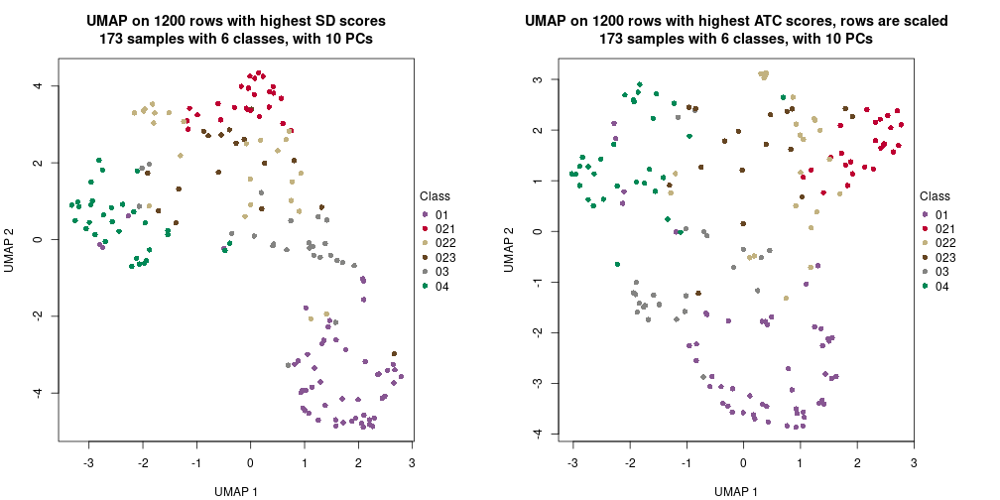</p>

</div>
<div id='tab-dimension-reduction-by-depth-8'>
<pre><code class="r">par(mfrow = c(1, 2))
dimension_reduction(res_rh, merge_node = merge_node_param(min_n_signatures = 9664),
    method = &quot;UMAP&quot;, top_value_method = &quot;SD&quot;, top_n = 1200, scale_rows = FALSE)
dimension_reduction(res_rh, merge_node = merge_node_param(min_n_signatures = 9664),
    method = &quot;UMAP&quot;, top_value_method = &quot;ATC&quot;, top_n = 1200, scale_rows = TRUE)
</code></pre>

<p>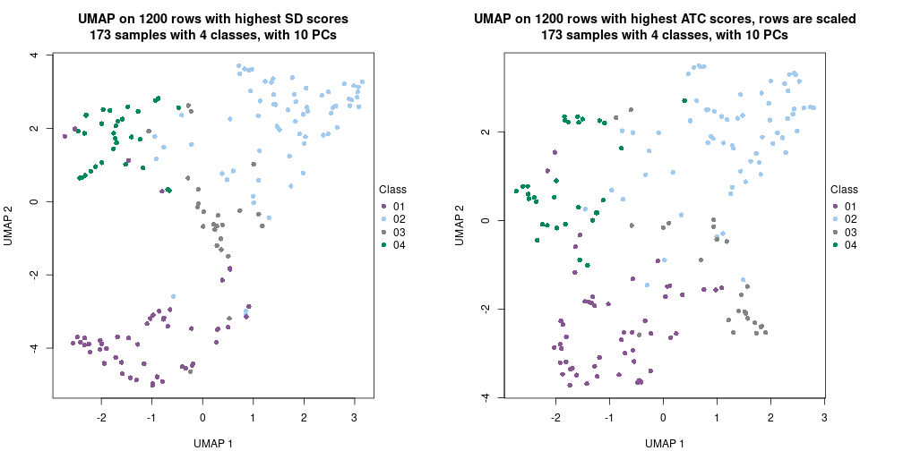</p>

</div>
</div>


### Signature heatmap

Signatures on the heatmap are the union of all signatures found on every node
on the hierarchy. The number of k-means on rows are automatically selected by the function.


<script>
$( function() {
	$( '#tabs-get-signatures-from-hierarchical-partition' ).tabs();
} );
</script>
<div id='tabs-get-signatures-from-hierarchical-partition'>
<ul>
<li><a href='#tab-get-signatures-from-hierarchical-partition-1'>n_signatures ≥ 625</a></li>
<li><a href='#tab-get-signatures-from-hierarchical-partition-2'>n_signatures ≥ 666</a></li>
<li><a href='#tab-get-signatures-from-hierarchical-partition-3'>n_signatures ≥ 806</a></li>
<li><a href='#tab-get-signatures-from-hierarchical-partition-4'>n_signatures ≥ 1376</a></li>
<li><a href='#tab-get-signatures-from-hierarchical-partition-5'>n_signatures ≥ 1954</a></li>
<li><a href='#tab-get-signatures-from-hierarchical-partition-6'>n_signatures ≥ 4051</a></li>
<li><a href='#tab-get-signatures-from-hierarchical-partition-7'>n_signatures ≥ 4781</a></li>
<li><a href='#tab-get-signatures-from-hierarchical-partition-8'>n_signatures ≥ 9664</a></li>
</ul>
<div id='tab-get-signatures-from-hierarchical-partition-1'>
<pre><code class="r">get_signatures(res_rh, merge_node = merge_node_param(min_n_signatures = 625))
</code></pre>

<p>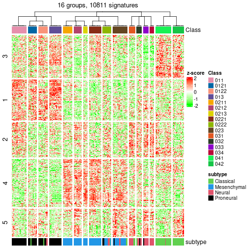</p>

</div>
<div id='tab-get-signatures-from-hierarchical-partition-2'>
<pre><code class="r">get_signatures(res_rh, merge_node = merge_node_param(min_n_signatures = 666))
</code></pre>

<p>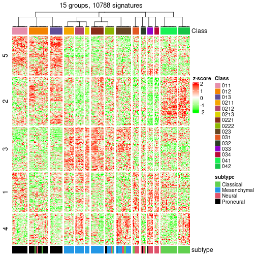</p>

</div>
<div id='tab-get-signatures-from-hierarchical-partition-3'>
<pre><code class="r">get_signatures(res_rh, merge_node = merge_node_param(min_n_signatures = 806))
</code></pre>

<p>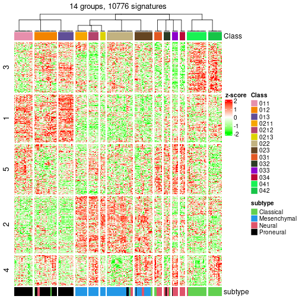</p>

</div>
<div id='tab-get-signatures-from-hierarchical-partition-4'>
<pre><code class="r">get_signatures(res_rh, merge_node = merge_node_param(min_n_signatures = 1376))
</code></pre>

<p>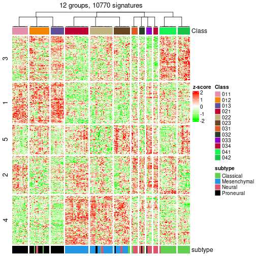</p>

</div>
<div id='tab-get-signatures-from-hierarchical-partition-5'>
<pre><code class="r">get_signatures(res_rh, merge_node = merge_node_param(min_n_signatures = 1954))
</code></pre>

<p>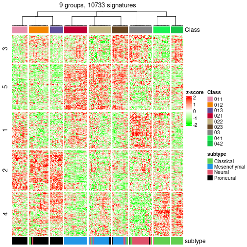</p>

</div>
<div id='tab-get-signatures-from-hierarchical-partition-6'>
<pre><code class="r">get_signatures(res_rh, merge_node = merge_node_param(min_n_signatures = 4051))
</code></pre>

<p></p>

</div>
<div id='tab-get-signatures-from-hierarchical-partition-7'>
<pre><code class="r">get_signatures(res_rh, merge_node = merge_node_param(min_n_signatures = 4781))
</code></pre>

<p>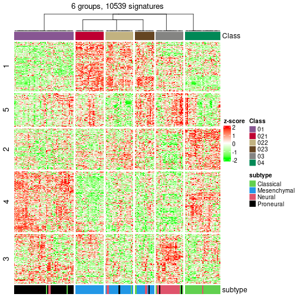</p>

</div>
<div id='tab-get-signatures-from-hierarchical-partition-8'>
<pre><code class="r">get_signatures(res_rh, merge_node = merge_node_param(min_n_signatures = 9664))
</code></pre>

<p>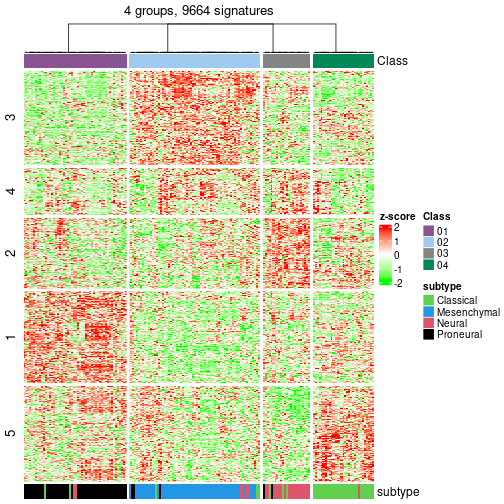</p>

</div>
</div>


Compare signatures from different nodes:


```r
compare_signatures(res_rh, verbose = FALSE)
```

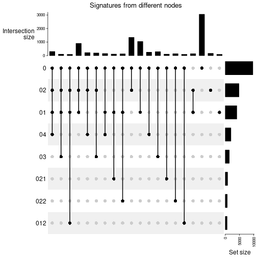

If there are too many signatures, `top_signatures = ...` can be set to only show the 
signatures with the highest FDRs. Note it only works on every node and the final signatures
are the union of all signatures of all nodes.


```r
# code only for demonstration
# e.g. to show the top 500 most significant rows on each node.
tb = get_signature(res_rh, top_signatures = 500)
```


### Test to known annotations

Test correlation between subgroups and known annotations. If the known
annotation is numeric, one-way ANOVA test is applied, and if the known
annotation is discrete, chi-squared contingency table test is applied.


<script>
$( function() {
	$( '#tabs-test-to-known-factors-from-hierarchical-partition' ).tabs();
} );
</script>
<div id='tabs-test-to-known-factors-from-hierarchical-partition'>
<ul>
<li><a href='#tab-test-to-known-factors-from-hierarchical-partition-1'>n_signatures ≥ 625</a></li>
<li><a href='#tab-test-to-known-factors-from-hierarchical-partition-2'>n_signatures ≥ 666</a></li>
<li><a href='#tab-test-to-known-factors-from-hierarchical-partition-3'>n_signatures ≥ 806</a></li>
<li><a href='#tab-test-to-known-factors-from-hierarchical-partition-4'>n_signatures ≥ 1376</a></li>
<li><a href='#tab-test-to-known-factors-from-hierarchical-partition-5'>n_signatures ≥ 1954</a></li>
<li><a href='#tab-test-to-known-factors-from-hierarchical-partition-6'>n_signatures ≥ 4051</a></li>
<li><a href='#tab-test-to-known-factors-from-hierarchical-partition-7'>n_signatures ≥ 4781</a></li>
<li><a href='#tab-test-to-known-factors-from-hierarchical-partition-8'>n_signatures ≥ 9664</a></li>
</ul>
<div id='tab-test-to-known-factors-from-hierarchical-partition-1'>
<pre><code class="r">test_to_known_factors(res_rh, merge_node = merge_node_param(min_n_signatures = 625))
</code></pre>

<pre><code>#&gt;        subtype
#&gt; class 3.25e-54
</code></pre>

</div>
<div id='tab-test-to-known-factors-from-hierarchical-partition-2'>
<pre><code class="r">test_to_known_factors(res_rh, merge_node = merge_node_param(min_n_signatures = 666))
</code></pre>

<pre><code>#&gt;        subtype
#&gt; class 2.56e-55
</code></pre>

</div>
<div id='tab-test-to-known-factors-from-hierarchical-partition-3'>
<pre><code class="r">test_to_known_factors(res_rh, merge_node = merge_node_param(min_n_signatures = 806))
</code></pre>

<pre><code>#&gt;       subtype
#&gt; class 2.1e-55
</code></pre>

</div>
<div id='tab-test-to-known-factors-from-hierarchical-partition-4'>
<pre><code class="r">test_to_known_factors(res_rh, merge_node = merge_node_param(min_n_signatures = 1376))
</code></pre>

<pre><code>#&gt;        subtype
#&gt; class 1.75e-58
</code></pre>

</div>
<div id='tab-test-to-known-factors-from-hierarchical-partition-5'>
<pre><code class="r">test_to_known_factors(res_rh, merge_node = merge_node_param(min_n_signatures = 1954))
</code></pre>

<pre><code>#&gt;        subtype
#&gt; class 1.22e-62
</code></pre>

</div>
<div id='tab-test-to-known-factors-from-hierarchical-partition-6'>
<pre><code class="r">test_to_known_factors(res_rh, merge_node = merge_node_param(min_n_signatures = 4051))
</code></pre>

<pre><code>#&gt;        subtype
#&gt; class 1.96e-64
</code></pre>

</div>
<div id='tab-test-to-known-factors-from-hierarchical-partition-7'>
<pre><code class="r">test_to_known_factors(res_rh, merge_node = merge_node_param(min_n_signatures = 4781))
</code></pre>

<pre><code>#&gt;       subtype
#&gt; class 7.3e-68
</code></pre>

</div>
<div id='tab-test-to-known-factors-from-hierarchical-partition-8'>
<pre><code class="r">test_to_known_factors(res_rh, merge_node = merge_node_param(min_n_signatures = 9664))
</code></pre>

<pre><code>#&gt;        subtype
#&gt; class 2.35e-71
</code></pre>

</div>
</div>


## Results for each node


---------------------------------------------------


### Node0


Child nodes: 
                [Node01](#Node01)
        ,
                [Node02](#Node02)
        ,
                [Node03](#Node03)
        ,
                [Node04](#Node04)
        .


The object with results only for a single top-value method and a single partitioning method 
can be extracted as:

```r
res = res_rh["0"]
```

A summary of `res` and all the functions that can be applied to it:

```r
res
```

```
#> A 'ConsensusPartition' object with k = 2, 3, 4.
#>   On a matrix with 10703 rows and 173 columns.
#>   Top rows (1070) are extracted by 'ATC' method.
#>   Subgroups are detected by 'skmeans' method.
#>   Performed in total 150 partitions by row resampling.
#>   Best k for subgroups seems to be 4.
#> 
#> Following methods can be applied to this 'ConsensusPartition' object:
#>  [1] "cola_report"             "collect_classes"         "collect_plots"          
#>  [4] "collect_stats"           "colnames"                "compare_partitions"     
#>  [7] "compare_signatures"      "consensus_heatmap"       "dimension_reduction"    
#> [10] "functional_enrichment"   "get_anno_col"            "get_anno"               
#> [13] "get_classes"             "get_consensus"           "get_matrix"             
#> [16] "get_membership"          "get_param"               "get_signatures"         
#> [19] "get_stats"               "is_best_k"               "is_stable_k"            
#> [22] "membership_heatmap"      "ncol"                    "nrow"                   
#> [25] "plot_ecdf"               "predict_classes"         "rownames"               
#> [28] "select_partition_number" "show"                    "suggest_best_k"         
#> [31] "test_to_known_factors"   "top_rows_heatmap"
```

`collect_plots()` function collects all the plots made from `res` for all `k` (number of subgroups)
into one single page to provide an easy and fast comparison between different `k`.

```r
collect_plots(res)
```

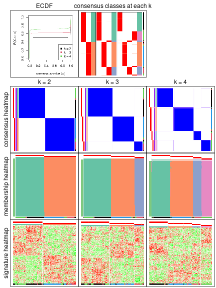

The plots are:

- The first row: a plot of the eCDF (empirical cumulative distribution
  function) curves of the consensus matrix for each `k` and the heatmap of
  predicted classes for each `k`.
- The second row: heatmaps of the consensus matrix for each `k`.
- The third row: heatmaps of the membership matrix for each `k`.
- The fouth row: heatmaps of the signatures for each `k`.

All the plots in panels can be made by individual functions and they are
plotted later in this section.

`select_partition_number()` produces several plots showing different
statistics for choosing "optimized" `k`. There are following statistics:

- eCDF curves of the consensus matrix for each `k`;
- 1-PAC. [The PAC score](https://en.wikipedia.org/wiki/Consensus_clustering#Over-interpretation_potential_of_consensus_clustering)
  measures the proportion of the ambiguous subgrouping.
- Mean silhouette score.
- Concordance. The mean probability of fiting the consensus subgroup labels in all
  partitions.
- Area increased. Denote $A_k$ as the area under the eCDF curve for current
  `k`, the area increased is defined as $A_k - A_{k-1}$.
- Rand index. The percent of pairs of samples that are both in a same cluster
  or both are not in a same cluster in the partition of k and k-1.
- Jaccard index. The ratio of pairs of samples are both in a same cluster in
  the partition of k and k-1 and the pairs of samples are both in a same
  cluster in the partition k or k-1.

The detailed explanations of these statistics can be found in [the _cola_
vignette](https://jokergoo.github.io/cola_vignettes/cola.html#toc_13).

Generally speaking, higher 1-PAC score, higher mean silhouette score or higher
concordance corresponds to better partition. Rand index and Jaccard index
measure how similar the current partition is compared to partition with `k-1`.
If they are too similar, we won't accept `k` is better than `k-1`.

```r
select_partition_number(res)
```

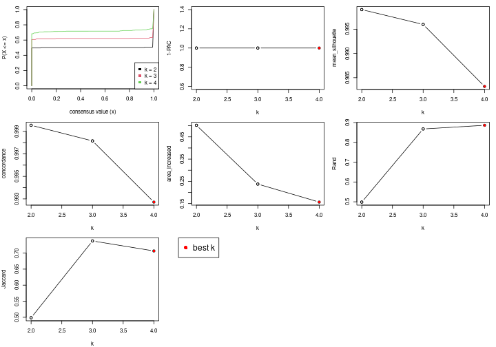

The numeric values for all these statistics can be obtained by `get_stats()`.

```r
get_stats(res)
```

```
#>   k 1-PAC mean_silhouette concordance area_increased  Rand Jaccard
#> 2 2     1           0.999       1.000          0.502 0.498   0.498
#> 3 3     1           0.996       0.998          0.238 0.868   0.738
#> 4 4     1           0.983       0.993          0.157 0.886   0.707
```

`suggest_best_k()` suggests the best $k$ based on these statistics. The rules are as follows:

- All $k$ with Jaccard index larger than 0.95 are removed because increasing
  $k$ does not provide enough extra information. If all $k$ are removed, it is
  marked as no subgroup is detected.
- For all $k$ with 1-PAC score larger than 0.9, the maximal $k$ is taken as
  the best $k$, and other $k$ are marked as optional $k$.
- If it does not fit the second rule. The $k$ with the maximal vote of the
  highest 1-PAC score, highest mean silhouette, and highest concordance is
  taken as the best $k$.

```r
suggest_best_k(res)
```

```
#> [1] 4
#> attr(,"optional")
#> [1] 2 3
```

There is also optional best $k$ = 2 3 that is worth to check.

Following is the table of the partitions (You need to click the **show/hide
code output** link to see it). The membership matrix (columns with name `p*`)
is inferred by
[`clue::cl_consensus()`](https://www.rdocumentation.org/link/cl_consensus?package=clue)
function with the `SE` method. Basically the value in the membership matrix
represents the probability to belong to a certain group. The finall subgroup
label for an item is determined with the group with highest probability it
belongs to.

In `get_classes()` function, the entropy is calculated from the membership
matrix and the silhouette score is calculated from the consensus matrix.


<script>
$( function() {
	$( '#tabs-node-0-get-classes' ).tabs();
} );
</script>
<div id='tabs-node-0-get-classes'>
<ul>
<li><a href='#tab-node-0-get-classes-1'>k = 2</a></li>
<li><a href='#tab-node-0-get-classes-2'>k = 3</a></li>
<li><a href='#tab-node-0-get-classes-3'>k = 4</a></li>
</ul>

<div id='tab-node-0-get-classes-1'>
<p><a id='tab-node-0-get-classes-1-a' style='color:#0366d6' href='#'>show/hide code output</a></p>
<pre><code class="r">cbind(get_classes(res, k = 2), get_membership(res, k = 2))
</code></pre>

<pre><code>#&gt;                     class entropy silhouette   p1   p2
#&gt; TCGA-02-0003-01A-01     1   0.000      1.000 1.00 0.00
#&gt; TCGA-02-0010-01A-01     1   0.000      1.000 1.00 0.00
#&gt; TCGA-02-0011-01B-01     1   0.000      1.000 1.00 0.00
#&gt; TCGA-02-0014-01A-01     1   0.000      1.000 1.00 0.00
#&gt; TCGA-02-0024-01B-01     1   0.000      1.000 1.00 0.00
#&gt; TCGA-02-0026-01B-01     1   0.000      1.000 1.00 0.00
#&gt; TCGA-02-0028-01A-01     1   0.000      1.000 1.00 0.00
#&gt; TCGA-02-0046-01A-01     1   0.000      1.000 1.00 0.00
#&gt; TCGA-02-0047-01A-01     2   0.000      0.999 0.00 1.00
#&gt; TCGA-02-0048-01A-01     1   0.000      1.000 1.00 0.00
#&gt; TCGA-02-0060-01A-01     1   0.000      1.000 1.00 0.00
#&gt; TCGA-02-0069-01A-01     1   0.000      1.000 1.00 0.00
#&gt; TCGA-02-0074-01A-01     1   0.000      1.000 1.00 0.00
#&gt; TCGA-02-0080-01A-01     1   0.000      1.000 1.00 0.00
#&gt; TCGA-02-0084-01A-03     2   0.000      0.999 0.00 1.00
#&gt; TCGA-02-0087-01A-01     1   0.000      1.000 1.00 0.00
#&gt; TCGA-02-0104-01A-01     1   0.000      1.000 1.00 0.00
#&gt; TCGA-02-0114-01A-01     1   0.000      1.000 1.00 0.00
#&gt; TCGA-02-0281-01A-01     1   0.000      1.000 1.00 0.00
#&gt; TCGA-02-0321-01A-01     1   0.000      1.000 1.00 0.00
#&gt; TCGA-02-0325-01A-01     1   0.000      1.000 1.00 0.00
#&gt; TCGA-02-0338-01A-01     1   0.000      1.000 1.00 0.00
#&gt; TCGA-02-0339-01A-01     1   0.000      1.000 1.00 0.00
#&gt; TCGA-02-0432-01A-02     1   0.000      1.000 1.00 0.00
#&gt; TCGA-02-0439-01A-01     1   0.000      1.000 1.00 0.00
#&gt; TCGA-02-0440-01A-01     1   0.000      1.000 1.00 0.00
#&gt; TCGA-02-0446-01A-01     2   0.000      0.999 0.00 1.00
#&gt; TCGA-06-0128-01A-01     1   0.000      1.000 1.00 0.00
#&gt; TCGA-06-0129-01A-01     1   0.000      1.000 1.00 0.00
#&gt; TCGA-06-0146-01A-01     1   0.000      1.000 1.00 0.00
#&gt; TCGA-06-0156-01A-01     1   0.000      1.000 1.00 0.00
#&gt; TCGA-06-0166-01A-01     1   0.000      1.000 1.00 0.00
#&gt; TCGA-06-0174-01A-01     1   0.000      1.000 1.00 0.00
#&gt; TCGA-06-0177-01A-01     1   0.000      1.000 1.00 0.00
#&gt; TCGA-06-0238-01A-02     1   0.000      1.000 1.00 0.00
#&gt; TCGA-06-0241-01A-02     1   0.000      1.000 1.00 0.00
#&gt; TCGA-06-0410-01A-01     1   0.000      1.000 1.00 0.00
#&gt; TCGA-06-0413-01A-01     1   0.000      1.000 1.00 0.00
#&gt; TCGA-06-0414-01A-01     1   0.000      1.000 1.00 0.00
#&gt; TCGA-06-0646-01A-01     2   0.000      0.999 0.00 1.00
#&gt; TCGA-06-0648-01A-01     1   0.000      1.000 1.00 0.00
#&gt; TCGA-08-0245-01A-01     1   0.000      1.000 1.00 0.00
#&gt; TCGA-08-0344-01A-01     1   0.000      1.000 1.00 0.00
#&gt; TCGA-08-0347-01A-01     1   0.000      1.000 1.00 0.00
#&gt; TCGA-08-0348-01A-01     1   0.000      1.000 1.00 0.00
#&gt; TCGA-08-0350-01A-01     1   0.000      1.000 1.00 0.00
#&gt; TCGA-08-0353-01A-01     1   0.000      1.000 1.00 0.00
#&gt; TCGA-08-0359-01A-01     1   0.000      1.000 1.00 0.00
#&gt; TCGA-08-0385-01A-01     1   0.000      1.000 1.00 0.00
#&gt; TCGA-08-0517-01A-01     1   0.000      1.000 1.00 0.00
#&gt; TCGA-08-0524-01A-01     1   0.000      1.000 1.00 0.00
#&gt; TCGA-12-0616-01A-01     1   0.000      1.000 1.00 0.00
#&gt; TCGA-12-0618-01A-01     1   0.000      1.000 1.00 0.00
#&gt; TCGA-02-0089-01A-01     2   0.000      0.999 0.00 1.00
#&gt; TCGA-02-0113-01A-01     2   0.000      0.999 0.00 1.00
#&gt; TCGA-02-0115-01A-01     2   0.000      0.999 0.00 1.00
#&gt; TCGA-02-0451-01A-01     2   0.000      0.999 0.00 1.00
#&gt; TCGA-06-0132-01A-02     2   0.000      0.999 0.00 1.00
#&gt; TCGA-06-0133-01A-02     2   0.000      0.999 0.00 1.00
#&gt; TCGA-06-0138-01A-02     2   0.000      0.999 0.00 1.00
#&gt; TCGA-06-0160-01A-01     1   0.000      1.000 1.00 0.00
#&gt; TCGA-06-0162-01A-01     2   0.000      0.999 0.00 1.00
#&gt; TCGA-06-0167-01A-01     1   0.000      1.000 1.00 0.00
#&gt; TCGA-06-0171-01A-02     2   0.000      0.999 0.00 1.00
#&gt; TCGA-06-0173-01A-01     1   0.000      1.000 1.00 0.00
#&gt; TCGA-06-0179-01A-02     2   0.000      0.999 0.00 1.00
#&gt; TCGA-06-0182-01A-01     2   0.000      0.999 0.00 1.00
#&gt; TCGA-06-0185-01A-01     2   0.000      0.999 0.00 1.00
#&gt; TCGA-06-0195-01B-01     1   0.000      1.000 1.00 0.00
#&gt; TCGA-06-0208-01B-01     2   0.000      0.999 0.00 1.00
#&gt; TCGA-06-0214-01A-02     2   0.000      0.999 0.00 1.00
#&gt; TCGA-06-0219-01A-01     2   0.000      0.999 0.00 1.00
#&gt; TCGA-06-0221-01A-01     2   0.000      0.999 0.00 1.00
#&gt; TCGA-06-0237-01A-02     2   0.000      0.999 0.00 1.00
#&gt; TCGA-06-0240-01A-02     2   0.000      0.999 0.00 1.00
#&gt; TCGA-08-0349-01A-01     2   0.000      0.999 0.00 1.00
#&gt; TCGA-08-0380-01A-01     2   0.000      0.999 0.00 1.00
#&gt; TCGA-08-0386-01A-01     1   0.000      1.000 1.00 0.00
#&gt; TCGA-08-0520-01A-01     2   0.000      0.999 0.00 1.00
#&gt; TCGA-02-0007-01A-01     1   0.000      1.000 1.00 0.00
#&gt; TCGA-02-0009-01A-01     1   0.000      1.000 1.00 0.00
#&gt; TCGA-02-0016-01A-01     1   0.000      1.000 1.00 0.00
#&gt; TCGA-02-0021-01A-01     1   0.000      1.000 1.00 0.00
#&gt; TCGA-02-0023-01B-01     2   0.000      0.999 0.00 1.00
#&gt; TCGA-02-0027-01A-01     1   0.000      1.000 1.00 0.00
#&gt; TCGA-02-0038-01A-01     2   0.000      0.999 0.00 1.00
#&gt; TCGA-02-0043-01A-01     1   0.000      1.000 1.00 0.00
#&gt; TCGA-02-0070-01A-01     1   0.000      1.000 1.00 0.00
#&gt; TCGA-02-0102-01A-01     1   0.000      1.000 1.00 0.00
#&gt; TCGA-02-0260-01A-03     1   0.000      1.000 1.00 0.00
#&gt; TCGA-02-0269-01B-01     1   0.000      1.000 1.00 0.00
#&gt; TCGA-02-0285-01A-01     2   0.000      0.999 0.00 1.00
#&gt; TCGA-02-0289-01A-01     1   0.000      1.000 1.00 0.00
#&gt; TCGA-02-0290-01A-01     2   0.000      0.999 0.00 1.00
#&gt; TCGA-02-0317-01A-01     1   0.000      1.000 1.00 0.00
#&gt; TCGA-02-0333-01A-02     1   0.000      1.000 1.00 0.00
#&gt; TCGA-02-0422-01A-01     1   0.000      1.000 1.00 0.00
#&gt; TCGA-02-0430-01A-01     1   0.000      1.000 1.00 0.00
#&gt; TCGA-06-0125-01A-01     1   0.000      1.000 1.00 0.00
#&gt; TCGA-06-0126-01A-01     1   0.000      1.000 1.00 0.00
#&gt; TCGA-06-0137-01A-03     1   0.000      1.000 1.00 0.00
#&gt; TCGA-06-0145-01A-04     2   0.000      0.999 0.00 1.00
#&gt; TCGA-06-0148-01A-01     1   0.000      1.000 1.00 0.00
#&gt; TCGA-06-0187-01A-01     2   0.000      0.999 0.00 1.00
#&gt; TCGA-06-0211-01B-01     1   0.000      1.000 1.00 0.00
#&gt; TCGA-06-0402-01A-01     1   0.000      1.000 1.00 0.00
#&gt; TCGA-08-0246-01A-01     2   0.000      0.999 0.00 1.00
#&gt; TCGA-08-0354-01A-01     2   0.000      0.999 0.00 1.00
#&gt; TCGA-08-0355-01A-01     2   0.000      0.999 0.00 1.00
#&gt; TCGA-08-0357-01A-01     1   0.000      1.000 1.00 0.00
#&gt; TCGA-08-0358-01A-01     1   0.000      1.000 1.00 0.00
#&gt; TCGA-08-0375-01A-01     1   0.000      1.000 1.00 0.00
#&gt; TCGA-08-0511-01A-01     1   0.000      1.000 1.00 0.00
#&gt; TCGA-08-0514-01A-01     2   0.000      0.999 0.00 1.00
#&gt; TCGA-08-0518-01A-01     1   0.000      1.000 1.00 0.00
#&gt; TCGA-08-0529-01A-02     1   0.000      1.000 1.00 0.00
#&gt; TCGA-08-0531-01A-01     1   0.000      1.000 1.00 0.00
#&gt; TCGA-02-0057-01A-01     2   0.000      0.999 0.00 1.00
#&gt; TCGA-02-0004-01A-01     2   0.000      0.999 0.00 1.00
#&gt; TCGA-02-0006-01B-01     2   0.000      0.999 0.00 1.00
#&gt; TCGA-02-0025-01A-01     2   0.000      0.999 0.00 1.00
#&gt; TCGA-02-0033-01A-01     2   0.000      0.999 0.00 1.00
#&gt; TCGA-02-0034-01A-01     2   0.000      0.999 0.00 1.00
#&gt; TCGA-02-0039-01A-01     2   0.000      0.999 0.00 1.00
#&gt; TCGA-02-0051-01A-01     2   0.000      0.999 0.00 1.00
#&gt; TCGA-02-0054-01A-01     2   0.000      0.999 0.00 1.00
#&gt; TCGA-02-0055-01A-01     2   0.000      0.999 0.00 1.00
#&gt; TCGA-02-0059-01A-01     2   0.000      0.999 0.00 1.00
#&gt; TCGA-02-0064-01A-01     2   0.000      0.999 0.00 1.00
#&gt; TCGA-02-0075-01A-01     2   0.000      0.999 0.00 1.00
#&gt; TCGA-02-0079-01A-03     2   0.000      0.999 0.00 1.00
#&gt; TCGA-02-0085-01A-01     2   0.000      0.999 0.00 1.00
#&gt; TCGA-02-0086-01A-01     2   0.000      0.999 0.00 1.00
#&gt; TCGA-02-0099-01A-01     2   0.000      0.999 0.00 1.00
#&gt; TCGA-02-0106-01A-01     2   0.000      0.999 0.00 1.00
#&gt; TCGA-02-0107-01A-01     2   0.000      0.999 0.00 1.00
#&gt; TCGA-02-0111-01A-01     2   0.000      0.999 0.00 1.00
#&gt; TCGA-02-0326-01A-01     2   0.402      0.913 0.08 0.92
#&gt; TCGA-02-0337-01A-01     2   0.000      0.999 0.00 1.00
#&gt; TCGA-06-0122-01A-01     2   0.000      0.999 0.00 1.00
#&gt; TCGA-06-0124-01A-01     2   0.000      0.999 0.00 1.00
#&gt; TCGA-06-0130-01A-01     2   0.000      0.999 0.00 1.00
#&gt; TCGA-06-0139-01A-01     2   0.000      0.999 0.00 1.00
#&gt; TCGA-06-0143-01A-01     2   0.000      0.999 0.00 1.00
#&gt; TCGA-06-0147-01A-01     2   0.000      0.999 0.00 1.00
#&gt; TCGA-06-0149-01A-05     2   0.000      0.999 0.00 1.00
#&gt; TCGA-06-0152-01A-02     2   0.000      0.999 0.00 1.00
#&gt; TCGA-06-0154-01A-02     2   0.000      0.999 0.00 1.00
#&gt; TCGA-06-0164-01A-01     2   0.000      0.999 0.00 1.00
#&gt; TCGA-06-0175-01A-01     2   0.000      0.999 0.00 1.00
#&gt; TCGA-06-0176-01A-03     2   0.000      0.999 0.00 1.00
#&gt; TCGA-06-0184-01A-01     2   0.000      0.999 0.00 1.00
#&gt; TCGA-06-0189-01A-05     2   0.000      0.999 0.00 1.00
#&gt; TCGA-06-0190-01A-01     2   0.000      0.999 0.00 1.00
#&gt; TCGA-06-0194-01A-01     2   0.000      0.999 0.00 1.00
#&gt; TCGA-06-0197-01A-02     2   0.000      0.999 0.00 1.00
#&gt; TCGA-06-0210-01A-01     2   0.000      0.999 0.00 1.00
#&gt; TCGA-06-0397-01A-01     2   0.000      0.999 0.00 1.00
#&gt; TCGA-06-0409-01A-02     2   0.000      0.999 0.00 1.00
#&gt; TCGA-06-0412-01A-01     2   0.000      0.999 0.00 1.00
#&gt; TCGA-06-0644-01A-02     2   0.000      0.999 0.00 1.00
#&gt; TCGA-06-0645-01A-01     2   0.000      0.999 0.00 1.00
#&gt; TCGA-08-0346-01A-01     2   0.000      0.999 0.00 1.00
#&gt; TCGA-08-0352-01A-01     2   0.000      0.999 0.00 1.00
#&gt; TCGA-08-0360-01A-01     2   0.000      0.999 0.00 1.00
#&gt; TCGA-08-0390-01A-01     2   0.000      0.999 0.00 1.00
#&gt; TCGA-08-0392-01A-01     2   0.000      0.999 0.00 1.00
#&gt; TCGA-08-0509-01A-01     2   0.000      0.999 0.00 1.00
#&gt; TCGA-08-0510-01A-01     2   0.000      0.999 0.00 1.00
#&gt; TCGA-08-0512-01A-01     2   0.000      0.999 0.00 1.00
#&gt; TCGA-08-0522-01A-01     2   0.000      0.999 0.00 1.00
#&gt; TCGA-12-0619-01A-01     2   0.000      0.999 0.00 1.00
#&gt; TCGA-12-0620-01A-01     2   0.000      0.999 0.00 1.00
</code></pre>

<script>
$('#tab-node-0-get-classes-1-a').parent().next().next().hide();
$('#tab-node-0-get-classes-1-a').click(function(){
  $('#tab-node-0-get-classes-1-a').parent().next().next().toggle();
  return(false);
});
</script>
</div>

<div id='tab-node-0-get-classes-2'>
<p><a id='tab-node-0-get-classes-2-a' style='color:#0366d6' href='#'>show/hide code output</a></p>
<pre><code class="r">cbind(get_classes(res, k = 3), get_membership(res, k = 3))
</code></pre>

<pre><code>#&gt;                     class entropy silhouette   p1   p2   p3
#&gt; TCGA-02-0003-01A-01     1   0.000      0.999 1.00 0.00 0.00
#&gt; TCGA-02-0010-01A-01     1   0.000      0.999 1.00 0.00 0.00
#&gt; TCGA-02-0011-01B-01     1   0.000      0.999 1.00 0.00 0.00
#&gt; TCGA-02-0014-01A-01     1   0.000      0.999 1.00 0.00 0.00
#&gt; TCGA-02-0024-01B-01     1   0.000      0.999 1.00 0.00 0.00
#&gt; TCGA-02-0026-01B-01     1   0.000      0.999 1.00 0.00 0.00
#&gt; TCGA-02-0028-01A-01     1   0.000      0.999 1.00 0.00 0.00
#&gt; TCGA-02-0046-01A-01     1   0.000      0.999 1.00 0.00 0.00
#&gt; TCGA-02-0047-01A-01     3   0.000      0.991 0.00 0.00 1.00
#&gt; TCGA-02-0048-01A-01     1   0.000      0.999 1.00 0.00 0.00
#&gt; TCGA-02-0060-01A-01     1   0.000      0.999 1.00 0.00 0.00
#&gt; TCGA-02-0069-01A-01     1   0.000      0.999 1.00 0.00 0.00
#&gt; TCGA-02-0074-01A-01     1   0.000      0.999 1.00 0.00 0.00
#&gt; TCGA-02-0080-01A-01     1   0.000      0.999 1.00 0.00 0.00
#&gt; TCGA-02-0084-01A-03     2   0.000      0.999 0.00 1.00 0.00
#&gt; TCGA-02-0087-01A-01     1   0.000      0.999 1.00 0.00 0.00
#&gt; TCGA-02-0104-01A-01     1   0.000      0.999 1.00 0.00 0.00
#&gt; TCGA-02-0114-01A-01     1   0.000      0.999 1.00 0.00 0.00
#&gt; TCGA-02-0281-01A-01     1   0.000      0.999 1.00 0.00 0.00
#&gt; TCGA-02-0321-01A-01     1   0.000      0.999 1.00 0.00 0.00
#&gt; TCGA-02-0325-01A-01     1   0.000      0.999 1.00 0.00 0.00
#&gt; TCGA-02-0338-01A-01     1   0.000      0.999 1.00 0.00 0.00
#&gt; TCGA-02-0339-01A-01     1   0.000      0.999 1.00 0.00 0.00
#&gt; TCGA-02-0432-01A-02     1   0.000      0.999 1.00 0.00 0.00
#&gt; TCGA-02-0439-01A-01     1   0.000      0.999 1.00 0.00 0.00
#&gt; TCGA-02-0440-01A-01     1   0.000      0.999 1.00 0.00 0.00
#&gt; TCGA-02-0446-01A-01     2   0.000      0.999 0.00 1.00 0.00
#&gt; TCGA-06-0128-01A-01     1   0.153      0.958 0.96 0.00 0.04
#&gt; TCGA-06-0129-01A-01     1   0.000      0.999 1.00 0.00 0.00
#&gt; TCGA-06-0146-01A-01     1   0.000      0.999 1.00 0.00 0.00
#&gt; TCGA-06-0156-01A-01     1   0.000      0.999 1.00 0.00 0.00
#&gt; TCGA-06-0166-01A-01     1   0.000      0.999 1.00 0.00 0.00
#&gt; TCGA-06-0174-01A-01     1   0.000      0.999 1.00 0.00 0.00
#&gt; TCGA-06-0177-01A-01     1   0.000      0.999 1.00 0.00 0.00
#&gt; TCGA-06-0238-01A-02     3   0.000      0.991 0.00 0.00 1.00
#&gt; TCGA-06-0241-01A-02     1   0.000      0.999 1.00 0.00 0.00
#&gt; TCGA-06-0410-01A-01     1   0.000      0.999 1.00 0.00 0.00
#&gt; TCGA-06-0413-01A-01     1   0.000      0.999 1.00 0.00 0.00
#&gt; TCGA-06-0414-01A-01     1   0.000      0.999 1.00 0.00 0.00
#&gt; TCGA-06-0646-01A-01     2   0.000      0.999 0.00 1.00 0.00
#&gt; TCGA-06-0648-01A-01     1   0.000      0.999 1.00 0.00 0.00
#&gt; TCGA-08-0245-01A-01     1   0.000      0.999 1.00 0.00 0.00
#&gt; TCGA-08-0344-01A-01     1   0.000      0.999 1.00 0.00 0.00
#&gt; TCGA-08-0347-01A-01     1   0.000      0.999 1.00 0.00 0.00
#&gt; TCGA-08-0348-01A-01     1   0.000      0.999 1.00 0.00 0.00
#&gt; TCGA-08-0350-01A-01     1   0.000      0.999 1.00 0.00 0.00
#&gt; TCGA-08-0353-01A-01     1   0.000      0.999 1.00 0.00 0.00
#&gt; TCGA-08-0359-01A-01     1   0.000      0.999 1.00 0.00 0.00
#&gt; TCGA-08-0385-01A-01     1   0.000      0.999 1.00 0.00 0.00
#&gt; TCGA-08-0517-01A-01     1   0.000      0.999 1.00 0.00 0.00
#&gt; TCGA-08-0524-01A-01     1   0.000      0.999 1.00 0.00 0.00
#&gt; TCGA-12-0616-01A-01     1   0.000      0.999 1.00 0.00 0.00
#&gt; TCGA-12-0618-01A-01     1   0.000      0.999 1.00 0.00 0.00
#&gt; TCGA-02-0089-01A-01     2   0.153      0.958 0.00 0.96 0.04
#&gt; TCGA-02-0113-01A-01     3   0.000      0.991 0.00 0.00 1.00
#&gt; TCGA-02-0115-01A-01     3   0.000      0.991 0.00 0.00 1.00
#&gt; TCGA-02-0451-01A-01     2   0.000      0.999 0.00 1.00 0.00
#&gt; TCGA-06-0132-01A-02     2   0.000      0.999 0.00 1.00 0.00
#&gt; TCGA-06-0133-01A-02     3   0.000      0.991 0.00 0.00 1.00
#&gt; TCGA-06-0138-01A-02     3   0.000      0.991 0.00 0.00 1.00
#&gt; TCGA-06-0160-01A-01     1   0.000      0.999 1.00 0.00 0.00
#&gt; TCGA-06-0162-01A-01     3   0.000      0.991 0.00 0.00 1.00
#&gt; TCGA-06-0167-01A-01     1   0.000      0.999 1.00 0.00 0.00
#&gt; TCGA-06-0171-01A-02     3   0.000      0.991 0.00 0.00 1.00
#&gt; TCGA-06-0173-01A-01     3   0.000      0.991 0.00 0.00 1.00
#&gt; TCGA-06-0179-01A-02     3   0.000      0.991 0.00 0.00 1.00
#&gt; TCGA-06-0182-01A-01     3   0.000      0.991 0.00 0.00 1.00
#&gt; TCGA-06-0185-01A-01     3   0.000      0.991 0.00 0.00 1.00
#&gt; TCGA-06-0195-01B-01     3   0.000      0.991 0.00 0.00 1.00
#&gt; TCGA-06-0208-01B-01     3   0.000      0.991 0.00 0.00 1.00
#&gt; TCGA-06-0214-01A-02     3   0.000      0.991 0.00 0.00 1.00
#&gt; TCGA-06-0219-01A-01     3   0.000      0.991 0.00 0.00 1.00
#&gt; TCGA-06-0221-01A-01     3   0.000      0.991 0.00 0.00 1.00
#&gt; TCGA-06-0237-01A-02     3   0.000      0.991 0.00 0.00 1.00
#&gt; TCGA-06-0240-01A-02     3   0.000      0.991 0.00 0.00 1.00
#&gt; TCGA-08-0349-01A-01     3   0.000      0.991 0.00 0.00 1.00
#&gt; TCGA-08-0380-01A-01     2   0.000      0.999 0.00 1.00 0.00
#&gt; TCGA-08-0386-01A-01     1   0.000      0.999 1.00 0.00 0.00
#&gt; TCGA-08-0520-01A-01     3   0.000      0.991 0.00 0.00 1.00
#&gt; TCGA-02-0007-01A-01     1   0.000      0.999 1.00 0.00 0.00
#&gt; TCGA-02-0009-01A-01     1   0.000      0.999 1.00 0.00 0.00
#&gt; TCGA-02-0016-01A-01     1   0.000      0.999 1.00 0.00 0.00
#&gt; TCGA-02-0021-01A-01     1   0.000      0.999 1.00 0.00 0.00
#&gt; TCGA-02-0023-01B-01     3   0.000      0.991 0.00 0.00 1.00
#&gt; TCGA-02-0027-01A-01     1   0.000      0.999 1.00 0.00 0.00
#&gt; TCGA-02-0038-01A-01     3   0.000      0.991 0.00 0.00 1.00
#&gt; TCGA-02-0043-01A-01     1   0.000      0.999 1.00 0.00 0.00
#&gt; TCGA-02-0070-01A-01     1   0.000      0.999 1.00 0.00 0.00
#&gt; TCGA-02-0102-01A-01     1   0.000      0.999 1.00 0.00 0.00
#&gt; TCGA-02-0260-01A-03     1   0.000      0.999 1.00 0.00 0.00
#&gt; TCGA-02-0269-01B-01     1   0.000      0.999 1.00 0.00 0.00
#&gt; TCGA-02-0285-01A-01     2   0.000      0.999 0.00 1.00 0.00
#&gt; TCGA-02-0289-01A-01     1   0.000      0.999 1.00 0.00 0.00
#&gt; TCGA-02-0290-01A-01     3   0.000      0.991 0.00 0.00 1.00
#&gt; TCGA-02-0317-01A-01     1   0.000      0.999 1.00 0.00 0.00
#&gt; TCGA-02-0333-01A-02     1   0.000      0.999 1.00 0.00 0.00
#&gt; TCGA-02-0422-01A-01     1   0.000      0.999 1.00 0.00 0.00
#&gt; TCGA-02-0430-01A-01     1   0.000      0.999 1.00 0.00 0.00
#&gt; TCGA-06-0125-01A-01     1   0.000      0.999 1.00 0.00 0.00
#&gt; TCGA-06-0126-01A-01     1   0.000      0.999 1.00 0.00 0.00
#&gt; TCGA-06-0137-01A-03     1   0.000      0.999 1.00 0.00 0.00
#&gt; TCGA-06-0145-01A-04     2   0.000      0.999 0.00 1.00 0.00
#&gt; TCGA-06-0148-01A-01     1   0.000      0.999 1.00 0.00 0.00
#&gt; TCGA-06-0187-01A-01     2   0.000      0.999 0.00 1.00 0.00
#&gt; TCGA-06-0211-01B-01     1   0.000      0.999 1.00 0.00 0.00
#&gt; TCGA-06-0402-01A-01     1   0.000      0.999 1.00 0.00 0.00
#&gt; TCGA-08-0246-01A-01     2   0.000      0.999 0.00 1.00 0.00
#&gt; TCGA-08-0354-01A-01     3   0.000      0.991 0.00 0.00 1.00
#&gt; TCGA-08-0355-01A-01     2   0.000      0.999 0.00 1.00 0.00
#&gt; TCGA-08-0357-01A-01     1   0.000      0.999 1.00 0.00 0.00
#&gt; TCGA-08-0358-01A-01     1   0.000      0.999 1.00 0.00 0.00
#&gt; TCGA-08-0375-01A-01     1   0.000      0.999 1.00 0.00 0.00
#&gt; TCGA-08-0511-01A-01     1   0.000      0.999 1.00 0.00 0.00
#&gt; TCGA-08-0514-01A-01     3   0.455      0.750 0.00 0.20 0.80
#&gt; TCGA-08-0518-01A-01     1   0.000      0.999 1.00 0.00 0.00
#&gt; TCGA-08-0529-01A-02     1   0.000      0.999 1.00 0.00 0.00
#&gt; TCGA-08-0531-01A-01     3   0.153      0.952 0.04 0.00 0.96
#&gt; TCGA-02-0057-01A-01     2   0.000      0.999 0.00 1.00 0.00
#&gt; TCGA-02-0004-01A-01     2   0.000      0.999 0.00 1.00 0.00
#&gt; TCGA-02-0006-01B-01     2   0.000      0.999 0.00 1.00 0.00
#&gt; TCGA-02-0025-01A-01     2   0.000      0.999 0.00 1.00 0.00
#&gt; TCGA-02-0033-01A-01     2   0.000      0.999 0.00 1.00 0.00
#&gt; TCGA-02-0034-01A-01     2   0.000      0.999 0.00 1.00 0.00
#&gt; TCGA-02-0039-01A-01     2   0.000      0.999 0.00 1.00 0.00
#&gt; TCGA-02-0051-01A-01     2   0.000      0.999 0.00 1.00 0.00
#&gt; TCGA-02-0054-01A-01     2   0.000      0.999 0.00 1.00 0.00
#&gt; TCGA-02-0055-01A-01     2   0.000      0.999 0.00 1.00 0.00
#&gt; TCGA-02-0059-01A-01     2   0.000      0.999 0.00 1.00 0.00
#&gt; TCGA-02-0064-01A-01     2   0.000      0.999 0.00 1.00 0.00
#&gt; TCGA-02-0075-01A-01     2   0.000      0.999 0.00 1.00 0.00
#&gt; TCGA-02-0079-01A-03     2   0.000      0.999 0.00 1.00 0.00
#&gt; TCGA-02-0085-01A-01     2   0.000      0.999 0.00 1.00 0.00
#&gt; TCGA-02-0086-01A-01     2   0.000      0.999 0.00 1.00 0.00
#&gt; TCGA-02-0099-01A-01     2   0.000      0.999 0.00 1.00 0.00
#&gt; TCGA-02-0106-01A-01     2   0.000      0.999 0.00 1.00 0.00
#&gt; TCGA-02-0107-01A-01     2   0.000      0.999 0.00 1.00 0.00
#&gt; TCGA-02-0111-01A-01     2   0.000      0.999 0.00 1.00 0.00
#&gt; TCGA-02-0326-01A-01     2   0.000      0.999 0.00 1.00 0.00
#&gt; TCGA-02-0337-01A-01     2   0.000      0.999 0.00 1.00 0.00
#&gt; TCGA-06-0122-01A-01     2   0.000      0.999 0.00 1.00 0.00
#&gt; TCGA-06-0124-01A-01     2   0.000      0.999 0.00 1.00 0.00
#&gt; TCGA-06-0130-01A-01     2   0.000      0.999 0.00 1.00 0.00
#&gt; TCGA-06-0139-01A-01     2   0.000      0.999 0.00 1.00 0.00
#&gt; TCGA-06-0143-01A-01     2   0.000      0.999 0.00 1.00 0.00
#&gt; TCGA-06-0147-01A-01     2   0.000      0.999 0.00 1.00 0.00
#&gt; TCGA-06-0149-01A-05     2   0.000      0.999 0.00 1.00 0.00
#&gt; TCGA-06-0152-01A-02     2   0.000      0.999 0.00 1.00 0.00
#&gt; TCGA-06-0154-01A-02     2   0.000      0.999 0.00 1.00 0.00
#&gt; TCGA-06-0164-01A-01     2   0.000      0.999 0.00 1.00 0.00
#&gt; TCGA-06-0175-01A-01     2   0.000      0.999 0.00 1.00 0.00
#&gt; TCGA-06-0176-01A-03     2   0.000      0.999 0.00 1.00 0.00
#&gt; TCGA-06-0184-01A-01     2   0.000      0.999 0.00 1.00 0.00
#&gt; TCGA-06-0189-01A-05     2   0.000      0.999 0.00 1.00 0.00
#&gt; TCGA-06-0190-01A-01     2   0.000      0.999 0.00 1.00 0.00
#&gt; TCGA-06-0194-01A-01     2   0.000      0.999 0.00 1.00 0.00
#&gt; TCGA-06-0197-01A-02     2   0.000      0.999 0.00 1.00 0.00
#&gt; TCGA-06-0210-01A-01     2   0.000      0.999 0.00 1.00 0.00
#&gt; TCGA-06-0397-01A-01     2   0.000      0.999 0.00 1.00 0.00
#&gt; TCGA-06-0409-01A-02     2   0.000      0.999 0.00 1.00 0.00
#&gt; TCGA-06-0412-01A-01     2   0.000      0.999 0.00 1.00 0.00
#&gt; TCGA-06-0644-01A-02     2   0.000      0.999 0.00 1.00 0.00
#&gt; TCGA-06-0645-01A-01     2   0.000      0.999 0.00 1.00 0.00
#&gt; TCGA-08-0346-01A-01     2   0.000      0.999 0.00 1.00 0.00
#&gt; TCGA-08-0352-01A-01     2   0.000      0.999 0.00 1.00 0.00
#&gt; TCGA-08-0360-01A-01     2   0.000      0.999 0.00 1.00 0.00
#&gt; TCGA-08-0390-01A-01     2   0.000      0.999 0.00 1.00 0.00
#&gt; TCGA-08-0392-01A-01     2   0.000      0.999 0.00 1.00 0.00
#&gt; TCGA-08-0509-01A-01     2   0.000      0.999 0.00 1.00 0.00
#&gt; TCGA-08-0510-01A-01     2   0.000      0.999 0.00 1.00 0.00
#&gt; TCGA-08-0512-01A-01     2   0.000      0.999 0.00 1.00 0.00
#&gt; TCGA-08-0522-01A-01     2   0.000      0.999 0.00 1.00 0.00
#&gt; TCGA-12-0619-01A-01     2   0.000      0.999 0.00 1.00 0.00
#&gt; TCGA-12-0620-01A-01     2   0.000      0.999 0.00 1.00 0.00
</code></pre>

<script>
$('#tab-node-0-get-classes-2-a').parent().next().next().hide();
$('#tab-node-0-get-classes-2-a').click(function(){
  $('#tab-node-0-get-classes-2-a').parent().next().next().toggle();
  return(false);
});
</script>
</div>

<div id='tab-node-0-get-classes-3'>
<p><a id='tab-node-0-get-classes-3-a' style='color:#0366d6' href='#'>show/hide code output</a></p>
<pre><code class="r">cbind(get_classes(res, k = 4), get_membership(res, k = 4))
</code></pre>

<pre><code>#&gt;                     class entropy silhouette   p1   p2   p3   p4
#&gt; TCGA-02-0003-01A-01     1  0.0000      0.996 1.00 0.00 0.00 0.00
#&gt; TCGA-02-0010-01A-01     1  0.0000      0.996 1.00 0.00 0.00 0.00
#&gt; TCGA-02-0011-01B-01     1  0.0000      0.996 1.00 0.00 0.00 0.00
#&gt; TCGA-02-0014-01A-01     1  0.0000      0.996 1.00 0.00 0.00 0.00
#&gt; TCGA-02-0024-01B-01     1  0.0000      0.996 1.00 0.00 0.00 0.00
#&gt; TCGA-02-0026-01B-01     1  0.0000      0.996 1.00 0.00 0.00 0.00
#&gt; TCGA-02-0028-01A-01     1  0.0000      0.996 1.00 0.00 0.00 0.00
#&gt; TCGA-02-0046-01A-01     1  0.0000      0.996 1.00 0.00 0.00 0.00
#&gt; TCGA-02-0047-01A-01     3  0.0707      0.975 0.02 0.00 0.98 0.00
#&gt; TCGA-02-0048-01A-01     1  0.0000      0.996 1.00 0.00 0.00 0.00
#&gt; TCGA-02-0060-01A-01     1  0.0000      0.996 1.00 0.00 0.00 0.00
#&gt; TCGA-02-0069-01A-01     1  0.0000      0.996 1.00 0.00 0.00 0.00
#&gt; TCGA-02-0074-01A-01     1  0.0000      0.996 1.00 0.00 0.00 0.00
#&gt; TCGA-02-0080-01A-01     1  0.0000      0.996 1.00 0.00 0.00 0.00
#&gt; TCGA-02-0084-01A-03     2  0.0000      0.988 0.00 1.00 0.00 0.00
#&gt; TCGA-02-0087-01A-01     1  0.0000      0.996 1.00 0.00 0.00 0.00
#&gt; TCGA-02-0104-01A-01     1  0.0000      0.996 1.00 0.00 0.00 0.00
#&gt; TCGA-02-0114-01A-01     1  0.0000      0.996 1.00 0.00 0.00 0.00
#&gt; TCGA-02-0281-01A-01     1  0.0000      0.996 1.00 0.00 0.00 0.00
#&gt; TCGA-02-0321-01A-01     1  0.0707      0.975 0.98 0.00 0.00 0.02
#&gt; TCGA-02-0325-01A-01     1  0.0000      0.996 1.00 0.00 0.00 0.00
#&gt; TCGA-02-0338-01A-01     1  0.0000      0.996 1.00 0.00 0.00 0.00
#&gt; TCGA-02-0339-01A-01     1  0.0000      0.996 1.00 0.00 0.00 0.00
#&gt; TCGA-02-0432-01A-02     1  0.0000      0.996 1.00 0.00 0.00 0.00
#&gt; TCGA-02-0439-01A-01     1  0.0000      0.996 1.00 0.00 0.00 0.00
#&gt; TCGA-02-0440-01A-01     1  0.0000      0.996 1.00 0.00 0.00 0.00
#&gt; TCGA-02-0446-01A-01     2  0.1637      0.923 0.06 0.94 0.00 0.00
#&gt; TCGA-06-0128-01A-01     1  0.0000      0.996 1.00 0.00 0.00 0.00
#&gt; TCGA-06-0129-01A-01     1  0.0000      0.996 1.00 0.00 0.00 0.00
#&gt; TCGA-06-0146-01A-01     1  0.0000      0.996 1.00 0.00 0.00 0.00
#&gt; TCGA-06-0156-01A-01     1  0.0000      0.996 1.00 0.00 0.00 0.00
#&gt; TCGA-06-0166-01A-01     1  0.0000      0.996 1.00 0.00 0.00 0.00
#&gt; TCGA-06-0174-01A-01     1  0.0000      0.996 1.00 0.00 0.00 0.00
#&gt; TCGA-06-0177-01A-01     1  0.0000      0.996 1.00 0.00 0.00 0.00
#&gt; TCGA-06-0238-01A-02     3  0.1637      0.928 0.06 0.00 0.94 0.00
#&gt; TCGA-06-0241-01A-02     1  0.0000      0.996 1.00 0.00 0.00 0.00
#&gt; TCGA-06-0410-01A-01     1  0.0000      0.996 1.00 0.00 0.00 0.00
#&gt; TCGA-06-0413-01A-01     1  0.0000      0.996 1.00 0.00 0.00 0.00
#&gt; TCGA-06-0414-01A-01     1  0.0000      0.996 1.00 0.00 0.00 0.00
#&gt; TCGA-06-0646-01A-01     2  0.2345      0.875 0.10 0.90 0.00 0.00
#&gt; TCGA-06-0648-01A-01     1  0.0000      0.996 1.00 0.00 0.00 0.00
#&gt; TCGA-08-0245-01A-01     1  0.0000      0.996 1.00 0.00 0.00 0.00
#&gt; TCGA-08-0344-01A-01     1  0.0000      0.996 1.00 0.00 0.00 0.00
#&gt; TCGA-08-0347-01A-01     1  0.0000      0.996 1.00 0.00 0.00 0.00
#&gt; TCGA-08-0348-01A-01     1  0.0000      0.996 1.00 0.00 0.00 0.00
#&gt; TCGA-08-0350-01A-01     1  0.0000      0.996 1.00 0.00 0.00 0.00
#&gt; TCGA-08-0353-01A-01     1  0.0000      0.996 1.00 0.00 0.00 0.00
#&gt; TCGA-08-0359-01A-01     1  0.0000      0.996 1.00 0.00 0.00 0.00
#&gt; TCGA-08-0385-01A-01     1  0.0000      0.996 1.00 0.00 0.00 0.00
#&gt; TCGA-08-0517-01A-01     1  0.0000      0.996 1.00 0.00 0.00 0.00
#&gt; TCGA-08-0524-01A-01     1  0.0000      0.996 1.00 0.00 0.00 0.00
#&gt; TCGA-12-0616-01A-01     1  0.0000      0.996 1.00 0.00 0.00 0.00
#&gt; TCGA-12-0618-01A-01     1  0.0000      0.996 1.00 0.00 0.00 0.00
#&gt; TCGA-02-0089-01A-01     2  0.1211      0.950 0.00 0.96 0.04 0.00
#&gt; TCGA-02-0113-01A-01     3  0.0000      0.995 0.00 0.00 1.00 0.00
#&gt; TCGA-02-0115-01A-01     3  0.0000      0.995 0.00 0.00 1.00 0.00
#&gt; TCGA-02-0451-01A-01     2  0.0000      0.988 0.00 1.00 0.00 0.00
#&gt; TCGA-06-0132-01A-02     2  0.0000      0.988 0.00 1.00 0.00 0.00
#&gt; TCGA-06-0133-01A-02     3  0.0000      0.995 0.00 0.00 1.00 0.00
#&gt; TCGA-06-0138-01A-02     3  0.0000      0.995 0.00 0.00 1.00 0.00
#&gt; TCGA-06-0160-01A-01     1  0.0000      0.996 1.00 0.00 0.00 0.00
#&gt; TCGA-06-0162-01A-01     3  0.0000      0.995 0.00 0.00 1.00 0.00
#&gt; TCGA-06-0167-01A-01     1  0.0000      0.996 1.00 0.00 0.00 0.00
#&gt; TCGA-06-0171-01A-02     3  0.0000      0.995 0.00 0.00 1.00 0.00
#&gt; TCGA-06-0173-01A-01     3  0.0000      0.995 0.00 0.00 1.00 0.00
#&gt; TCGA-06-0179-01A-02     3  0.0000      0.995 0.00 0.00 1.00 0.00
#&gt; TCGA-06-0182-01A-01     3  0.0000      0.995 0.00 0.00 1.00 0.00
#&gt; TCGA-06-0185-01A-01     3  0.0000      0.995 0.00 0.00 1.00 0.00
#&gt; TCGA-06-0195-01B-01     3  0.0000      0.995 0.00 0.00 1.00 0.00
#&gt; TCGA-06-0208-01B-01     3  0.0000      0.995 0.00 0.00 1.00 0.00
#&gt; TCGA-06-0214-01A-02     3  0.0000      0.995 0.00 0.00 1.00 0.00
#&gt; TCGA-06-0219-01A-01     3  0.0000      0.995 0.00 0.00 1.00 0.00
#&gt; TCGA-06-0221-01A-01     3  0.0000      0.995 0.00 0.00 1.00 0.00
#&gt; TCGA-06-0237-01A-02     3  0.0000      0.995 0.00 0.00 1.00 0.00
#&gt; TCGA-06-0240-01A-02     3  0.0000      0.995 0.00 0.00 1.00 0.00
#&gt; TCGA-08-0349-01A-01     3  0.0000      0.995 0.00 0.00 1.00 0.00
#&gt; TCGA-08-0380-01A-01     2  0.0000      0.988 0.00 1.00 0.00 0.00
#&gt; TCGA-08-0386-01A-01     4  0.0000      0.992 0.00 0.00 0.00 1.00
#&gt; TCGA-08-0520-01A-01     3  0.0000      0.995 0.00 0.00 1.00 0.00
#&gt; TCGA-02-0007-01A-01     4  0.0000      0.992 0.00 0.00 0.00 1.00
#&gt; TCGA-02-0009-01A-01     4  0.0000      0.992 0.00 0.00 0.00 1.00
#&gt; TCGA-02-0016-01A-01     4  0.0000      0.992 0.00 0.00 0.00 1.00
#&gt; TCGA-02-0021-01A-01     4  0.0000      0.992 0.00 0.00 0.00 1.00
#&gt; TCGA-02-0023-01B-01     4  0.3172      0.810 0.00 0.00 0.16 0.84
#&gt; TCGA-02-0027-01A-01     1  0.0000      0.996 1.00 0.00 0.00 0.00
#&gt; TCGA-02-0038-01A-01     3  0.0000      0.995 0.00 0.00 1.00 0.00
#&gt; TCGA-02-0043-01A-01     4  0.0000      0.992 0.00 0.00 0.00 1.00
#&gt; TCGA-02-0070-01A-01     4  0.0000      0.992 0.00 0.00 0.00 1.00
#&gt; TCGA-02-0102-01A-01     4  0.0000      0.992 0.00 0.00 0.00 1.00
#&gt; TCGA-02-0260-01A-03     4  0.0000      0.992 0.00 0.00 0.00 1.00
#&gt; TCGA-02-0269-01B-01     4  0.0000      0.992 0.00 0.00 0.00 1.00
#&gt; TCGA-02-0285-01A-01     4  0.0000      0.992 0.00 0.00 0.00 1.00
#&gt; TCGA-02-0289-01A-01     4  0.0000      0.992 0.00 0.00 0.00 1.00
#&gt; TCGA-02-0290-01A-01     3  0.0707      0.972 0.00 0.02 0.98 0.00
#&gt; TCGA-02-0317-01A-01     4  0.0000      0.992 0.00 0.00 0.00 1.00
#&gt; TCGA-02-0333-01A-02     4  0.0000      0.992 0.00 0.00 0.00 1.00
#&gt; TCGA-02-0422-01A-01     4  0.0000      0.992 0.00 0.00 0.00 1.00
#&gt; TCGA-02-0430-01A-01     4  0.0000      0.992 0.00 0.00 0.00 1.00
#&gt; TCGA-06-0125-01A-01     4  0.0000      0.992 0.00 0.00 0.00 1.00
#&gt; TCGA-06-0126-01A-01     4  0.0000      0.992 0.00 0.00 0.00 1.00
#&gt; TCGA-06-0137-01A-03     4  0.0000      0.992 0.00 0.00 0.00 1.00
#&gt; TCGA-06-0145-01A-04     4  0.0000      0.992 0.00 0.00 0.00 1.00
#&gt; TCGA-06-0148-01A-01     4  0.0000      0.992 0.00 0.00 0.00 1.00
#&gt; TCGA-06-0187-01A-01     2  0.4134      0.653 0.00 0.74 0.00 0.26
#&gt; TCGA-06-0211-01B-01     4  0.0000      0.992 0.00 0.00 0.00 1.00
#&gt; TCGA-06-0402-01A-01     4  0.0000      0.992 0.00 0.00 0.00 1.00
#&gt; TCGA-08-0246-01A-01     2  0.0000      0.988 0.00 1.00 0.00 0.00
#&gt; TCGA-08-0354-01A-01     3  0.0000      0.995 0.00 0.00 1.00 0.00
#&gt; TCGA-08-0355-01A-01     2  0.0000      0.988 0.00 1.00 0.00 0.00
#&gt; TCGA-08-0357-01A-01     4  0.0000      0.992 0.00 0.00 0.00 1.00
#&gt; TCGA-08-0358-01A-01     4  0.1637      0.921 0.06 0.00 0.00 0.94
#&gt; TCGA-08-0375-01A-01     1  0.3400      0.780 0.82 0.00 0.00 0.18
#&gt; TCGA-08-0511-01A-01     4  0.0000      0.992 0.00 0.00 0.00 1.00
#&gt; TCGA-08-0514-01A-01     4  0.0000      0.992 0.00 0.00 0.00 1.00
#&gt; TCGA-08-0518-01A-01     4  0.0000      0.992 0.00 0.00 0.00 1.00
#&gt; TCGA-08-0529-01A-02     4  0.0000      0.992 0.00 0.00 0.00 1.00
#&gt; TCGA-08-0531-01A-01     4  0.0000      0.992 0.00 0.00 0.00 1.00
#&gt; TCGA-02-0057-01A-01     2  0.0000      0.988 0.00 1.00 0.00 0.00
#&gt; TCGA-02-0004-01A-01     2  0.0000      0.988 0.00 1.00 0.00 0.00
#&gt; TCGA-02-0006-01B-01     2  0.0000      0.988 0.00 1.00 0.00 0.00
#&gt; TCGA-02-0025-01A-01     2  0.0000      0.988 0.00 1.00 0.00 0.00
#&gt; TCGA-02-0033-01A-01     2  0.0000      0.988 0.00 1.00 0.00 0.00
#&gt; TCGA-02-0034-01A-01     2  0.0000      0.988 0.00 1.00 0.00 0.00
#&gt; TCGA-02-0039-01A-01     2  0.0000      0.988 0.00 1.00 0.00 0.00
#&gt; TCGA-02-0051-01A-01     2  0.0000      0.988 0.00 1.00 0.00 0.00
#&gt; TCGA-02-0054-01A-01     2  0.0000      0.988 0.00 1.00 0.00 0.00
#&gt; TCGA-02-0055-01A-01     2  0.0000      0.988 0.00 1.00 0.00 0.00
#&gt; TCGA-02-0059-01A-01     2  0.0000      0.988 0.00 1.00 0.00 0.00
#&gt; TCGA-02-0064-01A-01     2  0.0000      0.988 0.00 1.00 0.00 0.00
#&gt; TCGA-02-0075-01A-01     2  0.0000      0.988 0.00 1.00 0.00 0.00
#&gt; TCGA-02-0079-01A-03     2  0.0000      0.988 0.00 1.00 0.00 0.00
#&gt; TCGA-02-0085-01A-01     2  0.0000      0.988 0.00 1.00 0.00 0.00
#&gt; TCGA-02-0086-01A-01     2  0.0000      0.988 0.00 1.00 0.00 0.00
#&gt; TCGA-02-0099-01A-01     2  0.0000      0.988 0.00 1.00 0.00 0.00
#&gt; TCGA-02-0106-01A-01     2  0.0000      0.988 0.00 1.00 0.00 0.00
#&gt; TCGA-02-0107-01A-01     2  0.0000      0.988 0.00 1.00 0.00 0.00
#&gt; TCGA-02-0111-01A-01     2  0.0000      0.988 0.00 1.00 0.00 0.00
#&gt; TCGA-02-0326-01A-01     2  0.4277      0.614 0.00 0.72 0.00 0.28
#&gt; TCGA-02-0337-01A-01     2  0.0000      0.988 0.00 1.00 0.00 0.00
#&gt; TCGA-06-0122-01A-01     2  0.0000      0.988 0.00 1.00 0.00 0.00
#&gt; TCGA-06-0124-01A-01     2  0.0000      0.988 0.00 1.00 0.00 0.00
#&gt; TCGA-06-0130-01A-01     2  0.0000      0.988 0.00 1.00 0.00 0.00
#&gt; TCGA-06-0139-01A-01     2  0.0000      0.988 0.00 1.00 0.00 0.00
#&gt; TCGA-06-0143-01A-01     2  0.0000      0.988 0.00 1.00 0.00 0.00
#&gt; TCGA-06-0147-01A-01     2  0.0000      0.988 0.00 1.00 0.00 0.00
#&gt; TCGA-06-0149-01A-05     2  0.0000      0.988 0.00 1.00 0.00 0.00
#&gt; TCGA-06-0152-01A-02     2  0.0000      0.988 0.00 1.00 0.00 0.00
#&gt; TCGA-06-0154-01A-02     2  0.0000      0.988 0.00 1.00 0.00 0.00
#&gt; TCGA-06-0164-01A-01     2  0.0000      0.988 0.00 1.00 0.00 0.00
#&gt; TCGA-06-0175-01A-01     2  0.0000      0.988 0.00 1.00 0.00 0.00
#&gt; TCGA-06-0176-01A-03     2  0.0000      0.988 0.00 1.00 0.00 0.00
#&gt; TCGA-06-0184-01A-01     2  0.0000      0.988 0.00 1.00 0.00 0.00
#&gt; TCGA-06-0189-01A-05     2  0.0000      0.988 0.00 1.00 0.00 0.00
#&gt; TCGA-06-0190-01A-01     2  0.0000      0.988 0.00 1.00 0.00 0.00
#&gt; TCGA-06-0194-01A-01     2  0.0000      0.988 0.00 1.00 0.00 0.00
#&gt; TCGA-06-0197-01A-02     2  0.0000      0.988 0.00 1.00 0.00 0.00
#&gt; TCGA-06-0210-01A-01     2  0.0000      0.988 0.00 1.00 0.00 0.00
#&gt; TCGA-06-0397-01A-01     2  0.0000      0.988 0.00 1.00 0.00 0.00
#&gt; TCGA-06-0409-01A-02     2  0.0000      0.988 0.00 1.00 0.00 0.00
#&gt; TCGA-06-0412-01A-01     2  0.0000      0.988 0.00 1.00 0.00 0.00
#&gt; TCGA-06-0644-01A-02     2  0.0000      0.988 0.00 1.00 0.00 0.00
#&gt; TCGA-06-0645-01A-01     2  0.0000      0.988 0.00 1.00 0.00 0.00
#&gt; TCGA-08-0346-01A-01     2  0.0000      0.988 0.00 1.00 0.00 0.00
#&gt; TCGA-08-0352-01A-01     2  0.0000      0.988 0.00 1.00 0.00 0.00
#&gt; TCGA-08-0360-01A-01     2  0.0000      0.988 0.00 1.00 0.00 0.00
#&gt; TCGA-08-0390-01A-01     2  0.0000      0.988 0.00 1.00 0.00 0.00
#&gt; TCGA-08-0392-01A-01     2  0.0000      0.988 0.00 1.00 0.00 0.00
#&gt; TCGA-08-0509-01A-01     2  0.0000      0.988 0.00 1.00 0.00 0.00
#&gt; TCGA-08-0510-01A-01     2  0.0000      0.988 0.00 1.00 0.00 0.00
#&gt; TCGA-08-0512-01A-01     2  0.0000      0.988 0.00 1.00 0.00 0.00
#&gt; TCGA-08-0522-01A-01     2  0.0000      0.988 0.00 1.00 0.00 0.00
#&gt; TCGA-12-0619-01A-01     2  0.0000      0.988 0.00 1.00 0.00 0.00
#&gt; TCGA-12-0620-01A-01     2  0.0000      0.988 0.00 1.00 0.00 0.00
</code></pre>

<script>
$('#tab-node-0-get-classes-3-a').parent().next().next().hide();
$('#tab-node-0-get-classes-3-a').click(function(){
  $('#tab-node-0-get-classes-3-a').parent().next().next().toggle();
  return(false);
});
</script>
</div>
</div>

Heatmaps for the consensus matrix. It visualizes the probability of two
samples to be in a same group.


<script>
$( function() {
	$( '#tabs-node-0-consensus-heatmap' ).tabs();
} );
</script>
<div id='tabs-node-0-consensus-heatmap'>
<ul>
<li><a href='#tab-node-0-consensus-heatmap-1'>k = 2</a></li>
<li><a href='#tab-node-0-consensus-heatmap-2'>k = 3</a></li>
<li><a href='#tab-node-0-consensus-heatmap-3'>k = 4</a></li>
</ul>
<div id='tab-node-0-consensus-heatmap-1'>
<pre><code class="r">consensus_heatmap(res, k = 2)
</code></pre>

<p>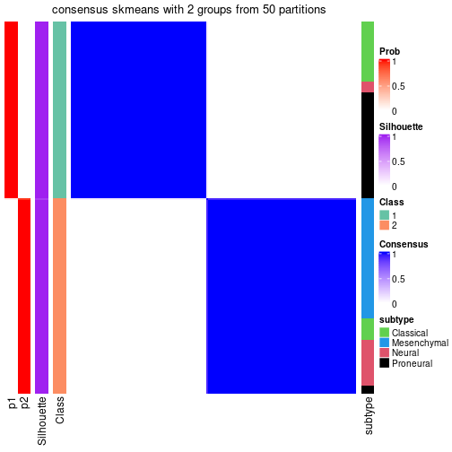</p>

</div>
<div id='tab-node-0-consensus-heatmap-2'>
<pre><code class="r">consensus_heatmap(res, k = 3)
</code></pre>

<p>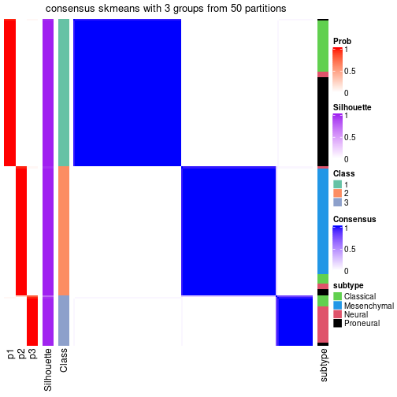</p>

</div>
<div id='tab-node-0-consensus-heatmap-3'>
<pre><code class="r">consensus_heatmap(res, k = 4)
</code></pre>

<p>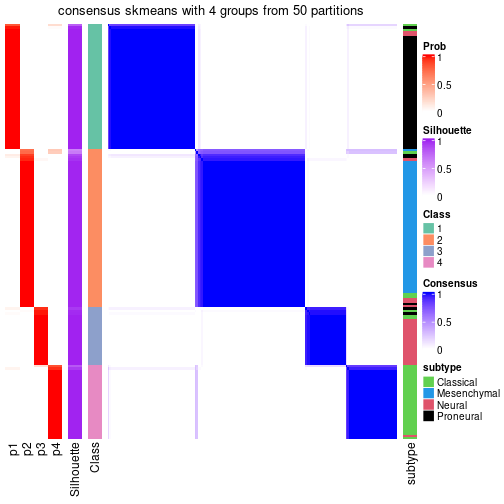</p>

</div>
</div>

Heatmaps for the membership of samples in all partitions to see how consistent they are:


<script>
$( function() {
	$( '#tabs-node-0-membership-heatmap' ).tabs();
} );
</script>
<div id='tabs-node-0-membership-heatmap'>
<ul>
<li><a href='#tab-node-0-membership-heatmap-1'>k = 2</a></li>
<li><a href='#tab-node-0-membership-heatmap-2'>k = 3</a></li>
<li><a href='#tab-node-0-membership-heatmap-3'>k = 4</a></li>
</ul>
<div id='tab-node-0-membership-heatmap-1'>
<pre><code class="r">membership_heatmap(res, k = 2)
</code></pre>

<p>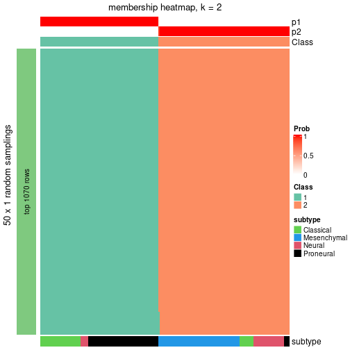</p>

</div>
<div id='tab-node-0-membership-heatmap-2'>
<pre><code class="r">membership_heatmap(res, k = 3)
</code></pre>

<p>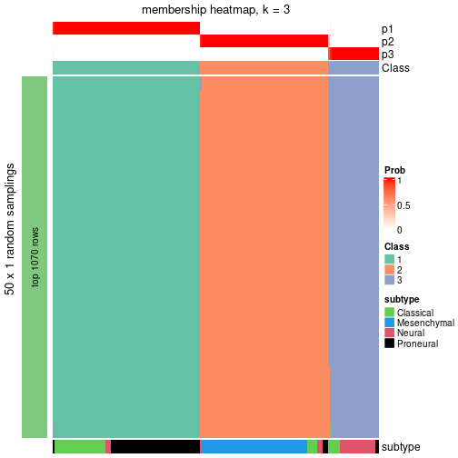</p>

</div>
<div id='tab-node-0-membership-heatmap-3'>
<pre><code class="r">membership_heatmap(res, k = 4)
</code></pre>

<p>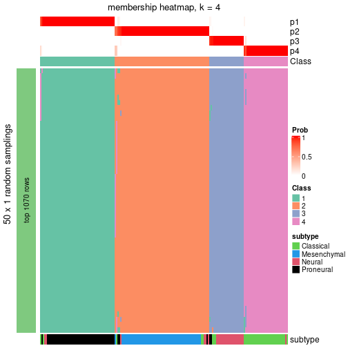</p>

</div>
</div>

As soon as the classes for columns are determined, the signatures
that are significantly different between subgroups can be looked for. 
Following are the heatmaps for signatures.


Signature heatmaps where rows are scaled:


<script>
$( function() {
	$( '#tabs-node-0-get-signatures' ).tabs();
} );
</script>
<div id='tabs-node-0-get-signatures'>
<ul>
<li><a href='#tab-node-0-get-signatures-1'>k = 2</a></li>
<li><a href='#tab-node-0-get-signatures-2'>k = 3</a></li>
<li><a href='#tab-node-0-get-signatures-3'>k = 4</a></li>
</ul>
<div id='tab-node-0-get-signatures-1'>
<pre><code class="r">get_signatures(res, k = 2)
</code></pre>

<p>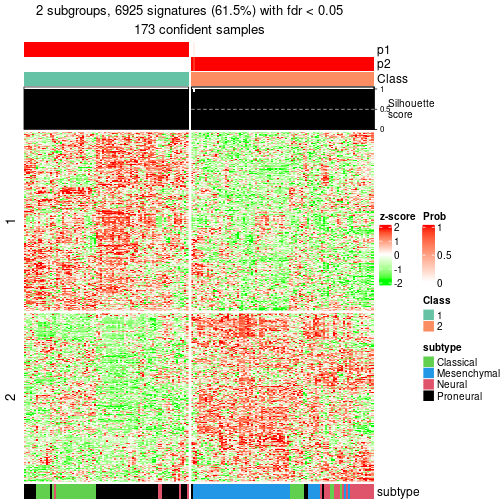</p>

</div>
<div id='tab-node-0-get-signatures-2'>
<pre><code class="r">get_signatures(res, k = 3)
</code></pre>

<p>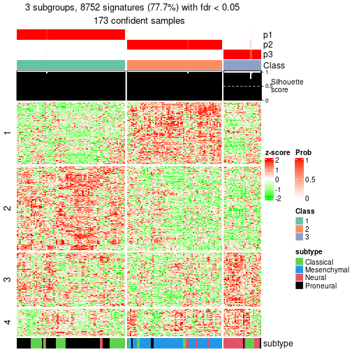</p>

</div>
<div id='tab-node-0-get-signatures-3'>
<pre><code class="r">get_signatures(res, k = 4)
</code></pre>

<p></p>

</div>
</div>


Signature heatmaps where rows are not scaled:


<script>
$( function() {
	$( '#tabs-node-0-get-signatures-no-scale' ).tabs();
} );
</script>
<div id='tabs-node-0-get-signatures-no-scale'>
<ul>
<li><a href='#tab-node-0-get-signatures-no-scale-1'>k = 2</a></li>
<li><a href='#tab-node-0-get-signatures-no-scale-2'>k = 3</a></li>
<li><a href='#tab-node-0-get-signatures-no-scale-3'>k = 4</a></li>
</ul>
<div id='tab-node-0-get-signatures-no-scale-1'>
<pre><code class="r">get_signatures(res, k = 2, scale_rows = FALSE)
</code></pre>

<p>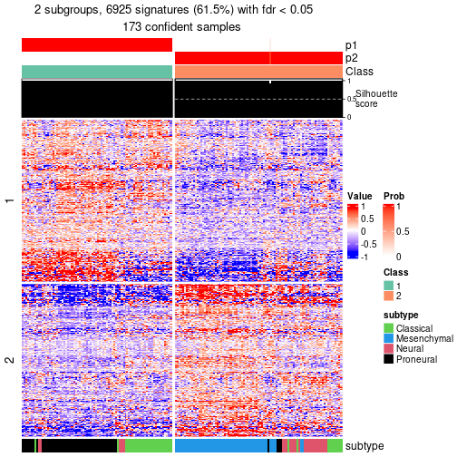</p>

</div>
<div id='tab-node-0-get-signatures-no-scale-2'>
<pre><code class="r">get_signatures(res, k = 3, scale_rows = FALSE)
</code></pre>

<p>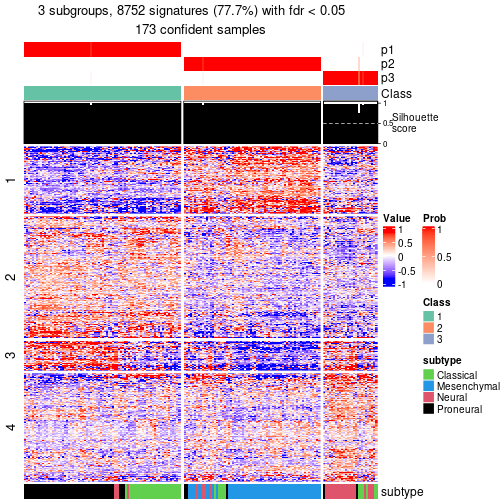</p>

</div>
<div id='tab-node-0-get-signatures-no-scale-3'>
<pre><code class="r">get_signatures(res, k = 4, scale_rows = FALSE)
</code></pre>

<p>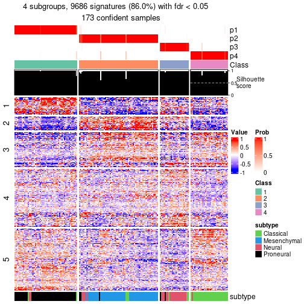</p>

</div>
</div>


Compare the overlap of signatures from different k:

```r
compare_signatures(res)
```

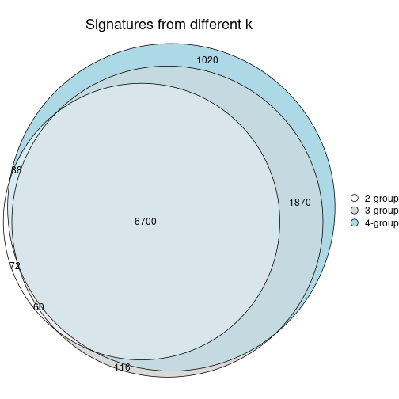

`get_signature()` returns a data frame invisibly. To get the list of signatures, the function
call should be assigned to a variable explicitly. In following code, if `plot` argument is set
to `FALSE`, no heatmap is plotted while only the differential analysis is performed.

```r
# code only for demonstration
tb = get_signature(res, k = ..., plot = FALSE)
```

An example of the output of `tb` is:

```
#>   which_row         fdr    mean_1    mean_2 scaled_mean_1 scaled_mean_2 km
#> 1        38 0.042760348  8.373488  9.131774    -0.5533452     0.5164555  1
#> 2        40 0.018707592  7.106213  8.469186    -0.6173731     0.5762149  1
#> 3        55 0.019134737 10.221463 11.207825    -0.6159697     0.5749050  1
#> 4        59 0.006059896  5.921854  7.869574    -0.6899429     0.6439467  1
#> 5        60 0.018055526  8.928898 10.211722    -0.6204761     0.5791110  1
#> 6        98 0.009384629 15.714769 14.887706     0.6635654    -0.6193277  2
...
```

The columns in `tb` are:

1. `which_row`: row indices corresponding to the input matrix.
2. `fdr`: FDR for the differential test. 
3. `mean_x`: The mean value in group x.
4. `scaled_mean_x`: The mean value in group x after rows are scaled.
5. `km`: Row groups if k-means clustering is applied to rows (which is done by automatically selecting number of clusters).

If there are too many signatures, `top_signatures = ...` can be set to only show the 
signatures with the highest FDRs:

```r
# code only for demonstration
# e.g. to show the top 500 most significant rows
tb = get_signature(res, k = ..., top_signatures = 500)
```

If the signatures are defined as these which are uniquely high in current group, `diff_method` argument
can be set to `"uniquely_high_in_one_group"`:

```r
# code only for demonstration
tb = get_signature(res, k = ..., diff_method = "uniquely_high_in_one_group")
```


UMAP plot which shows how samples are separated.


<script>
$( function() {
	$( '#tabs-node-0-dimension-reduction' ).tabs();
} );
</script>
<div id='tabs-node-0-dimension-reduction'>
<ul>
<li><a href='#tab-node-0-dimension-reduction-1'>k = 2</a></li>
<li><a href='#tab-node-0-dimension-reduction-2'>k = 3</a></li>
<li><a href='#tab-node-0-dimension-reduction-3'>k = 4</a></li>
</ul>
<div id='tab-node-0-dimension-reduction-1'>
<pre><code class="r">dimension_reduction(res, k = 2, method = &quot;UMAP&quot;)
</code></pre>

<p>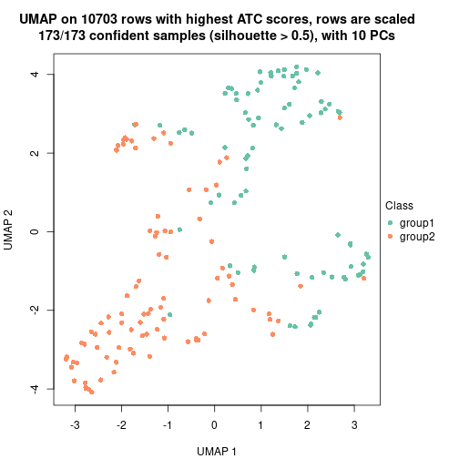</p>

</div>
<div id='tab-node-0-dimension-reduction-2'>
<pre><code class="r">dimension_reduction(res, k = 3, method = &quot;UMAP&quot;)
</code></pre>

<p>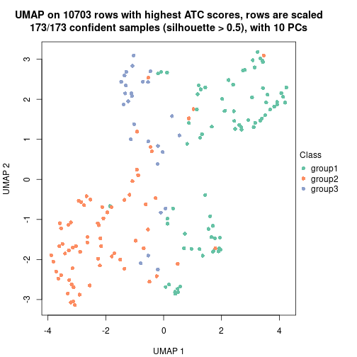</p>

</div>
<div id='tab-node-0-dimension-reduction-3'>
<pre><code class="r">dimension_reduction(res, k = 4, method = &quot;UMAP&quot;)
</code></pre>

<p>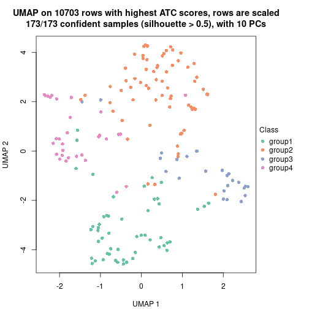</p>

</div>
</div>


Following heatmap shows how subgroups are split when increasing `k`:

```r
collect_classes(res)
```

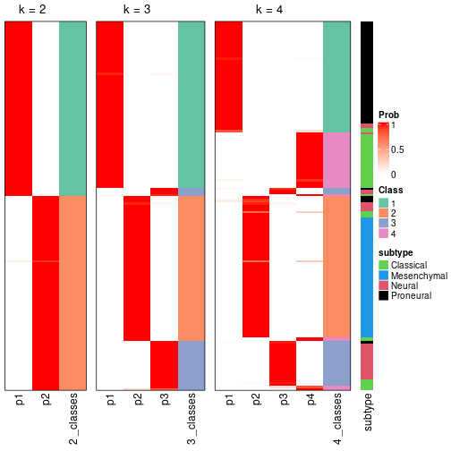


Test correlation between subgroups and known annotations. If the known
annotation is numeric, one-way ANOVA test is applied, and if the known
annotation is discrete, chi-squared contingency table test is applied.

```r
test_to_known_factors(res)
```

```
#>             n_sample subtype(p-value) k
#> ATC:skmeans      173         3.31e-24 2
#> ATC:skmeans      173         3.09e-42 3
#> ATC:skmeans      173         2.35e-71 4
```


If matrix rows can be associated to genes, consider to use `functional_enrichment(res,
...)` to perform function enrichment for the signature genes. See [this vignette](https://jokergoo.github.io/cola_vignettes/functional_enrichment.html) for more detailed explanations.


 

---------------------------------------------------


### Node01


Parent node: [Node0](#Node0).
Child nodes: 
                Node011-leaf
        ,
                [Node012](#Node012)
        ,
                Node013-leaf
        ,
                [Node021](#Node021)
        ,
                [Node022](#Node022)
        ,
                Node023-leaf
        ,
                Node031-leaf
        ,
                Node032-leaf
        ,
                Node033-leaf
        ,
                Node034-leaf
        ,
                Node041-leaf
        ,
                Node042-leaf
        .


The object with results only for a single top-value method and a single partitioning method 
can be extracted as:

```r
res = res_rh["01"]
```

A summary of `res` and all the functions that can be applied to it:

```r
res
```

```
#> A 'ConsensusPartition' object with k = 2, 3, 4.
#>   On a matrix with 10703 rows and 52 columns.
#>   Top rows (1070) are extracted by 'ATC' method.
#>   Subgroups are detected by 'skmeans' method.
#>   Performed in total 150 partitions by row resampling.
#>   Best k for subgroups seems to be 4.
#> 
#> Following methods can be applied to this 'ConsensusPartition' object:
#>  [1] "cola_report"             "collect_classes"         "collect_plots"          
#>  [4] "collect_stats"           "colnames"                "compare_partitions"     
#>  [7] "compare_signatures"      "consensus_heatmap"       "dimension_reduction"    
#> [10] "functional_enrichment"   "get_anno_col"            "get_anno"               
#> [13] "get_classes"             "get_consensus"           "get_matrix"             
#> [16] "get_membership"          "get_param"               "get_signatures"         
#> [19] "get_stats"               "is_best_k"               "is_stable_k"            
#> [22] "membership_heatmap"      "ncol"                    "nrow"                   
#> [25] "plot_ecdf"               "predict_classes"         "rownames"               
#> [28] "select_partition_number" "show"                    "suggest_best_k"         
#> [31] "test_to_known_factors"   "top_rows_heatmap"
```

`collect_plots()` function collects all the plots made from `res` for all `k` (number of subgroups)
into one single page to provide an easy and fast comparison between different `k`.

```r
collect_plots(res)
```

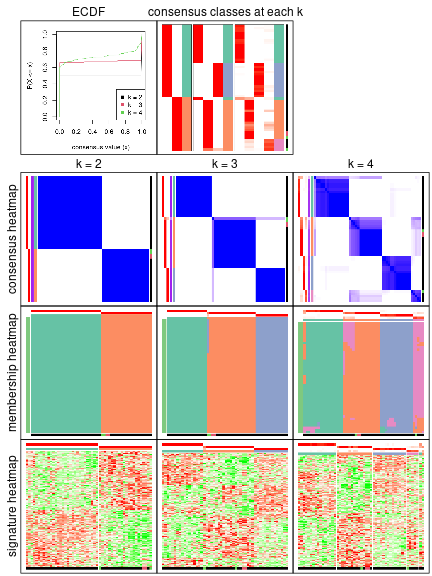

The plots are:

- The first row: a plot of the eCDF (empirical cumulative distribution
  function) curves of the consensus matrix for each `k` and the heatmap of
  predicted classes for each `k`.
- The second row: heatmaps of the consensus matrix for each `k`.
- The third row: heatmaps of the membership matrix for each `k`.
- The fouth row: heatmaps of the signatures for each `k`.

All the plots in panels can be made by individual functions and they are
plotted later in this section.

`select_partition_number()` produces several plots showing different
statistics for choosing "optimized" `k`. There are following statistics:

- eCDF curves of the consensus matrix for each `k`;
- 1-PAC. [The PAC score](https://en.wikipedia.org/wiki/Consensus_clustering#Over-interpretation_potential_of_consensus_clustering)
  measures the proportion of the ambiguous subgrouping.
- Mean silhouette score.
- Concordance. The mean probability of fiting the consensus subgroup labels in all
  partitions.
- Area increased. Denote $A_k$ as the area under the eCDF curve for current
  `k`, the area increased is defined as $A_k - A_{k-1}$.
- Rand index. The percent of pairs of samples that are both in a same cluster
  or both are not in a same cluster in the partition of k and k-1.
- Jaccard index. The ratio of pairs of samples are both in a same cluster in
  the partition of k and k-1 and the pairs of samples are both in a same
  cluster in the partition k or k-1.

The detailed explanations of these statistics can be found in [the _cola_
vignette](https://jokergoo.github.io/cola_vignettes/cola.html#toc_13).

Generally speaking, higher 1-PAC score, higher mean silhouette score or higher
concordance corresponds to better partition. Rand index and Jaccard index
measure how similar the current partition is compared to partition with `k-1`.
If they are too similar, we won't accept `k` is better than `k-1`.

```r
select_partition_number(res)
```

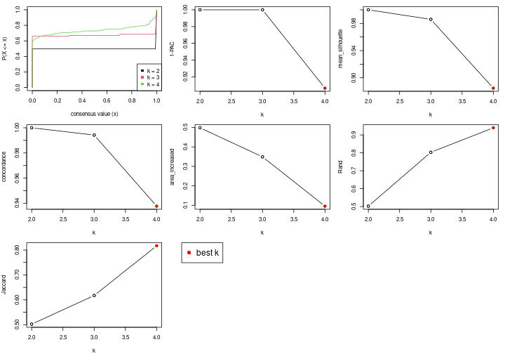

The numeric values for all these statistics can be obtained by `get_stats()`.

```r
get_stats(res)
```

```
#>   k 1-PAC mean_silhouette concordance area_increased  Rand Jaccard
#> 2 2 1.000           1.000       1.000         0.4982 0.502   0.502
#> 3 3 1.000           0.986       0.994         0.3490 0.803   0.617
#> 4 4 0.906           0.885       0.938         0.0957 0.940   0.817
```

`suggest_best_k()` suggests the best $k$ based on these statistics. The rules are as follows:

- All $k$ with Jaccard index larger than 0.95 are removed because increasing
  $k$ does not provide enough extra information. If all $k$ are removed, it is
  marked as no subgroup is detected.
- For all $k$ with 1-PAC score larger than 0.9, the maximal $k$ is taken as
  the best $k$, and other $k$ are marked as optional $k$.
- If it does not fit the second rule. The $k$ with the maximal vote of the
  highest 1-PAC score, highest mean silhouette, and highest concordance is
  taken as the best $k$.

```r
suggest_best_k(res)
```

```
#> [1] 4
#> attr(,"optional")
#> [1] 2 3
```

There is also optional best $k$ = 2 3 that is worth to check.

Following is the table of the partitions (You need to click the **show/hide
code output** link to see it). The membership matrix (columns with name `p*`)
is inferred by
[`clue::cl_consensus()`](https://www.rdocumentation.org/link/cl_consensus?package=clue)
function with the `SE` method. Basically the value in the membership matrix
represents the probability to belong to a certain group. The finall subgroup
label for an item is determined with the group with highest probability it
belongs to.

In `get_classes()` function, the entropy is calculated from the membership
matrix and the silhouette score is calculated from the consensus matrix.


<script>
$( function() {
	$( '#tabs-node-01-get-classes' ).tabs();
} );
</script>
<div id='tabs-node-01-get-classes'>
<ul>
<li><a href='#tab-node-01-get-classes-1'>k = 2</a></li>
<li><a href='#tab-node-01-get-classes-2'>k = 3</a></li>
<li><a href='#tab-node-01-get-classes-3'>k = 4</a></li>
</ul>

<div id='tab-node-01-get-classes-1'>
<p><a id='tab-node-01-get-classes-1-a' style='color:#0366d6' href='#'>show/hide code output</a></p>
<pre><code class="r">cbind(get_classes(res, k = 2), get_membership(res, k = 2))
</code></pre>

<pre><code>#&gt;                     class entropy silhouette p1 p2
#&gt; TCGA-02-0003-01A-01     1       0          1  1  0
#&gt; TCGA-02-0010-01A-01     1       0          1  1  0
#&gt; TCGA-02-0011-01B-01     2       0          1  0  1
#&gt; TCGA-02-0014-01A-01     1       0          1  1  0
#&gt; TCGA-02-0024-01B-01     1       0          1  1  0
#&gt; TCGA-02-0026-01B-01     1       0          1  1  0
#&gt; TCGA-02-0028-01A-01     1       0          1  1  0
#&gt; TCGA-02-0046-01A-01     1       0          1  1  0
#&gt; TCGA-02-0048-01A-01     1       0          1  1  0
#&gt; TCGA-02-0060-01A-01     2       0          1  0  1
#&gt; TCGA-02-0069-01A-01     1       0          1  1  0
#&gt; TCGA-02-0074-01A-01     1       0          1  1  0
#&gt; TCGA-02-0080-01A-01     2       0          1  0  1
#&gt; TCGA-02-0087-01A-01     2       0          1  0  1
#&gt; TCGA-02-0104-01A-01     1       0          1  1  0
#&gt; TCGA-02-0114-01A-01     1       0          1  1  0
#&gt; TCGA-02-0281-01A-01     1       0          1  1  0
#&gt; TCGA-02-0321-01A-01     2       0          1  0  1
#&gt; TCGA-02-0325-01A-01     2       0          1  0  1
#&gt; TCGA-02-0338-01A-01     1       0          1  1  0
#&gt; TCGA-02-0339-01A-01     1       0          1  1  0
#&gt; TCGA-02-0432-01A-02     2       0          1  0  1
#&gt; TCGA-02-0439-01A-01     2       0          1  0  1
#&gt; TCGA-02-0440-01A-01     1       0          1  1  0
#&gt; TCGA-06-0128-01A-01     2       0          1  0  1
#&gt; TCGA-06-0129-01A-01     1       0          1  1  0
#&gt; TCGA-06-0146-01A-01     2       0          1  0  1
#&gt; TCGA-06-0156-01A-01     1       0          1  1  0
#&gt; TCGA-06-0166-01A-01     1       0          1  1  0
#&gt; TCGA-06-0174-01A-01     1       0          1  1  0
#&gt; TCGA-06-0177-01A-01     1       0          1  1  0
#&gt; TCGA-06-0241-01A-02     1       0          1  1  0
#&gt; TCGA-06-0410-01A-01     1       0          1  1  0
#&gt; TCGA-06-0413-01A-01     1       0          1  1  0
#&gt; TCGA-06-0414-01A-01     1       0          1  1  0
#&gt; TCGA-06-0648-01A-01     2       0          1  0  1
#&gt; TCGA-08-0245-01A-01     1       0          1  1  0
#&gt; TCGA-08-0344-01A-01     2       0          1  0  1
#&gt; TCGA-08-0347-01A-01     2       0          1  0  1
#&gt; TCGA-08-0348-01A-01     2       0          1  0  1
#&gt; TCGA-08-0350-01A-01     2       0          1  0  1
#&gt; TCGA-08-0353-01A-01     1       0          1  1  0
#&gt; TCGA-08-0359-01A-01     2       0          1  0  1
#&gt; TCGA-08-0385-01A-01     2       0          1  0  1
#&gt; TCGA-08-0517-01A-01     1       0          1  1  0
#&gt; TCGA-08-0524-01A-01     1       0          1  1  0
#&gt; TCGA-12-0616-01A-01     1       0          1  1  0
#&gt; TCGA-12-0618-01A-01     2       0          1  0  1
#&gt; TCGA-06-0160-01A-01     2       0          1  0  1
#&gt; TCGA-06-0167-01A-01     2       0          1  0  1
#&gt; TCGA-02-0027-01A-01     2       0          1  0  1
#&gt; TCGA-08-0375-01A-01     2       0          1  0  1
</code></pre>

<script>
$('#tab-node-01-get-classes-1-a').parent().next().next().hide();
$('#tab-node-01-get-classes-1-a').click(function(){
  $('#tab-node-01-get-classes-1-a').parent().next().next().toggle();
  return(false);
});
</script>
</div>

<div id='tab-node-01-get-classes-2'>
<p><a id='tab-node-01-get-classes-2-a' style='color:#0366d6' href='#'>show/hide code output</a></p>
<pre><code class="r">cbind(get_classes(res, k = 3), get_membership(res, k = 3))
</code></pre>

<pre><code>#&gt;                     class entropy silhouette p1  p2  p3
#&gt; TCGA-02-0003-01A-01     1   0.000      1.000  1 0.0 0.0
#&gt; TCGA-02-0010-01A-01     3   0.000      1.000  0 0.0 1.0
#&gt; TCGA-02-0011-01B-01     2   0.000      0.985  0 1.0 0.0
#&gt; TCGA-02-0014-01A-01     3   0.000      1.000  0 0.0 1.0
#&gt; TCGA-02-0024-01B-01     3   0.000      1.000  0 0.0 1.0
#&gt; TCGA-02-0026-01B-01     3   0.000      1.000  0 0.0 1.0
#&gt; TCGA-02-0028-01A-01     3   0.000      1.000  0 0.0 1.0
#&gt; TCGA-02-0046-01A-01     1   0.000      1.000  1 0.0 0.0
#&gt; TCGA-02-0048-01A-01     1   0.000      1.000  1 0.0 0.0
#&gt; TCGA-02-0060-01A-01     2   0.000      0.985  0 1.0 0.0
#&gt; TCGA-02-0069-01A-01     3   0.000      1.000  0 0.0 1.0
#&gt; TCGA-02-0074-01A-01     3   0.000      1.000  0 0.0 1.0
#&gt; TCGA-02-0080-01A-01     2   0.000      0.985  0 1.0 0.0
#&gt; TCGA-02-0087-01A-01     2   0.000      0.985  0 1.0 0.0
#&gt; TCGA-02-0104-01A-01     1   0.000      1.000  1 0.0 0.0
#&gt; TCGA-02-0114-01A-01     1   0.000      1.000  1 0.0 0.0
#&gt; TCGA-02-0281-01A-01     3   0.000      1.000  0 0.0 1.0
#&gt; TCGA-02-0321-01A-01     2   0.000      0.985  0 1.0 0.0
#&gt; TCGA-02-0325-01A-01     2   0.000      0.985  0 1.0 0.0
#&gt; TCGA-02-0338-01A-01     3   0.000      1.000  0 0.0 1.0
#&gt; TCGA-02-0339-01A-01     3   0.000      1.000  0 0.0 1.0
#&gt; TCGA-02-0432-01A-02     2   0.000      0.985  0 1.0 0.0
#&gt; TCGA-02-0439-01A-01     2   0.000      0.985  0 1.0 0.0
#&gt; TCGA-02-0440-01A-01     1   0.000      1.000  1 0.0 0.0
#&gt; TCGA-06-0128-01A-01     1   0.000      1.000  1 0.0 0.0
#&gt; TCGA-06-0129-01A-01     3   0.000      1.000  0 0.0 1.0
#&gt; TCGA-06-0146-01A-01     2   0.000      0.985  0 1.0 0.0
#&gt; TCGA-06-0156-01A-01     1   0.000      1.000  1 0.0 0.0
#&gt; TCGA-06-0166-01A-01     1   0.000      1.000  1 0.0 0.0
#&gt; TCGA-06-0174-01A-01     1   0.000      1.000  1 0.0 0.0
#&gt; TCGA-06-0177-01A-01     3   0.000      1.000  0 0.0 1.0
#&gt; TCGA-06-0241-01A-02     1   0.000      1.000  1 0.0 0.0
#&gt; TCGA-06-0410-01A-01     1   0.000      1.000  1 0.0 0.0
#&gt; TCGA-06-0413-01A-01     3   0.000      1.000  0 0.0 1.0
#&gt; TCGA-06-0414-01A-01     1   0.000      1.000  1 0.0 0.0
#&gt; TCGA-06-0648-01A-01     2   0.000      0.985  0 1.0 0.0
#&gt; TCGA-08-0245-01A-01     1   0.000      1.000  1 0.0 0.0
#&gt; TCGA-08-0344-01A-01     2   0.000      0.985  0 1.0 0.0
#&gt; TCGA-08-0347-01A-01     2   0.000      0.985  0 1.0 0.0
#&gt; TCGA-08-0348-01A-01     2   0.000      0.985  0 1.0 0.0
#&gt; TCGA-08-0350-01A-01     2   0.000      0.985  0 1.0 0.0
#&gt; TCGA-08-0353-01A-01     1   0.000      1.000  1 0.0 0.0
#&gt; TCGA-08-0359-01A-01     2   0.000      0.985  0 1.0 0.0
#&gt; TCGA-08-0385-01A-01     2   0.000      0.985  0 1.0 0.0
#&gt; TCGA-08-0517-01A-01     1   0.000      1.000  1 0.0 0.0
#&gt; TCGA-08-0524-01A-01     3   0.000      1.000  0 0.0 1.0
#&gt; TCGA-12-0616-01A-01     1   0.000      1.000  1 0.0 0.0
#&gt; TCGA-12-0618-01A-01     2   0.000      0.985  0 1.0 0.0
#&gt; TCGA-06-0160-01A-01     2   0.000      0.985  0 1.0 0.0
#&gt; TCGA-06-0167-01A-01     2   0.000      0.985  0 1.0 0.0
#&gt; TCGA-02-0027-01A-01     2   0.000      0.985  0 1.0 0.0
#&gt; TCGA-08-0375-01A-01     2   0.556      0.571  0 0.7 0.3
</code></pre>

<script>
$('#tab-node-01-get-classes-2-a').parent().next().next().hide();
$('#tab-node-01-get-classes-2-a').click(function(){
  $('#tab-node-01-get-classes-2-a').parent().next().next().toggle();
  return(false);
});
</script>
</div>

<div id='tab-node-01-get-classes-3'>
<p><a id='tab-node-01-get-classes-3-a' style='color:#0366d6' href='#'>show/hide code output</a></p>
<pre><code class="r">cbind(get_classes(res, k = 4), get_membership(res, k = 4))
</code></pre>

<pre><code>#&gt;                     class entropy silhouette   p1   p2   p3   p4
#&gt; TCGA-02-0003-01A-01     1  0.0707      0.947 0.98 0.00 0.00 0.02
#&gt; TCGA-02-0010-01A-01     3  0.0000      0.970 0.00 0.00 1.00 0.00
#&gt; TCGA-02-0011-01B-01     2  0.0000      0.890 0.00 1.00 0.00 0.00
#&gt; TCGA-02-0014-01A-01     3  0.1637      0.930 0.06 0.00 0.94 0.00
#&gt; TCGA-02-0024-01B-01     3  0.0000      0.970 0.00 0.00 1.00 0.00
#&gt; TCGA-02-0026-01B-01     3  0.1637      0.947 0.00 0.00 0.94 0.06
#&gt; TCGA-02-0028-01A-01     3  0.0707      0.960 0.02 0.00 0.98 0.00
#&gt; TCGA-02-0046-01A-01     1  0.1913      0.920 0.94 0.00 0.04 0.02
#&gt; TCGA-02-0048-01A-01     1  0.1637      0.928 0.94 0.00 0.00 0.06
#&gt; TCGA-02-0060-01A-01     2  0.0000      0.890 0.00 1.00 0.00 0.00
#&gt; TCGA-02-0069-01A-01     3  0.0000      0.970 0.00 0.00 1.00 0.00
#&gt; TCGA-02-0074-01A-01     3  0.0000      0.970 0.00 0.00 1.00 0.00
#&gt; TCGA-02-0080-01A-01     2  0.0000      0.890 0.00 1.00 0.00 0.00
#&gt; TCGA-02-0087-01A-01     2  0.0000      0.890 0.00 1.00 0.00 0.00
#&gt; TCGA-02-0104-01A-01     1  0.0000      0.953 1.00 0.00 0.00 0.00
#&gt; TCGA-02-0114-01A-01     1  0.0000      0.953 1.00 0.00 0.00 0.00
#&gt; TCGA-02-0281-01A-01     3  0.0000      0.970 0.00 0.00 1.00 0.00
#&gt; TCGA-02-0321-01A-01     2  0.4277      0.641 0.00 0.72 0.00 0.28
#&gt; TCGA-02-0325-01A-01     2  0.0000      0.890 0.00 1.00 0.00 0.00
#&gt; TCGA-02-0338-01A-01     3  0.0000      0.970 0.00 0.00 1.00 0.00
#&gt; TCGA-02-0339-01A-01     3  0.2011      0.936 0.00 0.00 0.92 0.08
#&gt; TCGA-02-0432-01A-02     2  0.0000      0.890 0.00 1.00 0.00 0.00
#&gt; TCGA-02-0439-01A-01     2  0.0000      0.890 0.00 1.00 0.00 0.00
#&gt; TCGA-02-0440-01A-01     1  0.0000      0.953 1.00 0.00 0.00 0.00
#&gt; TCGA-06-0128-01A-01     1  0.6262      0.310 0.54 0.40 0.00 0.06
#&gt; TCGA-06-0129-01A-01     3  0.1211      0.956 0.00 0.00 0.96 0.04
#&gt; TCGA-06-0146-01A-01     2  0.0000      0.890 0.00 1.00 0.00 0.00
#&gt; TCGA-06-0156-01A-01     1  0.1637      0.928 0.94 0.00 0.00 0.06
#&gt; TCGA-06-0166-01A-01     1  0.1211      0.940 0.96 0.00 0.00 0.04
#&gt; TCGA-06-0174-01A-01     1  0.0000      0.953 1.00 0.00 0.00 0.00
#&gt; TCGA-06-0177-01A-01     3  0.2011      0.936 0.00 0.00 0.92 0.08
#&gt; TCGA-06-0241-01A-02     1  0.0000      0.953 1.00 0.00 0.00 0.00
#&gt; TCGA-06-0410-01A-01     1  0.0000      0.953 1.00 0.00 0.00 0.00
#&gt; TCGA-06-0413-01A-01     3  0.0000      0.970 0.00 0.00 1.00 0.00
#&gt; TCGA-06-0414-01A-01     1  0.0000      0.953 1.00 0.00 0.00 0.00
#&gt; TCGA-06-0648-01A-01     4  0.3400      0.901 0.00 0.18 0.00 0.82
#&gt; TCGA-08-0245-01A-01     1  0.0000      0.953 1.00 0.00 0.00 0.00
#&gt; TCGA-08-0344-01A-01     4  0.3801      0.864 0.00 0.22 0.00 0.78
#&gt; TCGA-08-0347-01A-01     2  0.3801      0.716 0.00 0.78 0.00 0.22
#&gt; TCGA-08-0348-01A-01     2  0.4907      0.197 0.00 0.58 0.00 0.42
#&gt; TCGA-08-0350-01A-01     2  0.4134      0.670 0.00 0.74 0.00 0.26
#&gt; TCGA-08-0353-01A-01     1  0.0000      0.953 1.00 0.00 0.00 0.00
#&gt; TCGA-08-0359-01A-01     2  0.3400      0.746 0.00 0.82 0.00 0.18
#&gt; TCGA-08-0385-01A-01     4  0.2345      0.894 0.00 0.10 0.00 0.90
#&gt; TCGA-08-0517-01A-01     1  0.1211      0.940 0.96 0.00 0.00 0.04
#&gt; TCGA-08-0524-01A-01     3  0.1637      0.930 0.06 0.00 0.94 0.00
#&gt; TCGA-12-0616-01A-01     1  0.0000      0.953 1.00 0.00 0.00 0.00
#&gt; TCGA-12-0618-01A-01     4  0.3172      0.906 0.00 0.16 0.00 0.84
#&gt; TCGA-06-0160-01A-01     2  0.0000      0.890 0.00 1.00 0.00 0.00
#&gt; TCGA-06-0167-01A-01     2  0.0000      0.890 0.00 1.00 0.00 0.00
#&gt; TCGA-02-0027-01A-01     2  0.0000      0.890 0.00 1.00 0.00 0.00
#&gt; TCGA-08-0375-01A-01     4  0.2335      0.851 0.00 0.06 0.02 0.92
</code></pre>

<script>
$('#tab-node-01-get-classes-3-a').parent().next().next().hide();
$('#tab-node-01-get-classes-3-a').click(function(){
  $('#tab-node-01-get-classes-3-a').parent().next().next().toggle();
  return(false);
});
</script>
</div>
</div>

Heatmaps for the consensus matrix. It visualizes the probability of two
samples to be in a same group.


<script>
$( function() {
	$( '#tabs-node-01-consensus-heatmap' ).tabs();
} );
</script>
<div id='tabs-node-01-consensus-heatmap'>
<ul>
<li><a href='#tab-node-01-consensus-heatmap-1'>k = 2</a></li>
<li><a href='#tab-node-01-consensus-heatmap-2'>k = 3</a></li>
<li><a href='#tab-node-01-consensus-heatmap-3'>k = 4</a></li>
</ul>
<div id='tab-node-01-consensus-heatmap-1'>
<pre><code class="r">consensus_heatmap(res, k = 2)
</code></pre>

<p>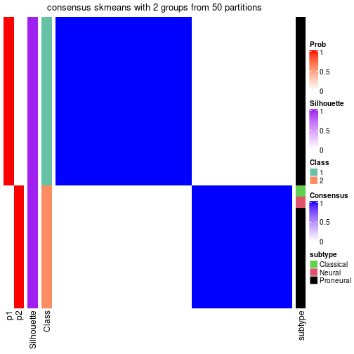</p>

</div>
<div id='tab-node-01-consensus-heatmap-2'>
<pre><code class="r">consensus_heatmap(res, k = 3)
</code></pre>

<p>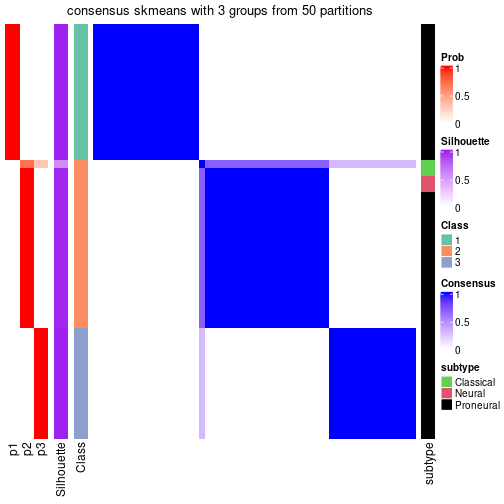</p>

</div>
<div id='tab-node-01-consensus-heatmap-3'>
<pre><code class="r">consensus_heatmap(res, k = 4)
</code></pre>

<p>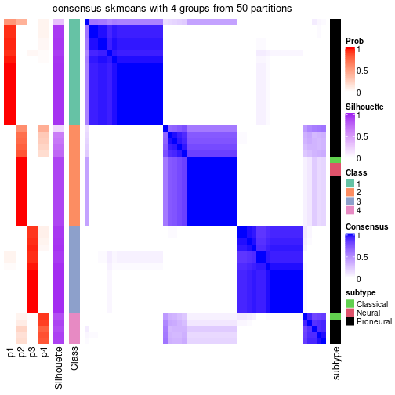</p>

</div>
</div>

Heatmaps for the membership of samples in all partitions to see how consistent they are:


<script>
$( function() {
	$( '#tabs-node-01-membership-heatmap' ).tabs();
} );
</script>
<div id='tabs-node-01-membership-heatmap'>
<ul>
<li><a href='#tab-node-01-membership-heatmap-1'>k = 2</a></li>
<li><a href='#tab-node-01-membership-heatmap-2'>k = 3</a></li>
<li><a href='#tab-node-01-membership-heatmap-3'>k = 4</a></li>
</ul>
<div id='tab-node-01-membership-heatmap-1'>
<pre><code class="r">membership_heatmap(res, k = 2)
</code></pre>

<p>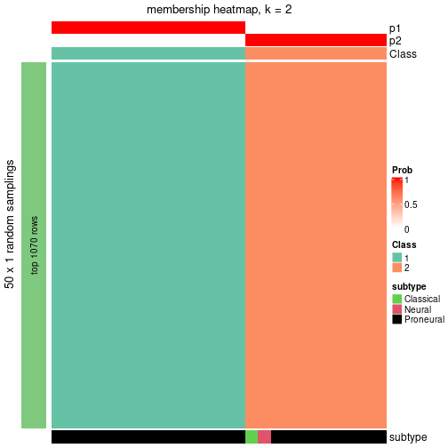</p>

</div>
<div id='tab-node-01-membership-heatmap-2'>
<pre><code class="r">membership_heatmap(res, k = 3)
</code></pre>

<p>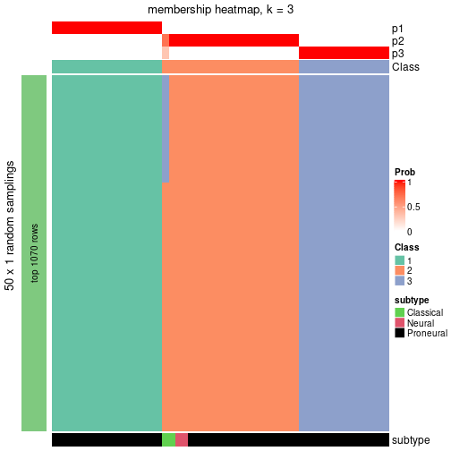</p>

</div>
<div id='tab-node-01-membership-heatmap-3'>
<pre><code class="r">membership_heatmap(res, k = 4)
</code></pre>

<p>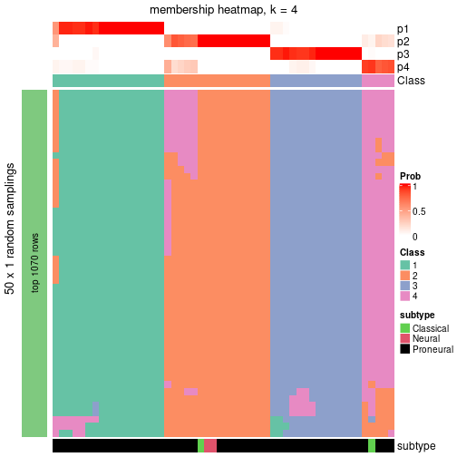</p>

</div>
</div>

As soon as the classes for columns are determined, the signatures
that are significantly different between subgroups can be looked for. 
Following are the heatmaps for signatures.


Signature heatmaps where rows are scaled:


<script>
$( function() {
	$( '#tabs-node-01-get-signatures' ).tabs();
} );
</script>
<div id='tabs-node-01-get-signatures'>
<ul>
<li><a href='#tab-node-01-get-signatures-1'>k = 2</a></li>
<li><a href='#tab-node-01-get-signatures-2'>k = 3</a></li>
<li><a href='#tab-node-01-get-signatures-3'>k = 4</a></li>
</ul>
<div id='tab-node-01-get-signatures-1'>
<pre><code class="r">get_signatures(res, k = 2)
</code></pre>

<p>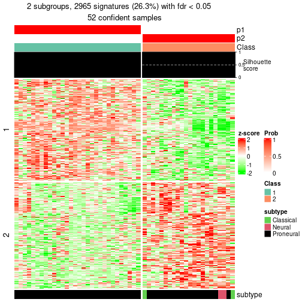</p>

</div>
<div id='tab-node-01-get-signatures-2'>
<pre><code class="r">get_signatures(res, k = 3)
</code></pre>

<p></p>

</div>
<div id='tab-node-01-get-signatures-3'>
<pre><code class="r">get_signatures(res, k = 4)
</code></pre>

<p>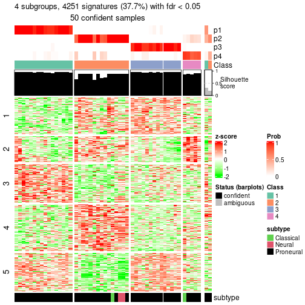</p>

</div>
</div>


Signature heatmaps where rows are not scaled:


<script>
$( function() {
	$( '#tabs-node-01-get-signatures-no-scale' ).tabs();
} );
</script>
<div id='tabs-node-01-get-signatures-no-scale'>
<ul>
<li><a href='#tab-node-01-get-signatures-no-scale-1'>k = 2</a></li>
<li><a href='#tab-node-01-get-signatures-no-scale-2'>k = 3</a></li>
<li><a href='#tab-node-01-get-signatures-no-scale-3'>k = 4</a></li>
</ul>
<div id='tab-node-01-get-signatures-no-scale-1'>
<pre><code class="r">get_signatures(res, k = 2, scale_rows = FALSE)
</code></pre>

<p>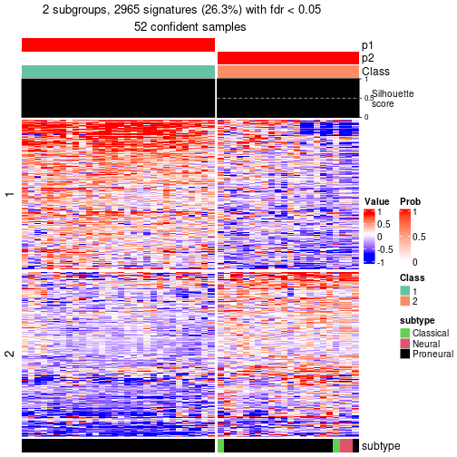</p>

</div>
<div id='tab-node-01-get-signatures-no-scale-2'>
<pre><code class="r">get_signatures(res, k = 3, scale_rows = FALSE)
</code></pre>

<p>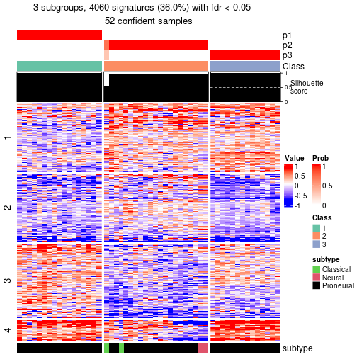</p>

</div>
<div id='tab-node-01-get-signatures-no-scale-3'>
<pre><code class="r">get_signatures(res, k = 4, scale_rows = FALSE)
</code></pre>

<p>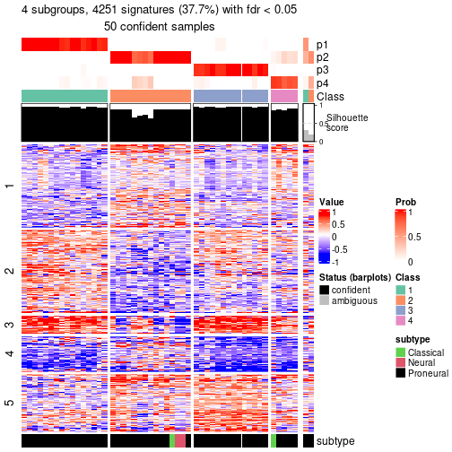</p>

</div>
</div>


Compare the overlap of signatures from different k:

```r
compare_signatures(res)
```

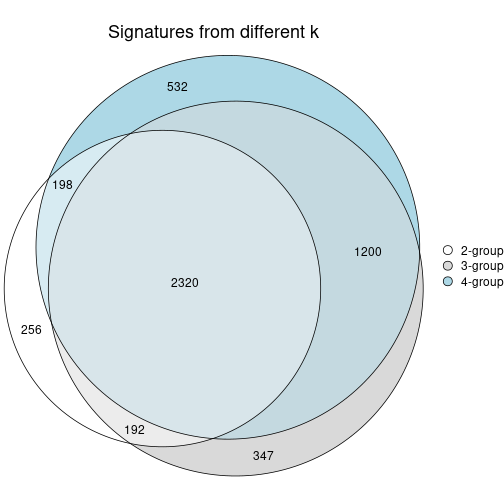

`get_signature()` returns a data frame invisibly. To get the list of signatures, the function
call should be assigned to a variable explicitly. In following code, if `plot` argument is set
to `FALSE`, no heatmap is plotted while only the differential analysis is performed.

```r
# code only for demonstration
tb = get_signature(res, k = ..., plot = FALSE)
```

An example of the output of `tb` is:

```
#>   which_row         fdr    mean_1    mean_2 scaled_mean_1 scaled_mean_2 km
#> 1        38 0.042760348  8.373488  9.131774    -0.5533452     0.5164555  1
#> 2        40 0.018707592  7.106213  8.469186    -0.6173731     0.5762149  1
#> 3        55 0.019134737 10.221463 11.207825    -0.6159697     0.5749050  1
#> 4        59 0.006059896  5.921854  7.869574    -0.6899429     0.6439467  1
#> 5        60 0.018055526  8.928898 10.211722    -0.6204761     0.5791110  1
#> 6        98 0.009384629 15.714769 14.887706     0.6635654    -0.6193277  2
...
```

The columns in `tb` are:

1. `which_row`: row indices corresponding to the input matrix.
2. `fdr`: FDR for the differential test. 
3. `mean_x`: The mean value in group x.
4. `scaled_mean_x`: The mean value in group x after rows are scaled.
5. `km`: Row groups if k-means clustering is applied to rows (which is done by automatically selecting number of clusters).

If there are too many signatures, `top_signatures = ...` can be set to only show the 
signatures with the highest FDRs:

```r
# code only for demonstration
# e.g. to show the top 500 most significant rows
tb = get_signature(res, k = ..., top_signatures = 500)
```

If the signatures are defined as these which are uniquely high in current group, `diff_method` argument
can be set to `"uniquely_high_in_one_group"`:

```r
# code only for demonstration
tb = get_signature(res, k = ..., diff_method = "uniquely_high_in_one_group")
```


UMAP plot which shows how samples are separated.


<script>
$( function() {
	$( '#tabs-node-01-dimension-reduction' ).tabs();
} );
</script>
<div id='tabs-node-01-dimension-reduction'>
<ul>
<li><a href='#tab-node-01-dimension-reduction-1'>k = 2</a></li>
<li><a href='#tab-node-01-dimension-reduction-2'>k = 3</a></li>
<li><a href='#tab-node-01-dimension-reduction-3'>k = 4</a></li>
</ul>
<div id='tab-node-01-dimension-reduction-1'>
<pre><code class="r">dimension_reduction(res, k = 2, method = &quot;UMAP&quot;)
</code></pre>

<p>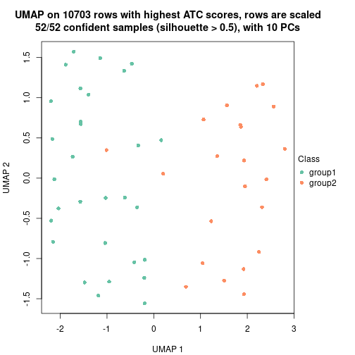</p>

</div>
<div id='tab-node-01-dimension-reduction-2'>
<pre><code class="r">dimension_reduction(res, k = 3, method = &quot;UMAP&quot;)
</code></pre>

<p>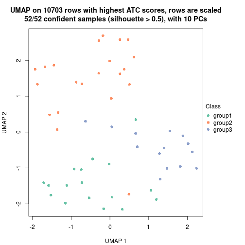</p>

</div>
<div id='tab-node-01-dimension-reduction-3'>
<pre><code class="r">dimension_reduction(res, k = 4, method = &quot;UMAP&quot;)
</code></pre>

<p>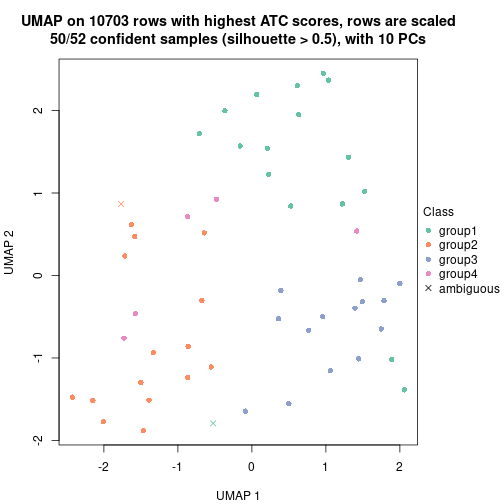</p>

</div>
</div>


Following heatmap shows how subgroups are split when increasing `k`:

```r
collect_classes(res)
```

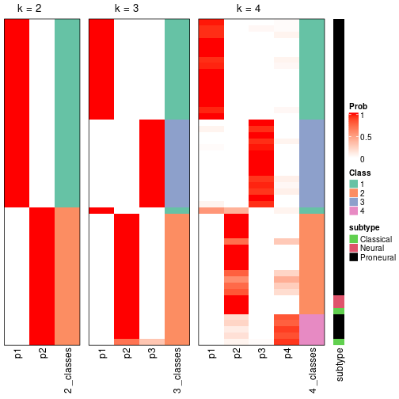


Test correlation between subgroups and known annotations. If the known
annotation is numeric, one-way ANOVA test is applied, and if the known
annotation is discrete, chi-squared contingency table test is applied.

```r
test_to_known_factors(res)
```

```
#>             n_sample subtype(p-value) k
#> ATC:skmeans       52           0.0521 2
#> ATC:skmeans       52           0.1714 3
#> ATC:skmeans       50           0.1309 4
```


If matrix rows can be associated to genes, consider to use `functional_enrichment(res,
...)` to perform function enrichment for the signature genes. See [this vignette](https://jokergoo.github.io/cola_vignettes/functional_enrichment.html) for more detailed explanations.


 

---------------------------------------------------


### Node012


Parent node: [Node01](#Node01).
Child nodes: 
                Node0121-leaf
        ,
                Node0122-leaf
        ,
                Node0211-leaf
        ,
                Node0212-leaf
        ,
                Node0213-leaf
        ,
                Node0221-leaf
        ,
                Node0222-leaf
        .


The object with results only for a single top-value method and a single partitioning method 
can be extracted as:

```r
res = res_rh["012"]
```

A summary of `res` and all the functions that can be applied to it:

```r
res
```

```
#> A 'ConsensusPartition' object with k = 2, 3, 4.
#>   On a matrix with 10703 rows and 21 columns.
#>   Top rows (806) are extracted by 'ATC' method.
#>   Subgroups are detected by 'skmeans' method.
#>   Performed in total 150 partitions by row resampling.
#>   Best k for subgroups seems to be 3.
#> 
#> Following methods can be applied to this 'ConsensusPartition' object:
#>  [1] "cola_report"             "collect_classes"         "collect_plots"          
#>  [4] "collect_stats"           "colnames"                "compare_partitions"     
#>  [7] "compare_signatures"      "consensus_heatmap"       "dimension_reduction"    
#> [10] "functional_enrichment"   "get_anno_col"            "get_anno"               
#> [13] "get_classes"             "get_consensus"           "get_matrix"             
#> [16] "get_membership"          "get_param"               "get_signatures"         
#> [19] "get_stats"               "is_best_k"               "is_stable_k"            
#> [22] "membership_heatmap"      "ncol"                    "nrow"                   
#> [25] "plot_ecdf"               "predict_classes"         "rownames"               
#> [28] "select_partition_number" "show"                    "suggest_best_k"         
#> [31] "test_to_known_factors"   "top_rows_heatmap"
```

`collect_plots()` function collects all the plots made from `res` for all `k` (number of subgroups)
into one single page to provide an easy and fast comparison between different `k`.

```r
collect_plots(res)
```

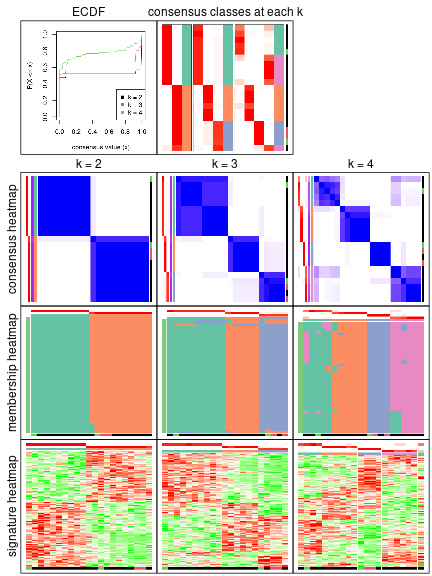

The plots are:

- The first row: a plot of the eCDF (empirical cumulative distribution
  function) curves of the consensus matrix for each `k` and the heatmap of
  predicted classes for each `k`.
- The second row: heatmaps of the consensus matrix for each `k`.
- The third row: heatmaps of the membership matrix for each `k`.
- The fouth row: heatmaps of the signatures for each `k`.

All the plots in panels can be made by individual functions and they are
plotted later in this section.

`select_partition_number()` produces several plots showing different
statistics for choosing "optimized" `k`. There are following statistics:

- eCDF curves of the consensus matrix for each `k`;
- 1-PAC. [The PAC score](https://en.wikipedia.org/wiki/Consensus_clustering#Over-interpretation_potential_of_consensus_clustering)
  measures the proportion of the ambiguous subgrouping.
- Mean silhouette score.
- Concordance. The mean probability of fiting the consensus subgroup labels in all
  partitions.
- Area increased. Denote $A_k$ as the area under the eCDF curve for current
  `k`, the area increased is defined as $A_k - A_{k-1}$.
- Rand index. The percent of pairs of samples that are both in a same cluster
  or both are not in a same cluster in the partition of k and k-1.
- Jaccard index. The ratio of pairs of samples are both in a same cluster in
  the partition of k and k-1 and the pairs of samples are both in a same
  cluster in the partition k or k-1.

The detailed explanations of these statistics can be found in [the _cola_
vignette](https://jokergoo.github.io/cola_vignettes/cola.html#toc_13).

Generally speaking, higher 1-PAC score, higher mean silhouette score or higher
concordance corresponds to better partition. Rand index and Jaccard index
measure how similar the current partition is compared to partition with `k-1`.
If they are too similar, we won't accept `k` is better than `k-1`.

```r
select_partition_number(res)
```

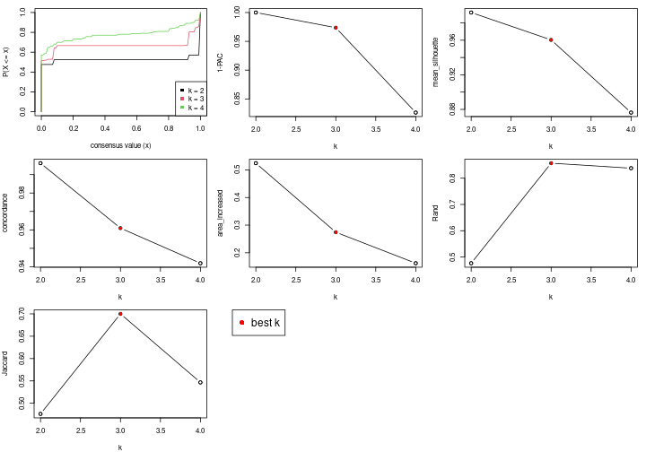

The numeric values for all these statistics can be obtained by `get_stats()`.

```r
get_stats(res)
```

```
#>   k 1-PAC mean_silhouette concordance area_increased  Rand Jaccard
#> 2 2 1.000           0.992       0.996          0.524 0.476   0.476
#> 3 3 0.974           0.960       0.961          0.274 0.857   0.700
#> 4 4 0.826           0.876       0.942          0.162 0.838   0.547
```

`suggest_best_k()` suggests the best $k$ based on these statistics. The rules are as follows:

- All $k$ with Jaccard index larger than 0.95 are removed because increasing
  $k$ does not provide enough extra information. If all $k$ are removed, it is
  marked as no subgroup is detected.
- For all $k$ with 1-PAC score larger than 0.9, the maximal $k$ is taken as
  the best $k$, and other $k$ are marked as optional $k$.
- If it does not fit the second rule. The $k$ with the maximal vote of the
  highest 1-PAC score, highest mean silhouette, and highest concordance is
  taken as the best $k$.

```r
suggest_best_k(res)
```

```
#> [1] 3
#> attr(,"optional")
#> [1] 2
```

There is also optional best $k$ = 2 that is worth to check.

Following is the table of the partitions (You need to click the **show/hide
code output** link to see it). The membership matrix (columns with name `p*`)
is inferred by
[`clue::cl_consensus()`](https://www.rdocumentation.org/link/cl_consensus?package=clue)
function with the `SE` method. Basically the value in the membership matrix
represents the probability to belong to a certain group. The finall subgroup
label for an item is determined with the group with highest probability it
belongs to.

In `get_classes()` function, the entropy is calculated from the membership
matrix and the silhouette score is calculated from the consensus matrix.


<script>
$( function() {
	$( '#tabs-node-012-get-classes' ).tabs();
} );
</script>
<div id='tabs-node-012-get-classes'>
<ul>
<li><a href='#tab-node-012-get-classes-1'>k = 2</a></li>
<li><a href='#tab-node-012-get-classes-2'>k = 3</a></li>
<li><a href='#tab-node-012-get-classes-3'>k = 4</a></li>
</ul>

<div id='tab-node-012-get-classes-1'>
<p><a id='tab-node-012-get-classes-1-a' style='color:#0366d6' href='#'>show/hide code output</a></p>
<pre><code class="r">cbind(get_classes(res, k = 2), get_membership(res, k = 2))
</code></pre>

<pre><code>#&gt;                     class entropy silhouette   p1   p2
#&gt; TCGA-02-0011-01B-01     2   0.000      0.992 0.00 1.00
#&gt; TCGA-02-0060-01A-01     2   0.000      0.992 0.00 1.00
#&gt; TCGA-02-0080-01A-01     2   0.000      0.992 0.00 1.00
#&gt; TCGA-02-0087-01A-01     2   0.000      0.992 0.00 1.00
#&gt; TCGA-02-0321-01A-01     1   0.000      1.000 1.00 0.00
#&gt; TCGA-02-0325-01A-01     2   0.000      0.992 0.00 1.00
#&gt; TCGA-02-0432-01A-02     2   0.000      0.992 0.00 1.00
#&gt; TCGA-02-0439-01A-01     2   0.402      0.913 0.08 0.92
#&gt; TCGA-06-0146-01A-01     2   0.000      0.992 0.00 1.00
#&gt; TCGA-06-0648-01A-01     1   0.000      1.000 1.00 0.00
#&gt; TCGA-08-0344-01A-01     1   0.000      1.000 1.00 0.00
#&gt; TCGA-08-0347-01A-01     1   0.000      1.000 1.00 0.00
#&gt; TCGA-08-0348-01A-01     1   0.000      1.000 1.00 0.00
#&gt; TCGA-08-0350-01A-01     1   0.000      1.000 1.00 0.00
#&gt; TCGA-08-0359-01A-01     1   0.000      1.000 1.00 0.00
#&gt; TCGA-08-0385-01A-01     1   0.000      1.000 1.00 0.00
#&gt; TCGA-12-0618-01A-01     1   0.000      1.000 1.00 0.00
#&gt; TCGA-06-0160-01A-01     2   0.000      0.992 0.00 1.00
#&gt; TCGA-06-0167-01A-01     2   0.000      0.992 0.00 1.00
#&gt; TCGA-02-0027-01A-01     2   0.000      0.992 0.00 1.00
#&gt; TCGA-08-0375-01A-01     1   0.000      1.000 1.00 0.00
</code></pre>

<script>
$('#tab-node-012-get-classes-1-a').parent().next().next().hide();
$('#tab-node-012-get-classes-1-a').click(function(){
  $('#tab-node-012-get-classes-1-a').parent().next().next().toggle();
  return(false);
});
</script>
</div>

<div id='tab-node-012-get-classes-2'>
<p><a id='tab-node-012-get-classes-2-a' style='color:#0366d6' href='#'>show/hide code output</a></p>
<pre><code class="r">cbind(get_classes(res, k = 3), get_membership(res, k = 3))
</code></pre>

<pre><code>#&gt;                     class entropy silhouette   p1   p2   p3
#&gt; TCGA-02-0011-01B-01     2   0.000      0.980 0.00 1.00 0.00
#&gt; TCGA-02-0060-01A-01     3   0.254      0.969 0.00 0.08 0.92
#&gt; TCGA-02-0080-01A-01     2   0.000      0.980 0.00 1.00 0.00
#&gt; TCGA-02-0087-01A-01     2   0.000      0.980 0.00 1.00 0.00
#&gt; TCGA-02-0321-01A-01     1   0.153      0.956 0.96 0.00 0.04
#&gt; TCGA-02-0325-01A-01     2   0.304      0.901 0.04 0.92 0.04
#&gt; TCGA-02-0432-01A-02     2   0.000      0.980 0.00 1.00 0.00
#&gt; TCGA-02-0439-01A-01     3   0.153      0.897 0.04 0.00 0.96
#&gt; TCGA-06-0146-01A-01     2   0.000      0.980 0.00 1.00 0.00
#&gt; TCGA-06-0648-01A-01     1   0.153      0.964 0.96 0.00 0.04
#&gt; TCGA-08-0344-01A-01     1   0.000      0.963 1.00 0.00 0.00
#&gt; TCGA-08-0347-01A-01     1   0.153      0.964 0.96 0.00 0.04
#&gt; TCGA-08-0348-01A-01     1   0.153      0.964 0.96 0.00 0.04
#&gt; TCGA-08-0350-01A-01     1   0.153      0.956 0.96 0.00 0.04
#&gt; TCGA-08-0359-01A-01     1   0.153      0.964 0.96 0.00 0.04
#&gt; TCGA-08-0385-01A-01     1   0.153      0.956 0.96 0.00 0.04
#&gt; TCGA-12-0618-01A-01     1   0.153      0.964 0.96 0.00 0.04
#&gt; TCGA-06-0160-01A-01     3   0.254      0.969 0.00 0.08 0.92
#&gt; TCGA-06-0167-01A-01     3   0.254      0.969 0.00 0.08 0.92
#&gt; TCGA-02-0027-01A-01     3   0.296      0.955 0.00 0.10 0.90
#&gt; TCGA-08-0375-01A-01     1   0.153      0.956 0.96 0.00 0.04
</code></pre>

<script>
$('#tab-node-012-get-classes-2-a').parent().next().next().hide();
$('#tab-node-012-get-classes-2-a').click(function(){
  $('#tab-node-012-get-classes-2-a').parent().next().next().toggle();
  return(false);
});
</script>
</div>

<div id='tab-node-012-get-classes-3'>
<p><a id='tab-node-012-get-classes-3-a' style='color:#0366d6' href='#'>show/hide code output</a></p>
<pre><code class="r">cbind(get_classes(res, k = 4), get_membership(res, k = 4))
</code></pre>

<pre><code>#&gt;                     class entropy silhouette   p1   p2   p3   p4
#&gt; TCGA-02-0011-01B-01     2   0.121      0.938 0.00 0.96 0.04 0.00
#&gt; TCGA-02-0060-01A-01     3   0.000      1.000 0.00 0.00 1.00 0.00
#&gt; TCGA-02-0080-01A-01     2   0.000      0.964 0.00 1.00 0.00 0.00
#&gt; TCGA-02-0087-01A-01     2   0.000      0.964 0.00 1.00 0.00 0.00
#&gt; TCGA-02-0321-01A-01     1   0.452      0.479 0.68 0.00 0.00 0.32
#&gt; TCGA-02-0325-01A-01     2   0.292      0.844 0.14 0.86 0.00 0.00
#&gt; TCGA-02-0432-01A-02     2   0.000      0.964 0.00 1.00 0.00 0.00
#&gt; TCGA-02-0439-01A-01     4   0.234      0.803 0.00 0.00 0.10 0.90
#&gt; TCGA-06-0146-01A-01     2   0.000      0.964 0.00 1.00 0.00 0.00
#&gt; TCGA-06-0648-01A-01     4   0.361      0.752 0.20 0.00 0.00 0.80
#&gt; TCGA-08-0344-01A-01     1   0.320      0.818 0.88 0.04 0.00 0.08
#&gt; TCGA-08-0347-01A-01     4   0.000      0.875 0.00 0.00 0.00 1.00
#&gt; TCGA-08-0348-01A-01     4   0.000      0.875 0.00 0.00 0.00 1.00
#&gt; TCGA-08-0350-01A-01     1   0.000      0.845 1.00 0.00 0.00 0.00
#&gt; TCGA-08-0359-01A-01     4   0.000      0.875 0.00 0.00 0.00 1.00
#&gt; TCGA-08-0385-01A-01     1   0.164      0.848 0.94 0.00 0.00 0.06
#&gt; TCGA-12-0618-01A-01     4   0.361      0.752 0.20 0.00 0.00 0.80
#&gt; TCGA-06-0160-01A-01     3   0.000      1.000 0.00 0.00 1.00 0.00
#&gt; TCGA-06-0167-01A-01     3   0.000      1.000 0.00 0.00 1.00 0.00
#&gt; TCGA-02-0027-01A-01     3   0.000      1.000 0.00 0.00 1.00 0.00
#&gt; TCGA-08-0375-01A-01     1   0.121      0.844 0.96 0.00 0.00 0.04
</code></pre>

<script>
$('#tab-node-012-get-classes-3-a').parent().next().next().hide();
$('#tab-node-012-get-classes-3-a').click(function(){
  $('#tab-node-012-get-classes-3-a').parent().next().next().toggle();
  return(false);
});
</script>
</div>
</div>

Heatmaps for the consensus matrix. It visualizes the probability of two
samples to be in a same group.


<script>
$( function() {
	$( '#tabs-node-012-consensus-heatmap' ).tabs();
} );
</script>
<div id='tabs-node-012-consensus-heatmap'>
<ul>
<li><a href='#tab-node-012-consensus-heatmap-1'>k = 2</a></li>
<li><a href='#tab-node-012-consensus-heatmap-2'>k = 3</a></li>
<li><a href='#tab-node-012-consensus-heatmap-3'>k = 4</a></li>
</ul>
<div id='tab-node-012-consensus-heatmap-1'>
<pre><code class="r">consensus_heatmap(res, k = 2)
</code></pre>

<p>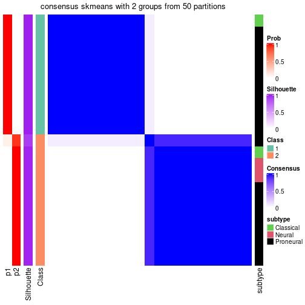</p>

</div>
<div id='tab-node-012-consensus-heatmap-2'>
<pre><code class="r">consensus_heatmap(res, k = 3)
</code></pre>

<p>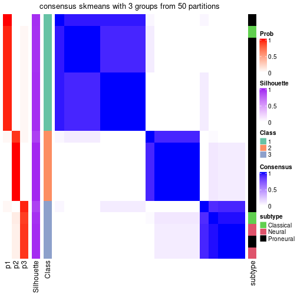</p>

</div>
<div id='tab-node-012-consensus-heatmap-3'>
<pre><code class="r">consensus_heatmap(res, k = 4)
</code></pre>

<p>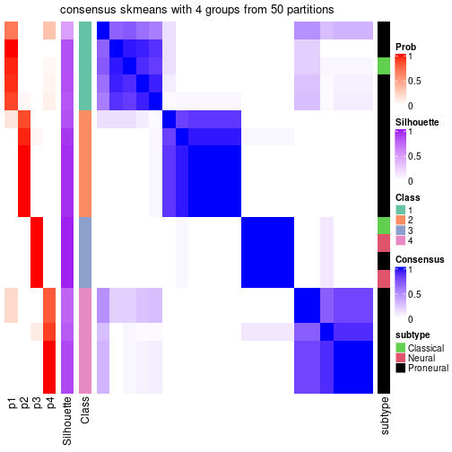</p>

</div>
</div>

Heatmaps for the membership of samples in all partitions to see how consistent they are:


<script>
$( function() {
	$( '#tabs-node-012-membership-heatmap' ).tabs();
} );
</script>
<div id='tabs-node-012-membership-heatmap'>
<ul>
<li><a href='#tab-node-012-membership-heatmap-1'>k = 2</a></li>
<li><a href='#tab-node-012-membership-heatmap-2'>k = 3</a></li>
<li><a href='#tab-node-012-membership-heatmap-3'>k = 4</a></li>
</ul>
<div id='tab-node-012-membership-heatmap-1'>
<pre><code class="r">membership_heatmap(res, k = 2)
</code></pre>

<p>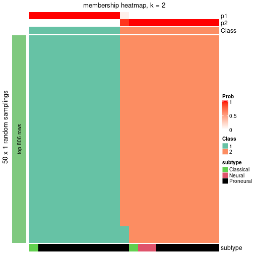</p>

</div>
<div id='tab-node-012-membership-heatmap-2'>
<pre><code class="r">membership_heatmap(res, k = 3)
</code></pre>

<p>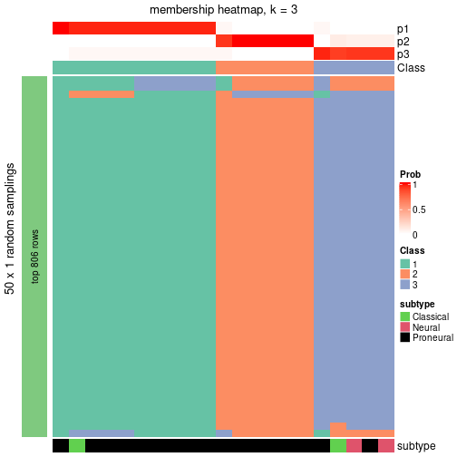</p>

</div>
<div id='tab-node-012-membership-heatmap-3'>
<pre><code class="r">membership_heatmap(res, k = 4)
</code></pre>

<p>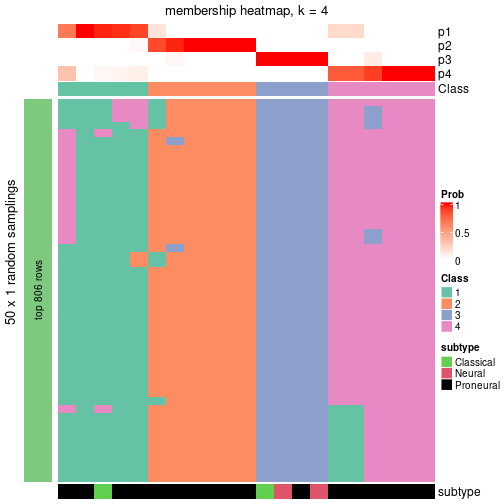</p>

</div>
</div>

As soon as the classes for columns are determined, the signatures
that are significantly different between subgroups can be looked for. 
Following are the heatmaps for signatures.


Signature heatmaps where rows are scaled:


<script>
$( function() {
	$( '#tabs-node-012-get-signatures' ).tabs();
} );
</script>
<div id='tabs-node-012-get-signatures'>
<ul>
<li><a href='#tab-node-012-get-signatures-1'>k = 2</a></li>
<li><a href='#tab-node-012-get-signatures-2'>k = 3</a></li>
<li><a href='#tab-node-012-get-signatures-3'>k = 4</a></li>
</ul>
<div id='tab-node-012-get-signatures-1'>
<pre><code class="r">get_signatures(res, k = 2)
</code></pre>

<p>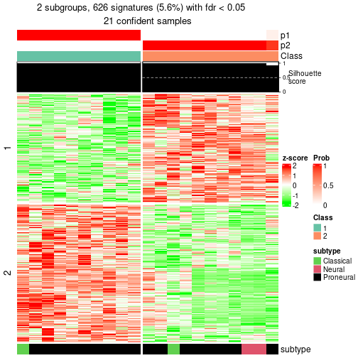</p>

</div>
<div id='tab-node-012-get-signatures-2'>
<pre><code class="r">get_signatures(res, k = 3)
</code></pre>

<p>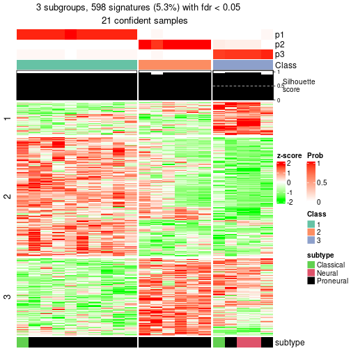</p>

</div>
<div id='tab-node-012-get-signatures-3'>
<pre><code class="r">get_signatures(res, k = 4)
</code></pre>

<p>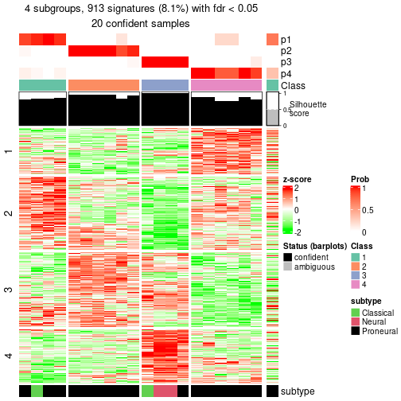</p>

</div>
</div>


Signature heatmaps where rows are not scaled:


<script>
$( function() {
	$( '#tabs-node-012-get-signatures-no-scale' ).tabs();
} );
</script>
<div id='tabs-node-012-get-signatures-no-scale'>
<ul>
<li><a href='#tab-node-012-get-signatures-no-scale-1'>k = 2</a></li>
<li><a href='#tab-node-012-get-signatures-no-scale-2'>k = 3</a></li>
<li><a href='#tab-node-012-get-signatures-no-scale-3'>k = 4</a></li>
</ul>
<div id='tab-node-012-get-signatures-no-scale-1'>
<pre><code class="r">get_signatures(res, k = 2, scale_rows = FALSE)
</code></pre>

<p>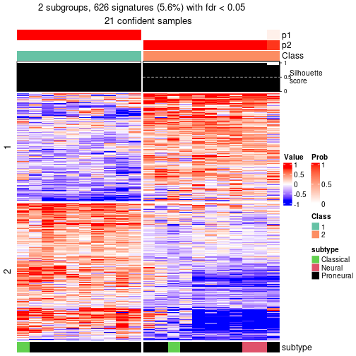</p>

</div>
<div id='tab-node-012-get-signatures-no-scale-2'>
<pre><code class="r">get_signatures(res, k = 3, scale_rows = FALSE)
</code></pre>

<p>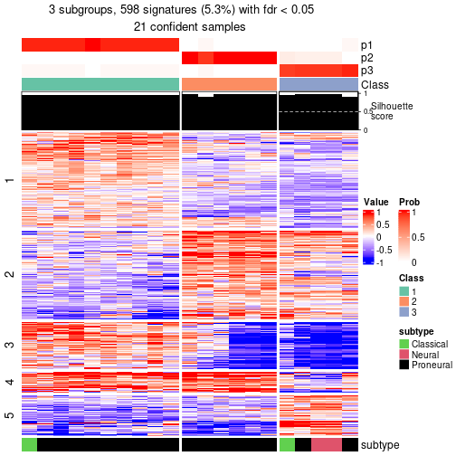</p>

</div>
<div id='tab-node-012-get-signatures-no-scale-3'>
<pre><code class="r">get_signatures(res, k = 4, scale_rows = FALSE)
</code></pre>

<p>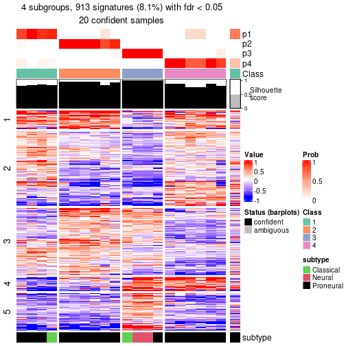</p>

</div>
</div>


Compare the overlap of signatures from different k:

```r
compare_signatures(res)
```

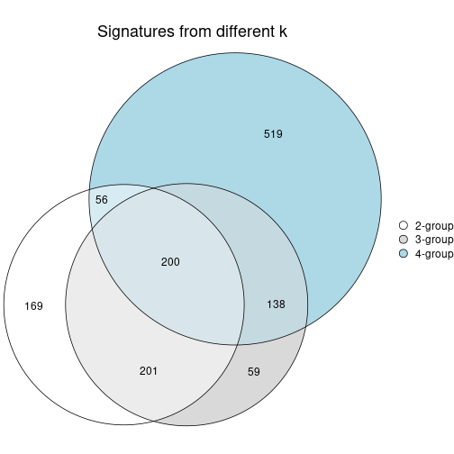

`get_signature()` returns a data frame invisibly. To get the list of signatures, the function
call should be assigned to a variable explicitly. In following code, if `plot` argument is set
to `FALSE`, no heatmap is plotted while only the differential analysis is performed.

```r
# code only for demonstration
tb = get_signature(res, k = ..., plot = FALSE)
```

An example of the output of `tb` is:

```
#>   which_row         fdr    mean_1    mean_2 scaled_mean_1 scaled_mean_2 km
#> 1        38 0.042760348  8.373488  9.131774    -0.5533452     0.5164555  1
#> 2        40 0.018707592  7.106213  8.469186    -0.6173731     0.5762149  1
#> 3        55 0.019134737 10.221463 11.207825    -0.6159697     0.5749050  1
#> 4        59 0.006059896  5.921854  7.869574    -0.6899429     0.6439467  1
#> 5        60 0.018055526  8.928898 10.211722    -0.6204761     0.5791110  1
#> 6        98 0.009384629 15.714769 14.887706     0.6635654    -0.6193277  2
...
```

The columns in `tb` are:

1. `which_row`: row indices corresponding to the input matrix.
2. `fdr`: FDR for the differential test. 
3. `mean_x`: The mean value in group x.
4. `scaled_mean_x`: The mean value in group x after rows are scaled.
5. `km`: Row groups if k-means clustering is applied to rows (which is done by automatically selecting number of clusters).

If there are too many signatures, `top_signatures = ...` can be set to only show the 
signatures with the highest FDRs:

```r
# code only for demonstration
# e.g. to show the top 500 most significant rows
tb = get_signature(res, k = ..., top_signatures = 500)
```

If the signatures are defined as these which are uniquely high in current group, `diff_method` argument
can be set to `"uniquely_high_in_one_group"`:

```r
# code only for demonstration
tb = get_signature(res, k = ..., diff_method = "uniquely_high_in_one_group")
```


UMAP plot which shows how samples are separated.


<script>
$( function() {
	$( '#tabs-node-012-dimension-reduction' ).tabs();
} );
</script>
<div id='tabs-node-012-dimension-reduction'>
<ul>
<li><a href='#tab-node-012-dimension-reduction-1'>k = 2</a></li>
<li><a href='#tab-node-012-dimension-reduction-2'>k = 3</a></li>
<li><a href='#tab-node-012-dimension-reduction-3'>k = 4</a></li>
</ul>
<div id='tab-node-012-dimension-reduction-1'>
<pre><code class="r">dimension_reduction(res, k = 2, method = &quot;UMAP&quot;)
</code></pre>

<p>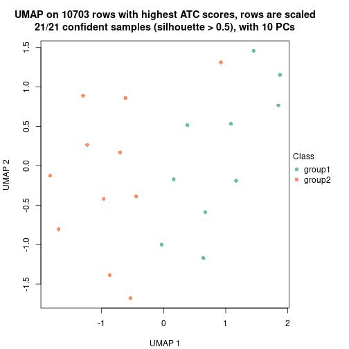</p>

</div>
<div id='tab-node-012-dimension-reduction-2'>
<pre><code class="r">dimension_reduction(res, k = 3, method = &quot;UMAP&quot;)
</code></pre>

<p>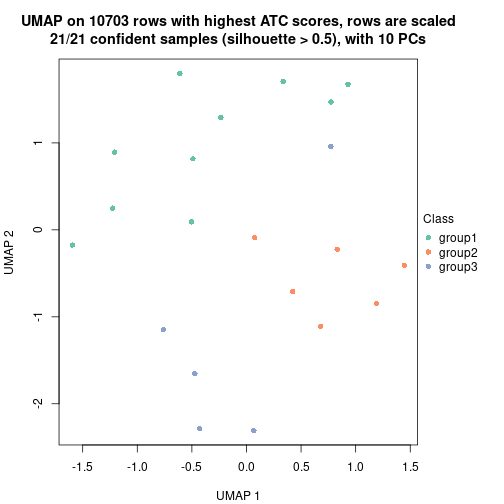</p>

</div>
<div id='tab-node-012-dimension-reduction-3'>
<pre><code class="r">dimension_reduction(res, k = 4, method = &quot;UMAP&quot;)
</code></pre>

<p>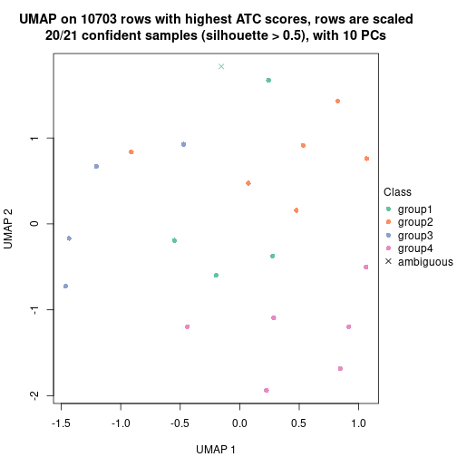</p>

</div>
</div>


Following heatmap shows how subgroups are split when increasing `k`:

```r
collect_classes(res)
```

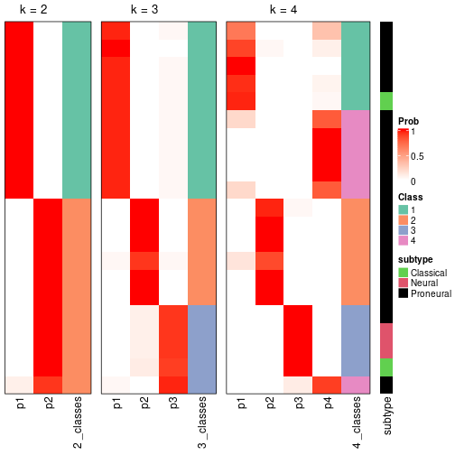


Test correlation between subgroups and known annotations. If the known
annotation is numeric, one-way ANOVA test is applied, and if the known
annotation is discrete, chi-squared contingency table test is applied.

```r
test_to_known_factors(res)
```

```
#>             n_sample subtype(p-value) k
#> ATC:skmeans       21           0.3650 2
#> ATC:skmeans       21           0.0622 3
#> ATC:skmeans       20           0.0411 4
```


If matrix rows can be associated to genes, consider to use `functional_enrichment(res,
...)` to perform function enrichment for the signature genes. See [this vignette](https://jokergoo.github.io/cola_vignettes/functional_enrichment.html) for more detailed explanations.


 

---------------------------------------------------


### Node02


Parent node: [Node0](#Node0).
Child nodes: 
                Node011-leaf
        ,
                [Node012](#Node012)
        ,
                Node013-leaf
        ,
                [Node021](#Node021)
        ,
                [Node022](#Node022)
        ,
                Node023-leaf
        ,
                Node031-leaf
        ,
                Node032-leaf
        ,
                Node033-leaf
        ,
                Node034-leaf
        ,
                Node041-leaf
        ,
                Node042-leaf
        .


The object with results only for a single top-value method and a single partitioning method 
can be extracted as:

```r
res = res_rh["02"]
```

A summary of `res` and all the functions that can be applied to it:

```r
res
```

```
#> A 'ConsensusPartition' object with k = 2, 3, 4.
#>   On a matrix with 10703 rows and 66 columns.
#>   Top rows (982) are extracted by 'ATC' method.
#>   Subgroups are detected by 'skmeans' method.
#>   Performed in total 150 partitions by row resampling.
#>   Best k for subgroups seems to be 3.
#> 
#> Following methods can be applied to this 'ConsensusPartition' object:
#>  [1] "cola_report"             "collect_classes"         "collect_plots"          
#>  [4] "collect_stats"           "colnames"                "compare_partitions"     
#>  [7] "compare_signatures"      "consensus_heatmap"       "dimension_reduction"    
#> [10] "functional_enrichment"   "get_anno_col"            "get_anno"               
#> [13] "get_classes"             "get_consensus"           "get_matrix"             
#> [16] "get_membership"          "get_param"               "get_signatures"         
#> [19] "get_stats"               "is_best_k"               "is_stable_k"            
#> [22] "membership_heatmap"      "ncol"                    "nrow"                   
#> [25] "plot_ecdf"               "predict_classes"         "rownames"               
#> [28] "select_partition_number" "show"                    "suggest_best_k"         
#> [31] "test_to_known_factors"   "top_rows_heatmap"
```

`collect_plots()` function collects all the plots made from `res` for all `k` (number of subgroups)
into one single page to provide an easy and fast comparison between different `k`.

```r
collect_plots(res)
```

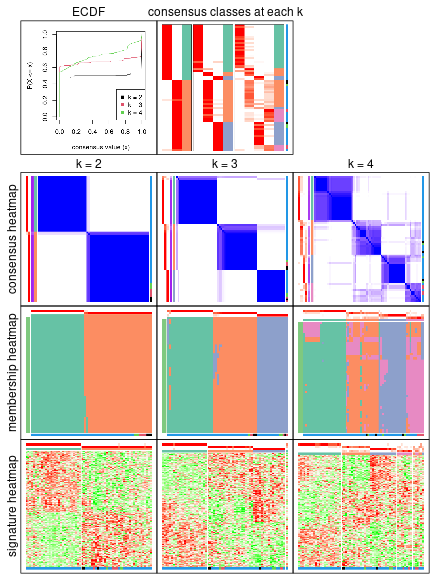

The plots are:

- The first row: a plot of the eCDF (empirical cumulative distribution
  function) curves of the consensus matrix for each `k` and the heatmap of
  predicted classes for each `k`.
- The second row: heatmaps of the consensus matrix for each `k`.
- The third row: heatmaps of the membership matrix for each `k`.
- The fouth row: heatmaps of the signatures for each `k`.

All the plots in panels can be made by individual functions and they are
plotted later in this section.

`select_partition_number()` produces several plots showing different
statistics for choosing "optimized" `k`. There are following statistics:

- eCDF curves of the consensus matrix for each `k`;
- 1-PAC. [The PAC score](https://en.wikipedia.org/wiki/Consensus_clustering#Over-interpretation_potential_of_consensus_clustering)
  measures the proportion of the ambiguous subgrouping.
- Mean silhouette score.
- Concordance. The mean probability of fiting the consensus subgroup labels in all
  partitions.
- Area increased. Denote $A_k$ as the area under the eCDF curve for current
  `k`, the area increased is defined as $A_k - A_{k-1}$.
- Rand index. The percent of pairs of samples that are both in a same cluster
  or both are not in a same cluster in the partition of k and k-1.
- Jaccard index. The ratio of pairs of samples are both in a same cluster in
  the partition of k and k-1 and the pairs of samples are both in a same
  cluster in the partition k or k-1.

The detailed explanations of these statistics can be found in [the _cola_
vignette](https://jokergoo.github.io/cola_vignettes/cola.html#toc_13).

Generally speaking, higher 1-PAC score, higher mean silhouette score or higher
concordance corresponds to better partition. Rand index and Jaccard index
measure how similar the current partition is compared to partition with `k-1`.
If they are too similar, we won't accept `k` is better than `k-1`.

```r
select_partition_number(res)
```


The numeric values for all these statistics can be obtained by `get_stats()`.

```r
get_stats(res)
```

```
#>   k 1-PAC mean_silhouette concordance area_increased  Rand Jaccard
#> 2 2 1.000           0.990       0.995          0.502 0.500   0.500
#> 3 3 0.980           0.956       0.981          0.337 0.763   0.557
#> 4 4 0.724           0.743       0.857          0.110 0.865   0.628
```

`suggest_best_k()` suggests the best $k$ based on these statistics. The rules are as follows:

- All $k$ with Jaccard index larger than 0.95 are removed because increasing
  $k$ does not provide enough extra information. If all $k$ are removed, it is
  marked as no subgroup is detected.
- For all $k$ with 1-PAC score larger than 0.9, the maximal $k$ is taken as
  the best $k$, and other $k$ are marked as optional $k$.
- If it does not fit the second rule. The $k$ with the maximal vote of the
  highest 1-PAC score, highest mean silhouette, and highest concordance is
  taken as the best $k$.

```r
suggest_best_k(res)
```

```
#> [1] 3
#> attr(,"optional")
#> [1] 2
```

There is also optional best $k$ = 2 that is worth to check.

Following is the table of the partitions (You need to click the **show/hide
code output** link to see it). The membership matrix (columns with name `p*`)
is inferred by
[`clue::cl_consensus()`](https://www.rdocumentation.org/link/cl_consensus?package=clue)
function with the `SE` method. Basically the value in the membership matrix
represents the probability to belong to a certain group. The finall subgroup
label for an item is determined with the group with highest probability it
belongs to.

In `get_classes()` function, the entropy is calculated from the membership
matrix and the silhouette score is calculated from the consensus matrix.


<script>
$( function() {
	$( '#tabs-node-02-get-classes' ).tabs();
} );
</script>
<div id='tabs-node-02-get-classes'>
<ul>
<li><a href='#tab-node-02-get-classes-1'>k = 2</a></li>
<li><a href='#tab-node-02-get-classes-2'>k = 3</a></li>
<li><a href='#tab-node-02-get-classes-3'>k = 4</a></li>
</ul>

<div id='tab-node-02-get-classes-1'>
<p><a id='tab-node-02-get-classes-1-a' style='color:#0366d6' href='#'>show/hide code output</a></p>
<pre><code class="r">cbind(get_classes(res, k = 2), get_membership(res, k = 2))
</code></pre>

<pre><code>#&gt;                     class entropy silhouette   p1   p2
#&gt; TCGA-02-0084-01A-03     2   0.000      0.991 0.00 1.00
#&gt; TCGA-02-0446-01A-01     2   0.000      0.991 0.00 1.00
#&gt; TCGA-06-0646-01A-01     2   0.000      0.991 0.00 1.00
#&gt; TCGA-02-0089-01A-01     2   0.000      0.991 0.00 1.00
#&gt; TCGA-02-0451-01A-01     2   0.000      0.991 0.00 1.00
#&gt; TCGA-06-0132-01A-02     2   0.000      0.991 0.00 1.00
#&gt; TCGA-08-0380-01A-01     2   0.000      0.991 0.00 1.00
#&gt; TCGA-06-0187-01A-01     2   0.000      0.991 0.00 1.00
#&gt; TCGA-08-0246-01A-01     2   0.000      0.991 0.00 1.00
#&gt; TCGA-08-0355-01A-01     2   0.000      0.991 0.00 1.00
#&gt; TCGA-02-0057-01A-01     2   0.000      0.991 0.00 1.00
#&gt; TCGA-02-0004-01A-01     1   0.000      1.000 1.00 0.00
#&gt; TCGA-02-0006-01B-01     2   0.000      0.991 0.00 1.00
#&gt; TCGA-02-0025-01A-01     1   0.000      1.000 1.00 0.00
#&gt; TCGA-02-0033-01A-01     1   0.000      1.000 1.00 0.00
#&gt; TCGA-02-0034-01A-01     1   0.000      1.000 1.00 0.00
#&gt; TCGA-02-0039-01A-01     2   0.000      0.991 0.00 1.00
#&gt; TCGA-02-0051-01A-01     1   0.000      1.000 1.00 0.00
#&gt; TCGA-02-0054-01A-01     2   0.000      0.991 0.00 1.00
#&gt; TCGA-02-0055-01A-01     1   0.000      1.000 1.00 0.00
#&gt; TCGA-02-0059-01A-01     1   0.000      1.000 1.00 0.00
#&gt; TCGA-02-0064-01A-01     2   0.000      0.991 0.00 1.00
#&gt; TCGA-02-0075-01A-01     1   0.000      1.000 1.00 0.00
#&gt; TCGA-02-0079-01A-03     2   0.000      0.991 0.00 1.00
#&gt; TCGA-02-0085-01A-01     2   0.000      0.991 0.00 1.00
#&gt; TCGA-02-0086-01A-01     1   0.000      1.000 1.00 0.00
#&gt; TCGA-02-0099-01A-01     2   0.000      0.991 0.00 1.00
#&gt; TCGA-02-0106-01A-01     1   0.000      1.000 1.00 0.00
#&gt; TCGA-02-0107-01A-01     2   0.000      0.991 0.00 1.00
#&gt; TCGA-02-0111-01A-01     1   0.000      1.000 1.00 0.00
#&gt; TCGA-02-0326-01A-01     2   0.000      0.991 0.00 1.00
#&gt; TCGA-02-0337-01A-01     2   0.000      0.991 0.00 1.00
#&gt; TCGA-06-0122-01A-01     2   0.000      0.991 0.00 1.00
#&gt; TCGA-06-0124-01A-01     2   0.000      0.991 0.00 1.00
#&gt; TCGA-06-0130-01A-01     1   0.000      1.000 1.00 0.00
#&gt; TCGA-06-0139-01A-01     1   0.000      1.000 1.00 0.00
#&gt; TCGA-06-0143-01A-01     2   0.000      0.991 0.00 1.00
#&gt; TCGA-06-0147-01A-01     2   0.584      0.839 0.14 0.86
#&gt; TCGA-06-0149-01A-05     2   0.000      0.991 0.00 1.00
#&gt; TCGA-06-0152-01A-02     2   0.000      0.991 0.00 1.00
#&gt; TCGA-06-0154-01A-02     1   0.000      1.000 1.00 0.00
#&gt; TCGA-06-0164-01A-01     1   0.000      1.000 1.00 0.00
#&gt; TCGA-06-0175-01A-01     1   0.000      1.000 1.00 0.00
#&gt; TCGA-06-0176-01A-03     1   0.000      1.000 1.00 0.00
#&gt; TCGA-06-0184-01A-01     2   0.680      0.783 0.18 0.82
#&gt; TCGA-06-0189-01A-05     1   0.000      1.000 1.00 0.00
#&gt; TCGA-06-0190-01A-01     1   0.000      1.000 1.00 0.00
#&gt; TCGA-06-0194-01A-01     1   0.000      1.000 1.00 0.00
#&gt; TCGA-06-0197-01A-02     1   0.000      1.000 1.00 0.00
#&gt; TCGA-06-0210-01A-01     1   0.000      1.000 1.00 0.00
#&gt; TCGA-06-0397-01A-01     1   0.000      1.000 1.00 0.00
#&gt; TCGA-06-0409-01A-02     2   0.000      0.991 0.00 1.00
#&gt; TCGA-06-0412-01A-01     2   0.000      0.991 0.00 1.00
#&gt; TCGA-06-0644-01A-02     1   0.000      1.000 1.00 0.00
#&gt; TCGA-06-0645-01A-01     2   0.000      0.991 0.00 1.00
#&gt; TCGA-08-0346-01A-01     2   0.000      0.991 0.00 1.00
#&gt; TCGA-08-0352-01A-01     2   0.000      0.991 0.00 1.00
#&gt; TCGA-08-0360-01A-01     2   0.000      0.991 0.00 1.00
#&gt; TCGA-08-0390-01A-01     1   0.000      1.000 1.00 0.00
#&gt; TCGA-08-0392-01A-01     1   0.000      1.000 1.00 0.00
#&gt; TCGA-08-0509-01A-01     2   0.000      0.991 0.00 1.00
#&gt; TCGA-08-0510-01A-01     2   0.000      0.991 0.00 1.00
#&gt; TCGA-08-0512-01A-01     1   0.000      1.000 1.00 0.00
#&gt; TCGA-08-0522-01A-01     1   0.000      1.000 1.00 0.00
#&gt; TCGA-12-0619-01A-01     1   0.000      1.000 1.00 0.00
#&gt; TCGA-12-0620-01A-01     2   0.000      0.991 0.00 1.00
</code></pre>

<script>
$('#tab-node-02-get-classes-1-a').parent().next().next().hide();
$('#tab-node-02-get-classes-1-a').click(function(){
  $('#tab-node-02-get-classes-1-a').parent().next().next().toggle();
  return(false);
});
</script>
</div>

<div id='tab-node-02-get-classes-2'>
<p><a id='tab-node-02-get-classes-2-a' style='color:#0366d6' href='#'>show/hide code output</a></p>
<pre><code class="r">cbind(get_classes(res, k = 3), get_membership(res, k = 3))
</code></pre>

<pre><code>#&gt;                     class entropy silhouette   p1   p2   p3
#&gt; TCGA-02-0084-01A-03     3  0.0000      1.000 0.00 0.00 1.00
#&gt; TCGA-02-0446-01A-01     2  0.0000      0.970 0.00 1.00 0.00
#&gt; TCGA-06-0646-01A-01     2  0.0000      0.970 0.00 1.00 0.00
#&gt; TCGA-02-0089-01A-01     2  0.0000      0.970 0.00 1.00 0.00
#&gt; TCGA-02-0451-01A-01     2  0.0000      0.970 0.00 1.00 0.00
#&gt; TCGA-06-0132-01A-02     3  0.0000      1.000 0.00 0.00 1.00
#&gt; TCGA-08-0380-01A-01     3  0.0000      1.000 0.00 0.00 1.00
#&gt; TCGA-06-0187-01A-01     2  0.0000      0.970 0.00 1.00 0.00
#&gt; TCGA-08-0246-01A-01     3  0.0000      1.000 0.00 0.00 1.00
#&gt; TCGA-08-0355-01A-01     3  0.0000      1.000 0.00 0.00 1.00
#&gt; TCGA-02-0057-01A-01     2  0.0000      0.970 0.00 1.00 0.00
#&gt; TCGA-02-0004-01A-01     1  0.0000      0.974 1.00 0.00 0.00
#&gt; TCGA-02-0006-01B-01     2  0.0000      0.970 0.00 1.00 0.00
#&gt; TCGA-02-0025-01A-01     3  0.0000      1.000 0.00 0.00 1.00
#&gt; TCGA-02-0033-01A-01     1  0.0000      0.974 1.00 0.00 0.00
#&gt; TCGA-02-0034-01A-01     1  0.6045      0.379 0.62 0.38 0.00
#&gt; TCGA-02-0039-01A-01     3  0.0000      1.000 0.00 0.00 1.00
#&gt; TCGA-02-0051-01A-01     1  0.0000      0.974 1.00 0.00 0.00
#&gt; TCGA-02-0054-01A-01     2  0.0000      0.970 0.00 1.00 0.00
#&gt; TCGA-02-0055-01A-01     1  0.0000      0.974 1.00 0.00 0.00
#&gt; TCGA-02-0059-01A-01     1  0.0000      0.974 1.00 0.00 0.00
#&gt; TCGA-02-0064-01A-01     2  0.0000      0.970 0.00 1.00 0.00
#&gt; TCGA-02-0075-01A-01     2  0.0000      0.970 0.00 1.00 0.00
#&gt; TCGA-02-0079-01A-03     3  0.0000      1.000 0.00 0.00 1.00
#&gt; TCGA-02-0085-01A-01     2  0.5016      0.714 0.00 0.76 0.24
#&gt; TCGA-02-0086-01A-01     1  0.0000      0.974 1.00 0.00 0.00
#&gt; TCGA-02-0099-01A-01     2  0.0000      0.970 0.00 1.00 0.00
#&gt; TCGA-02-0106-01A-01     1  0.0000      0.974 1.00 0.00 0.00
#&gt; TCGA-02-0107-01A-01     2  0.0892      0.956 0.00 0.98 0.02
#&gt; TCGA-02-0111-01A-01     3  0.0000      1.000 0.00 0.00 1.00
#&gt; TCGA-02-0326-01A-01     3  0.0000      1.000 0.00 0.00 1.00
#&gt; TCGA-02-0337-01A-01     3  0.0000      1.000 0.00 0.00 1.00
#&gt; TCGA-06-0122-01A-01     2  0.0000      0.970 0.00 1.00 0.00
#&gt; TCGA-06-0124-01A-01     2  0.0000      0.970 0.00 1.00 0.00
#&gt; TCGA-06-0130-01A-01     1  0.0000      0.974 1.00 0.00 0.00
#&gt; TCGA-06-0139-01A-01     1  0.0000      0.974 1.00 0.00 0.00
#&gt; TCGA-06-0143-01A-01     2  0.0000      0.970 0.00 1.00 0.00
#&gt; TCGA-06-0147-01A-01     2  0.2066      0.924 0.00 0.94 0.06
#&gt; TCGA-06-0149-01A-05     3  0.0000      1.000 0.00 0.00 1.00
#&gt; TCGA-06-0152-01A-02     3  0.0000      1.000 0.00 0.00 1.00
#&gt; TCGA-06-0154-01A-02     1  0.0000      0.974 1.00 0.00 0.00
#&gt; TCGA-06-0164-01A-01     1  0.0000      0.974 1.00 0.00 0.00
#&gt; TCGA-06-0175-01A-01     2  0.0000      0.970 0.00 1.00 0.00
#&gt; TCGA-06-0176-01A-03     1  0.0000      0.974 1.00 0.00 0.00
#&gt; TCGA-06-0184-01A-01     3  0.0000      1.000 0.00 0.00 1.00
#&gt; TCGA-06-0189-01A-05     1  0.0000      0.974 1.00 0.00 0.00
#&gt; TCGA-06-0190-01A-01     1  0.0000      0.974 1.00 0.00 0.00
#&gt; TCGA-06-0194-01A-01     1  0.0000      0.974 1.00 0.00 0.00
#&gt; TCGA-06-0197-01A-02     1  0.0000      0.974 1.00 0.00 0.00
#&gt; TCGA-06-0210-01A-01     1  0.0000      0.974 1.00 0.00 0.00
#&gt; TCGA-06-0397-01A-01     1  0.0000      0.974 1.00 0.00 0.00
#&gt; TCGA-06-0409-01A-02     2  0.0000      0.970 0.00 1.00 0.00
#&gt; TCGA-06-0412-01A-01     2  0.0000      0.970 0.00 1.00 0.00
#&gt; TCGA-06-0644-01A-02     1  0.0000      0.974 1.00 0.00 0.00
#&gt; TCGA-06-0645-01A-01     3  0.0000      1.000 0.00 0.00 1.00
#&gt; TCGA-08-0346-01A-01     3  0.0000      1.000 0.00 0.00 1.00
#&gt; TCGA-08-0352-01A-01     2  0.4796      0.741 0.00 0.78 0.22
#&gt; TCGA-08-0360-01A-01     2  0.3686      0.845 0.00 0.86 0.14
#&gt; TCGA-08-0390-01A-01     1  0.4796      0.710 0.78 0.00 0.22
#&gt; TCGA-08-0392-01A-01     1  0.0000      0.974 1.00 0.00 0.00
#&gt; TCGA-08-0509-01A-01     2  0.0000      0.970 0.00 1.00 0.00
#&gt; TCGA-08-0510-01A-01     2  0.0000      0.970 0.00 1.00 0.00
#&gt; TCGA-08-0512-01A-01     1  0.0000      0.974 1.00 0.00 0.00
#&gt; TCGA-08-0522-01A-01     1  0.0000      0.974 1.00 0.00 0.00
#&gt; TCGA-12-0619-01A-01     1  0.0000      0.974 1.00 0.00 0.00
#&gt; TCGA-12-0620-01A-01     3  0.0000      1.000 0.00 0.00 1.00
</code></pre>

<script>
$('#tab-node-02-get-classes-2-a').parent().next().next().hide();
$('#tab-node-02-get-classes-2-a').click(function(){
  $('#tab-node-02-get-classes-2-a').parent().next().next().toggle();
  return(false);
});
</script>
</div>

<div id='tab-node-02-get-classes-3'>
<p><a id='tab-node-02-get-classes-3-a' style='color:#0366d6' href='#'>show/hide code output</a></p>
<pre><code class="r">cbind(get_classes(res, k = 4), get_membership(res, k = 4))
</code></pre>

<pre><code>#&gt;                     class entropy silhouette   p1   p2   p3   p4
#&gt; TCGA-02-0084-01A-03     3  0.0000     0.8880 0.00 0.00 1.00 0.00
#&gt; TCGA-02-0446-01A-01     2  0.4624     0.7319 0.00 0.66 0.00 0.34
#&gt; TCGA-06-0646-01A-01     2  0.5820     0.6994 0.00 0.68 0.08 0.24
#&gt; TCGA-02-0089-01A-01     4  0.0000     0.6846 0.00 0.00 0.00 1.00
#&gt; TCGA-02-0451-01A-01     4  0.0000     0.6846 0.00 0.00 0.00 1.00
#&gt; TCGA-06-0132-01A-02     4  0.4624     0.4482 0.00 0.00 0.34 0.66
#&gt; TCGA-08-0380-01A-01     4  0.4624     0.4482 0.00 0.00 0.34 0.66
#&gt; TCGA-06-0187-01A-01     2  0.4790     0.7040 0.00 0.62 0.00 0.38
#&gt; TCGA-08-0246-01A-01     3  0.4406     0.5403 0.00 0.00 0.70 0.30
#&gt; TCGA-08-0355-01A-01     3  0.0000     0.8880 0.00 0.00 1.00 0.00
#&gt; TCGA-02-0057-01A-01     4  0.2921     0.7231 0.00 0.14 0.00 0.86
#&gt; TCGA-02-0004-01A-01     1  0.0000     0.9255 1.00 0.00 0.00 0.00
#&gt; TCGA-02-0006-01B-01     2  0.4977     0.6195 0.00 0.54 0.00 0.46
#&gt; TCGA-02-0025-01A-01     3  0.0000     0.8880 0.00 0.00 1.00 0.00
#&gt; TCGA-02-0033-01A-01     1  0.3400     0.8761 0.82 0.18 0.00 0.00
#&gt; TCGA-02-0034-01A-01     2  0.0000     0.6187 0.00 1.00 0.00 0.00
#&gt; TCGA-02-0039-01A-01     3  0.3172     0.7542 0.00 0.00 0.84 0.16
#&gt; TCGA-02-0051-01A-01     1  0.0000     0.9255 1.00 0.00 0.00 0.00
#&gt; TCGA-02-0054-01A-01     2  0.4624     0.7319 0.00 0.66 0.00 0.34
#&gt; TCGA-02-0055-01A-01     1  0.0000     0.9255 1.00 0.00 0.00 0.00
#&gt; TCGA-02-0059-01A-01     1  0.0000     0.9255 1.00 0.00 0.00 0.00
#&gt; TCGA-02-0064-01A-01     2  0.3400     0.7121 0.00 0.82 0.00 0.18
#&gt; TCGA-02-0075-01A-01     2  0.1637     0.6676 0.00 0.94 0.00 0.06
#&gt; TCGA-02-0079-01A-03     3  0.0000     0.8880 0.00 0.00 1.00 0.00
#&gt; TCGA-02-0085-01A-01     4  0.4088     0.7329 0.00 0.14 0.04 0.82
#&gt; TCGA-02-0086-01A-01     1  0.0000     0.9255 1.00 0.00 0.00 0.00
#&gt; TCGA-02-0099-01A-01     2  0.4624     0.7319 0.00 0.66 0.00 0.34
#&gt; TCGA-02-0106-01A-01     1  0.2345     0.9030 0.90 0.10 0.00 0.00
#&gt; TCGA-02-0107-01A-01     4  0.2345     0.7272 0.00 0.10 0.00 0.90
#&gt; TCGA-02-0111-01A-01     3  0.3400     0.6795 0.18 0.00 0.82 0.00
#&gt; TCGA-02-0326-01A-01     3  0.0000     0.8880 0.00 0.00 1.00 0.00
#&gt; TCGA-02-0337-01A-01     3  0.0000     0.8880 0.00 0.00 1.00 0.00
#&gt; TCGA-06-0122-01A-01     2  0.3400     0.7121 0.00 0.82 0.00 0.18
#&gt; TCGA-06-0124-01A-01     2  0.3400     0.7121 0.00 0.82 0.00 0.18
#&gt; TCGA-06-0130-01A-01     1  0.3400     0.8761 0.82 0.18 0.00 0.00
#&gt; TCGA-06-0139-01A-01     1  0.0000     0.9255 1.00 0.00 0.00 0.00
#&gt; TCGA-06-0143-01A-01     2  0.3400     0.7121 0.00 0.82 0.00 0.18
#&gt; TCGA-06-0147-01A-01     2  0.6855     0.1118 0.00 0.60 0.20 0.20
#&gt; TCGA-06-0149-01A-05     3  0.3172     0.7582 0.00 0.00 0.84 0.16
#&gt; TCGA-06-0152-01A-02     3  0.0000     0.8880 0.00 0.00 1.00 0.00
#&gt; TCGA-06-0154-01A-02     1  0.3400     0.8761 0.82 0.18 0.00 0.00
#&gt; TCGA-06-0164-01A-01     1  0.0000     0.9255 1.00 0.00 0.00 0.00
#&gt; TCGA-06-0175-01A-01     2  0.3801     0.6832 0.00 0.78 0.00 0.22
#&gt; TCGA-06-0176-01A-03     1  0.3400     0.8761 0.82 0.18 0.00 0.00
#&gt; TCGA-06-0184-01A-01     4  0.5594     0.5958 0.18 0.00 0.10 0.72
#&gt; TCGA-06-0189-01A-05     1  0.0000     0.9255 1.00 0.00 0.00 0.00
#&gt; TCGA-06-0190-01A-01     1  0.3400     0.8761 0.82 0.18 0.00 0.00
#&gt; TCGA-06-0194-01A-01     1  0.0000     0.9255 1.00 0.00 0.00 0.00
#&gt; TCGA-06-0197-01A-02     1  0.0000     0.9255 1.00 0.00 0.00 0.00
#&gt; TCGA-06-0210-01A-01     1  0.0707     0.9223 0.98 0.02 0.00 0.00
#&gt; TCGA-06-0397-01A-01     1  0.3400     0.8761 0.82 0.18 0.00 0.00
#&gt; TCGA-06-0409-01A-02     4  0.6477     0.5142 0.00 0.30 0.10 0.60
#&gt; TCGA-06-0412-01A-01     2  0.4522     0.7346 0.00 0.68 0.00 0.32
#&gt; TCGA-06-0644-01A-02     1  0.0000     0.9255 1.00 0.00 0.00 0.00
#&gt; TCGA-06-0645-01A-01     3  0.0000     0.8880 0.00 0.00 1.00 0.00
#&gt; TCGA-08-0346-01A-01     3  0.0000     0.8880 0.00 0.00 1.00 0.00
#&gt; TCGA-08-0352-01A-01     3  0.7427     0.0831 0.00 0.20 0.50 0.30
#&gt; TCGA-08-0360-01A-01     2  0.7021     0.0263 0.00 0.48 0.40 0.12
#&gt; TCGA-08-0390-01A-01     1  0.1211     0.8967 0.96 0.00 0.04 0.00
#&gt; TCGA-08-0392-01A-01     1  0.0000     0.9255 1.00 0.00 0.00 0.00
#&gt; TCGA-08-0509-01A-01     4  0.3801     0.6584 0.00 0.22 0.00 0.78
#&gt; TCGA-08-0510-01A-01     2  0.4624     0.7319 0.00 0.66 0.00 0.34
#&gt; TCGA-08-0512-01A-01     1  0.3975     0.8206 0.76 0.24 0.00 0.00
#&gt; TCGA-08-0522-01A-01     1  0.3400     0.8761 0.82 0.18 0.00 0.00
#&gt; TCGA-12-0619-01A-01     2  0.4994    -0.3099 0.48 0.52 0.00 0.00
#&gt; TCGA-12-0620-01A-01     3  0.0000     0.8880 0.00 0.00 1.00 0.00
</code></pre>

<script>
$('#tab-node-02-get-classes-3-a').parent().next().next().hide();
$('#tab-node-02-get-classes-3-a').click(function(){
  $('#tab-node-02-get-classes-3-a').parent().next().next().toggle();
  return(false);
});
</script>
</div>
</div>

Heatmaps for the consensus matrix. It visualizes the probability of two
samples to be in a same group.


<script>
$( function() {
	$( '#tabs-node-02-consensus-heatmap' ).tabs();
} );
</script>
<div id='tabs-node-02-consensus-heatmap'>
<ul>
<li><a href='#tab-node-02-consensus-heatmap-1'>k = 2</a></li>
<li><a href='#tab-node-02-consensus-heatmap-2'>k = 3</a></li>
<li><a href='#tab-node-02-consensus-heatmap-3'>k = 4</a></li>
</ul>
<div id='tab-node-02-consensus-heatmap-1'>
<pre><code class="r">consensus_heatmap(res, k = 2)
</code></pre>

<p>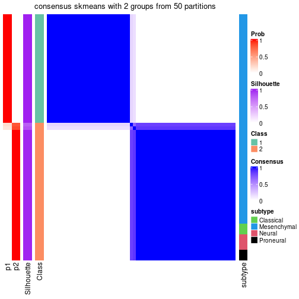</p>

</div>
<div id='tab-node-02-consensus-heatmap-2'>
<pre><code class="r">consensus_heatmap(res, k = 3)
</code></pre>

<p>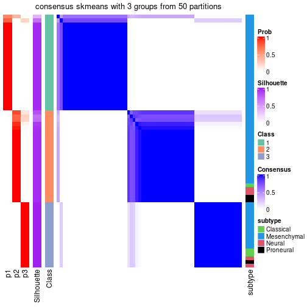</p>

</div>
<div id='tab-node-02-consensus-heatmap-3'>
<pre><code class="r">consensus_heatmap(res, k = 4)
</code></pre>

<p>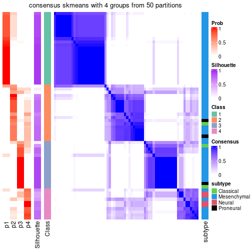</p>

</div>
</div>

Heatmaps for the membership of samples in all partitions to see how consistent they are:


<script>
$( function() {
	$( '#tabs-node-02-membership-heatmap' ).tabs();
} );
</script>
<div id='tabs-node-02-membership-heatmap'>
<ul>
<li><a href='#tab-node-02-membership-heatmap-1'>k = 2</a></li>
<li><a href='#tab-node-02-membership-heatmap-2'>k = 3</a></li>
<li><a href='#tab-node-02-membership-heatmap-3'>k = 4</a></li>
</ul>
<div id='tab-node-02-membership-heatmap-1'>
<pre><code class="r">membership_heatmap(res, k = 2)
</code></pre>

<p>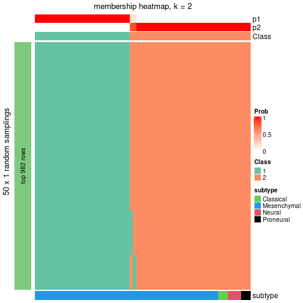</p>

</div>
<div id='tab-node-02-membership-heatmap-2'>
<pre><code class="r">membership_heatmap(res, k = 3)
</code></pre>

<p>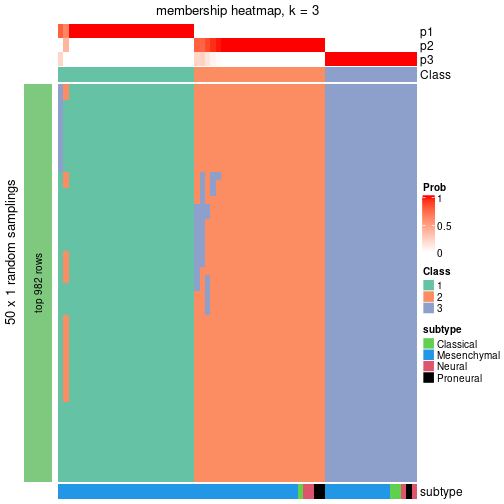</p>

</div>
<div id='tab-node-02-membership-heatmap-3'>
<pre><code class="r">membership_heatmap(res, k = 4)
</code></pre>

<p>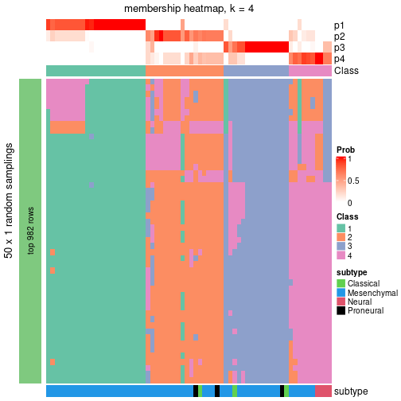</p>

</div>
</div>

As soon as the classes for columns are determined, the signatures
that are significantly different between subgroups can be looked for. 
Following are the heatmaps for signatures.


Signature heatmaps where rows are scaled:


<script>
$( function() {
	$( '#tabs-node-02-get-signatures' ).tabs();
} );
</script>
<div id='tabs-node-02-get-signatures'>
<ul>
<li><a href='#tab-node-02-get-signatures-1'>k = 2</a></li>
<li><a href='#tab-node-02-get-signatures-2'>k = 3</a></li>
<li><a href='#tab-node-02-get-signatures-3'>k = 4</a></li>
</ul>
<div id='tab-node-02-get-signatures-1'>
<pre><code class="r">get_signatures(res, k = 2)
</code></pre>

<p>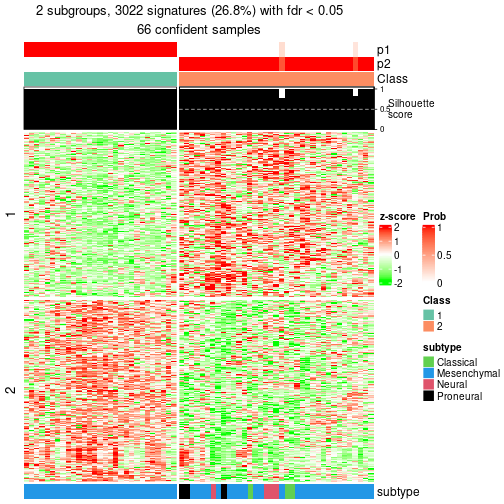</p>

</div>
<div id='tab-node-02-get-signatures-2'>
<pre><code class="r">get_signatures(res, k = 3)
</code></pre>

<p>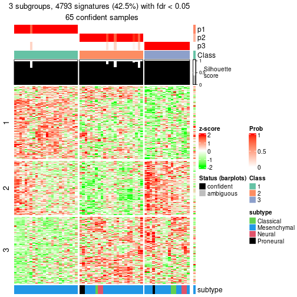</p>

</div>
<div id='tab-node-02-get-signatures-3'>
<pre><code class="r">get_signatures(res, k = 4)
</code></pre>

<p>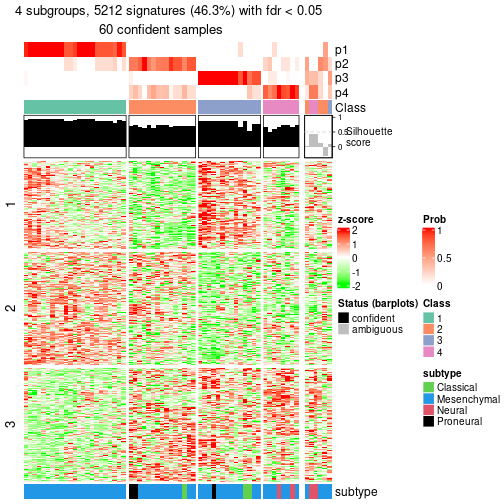</p>

</div>
</div>


Signature heatmaps where rows are not scaled:


<script>
$( function() {
	$( '#tabs-node-02-get-signatures-no-scale' ).tabs();
} );
</script>
<div id='tabs-node-02-get-signatures-no-scale'>
<ul>
<li><a href='#tab-node-02-get-signatures-no-scale-1'>k = 2</a></li>
<li><a href='#tab-node-02-get-signatures-no-scale-2'>k = 3</a></li>
<li><a href='#tab-node-02-get-signatures-no-scale-3'>k = 4</a></li>
</ul>
<div id='tab-node-02-get-signatures-no-scale-1'>
<pre><code class="r">get_signatures(res, k = 2, scale_rows = FALSE)
</code></pre>

<p>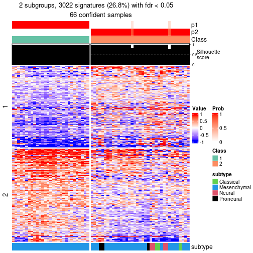</p>

</div>
<div id='tab-node-02-get-signatures-no-scale-2'>
<pre><code class="r">get_signatures(res, k = 3, scale_rows = FALSE)
</code></pre>

<p>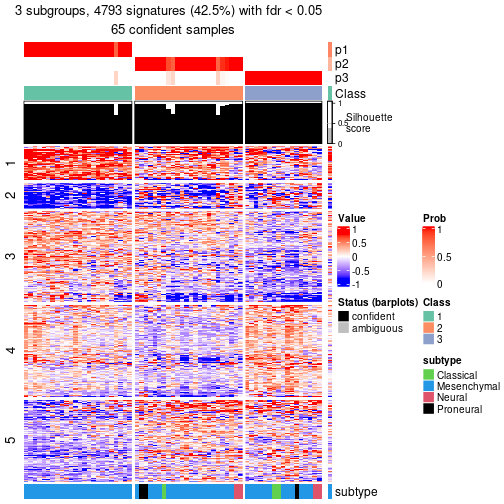</p>

</div>
<div id='tab-node-02-get-signatures-no-scale-3'>
<pre><code class="r">get_signatures(res, k = 4, scale_rows = FALSE)
</code></pre>

<p>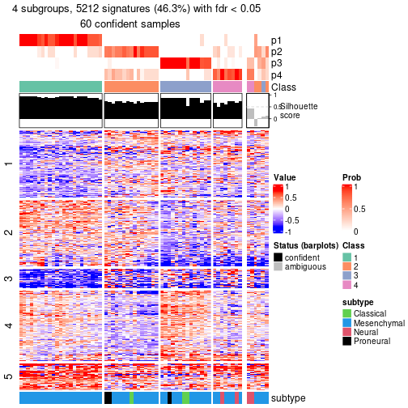</p>

</div>
</div>


Compare the overlap of signatures from different k:

```r
compare_signatures(res)
```

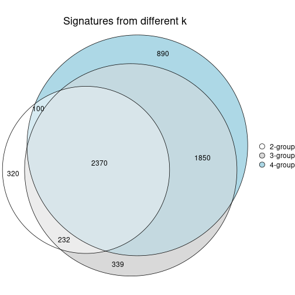

`get_signature()` returns a data frame invisibly. To get the list of signatures, the function
call should be assigned to a variable explicitly. In following code, if `plot` argument is set
to `FALSE`, no heatmap is plotted while only the differential analysis is performed.

```r
# code only for demonstration
tb = get_signature(res, k = ..., plot = FALSE)
```

An example of the output of `tb` is:

```
#>   which_row         fdr    mean_1    mean_2 scaled_mean_1 scaled_mean_2 km
#> 1        38 0.042760348  8.373488  9.131774    -0.5533452     0.5164555  1
#> 2        40 0.018707592  7.106213  8.469186    -0.6173731     0.5762149  1
#> 3        55 0.019134737 10.221463 11.207825    -0.6159697     0.5749050  1
#> 4        59 0.006059896  5.921854  7.869574    -0.6899429     0.6439467  1
#> 5        60 0.018055526  8.928898 10.211722    -0.6204761     0.5791110  1
#> 6        98 0.009384629 15.714769 14.887706     0.6635654    -0.6193277  2
...
```

The columns in `tb` are:

1. `which_row`: row indices corresponding to the input matrix.
2. `fdr`: FDR for the differential test. 
3. `mean_x`: The mean value in group x.
4. `scaled_mean_x`: The mean value in group x after rows are scaled.
5. `km`: Row groups if k-means clustering is applied to rows (which is done by automatically selecting number of clusters).

If there are too many signatures, `top_signatures = ...` can be set to only show the 
signatures with the highest FDRs:

```r
# code only for demonstration
# e.g. to show the top 500 most significant rows
tb = get_signature(res, k = ..., top_signatures = 500)
```

If the signatures are defined as these which are uniquely high in current group, `diff_method` argument
can be set to `"uniquely_high_in_one_group"`:

```r
# code only for demonstration
tb = get_signature(res, k = ..., diff_method = "uniquely_high_in_one_group")
```


UMAP plot which shows how samples are separated.


<script>
$( function() {
	$( '#tabs-node-02-dimension-reduction' ).tabs();
} );
</script>
<div id='tabs-node-02-dimension-reduction'>
<ul>
<li><a href='#tab-node-02-dimension-reduction-1'>k = 2</a></li>
<li><a href='#tab-node-02-dimension-reduction-2'>k = 3</a></li>
<li><a href='#tab-node-02-dimension-reduction-3'>k = 4</a></li>
</ul>
<div id='tab-node-02-dimension-reduction-1'>
<pre><code class="r">dimension_reduction(res, k = 2, method = &quot;UMAP&quot;)
</code></pre>

<p>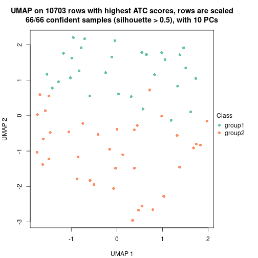</p>

</div>
<div id='tab-node-02-dimension-reduction-2'>
<pre><code class="r">dimension_reduction(res, k = 3, method = &quot;UMAP&quot;)
</code></pre>

<p>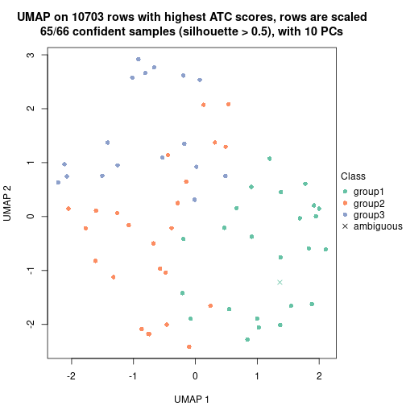</p>

</div>
<div id='tab-node-02-dimension-reduction-3'>
<pre><code class="r">dimension_reduction(res, k = 4, method = &quot;UMAP&quot;)
</code></pre>

<p>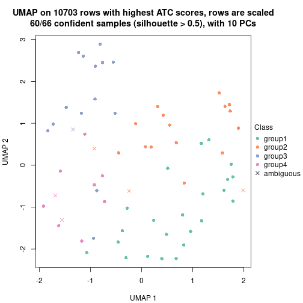</p>

</div>
</div>


Following heatmap shows how subgroups are split when increasing `k`:

```r
collect_classes(res)
```

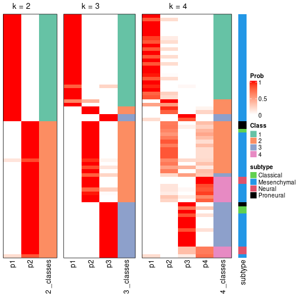


Test correlation between subgroups and known annotations. If the known
annotation is numeric, one-way ANOVA test is applied, and if the known
annotation is discrete, chi-squared contingency table test is applied.

```r
test_to_known_factors(res)
```

```
#>             n_sample subtype(p-value) k
#> ATC:skmeans       66           0.0263 2
#> ATC:skmeans       65           0.1993 3
#> ATC:skmeans       60           0.0103 4
```


If matrix rows can be associated to genes, consider to use `functional_enrichment(res,
...)` to perform function enrichment for the signature genes. See [this vignette](https://jokergoo.github.io/cola_vignettes/functional_enrichment.html) for more detailed explanations.


 

---------------------------------------------------


### Node021


Parent node: [Node02](#Node02).
Child nodes: 
                Node0121-leaf
        ,
                Node0122-leaf
        ,
                Node0211-leaf
        ,
                Node0212-leaf
        ,
                Node0213-leaf
        ,
                Node0221-leaf
        ,
                Node0222-leaf
        .


The object with results only for a single top-value method and a single partitioning method 
can be extracted as:

```r
res = res_rh["021"]
```

A summary of `res` and all the functions that can be applied to it:

```r
res
```

```
#> A 'ConsensusPartition' object with k = 2, 3, 4.
#>   On a matrix with 10703 rows and 25 columns.
#>   Top rows (974) are extracted by 'ATC' method.
#>   Subgroups are detected by 'skmeans' method.
#>   Performed in total 150 partitions by row resampling.
#>   Best k for subgroups seems to be 3.
#> 
#> Following methods can be applied to this 'ConsensusPartition' object:
#>  [1] "cola_report"             "collect_classes"         "collect_plots"          
#>  [4] "collect_stats"           "colnames"                "compare_partitions"     
#>  [7] "compare_signatures"      "consensus_heatmap"       "dimension_reduction"    
#> [10] "functional_enrichment"   "get_anno_col"            "get_anno"               
#> [13] "get_classes"             "get_consensus"           "get_matrix"             
#> [16] "get_membership"          "get_param"               "get_signatures"         
#> [19] "get_stats"               "is_best_k"               "is_stable_k"            
#> [22] "membership_heatmap"      "ncol"                    "nrow"                   
#> [25] "plot_ecdf"               "predict_classes"         "rownames"               
#> [28] "select_partition_number" "show"                    "suggest_best_k"         
#> [31] "test_to_known_factors"   "top_rows_heatmap"
```

`collect_plots()` function collects all the plots made from `res` for all `k` (number of subgroups)
into one single page to provide an easy and fast comparison between different `k`.

```r
collect_plots(res)
```

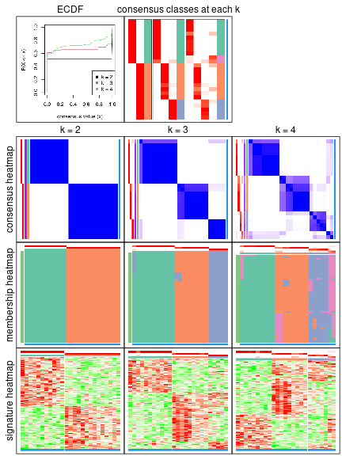

The plots are:

- The first row: a plot of the eCDF (empirical cumulative distribution
  function) curves of the consensus matrix for each `k` and the heatmap of
  predicted classes for each `k`.
- The second row: heatmaps of the consensus matrix for each `k`.
- The third row: heatmaps of the membership matrix for each `k`.
- The fouth row: heatmaps of the signatures for each `k`.

All the plots in panels can be made by individual functions and they are
plotted later in this section.

`select_partition_number()` produces several plots showing different
statistics for choosing "optimized" `k`. There are following statistics:

- eCDF curves of the consensus matrix for each `k`;
- 1-PAC. [The PAC score](https://en.wikipedia.org/wiki/Consensus_clustering#Over-interpretation_potential_of_consensus_clustering)
  measures the proportion of the ambiguous subgrouping.
- Mean silhouette score.
- Concordance. The mean probability of fiting the consensus subgroup labels in all
  partitions.
- Area increased. Denote $A_k$ as the area under the eCDF curve for current
  `k`, the area increased is defined as $A_k - A_{k-1}$.
- Rand index. The percent of pairs of samples that are both in a same cluster
  or both are not in a same cluster in the partition of k and k-1.
- Jaccard index. The ratio of pairs of samples are both in a same cluster in
  the partition of k and k-1 and the pairs of samples are both in a same
  cluster in the partition k or k-1.

The detailed explanations of these statistics can be found in [the _cola_
vignette](https://jokergoo.github.io/cola_vignettes/cola.html#toc_13).

Generally speaking, higher 1-PAC score, higher mean silhouette score or higher
concordance corresponds to better partition. Rand index and Jaccard index
measure how similar the current partition is compared to partition with `k-1`.
If they are too similar, we won't accept `k` is better than `k-1`.

```r
select_partition_number(res)
```

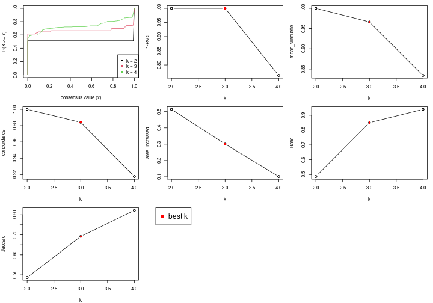

The numeric values for all these statistics can be obtained by `get_stats()`.

```r
get_stats(res)
```

```
#>   k 1-PAC mean_silhouette concordance area_increased  Rand Jaccard
#> 2 2 1.000           1.000       1.000          0.514 0.487   0.487
#> 3 3 1.000           0.966       0.984          0.301 0.850   0.692
#> 4 4 0.763           0.834       0.918          0.102 0.940   0.822
```

`suggest_best_k()` suggests the best $k$ based on these statistics. The rules are as follows:

- All $k$ with Jaccard index larger than 0.95 are removed because increasing
  $k$ does not provide enough extra information. If all $k$ are removed, it is
  marked as no subgroup is detected.
- For all $k$ with 1-PAC score larger than 0.9, the maximal $k$ is taken as
  the best $k$, and other $k$ are marked as optional $k$.
- If it does not fit the second rule. The $k$ with the maximal vote of the
  highest 1-PAC score, highest mean silhouette, and highest concordance is
  taken as the best $k$.

```r
suggest_best_k(res)
```

```
#> [1] 3
#> attr(,"optional")
#> [1] 2
```

There is also optional best $k$ = 2 that is worth to check.

Following is the table of the partitions (You need to click the **show/hide
code output** link to see it). The membership matrix (columns with name `p*`)
is inferred by
[`clue::cl_consensus()`](https://www.rdocumentation.org/link/cl_consensus?package=clue)
function with the `SE` method. Basically the value in the membership matrix
represents the probability to belong to a certain group. The finall subgroup
label for an item is determined with the group with highest probability it
belongs to.

In `get_classes()` function, the entropy is calculated from the membership
matrix and the silhouette score is calculated from the consensus matrix.


<script>
$( function() {
	$( '#tabs-node-021-get-classes' ).tabs();
} );
</script>
<div id='tabs-node-021-get-classes'>
<ul>
<li><a href='#tab-node-021-get-classes-1'>k = 2</a></li>
<li><a href='#tab-node-021-get-classes-2'>k = 3</a></li>
<li><a href='#tab-node-021-get-classes-3'>k = 4</a></li>
</ul>

<div id='tab-node-021-get-classes-1'>
<p><a id='tab-node-021-get-classes-1-a' style='color:#0366d6' href='#'>show/hide code output</a></p>
<pre><code class="r">cbind(get_classes(res, k = 2), get_membership(res, k = 2))
</code></pre>

<pre><code>#&gt;                     class entropy silhouette p1 p2
#&gt; TCGA-02-0004-01A-01     2       0          1  0  1
#&gt; TCGA-02-0033-01A-01     1       0          1  1  0
#&gt; TCGA-02-0034-01A-01     1       0          1  1  0
#&gt; TCGA-02-0051-01A-01     2       0          1  0  1
#&gt; TCGA-02-0055-01A-01     2       0          1  0  1
#&gt; TCGA-02-0059-01A-01     2       0          1  0  1
#&gt; TCGA-02-0086-01A-01     2       0          1  0  1
#&gt; TCGA-02-0106-01A-01     1       0          1  1  0
#&gt; TCGA-06-0130-01A-01     1       0          1  1  0
#&gt; TCGA-06-0139-01A-01     2       0          1  0  1
#&gt; TCGA-06-0154-01A-02     1       0          1  1  0
#&gt; TCGA-06-0164-01A-01     2       0          1  0  1
#&gt; TCGA-06-0176-01A-03     1       0          1  1  0
#&gt; TCGA-06-0189-01A-05     2       0          1  0  1
#&gt; TCGA-06-0190-01A-01     1       0          1  1  0
#&gt; TCGA-06-0194-01A-01     2       0          1  0  1
#&gt; TCGA-06-0197-01A-02     2       0          1  0  1
#&gt; TCGA-06-0210-01A-01     2       0          1  0  1
#&gt; TCGA-06-0397-01A-01     1       0          1  1  0
#&gt; TCGA-06-0644-01A-02     2       0          1  0  1
#&gt; TCGA-08-0390-01A-01     2       0          1  0  1
#&gt; TCGA-08-0392-01A-01     2       0          1  0  1
#&gt; TCGA-08-0512-01A-01     1       0          1  1  0
#&gt; TCGA-08-0522-01A-01     1       0          1  1  0
#&gt; TCGA-12-0619-01A-01     1       0          1  1  0
</code></pre>

<script>
$('#tab-node-021-get-classes-1-a').parent().next().next().hide();
$('#tab-node-021-get-classes-1-a').click(function(){
  $('#tab-node-021-get-classes-1-a').parent().next().next().toggle();
  return(false);
});
</script>
</div>

<div id='tab-node-021-get-classes-2'>
<p><a id='tab-node-021-get-classes-2-a' style='color:#0366d6' href='#'>show/hide code output</a></p>
<pre><code class="r">cbind(get_classes(res, k = 3), get_membership(res, k = 3))
</code></pre>

<pre><code>#&gt;                     class entropy silhouette   p1   p2   p3
#&gt; TCGA-02-0004-01A-01     2   0.000      0.977 0.00 1.00 0.00
#&gt; TCGA-02-0033-01A-01     1   0.000      0.978 1.00 0.00 0.00
#&gt; TCGA-02-0034-01A-01     1   0.000      0.978 1.00 0.00 0.00
#&gt; TCGA-02-0051-01A-01     2   0.000      0.977 0.00 1.00 0.00
#&gt; TCGA-02-0055-01A-01     2   0.000      0.977 0.00 1.00 0.00
#&gt; TCGA-02-0059-01A-01     2   0.000      0.977 0.00 1.00 0.00
#&gt; TCGA-02-0086-01A-01     3   0.000      1.000 0.00 0.00 1.00
#&gt; TCGA-02-0106-01A-01     1   0.000      0.978 1.00 0.00 0.00
#&gt; TCGA-06-0130-01A-01     1   0.000      0.978 1.00 0.00 0.00
#&gt; TCGA-06-0139-01A-01     3   0.000      1.000 0.00 0.00 1.00
#&gt; TCGA-06-0154-01A-02     1   0.000      0.978 1.00 0.00 0.00
#&gt; TCGA-06-0164-01A-01     3   0.000      1.000 0.00 0.00 1.00
#&gt; TCGA-06-0176-01A-03     1   0.000      0.978 1.00 0.00 0.00
#&gt; TCGA-06-0189-01A-05     2   0.000      0.977 0.00 1.00 0.00
#&gt; TCGA-06-0190-01A-01     1   0.000      0.978 1.00 0.00 0.00
#&gt; TCGA-06-0194-01A-01     3   0.000      1.000 0.00 0.00 1.00
#&gt; TCGA-06-0197-01A-02     2   0.296      0.902 0.00 0.90 0.10
#&gt; TCGA-06-0210-01A-01     3   0.000      1.000 0.00 0.00 1.00
#&gt; TCGA-06-0397-01A-01     1   0.480      0.718 0.78 0.00 0.22
#&gt; TCGA-06-0644-01A-02     2   0.000      0.977 0.00 1.00 0.00
#&gt; TCGA-08-0390-01A-01     2   0.254      0.921 0.00 0.92 0.08
#&gt; TCGA-08-0392-01A-01     2   0.000      0.977 0.00 1.00 0.00
#&gt; TCGA-08-0512-01A-01     1   0.000      0.978 1.00 0.00 0.00
#&gt; TCGA-08-0522-01A-01     1   0.000      0.978 1.00 0.00 0.00
#&gt; TCGA-12-0619-01A-01     1   0.000      0.978 1.00 0.00 0.00
</code></pre>

<script>
$('#tab-node-021-get-classes-2-a').parent().next().next().hide();
$('#tab-node-021-get-classes-2-a').click(function(){
  $('#tab-node-021-get-classes-2-a').parent().next().next().toggle();
  return(false);
});
</script>
</div>

<div id='tab-node-021-get-classes-3'>
<p><a id='tab-node-021-get-classes-3-a' style='color:#0366d6' href='#'>show/hide code output</a></p>
<pre><code class="r">cbind(get_classes(res, k = 4), get_membership(res, k = 4))
</code></pre>

<pre><code>#&gt;                     class entropy silhouette   p1   p2   p3   p4
#&gt; TCGA-02-0004-01A-01     2  0.4522      0.628 0.00 0.68 0.00 0.32
#&gt; TCGA-02-0033-01A-01     1  0.0000      0.950 1.00 0.00 0.00 0.00
#&gt; TCGA-02-0034-01A-01     1  0.0000      0.950 1.00 0.00 0.00 0.00
#&gt; TCGA-02-0051-01A-01     2  0.0000      0.882 0.00 1.00 0.00 0.00
#&gt; TCGA-02-0055-01A-01     2  0.0000      0.882 0.00 1.00 0.00 0.00
#&gt; TCGA-02-0059-01A-01     2  0.0000      0.882 0.00 1.00 0.00 0.00
#&gt; TCGA-02-0086-01A-01     3  0.2921      0.756 0.00 0.00 0.86 0.14
#&gt; TCGA-02-0106-01A-01     4  0.2647      0.682 0.12 0.00 0.00 0.88
#&gt; TCGA-06-0130-01A-01     1  0.0000      0.950 1.00 0.00 0.00 0.00
#&gt; TCGA-06-0139-01A-01     3  0.3606      0.748 0.00 0.14 0.84 0.02
#&gt; TCGA-06-0154-01A-02     1  0.4277      0.564 0.72 0.00 0.00 0.28
#&gt; TCGA-06-0164-01A-01     3  0.0000      0.873 0.00 0.00 1.00 0.00
#&gt; TCGA-06-0176-01A-03     1  0.0000      0.950 1.00 0.00 0.00 0.00
#&gt; TCGA-06-0189-01A-05     2  0.0000      0.882 0.00 1.00 0.00 0.00
#&gt; TCGA-06-0190-01A-01     1  0.0707      0.945 0.98 0.00 0.00 0.02
#&gt; TCGA-06-0194-01A-01     3  0.0707      0.875 0.00 0.02 0.98 0.00
#&gt; TCGA-06-0197-01A-02     2  0.3037      0.811 0.00 0.88 0.10 0.02
#&gt; TCGA-06-0210-01A-01     3  0.1637      0.861 0.00 0.00 0.94 0.06
#&gt; TCGA-06-0397-01A-01     4  0.6286      0.630 0.14 0.00 0.20 0.66
#&gt; TCGA-06-0644-01A-02     2  0.4624      0.604 0.00 0.66 0.00 0.34
#&gt; TCGA-08-0390-01A-01     2  0.2345      0.825 0.00 0.90 0.10 0.00
#&gt; TCGA-08-0392-01A-01     2  0.0000      0.882 0.00 1.00 0.00 0.00
#&gt; TCGA-08-0512-01A-01     1  0.0707      0.945 0.98 0.00 0.00 0.02
#&gt; TCGA-08-0522-01A-01     1  0.0707      0.945 0.98 0.00 0.00 0.02
#&gt; TCGA-12-0619-01A-01     1  0.0000      0.950 1.00 0.00 0.00 0.00
</code></pre>

<script>
$('#tab-node-021-get-classes-3-a').parent().next().next().hide();
$('#tab-node-021-get-classes-3-a').click(function(){
  $('#tab-node-021-get-classes-3-a').parent().next().next().toggle();
  return(false);
});
</script>
</div>
</div>

Heatmaps for the consensus matrix. It visualizes the probability of two
samples to be in a same group.


<script>
$( function() {
	$( '#tabs-node-021-consensus-heatmap' ).tabs();
} );
</script>
<div id='tabs-node-021-consensus-heatmap'>
<ul>
<li><a href='#tab-node-021-consensus-heatmap-1'>k = 2</a></li>
<li><a href='#tab-node-021-consensus-heatmap-2'>k = 3</a></li>
<li><a href='#tab-node-021-consensus-heatmap-3'>k = 4</a></li>
</ul>
<div id='tab-node-021-consensus-heatmap-1'>
<pre><code class="r">consensus_heatmap(res, k = 2)
</code></pre>

<p>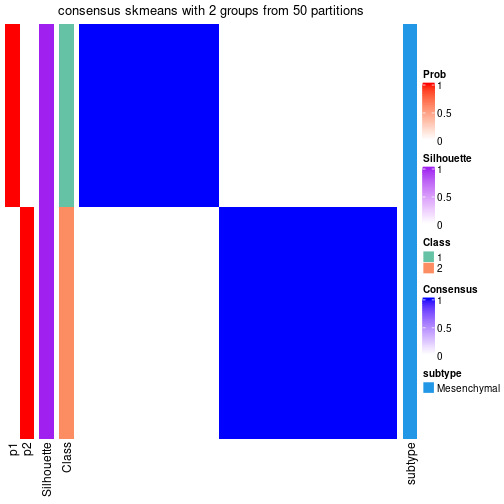</p>

</div>
<div id='tab-node-021-consensus-heatmap-2'>
<pre><code class="r">consensus_heatmap(res, k = 3)
</code></pre>

<p>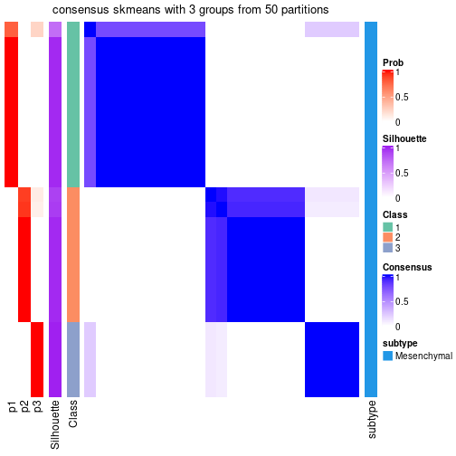</p>

</div>
<div id='tab-node-021-consensus-heatmap-3'>
<pre><code class="r">consensus_heatmap(res, k = 4)
</code></pre>

<p>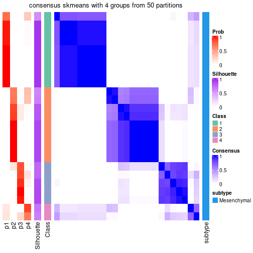</p>

</div>
</div>

Heatmaps for the membership of samples in all partitions to see how consistent they are:


<script>
$( function() {
	$( '#tabs-node-021-membership-heatmap' ).tabs();
} );
</script>
<div id='tabs-node-021-membership-heatmap'>
<ul>
<li><a href='#tab-node-021-membership-heatmap-1'>k = 2</a></li>
<li><a href='#tab-node-021-membership-heatmap-2'>k = 3</a></li>
<li><a href='#tab-node-021-membership-heatmap-3'>k = 4</a></li>
</ul>
<div id='tab-node-021-membership-heatmap-1'>
<pre><code class="r">membership_heatmap(res, k = 2)
</code></pre>

<p>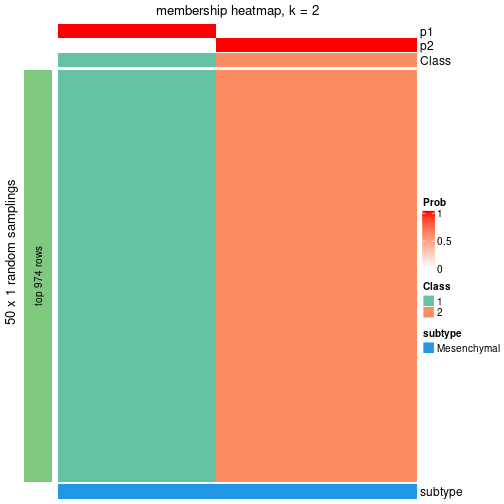</p>

</div>
<div id='tab-node-021-membership-heatmap-2'>
<pre><code class="r">membership_heatmap(res, k = 3)
</code></pre>

<p>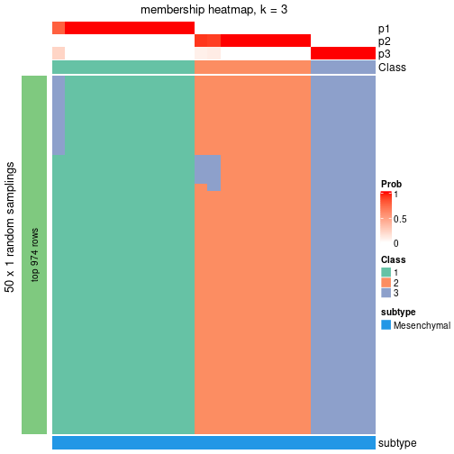</p>

</div>
<div id='tab-node-021-membership-heatmap-3'>
<pre><code class="r">membership_heatmap(res, k = 4)
</code></pre>

<p>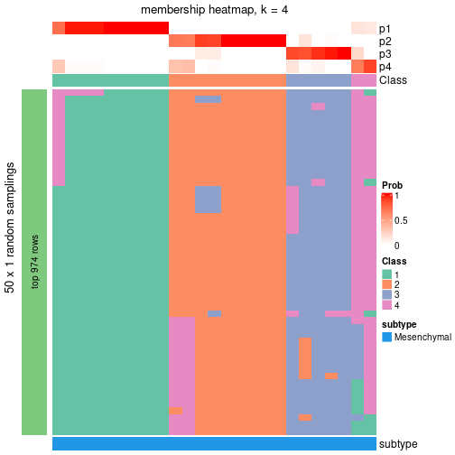</p>

</div>
</div>

As soon as the classes for columns are determined, the signatures
that are significantly different between subgroups can be looked for. 
Following are the heatmaps for signatures.


Signature heatmaps where rows are scaled:


<script>
$( function() {
	$( '#tabs-node-021-get-signatures' ).tabs();
} );
</script>
<div id='tabs-node-021-get-signatures'>
<ul>
<li><a href='#tab-node-021-get-signatures-1'>k = 2</a></li>
<li><a href='#tab-node-021-get-signatures-2'>k = 3</a></li>
<li><a href='#tab-node-021-get-signatures-3'>k = 4</a></li>
</ul>
<div id='tab-node-021-get-signatures-1'>
<pre><code class="r">get_signatures(res, k = 2)
</code></pre>

<p>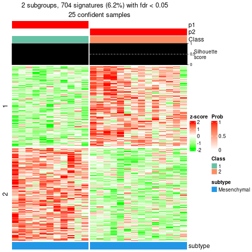</p>

</div>
<div id='tab-node-021-get-signatures-2'>
<pre><code class="r">get_signatures(res, k = 3)
</code></pre>

<p>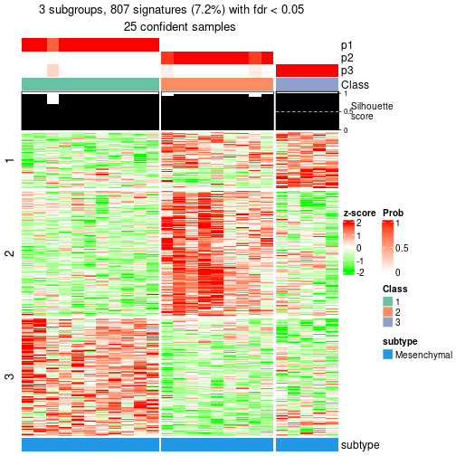</p>

</div>
<div id='tab-node-021-get-signatures-3'>
<pre><code class="r">get_signatures(res, k = 4)
</code></pre>

<p>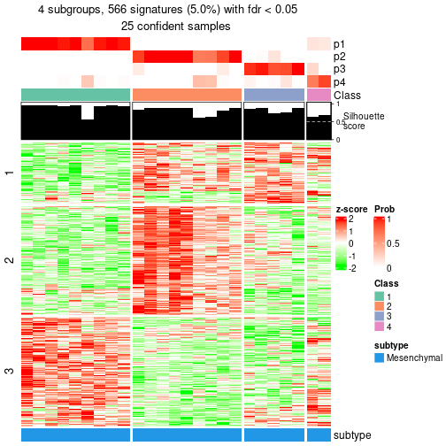</p>

</div>
</div>


Signature heatmaps where rows are not scaled:


<script>
$( function() {
	$( '#tabs-node-021-get-signatures-no-scale' ).tabs();
} );
</script>
<div id='tabs-node-021-get-signatures-no-scale'>
<ul>
<li><a href='#tab-node-021-get-signatures-no-scale-1'>k = 2</a></li>
<li><a href='#tab-node-021-get-signatures-no-scale-2'>k = 3</a></li>
<li><a href='#tab-node-021-get-signatures-no-scale-3'>k = 4</a></li>
</ul>
<div id='tab-node-021-get-signatures-no-scale-1'>
<pre><code class="r">get_signatures(res, k = 2, scale_rows = FALSE)
</code></pre>

<p>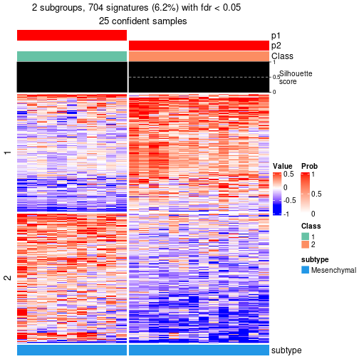</p>

</div>
<div id='tab-node-021-get-signatures-no-scale-2'>
<pre><code class="r">get_signatures(res, k = 3, scale_rows = FALSE)
</code></pre>

<p>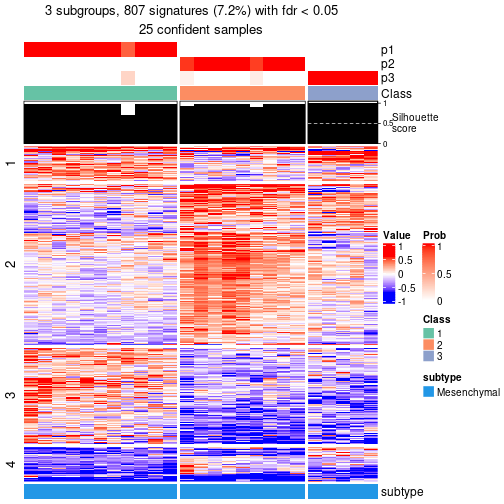</p>

</div>
<div id='tab-node-021-get-signatures-no-scale-3'>
<pre><code class="r">get_signatures(res, k = 4, scale_rows = FALSE)
</code></pre>

<p>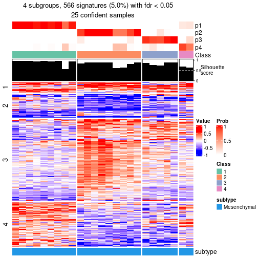</p>

</div>
</div>


Compare the overlap of signatures from different k:

```r
compare_signatures(res)
```

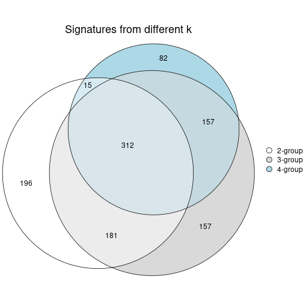

`get_signature()` returns a data frame invisibly. To get the list of signatures, the function
call should be assigned to a variable explicitly. In following code, if `plot` argument is set
to `FALSE`, no heatmap is plotted while only the differential analysis is performed.

```r
# code only for demonstration
tb = get_signature(res, k = ..., plot = FALSE)
```

An example of the output of `tb` is:

```
#>   which_row         fdr    mean_1    mean_2 scaled_mean_1 scaled_mean_2 km
#> 1        38 0.042760348  8.373488  9.131774    -0.5533452     0.5164555  1
#> 2        40 0.018707592  7.106213  8.469186    -0.6173731     0.5762149  1
#> 3        55 0.019134737 10.221463 11.207825    -0.6159697     0.5749050  1
#> 4        59 0.006059896  5.921854  7.869574    -0.6899429     0.6439467  1
#> 5        60 0.018055526  8.928898 10.211722    -0.6204761     0.5791110  1
#> 6        98 0.009384629 15.714769 14.887706     0.6635654    -0.6193277  2
...
```

The columns in `tb` are:

1. `which_row`: row indices corresponding to the input matrix.
2. `fdr`: FDR for the differential test. 
3. `mean_x`: The mean value in group x.
4. `scaled_mean_x`: The mean value in group x after rows are scaled.
5. `km`: Row groups if k-means clustering is applied to rows (which is done by automatically selecting number of clusters).

If there are too many signatures, `top_signatures = ...` can be set to only show the 
signatures with the highest FDRs:

```r
# code only for demonstration
# e.g. to show the top 500 most significant rows
tb = get_signature(res, k = ..., top_signatures = 500)
```

If the signatures are defined as these which are uniquely high in current group, `diff_method` argument
can be set to `"uniquely_high_in_one_group"`:

```r
# code only for demonstration
tb = get_signature(res, k = ..., diff_method = "uniquely_high_in_one_group")
```


UMAP plot which shows how samples are separated.


<script>
$( function() {
	$( '#tabs-node-021-dimension-reduction' ).tabs();
} );
</script>
<div id='tabs-node-021-dimension-reduction'>
<ul>
<li><a href='#tab-node-021-dimension-reduction-1'>k = 2</a></li>
<li><a href='#tab-node-021-dimension-reduction-2'>k = 3</a></li>
<li><a href='#tab-node-021-dimension-reduction-3'>k = 4</a></li>
</ul>
<div id='tab-node-021-dimension-reduction-1'>
<pre><code class="r">dimension_reduction(res, k = 2, method = &quot;UMAP&quot;)
</code></pre>

<p>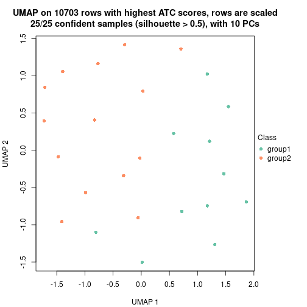</p>

</div>
<div id='tab-node-021-dimension-reduction-2'>
<pre><code class="r">dimension_reduction(res, k = 3, method = &quot;UMAP&quot;)
</code></pre>

<p>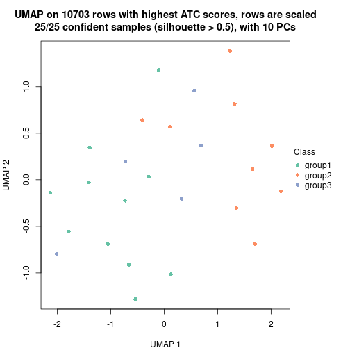</p>

</div>
<div id='tab-node-021-dimension-reduction-3'>
<pre><code class="r">dimension_reduction(res, k = 4, method = &quot;UMAP&quot;)
</code></pre>

<p>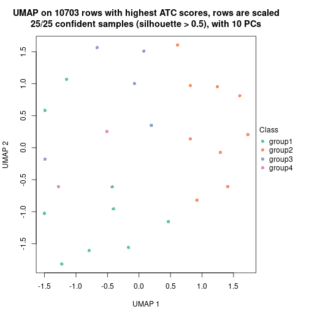</p>

</div>
</div>


Following heatmap shows how subgroups are split when increasing `k`:

```r
collect_classes(res)
```

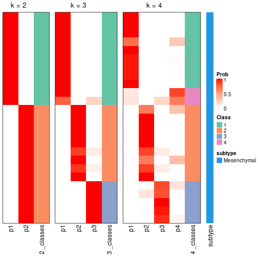


Test correlation between subgroups and known annotations. If the known
annotation is numeric, one-way ANOVA test is applied, and if the known
annotation is discrete, chi-squared contingency table test is applied.

```r
test_to_known_factors(res)
```

```
#>             n_sample subtype(p-value) k
#> ATC:skmeans       25               NA 2
#> ATC:skmeans       25               NA 3
#> ATC:skmeans       25               NA 4
```


If matrix rows can be associated to genes, consider to use `functional_enrichment(res,
...)` to perform function enrichment for the signature genes. See [this vignette](https://jokergoo.github.io/cola_vignettes/functional_enrichment.html) for more detailed explanations.


 

---------------------------------------------------


### Node022


Parent node: [Node02](#Node02).
Child nodes: 
                Node0121-leaf
        ,
                Node0122-leaf
        ,
                Node0211-leaf
        ,
                Node0212-leaf
        ,
                Node0213-leaf
        ,
                Node0221-leaf
        ,
                Node0222-leaf
        .


The object with results only for a single top-value method and a single partitioning method 
can be extracted as:

```r
res = res_rh["022"]
```

A summary of `res` and all the functions that can be applied to it:

```r
res
```

```
#> A 'ConsensusPartition' object with k = 2, 3, 4.
#>   On a matrix with 10703 rows and 24 columns.
#>   Top rows (1070) are extracted by 'ATC' method.
#>   Subgroups are detected by 'skmeans' method.
#>   Performed in total 150 partitions by row resampling.
#>   Best k for subgroups seems to be 3.
#> 
#> Following methods can be applied to this 'ConsensusPartition' object:
#>  [1] "cola_report"             "collect_classes"         "collect_plots"          
#>  [4] "collect_stats"           "colnames"                "compare_partitions"     
#>  [7] "compare_signatures"      "consensus_heatmap"       "dimension_reduction"    
#> [10] "functional_enrichment"   "get_anno_col"            "get_anno"               
#> [13] "get_classes"             "get_consensus"           "get_matrix"             
#> [16] "get_membership"          "get_param"               "get_signatures"         
#> [19] "get_stats"               "is_best_k"               "is_stable_k"            
#> [22] "membership_heatmap"      "ncol"                    "nrow"                   
#> [25] "plot_ecdf"               "predict_classes"         "rownames"               
#> [28] "select_partition_number" "show"                    "suggest_best_k"         
#> [31] "test_to_known_factors"   "top_rows_heatmap"
```

`collect_plots()` function collects all the plots made from `res` for all `k` (number of subgroups)
into one single page to provide an easy and fast comparison between different `k`.

```r
collect_plots(res)
```

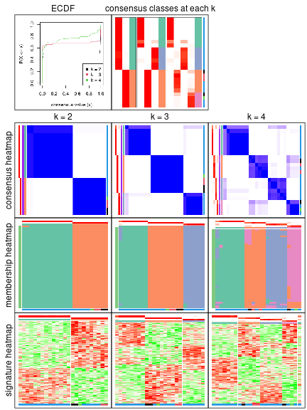

The plots are:

- The first row: a plot of the eCDF (empirical cumulative distribution
  function) curves of the consensus matrix for each `k` and the heatmap of
  predicted classes for each `k`.
- The second row: heatmaps of the consensus matrix for each `k`.
- The third row: heatmaps of the membership matrix for each `k`.
- The fouth row: heatmaps of the signatures for each `k`.

All the plots in panels can be made by individual functions and they are
plotted later in this section.

`select_partition_number()` produces several plots showing different
statistics for choosing "optimized" `k`. There are following statistics:

- eCDF curves of the consensus matrix for each `k`;
- 1-PAC. [The PAC score](https://en.wikipedia.org/wiki/Consensus_clustering#Over-interpretation_potential_of_consensus_clustering)
  measures the proportion of the ambiguous subgrouping.
- Mean silhouette score.
- Concordance. The mean probability of fiting the consensus subgroup labels in all
  partitions.
- Area increased. Denote $A_k$ as the area under the eCDF curve for current
  `k`, the area increased is defined as $A_k - A_{k-1}$.
- Rand index. The percent of pairs of samples that are both in a same cluster
  or both are not in a same cluster in the partition of k and k-1.
- Jaccard index. The ratio of pairs of samples are both in a same cluster in
  the partition of k and k-1 and the pairs of samples are both in a same
  cluster in the partition k or k-1.

The detailed explanations of these statistics can be found in [the _cola_
vignette](https://jokergoo.github.io/cola_vignettes/cola.html#toc_13).

Generally speaking, higher 1-PAC score, higher mean silhouette score or higher
concordance corresponds to better partition. Rand index and Jaccard index
measure how similar the current partition is compared to partition with `k-1`.
If they are too similar, we won't accept `k` is better than `k-1`.

```r
select_partition_number(res)
```

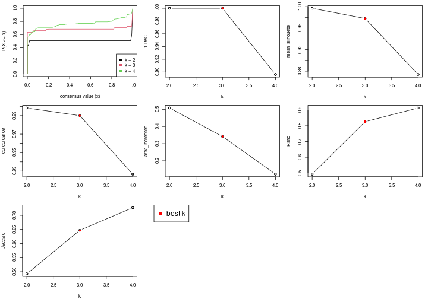

The numeric values for all these statistics can be obtained by `get_stats()`.

```r
get_stats(res)
```

```
#>   k 1-PAC mean_silhouette concordance area_increased  Rand Jaccard
#> 2 2 1.000           0.997       0.998          0.508 0.493   0.493
#> 3 3 1.000           0.978       0.990          0.342 0.826   0.647
#> 4 4 0.896           0.874       0.927          0.122 0.913   0.727
```

`suggest_best_k()` suggests the best $k$ based on these statistics. The rules are as follows:

- All $k$ with Jaccard index larger than 0.95 are removed because increasing
  $k$ does not provide enough extra information. If all $k$ are removed, it is
  marked as no subgroup is detected.
- For all $k$ with 1-PAC score larger than 0.9, the maximal $k$ is taken as
  the best $k$, and other $k$ are marked as optional $k$.
- If it does not fit the second rule. The $k$ with the maximal vote of the
  highest 1-PAC score, highest mean silhouette, and highest concordance is
  taken as the best $k$.

```r
suggest_best_k(res)
```

```
#> [1] 3
#> attr(,"optional")
#> [1] 2
```

There is also optional best $k$ = 2 that is worth to check.

Following is the table of the partitions (You need to click the **show/hide
code output** link to see it). The membership matrix (columns with name `p*`)
is inferred by
[`clue::cl_consensus()`](https://www.rdocumentation.org/link/cl_consensus?package=clue)
function with the `SE` method. Basically the value in the membership matrix
represents the probability to belong to a certain group. The finall subgroup
label for an item is determined with the group with highest probability it
belongs to.

In `get_classes()` function, the entropy is calculated from the membership
matrix and the silhouette score is calculated from the consensus matrix.


<script>
$( function() {
	$( '#tabs-node-022-get-classes' ).tabs();
} );
</script>
<div id='tabs-node-022-get-classes'>
<ul>
<li><a href='#tab-node-022-get-classes-1'>k = 2</a></li>
<li><a href='#tab-node-022-get-classes-2'>k = 3</a></li>
<li><a href='#tab-node-022-get-classes-3'>k = 4</a></li>
</ul>

<div id='tab-node-022-get-classes-1'>
<p><a id='tab-node-022-get-classes-1-a' style='color:#0366d6' href='#'>show/hide code output</a></p>
<pre><code class="r">cbind(get_classes(res, k = 2), get_membership(res, k = 2))
</code></pre>

<pre><code>#&gt;                     class entropy silhouette   p1   p2
#&gt; TCGA-02-0446-01A-01     2   0.000      1.000 0.00 1.00
#&gt; TCGA-06-0646-01A-01     2   0.000      1.000 0.00 1.00
#&gt; TCGA-02-0089-01A-01     2   0.000      1.000 0.00 1.00
#&gt; TCGA-02-0451-01A-01     2   0.000      1.000 0.00 1.00
#&gt; TCGA-06-0187-01A-01     2   0.000      1.000 0.00 1.00
#&gt; TCGA-02-0057-01A-01     1   0.000      0.997 1.00 0.00
#&gt; TCGA-02-0006-01B-01     2   0.000      1.000 0.00 1.00
#&gt; TCGA-02-0054-01A-01     2   0.000      1.000 0.00 1.00
#&gt; TCGA-02-0064-01A-01     1   0.000      0.997 1.00 0.00
#&gt; TCGA-02-0075-01A-01     1   0.000      0.997 1.00 0.00
#&gt; TCGA-02-0085-01A-01     1   0.141      0.981 0.98 0.02
#&gt; TCGA-02-0099-01A-01     2   0.000      1.000 0.00 1.00
#&gt; TCGA-02-0107-01A-01     1   0.141      0.981 0.98 0.02
#&gt; TCGA-06-0122-01A-01     1   0.000      0.997 1.00 0.00
#&gt; TCGA-06-0124-01A-01     1   0.000      0.997 1.00 0.00
#&gt; TCGA-06-0143-01A-01     1   0.000      0.997 1.00 0.00
#&gt; TCGA-06-0147-01A-01     1   0.000      0.997 1.00 0.00
#&gt; TCGA-06-0175-01A-01     2   0.000      1.000 0.00 1.00
#&gt; TCGA-06-0409-01A-02     1   0.000      0.997 1.00 0.00
#&gt; TCGA-06-0412-01A-01     2   0.000      1.000 0.00 1.00
#&gt; TCGA-08-0352-01A-01     1   0.000      0.997 1.00 0.00
#&gt; TCGA-08-0360-01A-01     1   0.000      0.997 1.00 0.00
#&gt; TCGA-08-0509-01A-01     1   0.000      0.997 1.00 0.00
#&gt; TCGA-08-0510-01A-01     1   0.000      0.997 1.00 0.00
</code></pre>

<script>
$('#tab-node-022-get-classes-1-a').parent().next().next().hide();
$('#tab-node-022-get-classes-1-a').click(function(){
  $('#tab-node-022-get-classes-1-a').parent().next().next().toggle();
  return(false);
});
</script>
</div>

<div id='tab-node-022-get-classes-2'>
<p><a id='tab-node-022-get-classes-2-a' style='color:#0366d6' href='#'>show/hide code output</a></p>
<pre><code class="r">cbind(get_classes(res, k = 3), get_membership(res, k = 3))
</code></pre>

<pre><code>#&gt;                     class entropy silhouette   p1 p2   p3
#&gt; TCGA-02-0446-01A-01     2   0.000      1.000 0.00  1 0.00
#&gt; TCGA-06-0646-01A-01     2   0.000      1.000 0.00  1 0.00
#&gt; TCGA-02-0089-01A-01     2   0.000      1.000 0.00  1 0.00
#&gt; TCGA-02-0451-01A-01     2   0.000      1.000 0.00  1 0.00
#&gt; TCGA-06-0187-01A-01     2   0.000      1.000 0.00  1 0.00
#&gt; TCGA-02-0057-01A-01     3   0.000      0.988 0.00  0 1.00
#&gt; TCGA-02-0006-01B-01     2   0.000      1.000 0.00  1 0.00
#&gt; TCGA-02-0054-01A-01     2   0.000      1.000 0.00  1 0.00
#&gt; TCGA-02-0064-01A-01     1   0.000      0.974 1.00  0 0.00
#&gt; TCGA-02-0075-01A-01     1   0.000      0.974 1.00  0 0.00
#&gt; TCGA-02-0085-01A-01     3   0.000      0.988 0.00  0 1.00
#&gt; TCGA-02-0099-01A-01     2   0.000      1.000 0.00  1 0.00
#&gt; TCGA-02-0107-01A-01     3   0.000      0.988 0.00  0 1.00
#&gt; TCGA-06-0122-01A-01     1   0.000      0.974 1.00  0 0.00
#&gt; TCGA-06-0124-01A-01     1   0.000      0.974 1.00  0 0.00
#&gt; TCGA-06-0143-01A-01     1   0.000      0.974 1.00  0 0.00
#&gt; TCGA-06-0147-01A-01     3   0.207      0.936 0.06  0 0.94
#&gt; TCGA-06-0175-01A-01     2   0.000      1.000 0.00  1 0.00
#&gt; TCGA-06-0409-01A-02     3   0.000      0.988 0.00  0 1.00
#&gt; TCGA-06-0412-01A-01     2   0.000      1.000 0.00  1 0.00
#&gt; TCGA-08-0352-01A-01     1   0.000      0.974 1.00  0 0.00
#&gt; TCGA-08-0360-01A-01     1   0.429      0.780 0.82  0 0.18
#&gt; TCGA-08-0509-01A-01     3   0.000      0.988 0.00  0 1.00
#&gt; TCGA-08-0510-01A-01     1   0.000      0.974 1.00  0 0.00
</code></pre>

<script>
$('#tab-node-022-get-classes-2-a').parent().next().next().hide();
$('#tab-node-022-get-classes-2-a').click(function(){
  $('#tab-node-022-get-classes-2-a').parent().next().next().toggle();
  return(false);
});
</script>
</div>

<div id='tab-node-022-get-classes-3'>
<p><a id='tab-node-022-get-classes-3-a' style='color:#0366d6' href='#'>show/hide code output</a></p>
<pre><code class="r">cbind(get_classes(res, k = 4), get_membership(res, k = 4))
</code></pre>

<pre><code>#&gt;                     class entropy silhouette   p1   p2   p3   p4
#&gt; TCGA-02-0446-01A-01     2  0.3975      0.753 0.00 0.76 0.00 0.24
#&gt; TCGA-06-0646-01A-01     4  0.3975      0.674 0.00 0.24 0.00 0.76
#&gt; TCGA-02-0089-01A-01     2  0.0000      0.856 0.00 1.00 0.00 0.00
#&gt; TCGA-02-0451-01A-01     2  0.1211      0.888 0.00 0.96 0.00 0.04
#&gt; TCGA-06-0187-01A-01     4  0.1211      0.914 0.00 0.04 0.00 0.96
#&gt; TCGA-02-0057-01A-01     3  0.1913      0.931 0.00 0.02 0.94 0.04
#&gt; TCGA-02-0006-01B-01     2  0.1211      0.888 0.00 0.96 0.00 0.04
#&gt; TCGA-02-0054-01A-01     2  0.1637      0.885 0.00 0.94 0.00 0.06
#&gt; TCGA-02-0064-01A-01     1  0.0000      0.939 1.00 0.00 0.00 0.00
#&gt; TCGA-02-0075-01A-01     1  0.0000      0.939 1.00 0.00 0.00 0.00
#&gt; TCGA-02-0085-01A-01     3  0.3198      0.916 0.00 0.08 0.88 0.04
#&gt; TCGA-02-0099-01A-01     2  0.3801      0.778 0.00 0.78 0.00 0.22
#&gt; TCGA-02-0107-01A-01     3  0.3198      0.916 0.00 0.08 0.88 0.04
#&gt; TCGA-06-0122-01A-01     1  0.0000      0.939 1.00 0.00 0.00 0.00
#&gt; TCGA-06-0124-01A-01     1  0.0000      0.939 1.00 0.00 0.00 0.00
#&gt; TCGA-06-0143-01A-01     1  0.0000      0.939 1.00 0.00 0.00 0.00
#&gt; TCGA-06-0147-01A-01     3  0.2011      0.891 0.08 0.00 0.92 0.00
#&gt; TCGA-06-0175-01A-01     4  0.1211      0.914 0.00 0.04 0.00 0.96
#&gt; TCGA-06-0409-01A-02     3  0.0707      0.923 0.02 0.00 0.98 0.00
#&gt; TCGA-06-0412-01A-01     4  0.1211      0.914 0.00 0.04 0.00 0.96
#&gt; TCGA-08-0352-01A-01     1  0.0000      0.939 1.00 0.00 0.00 0.00
#&gt; TCGA-08-0360-01A-01     1  0.4713      0.470 0.64 0.00 0.36 0.00
#&gt; TCGA-08-0509-01A-01     3  0.0000      0.928 0.00 0.00 1.00 0.00
#&gt; TCGA-08-0510-01A-01     1  0.1913      0.900 0.94 0.00 0.02 0.04
</code></pre>

<script>
$('#tab-node-022-get-classes-3-a').parent().next().next().hide();
$('#tab-node-022-get-classes-3-a').click(function(){
  $('#tab-node-022-get-classes-3-a').parent().next().next().toggle();
  return(false);
});
</script>
</div>
</div>

Heatmaps for the consensus matrix. It visualizes the probability of two
samples to be in a same group.


<script>
$( function() {
	$( '#tabs-node-022-consensus-heatmap' ).tabs();
} );
</script>
<div id='tabs-node-022-consensus-heatmap'>
<ul>
<li><a href='#tab-node-022-consensus-heatmap-1'>k = 2</a></li>
<li><a href='#tab-node-022-consensus-heatmap-2'>k = 3</a></li>
<li><a href='#tab-node-022-consensus-heatmap-3'>k = 4</a></li>
</ul>
<div id='tab-node-022-consensus-heatmap-1'>
<pre><code class="r">consensus_heatmap(res, k = 2)
</code></pre>

<p>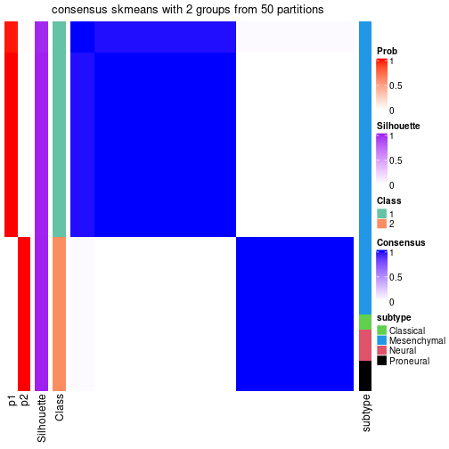</p>

</div>
<div id='tab-node-022-consensus-heatmap-2'>
<pre><code class="r">consensus_heatmap(res, k = 3)
</code></pre>

<p>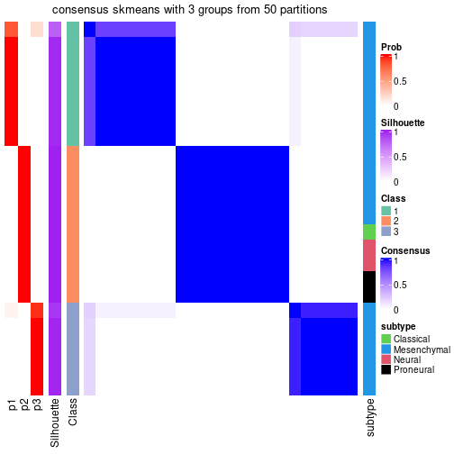</p>

</div>
<div id='tab-node-022-consensus-heatmap-3'>
<pre><code class="r">consensus_heatmap(res, k = 4)
</code></pre>

<p>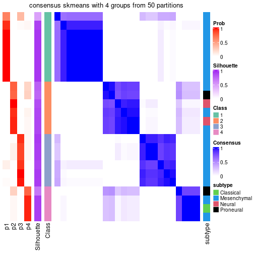</p>

</div>
</div>

Heatmaps for the membership of samples in all partitions to see how consistent they are:


<script>
$( function() {
	$( '#tabs-node-022-membership-heatmap' ).tabs();
} );
</script>
<div id='tabs-node-022-membership-heatmap'>
<ul>
<li><a href='#tab-node-022-membership-heatmap-1'>k = 2</a></li>
<li><a href='#tab-node-022-membership-heatmap-2'>k = 3</a></li>
<li><a href='#tab-node-022-membership-heatmap-3'>k = 4</a></li>
</ul>
<div id='tab-node-022-membership-heatmap-1'>
<pre><code class="r">membership_heatmap(res, k = 2)
</code></pre>

<p>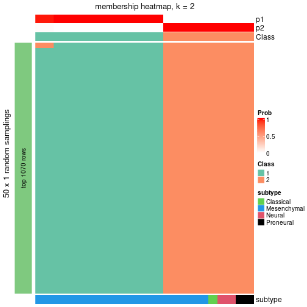</p>

</div>
<div id='tab-node-022-membership-heatmap-2'>
<pre><code class="r">membership_heatmap(res, k = 3)
</code></pre>

<p>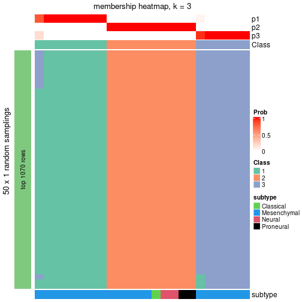</p>

</div>
<div id='tab-node-022-membership-heatmap-3'>
<pre><code class="r">membership_heatmap(res, k = 4)
</code></pre>

<p>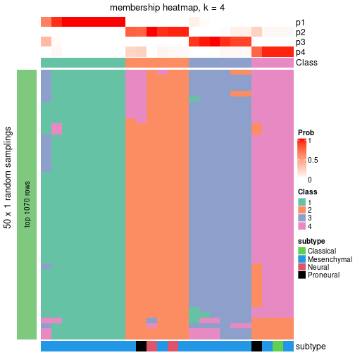</p>

</div>
</div>

As soon as the classes for columns are determined, the signatures
that are significantly different between subgroups can be looked for. 
Following are the heatmaps for signatures.


Signature heatmaps where rows are scaled:


<script>
$( function() {
	$( '#tabs-node-022-get-signatures' ).tabs();
} );
</script>
<div id='tabs-node-022-get-signatures'>
<ul>
<li><a href='#tab-node-022-get-signatures-1'>k = 2</a></li>
<li><a href='#tab-node-022-get-signatures-2'>k = 3</a></li>
<li><a href='#tab-node-022-get-signatures-3'>k = 4</a></li>
</ul>
<div id='tab-node-022-get-signatures-1'>
<pre><code class="r">get_signatures(res, k = 2)
</code></pre>

<p>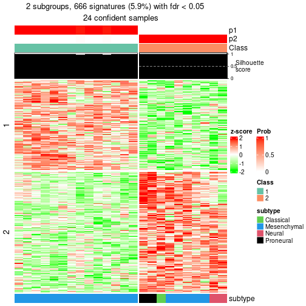</p>

</div>
<div id='tab-node-022-get-signatures-2'>
<pre><code class="r">get_signatures(res, k = 3)
</code></pre>

<p>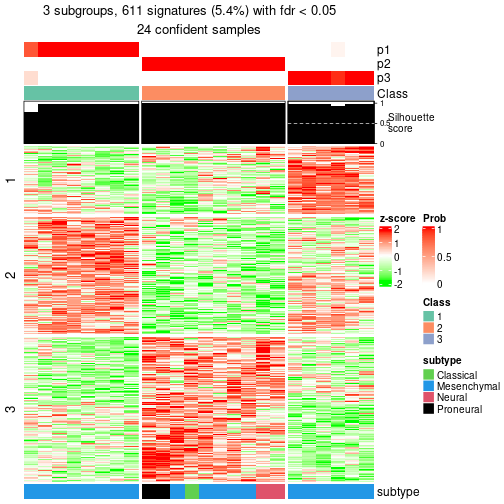</p>

</div>
<div id='tab-node-022-get-signatures-3'>
<pre><code class="r">get_signatures(res, k = 4)
</code></pre>

<p>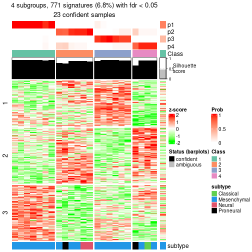</p>

</div>
</div>


Signature heatmaps where rows are not scaled:


<script>
$( function() {
	$( '#tabs-node-022-get-signatures-no-scale' ).tabs();
} );
</script>
<div id='tabs-node-022-get-signatures-no-scale'>
<ul>
<li><a href='#tab-node-022-get-signatures-no-scale-1'>k = 2</a></li>
<li><a href='#tab-node-022-get-signatures-no-scale-2'>k = 3</a></li>
<li><a href='#tab-node-022-get-signatures-no-scale-3'>k = 4</a></li>
</ul>
<div id='tab-node-022-get-signatures-no-scale-1'>
<pre><code class="r">get_signatures(res, k = 2, scale_rows = FALSE)
</code></pre>

<p>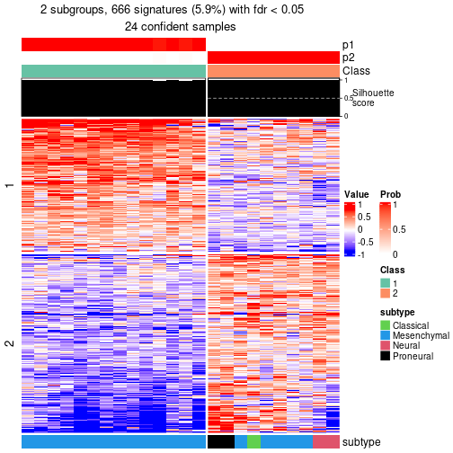</p>

</div>
<div id='tab-node-022-get-signatures-no-scale-2'>
<pre><code class="r">get_signatures(res, k = 3, scale_rows = FALSE)
</code></pre>

<p>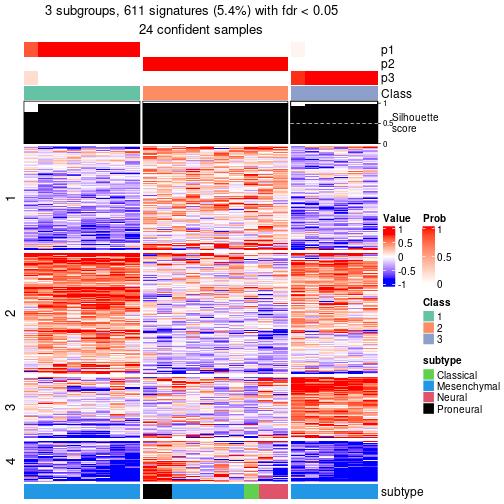</p>

</div>
<div id='tab-node-022-get-signatures-no-scale-3'>
<pre><code class="r">get_signatures(res, k = 4, scale_rows = FALSE)
</code></pre>

<p>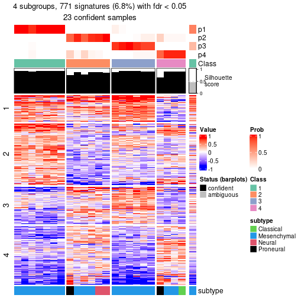</p>

</div>
</div>


Compare the overlap of signatures from different k:

```r
compare_signatures(res)
```

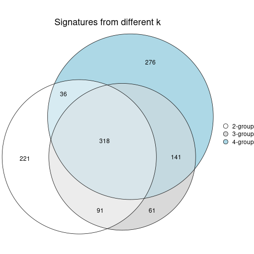

`get_signature()` returns a data frame invisibly. To get the list of signatures, the function
call should be assigned to a variable explicitly. In following code, if `plot` argument is set
to `FALSE`, no heatmap is plotted while only the differential analysis is performed.

```r
# code only for demonstration
tb = get_signature(res, k = ..., plot = FALSE)
```

An example of the output of `tb` is:

```
#>   which_row         fdr    mean_1    mean_2 scaled_mean_1 scaled_mean_2 km
#> 1        38 0.042760348  8.373488  9.131774    -0.5533452     0.5164555  1
#> 2        40 0.018707592  7.106213  8.469186    -0.6173731     0.5762149  1
#> 3        55 0.019134737 10.221463 11.207825    -0.6159697     0.5749050  1
#> 4        59 0.006059896  5.921854  7.869574    -0.6899429     0.6439467  1
#> 5        60 0.018055526  8.928898 10.211722    -0.6204761     0.5791110  1
#> 6        98 0.009384629 15.714769 14.887706     0.6635654    -0.6193277  2
...
```

The columns in `tb` are:

1. `which_row`: row indices corresponding to the input matrix.
2. `fdr`: FDR for the differential test. 
3. `mean_x`: The mean value in group x.
4. `scaled_mean_x`: The mean value in group x after rows are scaled.
5. `km`: Row groups if k-means clustering is applied to rows (which is done by automatically selecting number of clusters).

If there are too many signatures, `top_signatures = ...` can be set to only show the 
signatures with the highest FDRs:

```r
# code only for demonstration
# e.g. to show the top 500 most significant rows
tb = get_signature(res, k = ..., top_signatures = 500)
```

If the signatures are defined as these which are uniquely high in current group, `diff_method` argument
can be set to `"uniquely_high_in_one_group"`:

```r
# code only for demonstration
tb = get_signature(res, k = ..., diff_method = "uniquely_high_in_one_group")
```


UMAP plot which shows how samples are separated.


<script>
$( function() {
	$( '#tabs-node-022-dimension-reduction' ).tabs();
} );
</script>
<div id='tabs-node-022-dimension-reduction'>
<ul>
<li><a href='#tab-node-022-dimension-reduction-1'>k = 2</a></li>
<li><a href='#tab-node-022-dimension-reduction-2'>k = 3</a></li>
<li><a href='#tab-node-022-dimension-reduction-3'>k = 4</a></li>
</ul>
<div id='tab-node-022-dimension-reduction-1'>
<pre><code class="r">dimension_reduction(res, k = 2, method = &quot;UMAP&quot;)
</code></pre>

<p>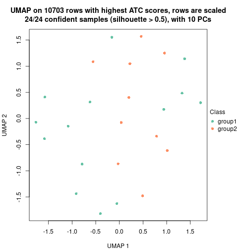</p>

</div>
<div id='tab-node-022-dimension-reduction-2'>
<pre><code class="r">dimension_reduction(res, k = 3, method = &quot;UMAP&quot;)
</code></pre>

<p>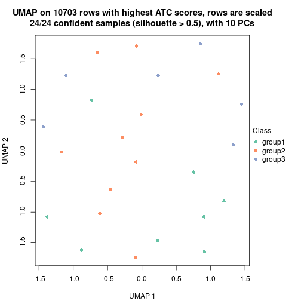</p>

</div>
<div id='tab-node-022-dimension-reduction-3'>
<pre><code class="r">dimension_reduction(res, k = 4, method = &quot;UMAP&quot;)
</code></pre>

<p>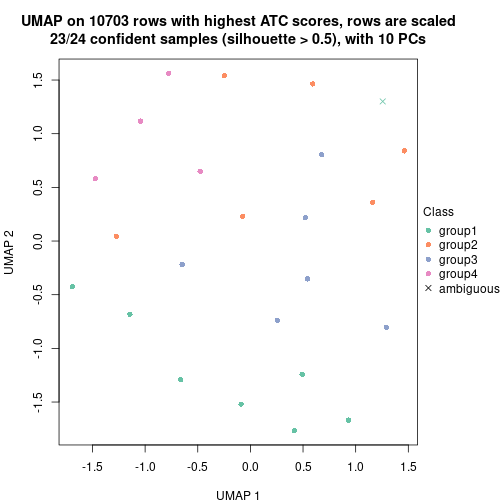</p>

</div>
</div>


Following heatmap shows how subgroups are split when increasing `k`:

```r
collect_classes(res)
```

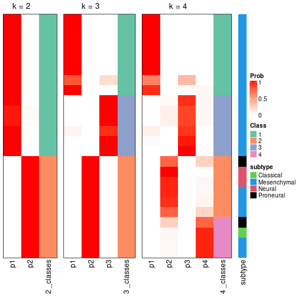


Test correlation between subgroups and known annotations. If the known
annotation is numeric, one-way ANOVA test is applied, and if the known
annotation is discrete, chi-squared contingency table test is applied.

```r
test_to_known_factors(res)
```

```
#>             n_sample subtype(p-value) k
#> ATC:skmeans       24           0.0315 2
#> ATC:skmeans       24           0.1827 3
#> ATC:skmeans       23           0.0906 4
```


If matrix rows can be associated to genes, consider to use `functional_enrichment(res,
...)` to perform function enrichment for the signature genes. See [this vignette](https://jokergoo.github.io/cola_vignettes/functional_enrichment.html) for more detailed explanations.


 

---------------------------------------------------


### Node03


Parent node: [Node0](#Node0).
Child nodes: 
                Node011-leaf
        ,
                [Node012](#Node012)
        ,
                Node013-leaf
        ,
                [Node021](#Node021)
        ,
                [Node022](#Node022)
        ,
                Node023-leaf
        ,
                Node031-leaf
        ,
                Node032-leaf
        ,
                Node033-leaf
        ,
                Node034-leaf
        ,
                Node041-leaf
        ,
                Node042-leaf
        .


The object with results only for a single top-value method and a single partitioning method 
can be extracted as:

```r
res = res_rh["03"]
```

A summary of `res` and all the functions that can be applied to it:

```r
res
```

```
#> A 'ConsensusPartition' object with k = 2, 3, 4.
#>   On a matrix with 10703 rows and 24 columns.
#>   Top rows (1070) are extracted by 'ATC' method.
#>   Subgroups are detected by 'skmeans' method.
#>   Performed in total 150 partitions by row resampling.
#>   Best k for subgroups seems to be 4.
#> 
#> Following methods can be applied to this 'ConsensusPartition' object:
#>  [1] "cola_report"             "collect_classes"         "collect_plots"          
#>  [4] "collect_stats"           "colnames"                "compare_partitions"     
#>  [7] "compare_signatures"      "consensus_heatmap"       "dimension_reduction"    
#> [10] "functional_enrichment"   "get_anno_col"            "get_anno"               
#> [13] "get_classes"             "get_consensus"           "get_matrix"             
#> [16] "get_membership"          "get_param"               "get_signatures"         
#> [19] "get_stats"               "is_best_k"               "is_stable_k"            
#> [22] "membership_heatmap"      "ncol"                    "nrow"                   
#> [25] "plot_ecdf"               "predict_classes"         "rownames"               
#> [28] "select_partition_number" "show"                    "suggest_best_k"         
#> [31] "test_to_known_factors"   "top_rows_heatmap"
```

`collect_plots()` function collects all the plots made from `res` for all `k` (number of subgroups)
into one single page to provide an easy and fast comparison between different `k`.

```r
collect_plots(res)
```

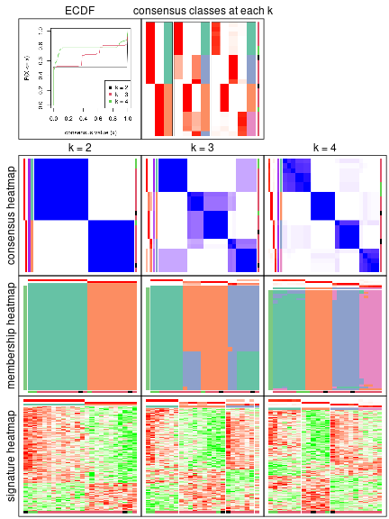

The plots are:

- The first row: a plot of the eCDF (empirical cumulative distribution
  function) curves of the consensus matrix for each `k` and the heatmap of
  predicted classes for each `k`.
- The second row: heatmaps of the consensus matrix for each `k`.
- The third row: heatmaps of the membership matrix for each `k`.
- The fouth row: heatmaps of the signatures for each `k`.

All the plots in panels can be made by individual functions and they are
plotted later in this section.

`select_partition_number()` produces several plots showing different
statistics for choosing "optimized" `k`. There are following statistics:

- eCDF curves of the consensus matrix for each `k`;
- 1-PAC. [The PAC score](https://en.wikipedia.org/wiki/Consensus_clustering#Over-interpretation_potential_of_consensus_clustering)
  measures the proportion of the ambiguous subgrouping.
- Mean silhouette score.
- Concordance. The mean probability of fiting the consensus subgroup labels in all
  partitions.
- Area increased. Denote $A_k$ as the area under the eCDF curve for current
  `k`, the area increased is defined as $A_k - A_{k-1}$.
- Rand index. The percent of pairs of samples that are both in a same cluster
  or both are not in a same cluster in the partition of k and k-1.
- Jaccard index. The ratio of pairs of samples are both in a same cluster in
  the partition of k and k-1 and the pairs of samples are both in a same
  cluster in the partition k or k-1.

The detailed explanations of these statistics can be found in [the _cola_
vignette](https://jokergoo.github.io/cola_vignettes/cola.html#toc_13).

Generally speaking, higher 1-PAC score, higher mean silhouette score or higher
concordance corresponds to better partition. Rand index and Jaccard index
measure how similar the current partition is compared to partition with `k-1`.
If they are too similar, we won't accept `k` is better than `k-1`.

```r
select_partition_number(res)
```

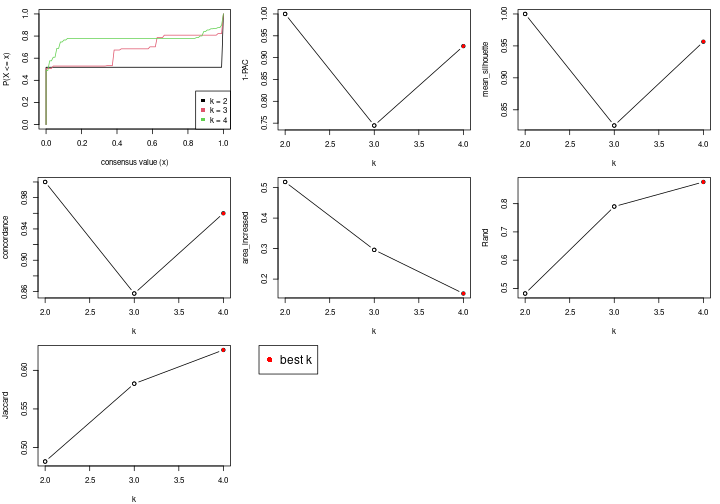

The numeric values for all these statistics can be obtained by `get_stats()`.

```r
get_stats(res)
```

```
#>   k 1-PAC mean_silhouette concordance area_increased  Rand Jaccard
#> 2 2 1.000           1.000       1.000          0.519 0.482   0.482
#> 3 3 0.745           0.825       0.858          0.296 0.790   0.583
#> 4 4 0.926           0.957       0.960          0.153 0.877   0.626
```

`suggest_best_k()` suggests the best $k$ based on these statistics. The rules are as follows:

- All $k$ with Jaccard index larger than 0.95 are removed because increasing
  $k$ does not provide enough extra information. If all $k$ are removed, it is
  marked as no subgroup is detected.
- For all $k$ with 1-PAC score larger than 0.9, the maximal $k$ is taken as
  the best $k$, and other $k$ are marked as optional $k$.
- If it does not fit the second rule. The $k$ with the maximal vote of the
  highest 1-PAC score, highest mean silhouette, and highest concordance is
  taken as the best $k$.

```r
suggest_best_k(res)
```

```
#> [1] 4
#> attr(,"optional")
#> [1] 2
```

There is also optional best $k$ = 2 that is worth to check.

Following is the table of the partitions (You need to click the **show/hide
code output** link to see it). The membership matrix (columns with name `p*`)
is inferred by
[`clue::cl_consensus()`](https://www.rdocumentation.org/link/cl_consensus?package=clue)
function with the `SE` method. Basically the value in the membership matrix
represents the probability to belong to a certain group. The finall subgroup
label for an item is determined with the group with highest probability it
belongs to.

In `get_classes()` function, the entropy is calculated from the membership
matrix and the silhouette score is calculated from the consensus matrix.


<script>
$( function() {
	$( '#tabs-node-03-get-classes' ).tabs();
} );
</script>
<div id='tabs-node-03-get-classes'>
<ul>
<li><a href='#tab-node-03-get-classes-1'>k = 2</a></li>
<li><a href='#tab-node-03-get-classes-2'>k = 3</a></li>
<li><a href='#tab-node-03-get-classes-3'>k = 4</a></li>
</ul>

<div id='tab-node-03-get-classes-1'>
<p><a id='tab-node-03-get-classes-1-a' style='color:#0366d6' href='#'>show/hide code output</a></p>
<pre><code class="r">cbind(get_classes(res, k = 2), get_membership(res, k = 2))
</code></pre>

<pre><code>#&gt;                     class entropy silhouette p1 p2
#&gt; TCGA-02-0047-01A-01     2       0          1  0  1
#&gt; TCGA-06-0238-01A-02     1       0          1  1  0
#&gt; TCGA-02-0113-01A-01     2       0          1  0  1
#&gt; TCGA-02-0115-01A-01     2       0          1  0  1
#&gt; TCGA-06-0133-01A-02     2       0          1  0  1
#&gt; TCGA-06-0138-01A-02     1       0          1  1  0
#&gt; TCGA-06-0162-01A-01     1       0          1  1  0
#&gt; TCGA-06-0171-01A-02     2       0          1  0  1
#&gt; TCGA-06-0173-01A-01     2       0          1  0  1
#&gt; TCGA-06-0179-01A-02     2       0          1  0  1
#&gt; TCGA-06-0182-01A-01     1       0          1  1  0
#&gt; TCGA-06-0185-01A-01     1       0          1  1  0
#&gt; TCGA-06-0195-01B-01     2       0          1  0  1
#&gt; TCGA-06-0208-01B-01     2       0          1  0  1
#&gt; TCGA-06-0214-01A-02     2       0          1  0  1
#&gt; TCGA-06-0219-01A-01     1       0          1  1  0
#&gt; TCGA-06-0221-01A-01     1       0          1  1  0
#&gt; TCGA-06-0237-01A-02     1       0          1  1  0
#&gt; TCGA-06-0240-01A-02     1       0          1  1  0
#&gt; TCGA-08-0349-01A-01     1       0          1  1  0
#&gt; TCGA-08-0520-01A-01     1       0          1  1  0
#&gt; TCGA-02-0038-01A-01     2       0          1  0  1
#&gt; TCGA-02-0290-01A-01     1       0          1  1  0
#&gt; TCGA-08-0354-01A-01     1       0          1  1  0
</code></pre>

<script>
$('#tab-node-03-get-classes-1-a').parent().next().next().hide();
$('#tab-node-03-get-classes-1-a').click(function(){
  $('#tab-node-03-get-classes-1-a').parent().next().next().toggle();
  return(false);
});
</script>
</div>

<div id='tab-node-03-get-classes-2'>
<p><a id='tab-node-03-get-classes-2-a' style='color:#0366d6' href='#'>show/hide code output</a></p>
<pre><code class="r">cbind(get_classes(res, k = 3), get_membership(res, k = 3))
</code></pre>

<pre><code>#&gt;                     class entropy silhouette   p1   p2   p3
#&gt; TCGA-02-0047-01A-01     2   0.000      0.843 0.00 1.00 0.00
#&gt; TCGA-06-0238-01A-02     3   0.604      0.762 0.38 0.00 0.62
#&gt; TCGA-02-0113-01A-01     2   0.000      0.843 0.00 1.00 0.00
#&gt; TCGA-02-0115-01A-01     2   0.000      0.843 0.00 1.00 0.00
#&gt; TCGA-06-0133-01A-02     2   0.604      0.726 0.00 0.62 0.38
#&gt; TCGA-06-0138-01A-02     3   0.604      0.762 0.38 0.00 0.62
#&gt; TCGA-06-0162-01A-01     3   0.604      0.762 0.38 0.00 0.62
#&gt; TCGA-06-0171-01A-02     3   0.153      0.484 0.00 0.04 0.96
#&gt; TCGA-06-0173-01A-01     2   0.000      0.843 0.00 1.00 0.00
#&gt; TCGA-06-0179-01A-02     2   0.604      0.726 0.00 0.62 0.38
#&gt; TCGA-06-0182-01A-01     1   0.000      1.000 1.00 0.00 0.00
#&gt; TCGA-06-0185-01A-01     1   0.000      1.000 1.00 0.00 0.00
#&gt; TCGA-06-0195-01B-01     2   0.604      0.726 0.00 0.62 0.38
#&gt; TCGA-06-0208-01B-01     2   0.583      0.744 0.00 0.66 0.34
#&gt; TCGA-06-0214-01A-02     2   0.000      0.843 0.00 1.00 0.00
#&gt; TCGA-06-0219-01A-01     3   0.604      0.762 0.38 0.00 0.62
#&gt; TCGA-06-0221-01A-01     3   0.604      0.762 0.38 0.00 0.62
#&gt; TCGA-06-0237-01A-02     1   0.000      1.000 1.00 0.00 0.00
#&gt; TCGA-06-0240-01A-02     3   0.000      0.533 0.00 0.00 1.00
#&gt; TCGA-08-0349-01A-01     1   0.000      1.000 1.00 0.00 0.00
#&gt; TCGA-08-0520-01A-01     1   0.000      1.000 1.00 0.00 0.00
#&gt; TCGA-02-0038-01A-01     2   0.000      0.843 0.00 1.00 0.00
#&gt; TCGA-02-0290-01A-01     1   0.000      1.000 1.00 0.00 0.00
#&gt; TCGA-08-0354-01A-01     1   0.000      1.000 1.00 0.00 0.00
</code></pre>

<script>
$('#tab-node-03-get-classes-2-a').parent().next().next().hide();
$('#tab-node-03-get-classes-2-a').click(function(){
  $('#tab-node-03-get-classes-2-a').parent().next().next().toggle();
  return(false);
});
</script>
</div>

<div id='tab-node-03-get-classes-3'>
<p><a id='tab-node-03-get-classes-3-a' style='color:#0366d6' href='#'>show/hide code output</a></p>
<pre><code class="r">cbind(get_classes(res, k = 4), get_membership(res, k = 4))
</code></pre>

<pre><code>#&gt;                     class entropy silhouette   p1   p2   p3   p4
#&gt; TCGA-02-0047-01A-01     2  0.0000      1.000 0.00 1.00 0.00 0.00
#&gt; TCGA-06-0238-01A-02     3  0.0000      0.974 0.00 0.00 1.00 0.00
#&gt; TCGA-02-0113-01A-01     2  0.0000      1.000 0.00 1.00 0.00 0.00
#&gt; TCGA-02-0115-01A-01     2  0.0000      1.000 0.00 1.00 0.00 0.00
#&gt; TCGA-06-0133-01A-02     4  0.1211      0.952 0.00 0.04 0.00 0.96
#&gt; TCGA-06-0138-01A-02     3  0.0000      0.974 0.00 0.00 1.00 0.00
#&gt; TCGA-06-0162-01A-01     3  0.0000      0.974 0.00 0.00 1.00 0.00
#&gt; TCGA-06-0171-01A-02     4  0.3935      0.898 0.06 0.02 0.06 0.86
#&gt; TCGA-06-0173-01A-01     2  0.0000      1.000 0.00 1.00 0.00 0.00
#&gt; TCGA-06-0179-01A-02     4  0.0707      0.954 0.00 0.02 0.00 0.98
#&gt; TCGA-06-0182-01A-01     1  0.2335      0.931 0.92 0.00 0.06 0.02
#&gt; TCGA-06-0185-01A-01     1  0.1411      0.923 0.96 0.00 0.02 0.02
#&gt; TCGA-06-0195-01B-01     4  0.0707      0.954 0.00 0.02 0.00 0.98
#&gt; TCGA-06-0208-01B-01     4  0.2706      0.924 0.02 0.08 0.00 0.90
#&gt; TCGA-06-0214-01A-02     2  0.0000      1.000 0.00 1.00 0.00 0.00
#&gt; TCGA-06-0219-01A-01     3  0.0000      0.974 0.00 0.00 1.00 0.00
#&gt; TCGA-06-0221-01A-01     3  0.0000      0.974 0.00 0.00 1.00 0.00
#&gt; TCGA-06-0237-01A-02     1  0.3037      0.907 0.88 0.00 0.10 0.02
#&gt; TCGA-06-0240-01A-02     3  0.2647      0.857 0.00 0.00 0.88 0.12
#&gt; TCGA-08-0349-01A-01     1  0.1637      0.949 0.94 0.00 0.06 0.00
#&gt; TCGA-08-0520-01A-01     1  0.1637      0.949 0.94 0.00 0.06 0.00
#&gt; TCGA-02-0038-01A-01     2  0.0000      1.000 0.00 1.00 0.00 0.00
#&gt; TCGA-02-0290-01A-01     1  0.2011      0.945 0.92 0.00 0.08 0.00
#&gt; TCGA-08-0354-01A-01     1  0.2011      0.945 0.92 0.00 0.08 0.00
</code></pre>

<script>
$('#tab-node-03-get-classes-3-a').parent().next().next().hide();
$('#tab-node-03-get-classes-3-a').click(function(){
  $('#tab-node-03-get-classes-3-a').parent().next().next().toggle();
  return(false);
});
</script>
</div>
</div>

Heatmaps for the consensus matrix. It visualizes the probability of two
samples to be in a same group.


<script>
$( function() {
	$( '#tabs-node-03-consensus-heatmap' ).tabs();
} );
</script>
<div id='tabs-node-03-consensus-heatmap'>
<ul>
<li><a href='#tab-node-03-consensus-heatmap-1'>k = 2</a></li>
<li><a href='#tab-node-03-consensus-heatmap-2'>k = 3</a></li>
<li><a href='#tab-node-03-consensus-heatmap-3'>k = 4</a></li>
</ul>
<div id='tab-node-03-consensus-heatmap-1'>
<pre><code class="r">consensus_heatmap(res, k = 2)
</code></pre>

<p>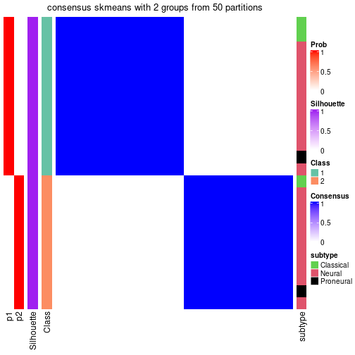</p>

</div>
<div id='tab-node-03-consensus-heatmap-2'>
<pre><code class="r">consensus_heatmap(res, k = 3)
</code></pre>

<p>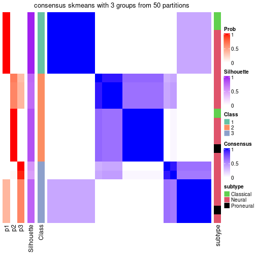</p>

</div>
<div id='tab-node-03-consensus-heatmap-3'>
<pre><code class="r">consensus_heatmap(res, k = 4)
</code></pre>

<p>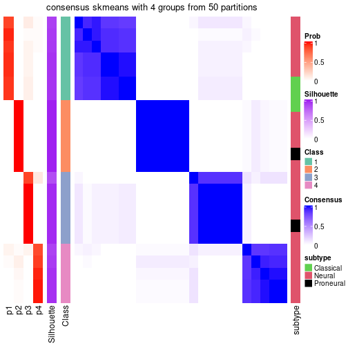</p>

</div>
</div>

Heatmaps for the membership of samples in all partitions to see how consistent they are:


<script>
$( function() {
	$( '#tabs-node-03-membership-heatmap' ).tabs();
} );
</script>
<div id='tabs-node-03-membership-heatmap'>
<ul>
<li><a href='#tab-node-03-membership-heatmap-1'>k = 2</a></li>
<li><a href='#tab-node-03-membership-heatmap-2'>k = 3</a></li>
<li><a href='#tab-node-03-membership-heatmap-3'>k = 4</a></li>
</ul>
<div id='tab-node-03-membership-heatmap-1'>
<pre><code class="r">membership_heatmap(res, k = 2)
</code></pre>

<p>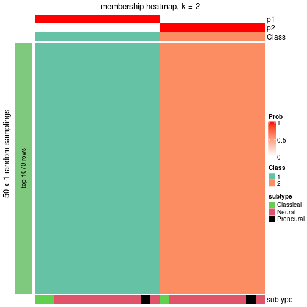</p>

</div>
<div id='tab-node-03-membership-heatmap-2'>
<pre><code class="r">membership_heatmap(res, k = 3)
</code></pre>

<p>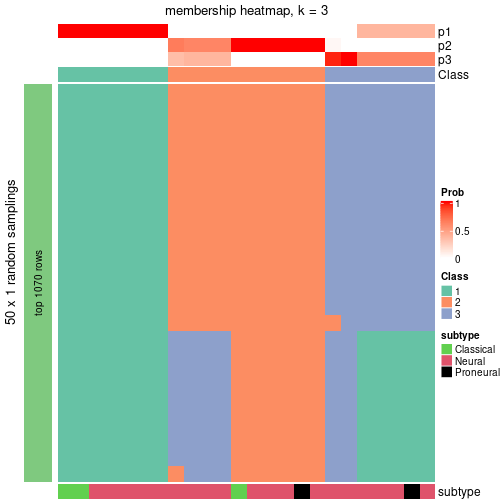</p>

</div>
<div id='tab-node-03-membership-heatmap-3'>
<pre><code class="r">membership_heatmap(res, k = 4)
</code></pre>

<p>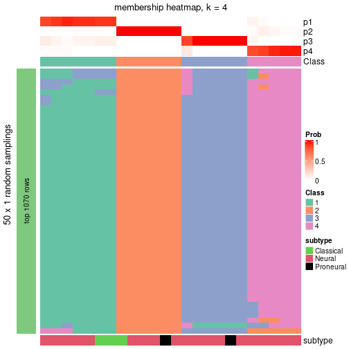</p>

</div>
</div>

As soon as the classes for columns are determined, the signatures
that are significantly different between subgroups can be looked for. 
Following are the heatmaps for signatures.


Signature heatmaps where rows are scaled:


<script>
$( function() {
	$( '#tabs-node-03-get-signatures' ).tabs();
} );
</script>
<div id='tabs-node-03-get-signatures'>
<ul>
<li><a href='#tab-node-03-get-signatures-1'>k = 2</a></li>
<li><a href='#tab-node-03-get-signatures-2'>k = 3</a></li>
<li><a href='#tab-node-03-get-signatures-3'>k = 4</a></li>
</ul>
<div id='tab-node-03-get-signatures-1'>
<pre><code class="r">get_signatures(res, k = 2)
</code></pre>

<p>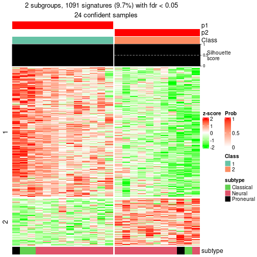</p>

</div>
<div id='tab-node-03-get-signatures-2'>
<pre><code class="r">get_signatures(res, k = 3)
</code></pre>

<p>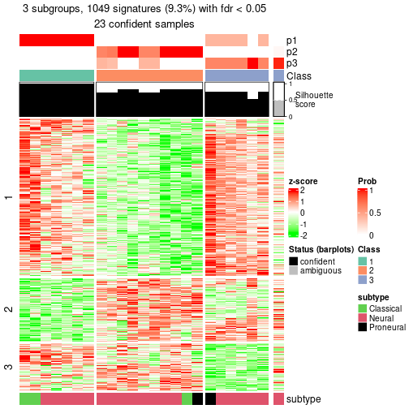</p>

</div>
<div id='tab-node-03-get-signatures-3'>
<pre><code class="r">get_signatures(res, k = 4)
</code></pre>

<p>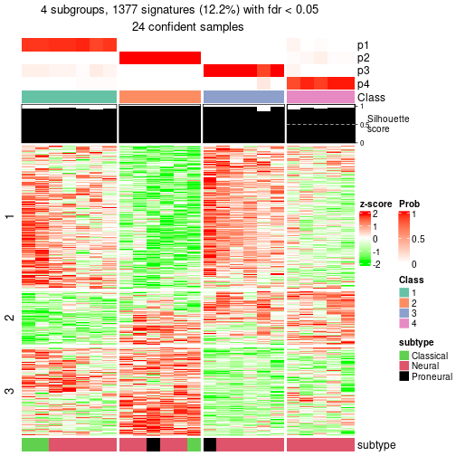</p>

</div>
</div>


Signature heatmaps where rows are not scaled:


<script>
$( function() {
	$( '#tabs-node-03-get-signatures-no-scale' ).tabs();
} );
</script>
<div id='tabs-node-03-get-signatures-no-scale'>
<ul>
<li><a href='#tab-node-03-get-signatures-no-scale-1'>k = 2</a></li>
<li><a href='#tab-node-03-get-signatures-no-scale-2'>k = 3</a></li>
<li><a href='#tab-node-03-get-signatures-no-scale-3'>k = 4</a></li>
</ul>
<div id='tab-node-03-get-signatures-no-scale-1'>
<pre><code class="r">get_signatures(res, k = 2, scale_rows = FALSE)
</code></pre>

<p>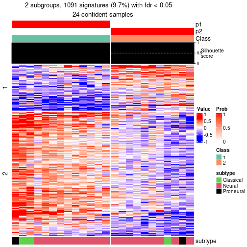</p>

</div>
<div id='tab-node-03-get-signatures-no-scale-2'>
<pre><code class="r">get_signatures(res, k = 3, scale_rows = FALSE)
</code></pre>

<p>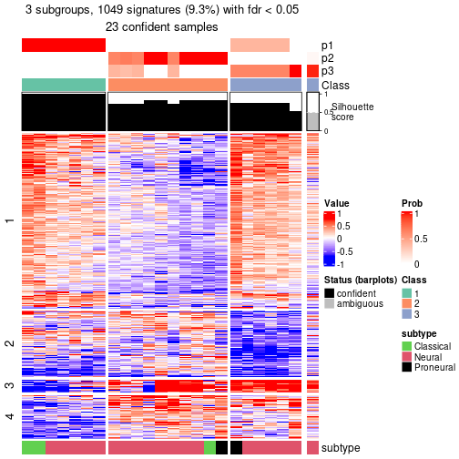</p>

</div>
<div id='tab-node-03-get-signatures-no-scale-3'>
<pre><code class="r">get_signatures(res, k = 4, scale_rows = FALSE)
</code></pre>

<p>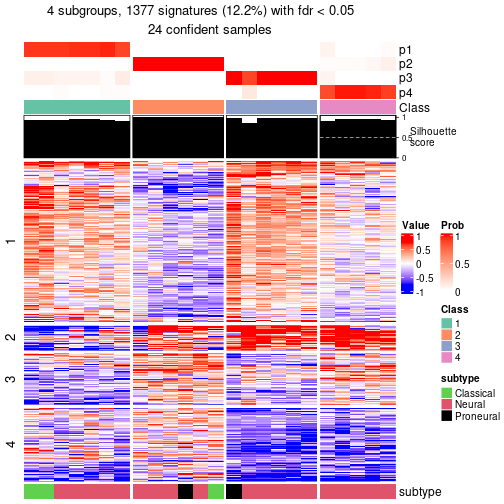</p>

</div>
</div>


Compare the overlap of signatures from different k:

```r
compare_signatures(res)
```

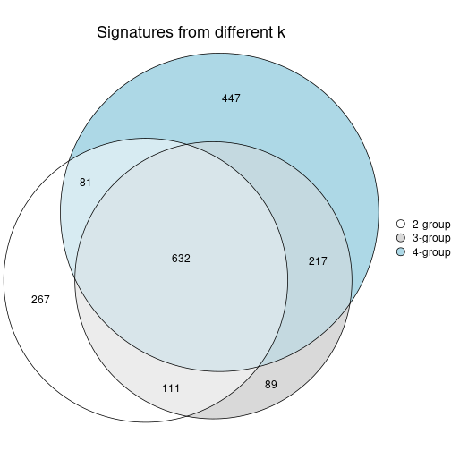

`get_signature()` returns a data frame invisibly. To get the list of signatures, the function
call should be assigned to a variable explicitly. In following code, if `plot` argument is set
to `FALSE`, no heatmap is plotted while only the differential analysis is performed.

```r
# code only for demonstration
tb = get_signature(res, k = ..., plot = FALSE)
```

An example of the output of `tb` is:

```
#>   which_row         fdr    mean_1    mean_2 scaled_mean_1 scaled_mean_2 km
#> 1        38 0.042760348  8.373488  9.131774    -0.5533452     0.5164555  1
#> 2        40 0.018707592  7.106213  8.469186    -0.6173731     0.5762149  1
#> 3        55 0.019134737 10.221463 11.207825    -0.6159697     0.5749050  1
#> 4        59 0.006059896  5.921854  7.869574    -0.6899429     0.6439467  1
#> 5        60 0.018055526  8.928898 10.211722    -0.6204761     0.5791110  1
#> 6        98 0.009384629 15.714769 14.887706     0.6635654    -0.6193277  2
...
```

The columns in `tb` are:

1. `which_row`: row indices corresponding to the input matrix.
2. `fdr`: FDR for the differential test. 
3. `mean_x`: The mean value in group x.
4. `scaled_mean_x`: The mean value in group x after rows are scaled.
5. `km`: Row groups if k-means clustering is applied to rows (which is done by automatically selecting number of clusters).

If there are too many signatures, `top_signatures = ...` can be set to only show the 
signatures with the highest FDRs:

```r
# code only for demonstration
# e.g. to show the top 500 most significant rows
tb = get_signature(res, k = ..., top_signatures = 500)
```

If the signatures are defined as these which are uniquely high in current group, `diff_method` argument
can be set to `"uniquely_high_in_one_group"`:

```r
# code only for demonstration
tb = get_signature(res, k = ..., diff_method = "uniquely_high_in_one_group")
```


UMAP plot which shows how samples are separated.


<script>
$( function() {
	$( '#tabs-node-03-dimension-reduction' ).tabs();
} );
</script>
<div id='tabs-node-03-dimension-reduction'>
<ul>
<li><a href='#tab-node-03-dimension-reduction-1'>k = 2</a></li>
<li><a href='#tab-node-03-dimension-reduction-2'>k = 3</a></li>
<li><a href='#tab-node-03-dimension-reduction-3'>k = 4</a></li>
</ul>
<div id='tab-node-03-dimension-reduction-1'>
<pre><code class="r">dimension_reduction(res, k = 2, method = &quot;UMAP&quot;)
</code></pre>

<p>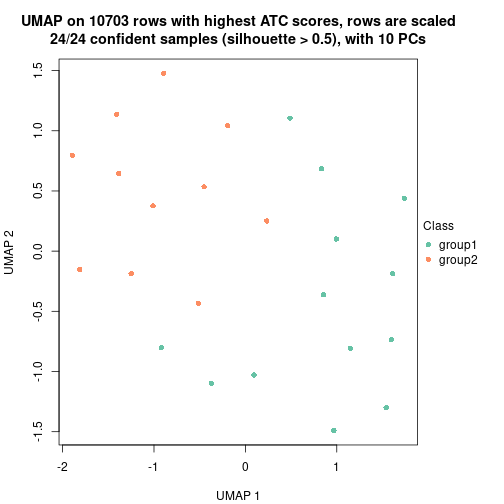</p>

</div>
<div id='tab-node-03-dimension-reduction-2'>
<pre><code class="r">dimension_reduction(res, k = 3, method = &quot;UMAP&quot;)
</code></pre>

<p>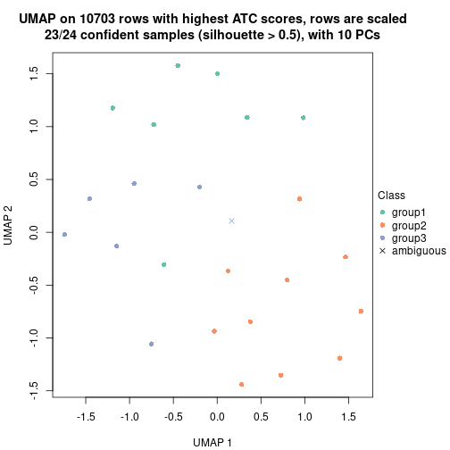</p>

</div>
<div id='tab-node-03-dimension-reduction-3'>
<pre><code class="r">dimension_reduction(res, k = 4, method = &quot;UMAP&quot;)
</code></pre>

<p>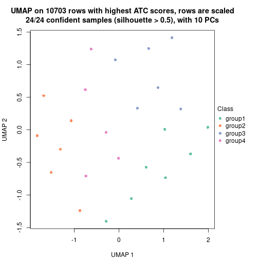</p>

</div>
</div>


Following heatmap shows how subgroups are split when increasing `k`:

```r
collect_classes(res)
```

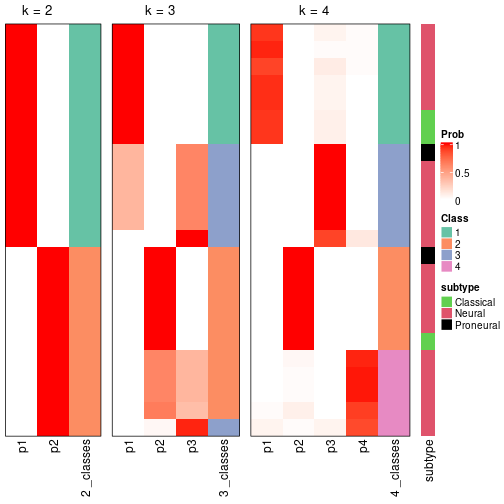


Test correlation between subgroups and known annotations. If the known
annotation is numeric, one-way ANOVA test is applied, and if the known
annotation is discrete, chi-squared contingency table test is applied.

```r
test_to_known_factors(res)
```

```
#>             n_sample subtype(p-value) k
#> ATC:skmeans       24            0.895 2
#> ATC:skmeans       23            0.512 3
#> ATC:skmeans       24            0.498 4
```


If matrix rows can be associated to genes, consider to use `functional_enrichment(res,
...)` to perform function enrichment for the signature genes. See [this vignette](https://jokergoo.github.io/cola_vignettes/functional_enrichment.html) for more detailed explanations.


 

---------------------------------------------------


### Node04


Parent node: [Node0](#Node0).
Child nodes: 
                Node011-leaf
        ,
                [Node012](#Node012)
        ,
                Node013-leaf
        ,
                [Node021](#Node021)
        ,
                [Node022](#Node022)
        ,
                Node023-leaf
        ,
                Node031-leaf
        ,
                Node032-leaf
        ,
                Node033-leaf
        ,
                Node034-leaf
        ,
                Node041-leaf
        ,
                Node042-leaf
        .


The object with results only for a single top-value method and a single partitioning method 
can be extracted as:

```r
res = res_rh["04"]
```

A summary of `res` and all the functions that can be applied to it:

```r
res
```

```
#> A 'ConsensusPartition' object with k = 2, 3, 4.
#>   On a matrix with 10703 rows and 31 columns.
#>   Top rows (1070) are extracted by 'ATC' method.
#>   Subgroups are detected by 'skmeans' method.
#>   Performed in total 150 partitions by row resampling.
#>   Best k for subgroups seems to be 2.
#> 
#> Following methods can be applied to this 'ConsensusPartition' object:
#>  [1] "cola_report"             "collect_classes"         "collect_plots"          
#>  [4] "collect_stats"           "colnames"                "compare_partitions"     
#>  [7] "compare_signatures"      "consensus_heatmap"       "dimension_reduction"    
#> [10] "functional_enrichment"   "get_anno_col"            "get_anno"               
#> [13] "get_classes"             "get_consensus"           "get_matrix"             
#> [16] "get_membership"          "get_param"               "get_signatures"         
#> [19] "get_stats"               "is_best_k"               "is_stable_k"            
#> [22] "membership_heatmap"      "ncol"                    "nrow"                   
#> [25] "plot_ecdf"               "predict_classes"         "rownames"               
#> [28] "select_partition_number" "show"                    "suggest_best_k"         
#> [31] "test_to_known_factors"   "top_rows_heatmap"
```

`collect_plots()` function collects all the plots made from `res` for all `k` (number of subgroups)
into one single page to provide an easy and fast comparison between different `k`.

```r
collect_plots(res)
```

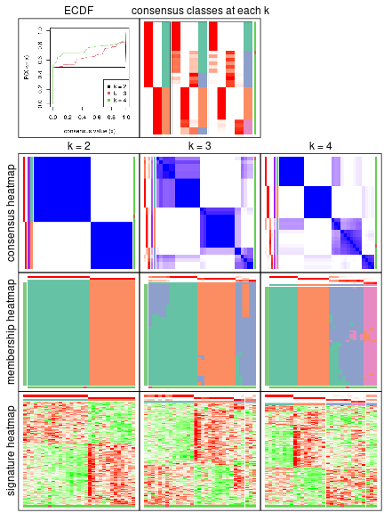

The plots are:

- The first row: a plot of the eCDF (empirical cumulative distribution
  function) curves of the consensus matrix for each `k` and the heatmap of
  predicted classes for each `k`.
- The second row: heatmaps of the consensus matrix for each `k`.
- The third row: heatmaps of the membership matrix for each `k`.
- The fouth row: heatmaps of the signatures for each `k`.

All the plots in panels can be made by individual functions and they are
plotted later in this section.

`select_partition_number()` produces several plots showing different
statistics for choosing "optimized" `k`. There are following statistics:

- eCDF curves of the consensus matrix for each `k`;
- 1-PAC. [The PAC score](https://en.wikipedia.org/wiki/Consensus_clustering#Over-interpretation_potential_of_consensus_clustering)
  measures the proportion of the ambiguous subgrouping.
- Mean silhouette score.
- Concordance. The mean probability of fiting the consensus subgroup labels in all
  partitions.
- Area increased. Denote $A_k$ as the area under the eCDF curve for current
  `k`, the area increased is defined as $A_k - A_{k-1}$.
- Rand index. The percent of pairs of samples that are both in a same cluster
  or both are not in a same cluster in the partition of k and k-1.
- Jaccard index. The ratio of pairs of samples are both in a same cluster in
  the partition of k and k-1 and the pairs of samples are both in a same
  cluster in the partition k or k-1.

The detailed explanations of these statistics can be found in [the _cola_
vignette](https://jokergoo.github.io/cola_vignettes/cola.html#toc_13).

Generally speaking, higher 1-PAC score, higher mean silhouette score or higher
concordance corresponds to better partition. Rand index and Jaccard index
measure how similar the current partition is compared to partition with `k-1`.
If they are too similar, we won't accept `k` is better than `k-1`.

```r
select_partition_number(res)
```

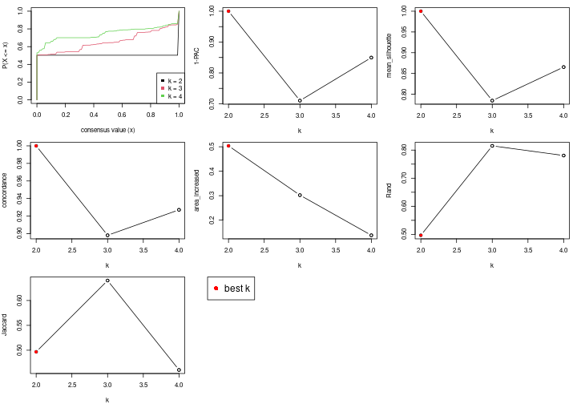

The numeric values for all these statistics can be obtained by `get_stats()`.

```r
get_stats(res)
```

```
#>   k 1-PAC mean_silhouette concordance area_increased  Rand Jaccard
#> 2 2  1.00           1.000       1.000          0.504 0.497   0.497
#> 3 3  0.71           0.785       0.898          0.302 0.815   0.640
#> 4 4  0.85           0.865       0.927          0.138 0.781   0.460
```

`suggest_best_k()` suggests the best $k$ based on these statistics. The rules are as follows:

- All $k$ with Jaccard index larger than 0.95 are removed because increasing
  $k$ does not provide enough extra information. If all $k$ are removed, it is
  marked as no subgroup is detected.
- For all $k$ with 1-PAC score larger than 0.9, the maximal $k$ is taken as
  the best $k$, and other $k$ are marked as optional $k$.
- If it does not fit the second rule. The $k$ with the maximal vote of the
  highest 1-PAC score, highest mean silhouette, and highest concordance is
  taken as the best $k$.

```r
suggest_best_k(res)
```

```
#> [1] 2
```


Following is the table of the partitions (You need to click the **show/hide
code output** link to see it). The membership matrix (columns with name `p*`)
is inferred by
[`clue::cl_consensus()`](https://www.rdocumentation.org/link/cl_consensus?package=clue)
function with the `SE` method. Basically the value in the membership matrix
represents the probability to belong to a certain group. The finall subgroup
label for an item is determined with the group with highest probability it
belongs to.

In `get_classes()` function, the entropy is calculated from the membership
matrix and the silhouette score is calculated from the consensus matrix.


<script>
$( function() {
	$( '#tabs-node-04-get-classes' ).tabs();
} );
</script>
<div id='tabs-node-04-get-classes'>
<ul>
<li><a href='#tab-node-04-get-classes-1'>k = 2</a></li>
<li><a href='#tab-node-04-get-classes-2'>k = 3</a></li>
<li><a href='#tab-node-04-get-classes-3'>k = 4</a></li>
</ul>

<div id='tab-node-04-get-classes-1'>
<p><a id='tab-node-04-get-classes-1-a' style='color:#0366d6' href='#'>show/hide code output</a></p>
<pre><code class="r">cbind(get_classes(res, k = 2), get_membership(res, k = 2))
</code></pre>

<pre><code>#&gt;                     class entropy silhouette p1 p2
#&gt; TCGA-08-0386-01A-01     1       0          1  1  0
#&gt; TCGA-02-0007-01A-01     1       0          1  1  0
#&gt; TCGA-02-0009-01A-01     1       0          1  1  0
#&gt; TCGA-02-0016-01A-01     2       0          1  0  1
#&gt; TCGA-02-0021-01A-01     1       0          1  1  0
#&gt; TCGA-02-0023-01B-01     2       0          1  0  1
#&gt; TCGA-02-0043-01A-01     1       0          1  1  0
#&gt; TCGA-02-0070-01A-01     2       0          1  0  1
#&gt; TCGA-02-0102-01A-01     1       0          1  1  0
#&gt; TCGA-02-0260-01A-03     2       0          1  0  1
#&gt; TCGA-02-0269-01B-01     2       0          1  0  1
#&gt; TCGA-02-0285-01A-01     2       0          1  0  1
#&gt; TCGA-02-0289-01A-01     2       0          1  0  1
#&gt; TCGA-02-0317-01A-01     2       0          1  0  1
#&gt; TCGA-02-0333-01A-02     2       0          1  0  1
#&gt; TCGA-02-0422-01A-01     2       0          1  0  1
#&gt; TCGA-02-0430-01A-01     1       0          1  1  0
#&gt; TCGA-06-0125-01A-01     1       0          1  1  0
#&gt; TCGA-06-0126-01A-01     1       0          1  1  0
#&gt; TCGA-06-0137-01A-03     1       0          1  1  0
#&gt; TCGA-06-0145-01A-04     1       0          1  1  0
#&gt; TCGA-06-0148-01A-01     2       0          1  0  1
#&gt; TCGA-06-0211-01B-01     1       0          1  1  0
#&gt; TCGA-06-0402-01A-01     1       0          1  1  0
#&gt; TCGA-08-0357-01A-01     2       0          1  0  1
#&gt; TCGA-08-0358-01A-01     2       0          1  0  1
#&gt; TCGA-08-0511-01A-01     1       0          1  1  0
#&gt; TCGA-08-0514-01A-01     1       0          1  1  0
#&gt; TCGA-08-0518-01A-01     1       0          1  1  0
#&gt; TCGA-08-0529-01A-02     1       0          1  1  0
#&gt; TCGA-08-0531-01A-01     1       0          1  1  0
</code></pre>

<script>
$('#tab-node-04-get-classes-1-a').parent().next().next().hide();
$('#tab-node-04-get-classes-1-a').click(function(){
  $('#tab-node-04-get-classes-1-a').parent().next().next().toggle();
  return(false);
});
</script>
</div>

<div id='tab-node-04-get-classes-2'>
<p><a id='tab-node-04-get-classes-2-a' style='color:#0366d6' href='#'>show/hide code output</a></p>
<pre><code class="r">cbind(get_classes(res, k = 3), get_membership(res, k = 3))
</code></pre>

<pre><code>#&gt;                     class entropy silhouette   p1   p2   p3
#&gt; TCGA-08-0386-01A-01     1   0.619      0.515 0.58 0.00 0.42
#&gt; TCGA-02-0007-01A-01     1   0.455      0.760 0.80 0.00 0.20
#&gt; TCGA-02-0009-01A-01     1   0.000      0.830 1.00 0.00 0.00
#&gt; TCGA-02-0016-01A-01     2   0.369      0.838 0.00 0.86 0.14
#&gt; TCGA-02-0021-01A-01     1   0.000      0.830 1.00 0.00 0.00
#&gt; TCGA-02-0023-01B-01     2   0.000      0.976 0.00 1.00 0.00
#&gt; TCGA-02-0043-01A-01     1   0.000      0.830 1.00 0.00 0.00
#&gt; TCGA-02-0070-01A-01     2   0.254      0.907 0.00 0.92 0.08
#&gt; TCGA-02-0102-01A-01     1   0.000      0.830 1.00 0.00 0.00
#&gt; TCGA-02-0260-01A-03     2   0.000      0.976 0.00 1.00 0.00
#&gt; TCGA-02-0269-01B-01     2   0.000      0.976 0.00 1.00 0.00
#&gt; TCGA-02-0285-01A-01     2   0.000      0.976 0.00 1.00 0.00
#&gt; TCGA-02-0289-01A-01     2   0.000      0.976 0.00 1.00 0.00
#&gt; TCGA-02-0317-01A-01     2   0.000      0.976 0.00 1.00 0.00
#&gt; TCGA-02-0333-01A-02     2   0.000      0.976 0.00 1.00 0.00
#&gt; TCGA-02-0422-01A-01     3   0.571      0.441 0.00 0.32 0.68
#&gt; TCGA-02-0430-01A-01     1   0.571      0.684 0.68 0.00 0.32
#&gt; TCGA-06-0125-01A-01     1   0.000      0.830 1.00 0.00 0.00
#&gt; TCGA-06-0126-01A-01     1   0.000      0.830 1.00 0.00 0.00
#&gt; TCGA-06-0137-01A-03     1   0.000      0.830 1.00 0.00 0.00
#&gt; TCGA-06-0145-01A-04     1   0.000      0.830 1.00 0.00 0.00
#&gt; TCGA-06-0148-01A-01     2   0.000      0.976 0.00 1.00 0.00
#&gt; TCGA-06-0211-01B-01     3   0.000      0.696 0.00 0.00 1.00
#&gt; TCGA-06-0402-01A-01     1   0.556      0.703 0.70 0.00 0.30
#&gt; TCGA-08-0357-01A-01     3   0.571      0.441 0.00 0.32 0.68
#&gt; TCGA-08-0358-01A-01     2   0.000      0.976 0.00 1.00 0.00
#&gt; TCGA-08-0511-01A-01     1   0.571      0.684 0.68 0.00 0.32
#&gt; TCGA-08-0514-01A-01     3   0.556      0.246 0.30 0.00 0.70
#&gt; TCGA-08-0518-01A-01     1   0.556      0.703 0.70 0.00 0.30
#&gt; TCGA-08-0529-01A-02     3   0.369      0.585 0.14 0.00 0.86
#&gt; TCGA-08-0531-01A-01     3   0.000      0.696 0.00 0.00 1.00
</code></pre>

<script>
$('#tab-node-04-get-classes-2-a').parent().next().next().hide();
$('#tab-node-04-get-classes-2-a').click(function(){
  $('#tab-node-04-get-classes-2-a').parent().next().next().toggle();
  return(false);
});
</script>
</div>

<div id='tab-node-04-get-classes-3'>
<p><a id='tab-node-04-get-classes-3-a' style='color:#0366d6' href='#'>show/hide code output</a></p>
<pre><code class="r">cbind(get_classes(res, k = 4), get_membership(res, k = 4))
</code></pre>

<pre><code>#&gt;                     class entropy silhouette   p1   p2   p3   p4
#&gt; TCGA-08-0386-01A-01     3  0.1913      0.750 0.04 0.00 0.94 0.02
#&gt; TCGA-02-0007-01A-01     3  0.5606      0.292 0.48 0.00 0.50 0.02
#&gt; TCGA-02-0009-01A-01     1  0.0000      1.000 1.00 0.00 0.00 0.00
#&gt; TCGA-02-0016-01A-01     4  0.1637      0.924 0.00 0.06 0.00 0.94
#&gt; TCGA-02-0021-01A-01     1  0.0000      1.000 1.00 0.00 0.00 0.00
#&gt; TCGA-02-0023-01B-01     2  0.0000      1.000 0.00 1.00 0.00 0.00
#&gt; TCGA-02-0043-01A-01     1  0.0000      1.000 1.00 0.00 0.00 0.00
#&gt; TCGA-02-0070-01A-01     4  0.2921      0.883 0.00 0.14 0.00 0.86
#&gt; TCGA-02-0102-01A-01     1  0.0000      1.000 1.00 0.00 0.00 0.00
#&gt; TCGA-02-0260-01A-03     2  0.0000      1.000 0.00 1.00 0.00 0.00
#&gt; TCGA-02-0269-01B-01     2  0.0000      1.000 0.00 1.00 0.00 0.00
#&gt; TCGA-02-0285-01A-01     2  0.0000      1.000 0.00 1.00 0.00 0.00
#&gt; TCGA-02-0289-01A-01     2  0.0000      1.000 0.00 1.00 0.00 0.00
#&gt; TCGA-02-0317-01A-01     2  0.0000      1.000 0.00 1.00 0.00 0.00
#&gt; TCGA-02-0333-01A-02     2  0.0000      1.000 0.00 1.00 0.00 0.00
#&gt; TCGA-02-0422-01A-01     4  0.1637      0.921 0.00 0.06 0.00 0.94
#&gt; TCGA-02-0430-01A-01     3  0.2345      0.755 0.10 0.00 0.90 0.00
#&gt; TCGA-06-0125-01A-01     1  0.0000      1.000 1.00 0.00 0.00 0.00
#&gt; TCGA-06-0126-01A-01     1  0.0000      1.000 1.00 0.00 0.00 0.00
#&gt; TCGA-06-0137-01A-03     1  0.0000      1.000 1.00 0.00 0.00 0.00
#&gt; TCGA-06-0145-01A-04     1  0.0000      1.000 1.00 0.00 0.00 0.00
#&gt; TCGA-06-0148-01A-01     2  0.0000      1.000 0.00 1.00 0.00 0.00
#&gt; TCGA-06-0211-01B-01     3  0.1637      0.721 0.00 0.00 0.94 0.06
#&gt; TCGA-06-0402-01A-01     3  0.4948      0.415 0.44 0.00 0.56 0.00
#&gt; TCGA-08-0357-01A-01     4  0.0707      0.914 0.00 0.02 0.00 0.98
#&gt; TCGA-08-0358-01A-01     2  0.0000      1.000 0.00 1.00 0.00 0.00
#&gt; TCGA-08-0511-01A-01     3  0.2647      0.750 0.12 0.00 0.88 0.00
#&gt; TCGA-08-0514-01A-01     3  0.0000      0.736 0.00 0.00 1.00 0.00
#&gt; TCGA-08-0518-01A-01     3  0.4977      0.374 0.46 0.00 0.54 0.00
#&gt; TCGA-08-0529-01A-02     3  0.3247      0.709 0.06 0.00 0.88 0.06
#&gt; TCGA-08-0531-01A-01     3  0.2647      0.683 0.00 0.00 0.88 0.12
</code></pre>

<script>
$('#tab-node-04-get-classes-3-a').parent().next().next().hide();
$('#tab-node-04-get-classes-3-a').click(function(){
  $('#tab-node-04-get-classes-3-a').parent().next().next().toggle();
  return(false);
});
</script>
</div>
</div>

Heatmaps for the consensus matrix. It visualizes the probability of two
samples to be in a same group.


<script>
$( function() {
	$( '#tabs-node-04-consensus-heatmap' ).tabs();
} );
</script>
<div id='tabs-node-04-consensus-heatmap'>
<ul>
<li><a href='#tab-node-04-consensus-heatmap-1'>k = 2</a></li>
<li><a href='#tab-node-04-consensus-heatmap-2'>k = 3</a></li>
<li><a href='#tab-node-04-consensus-heatmap-3'>k = 4</a></li>
</ul>
<div id='tab-node-04-consensus-heatmap-1'>
<pre><code class="r">consensus_heatmap(res, k = 2)
</code></pre>

<p>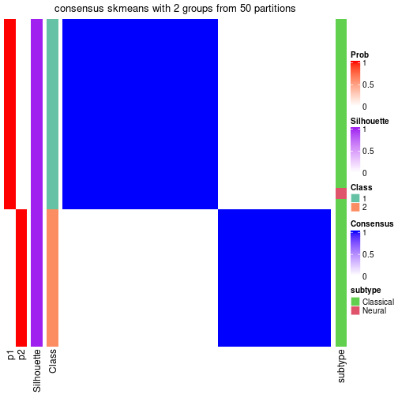</p>

</div>
<div id='tab-node-04-consensus-heatmap-2'>
<pre><code class="r">consensus_heatmap(res, k = 3)
</code></pre>

<p>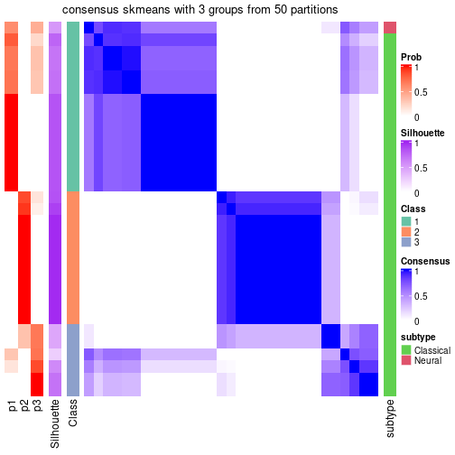</p>

</div>
<div id='tab-node-04-consensus-heatmap-3'>
<pre><code class="r">consensus_heatmap(res, k = 4)
</code></pre>

<p>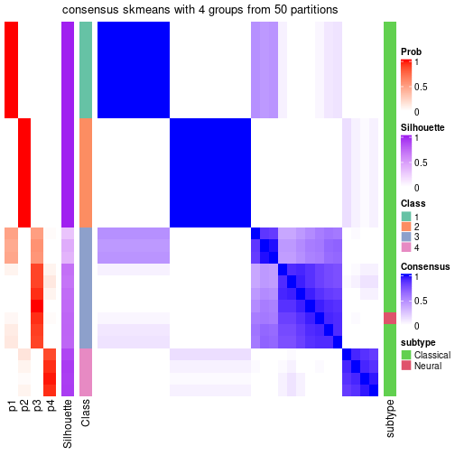</p>

</div>
</div>

Heatmaps for the membership of samples in all partitions to see how consistent they are:


<script>
$( function() {
	$( '#tabs-node-04-membership-heatmap' ).tabs();
} );
</script>
<div id='tabs-node-04-membership-heatmap'>
<ul>
<li><a href='#tab-node-04-membership-heatmap-1'>k = 2</a></li>
<li><a href='#tab-node-04-membership-heatmap-2'>k = 3</a></li>
<li><a href='#tab-node-04-membership-heatmap-3'>k = 4</a></li>
</ul>
<div id='tab-node-04-membership-heatmap-1'>
<pre><code class="r">membership_heatmap(res, k = 2)
</code></pre>

<p>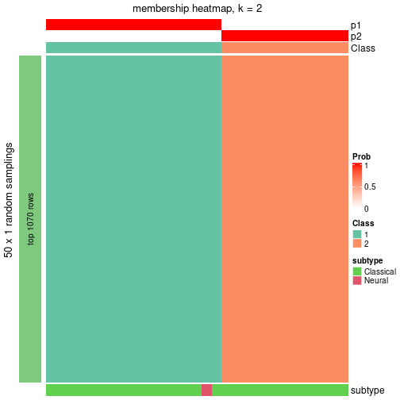</p>

</div>
<div id='tab-node-04-membership-heatmap-2'>
<pre><code class="r">membership_heatmap(res, k = 3)
</code></pre>

<p>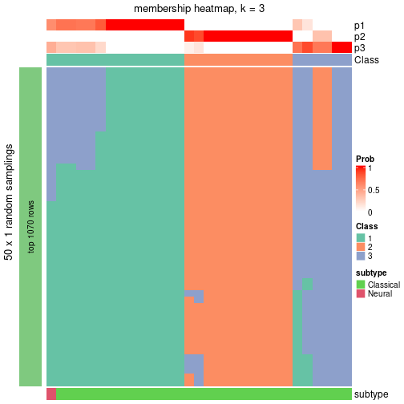</p>

</div>
<div id='tab-node-04-membership-heatmap-3'>
<pre><code class="r">membership_heatmap(res, k = 4)
</code></pre>

<p>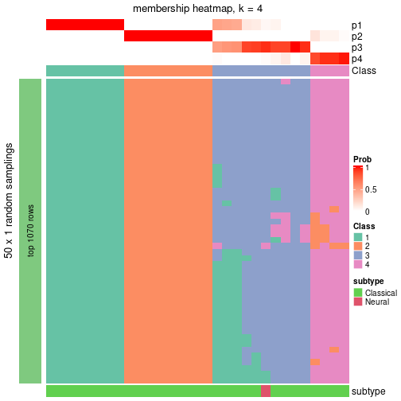</p>

</div>
</div>

As soon as the classes for columns are determined, the signatures
that are significantly different between subgroups can be looked for. 
Following are the heatmaps for signatures.


Signature heatmaps where rows are scaled:


<script>
$( function() {
	$( '#tabs-node-04-get-signatures' ).tabs();
} );
</script>
<div id='tabs-node-04-get-signatures'>
<ul>
<li><a href='#tab-node-04-get-signatures-1'>k = 2</a></li>
<li><a href='#tab-node-04-get-signatures-2'>k = 3</a></li>
<li><a href='#tab-node-04-get-signatures-3'>k = 4</a></li>
</ul>
<div id='tab-node-04-get-signatures-1'>
<pre><code class="r">get_signatures(res, k = 2)
</code></pre>

<p>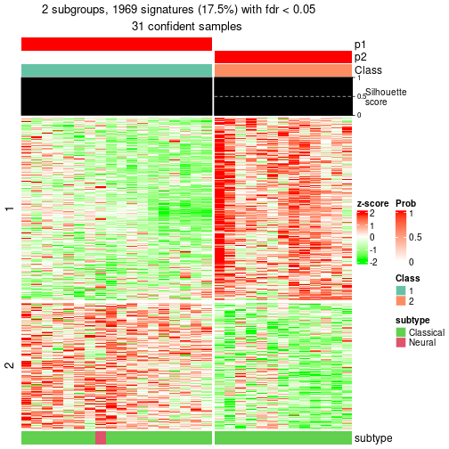</p>

</div>
<div id='tab-node-04-get-signatures-2'>
<pre><code class="r">get_signatures(res, k = 3)
</code></pre>

<p>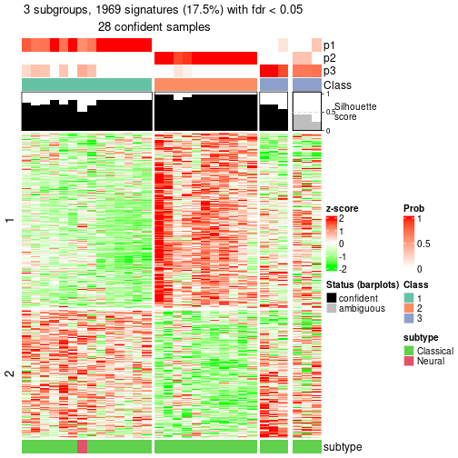</p>

</div>
<div id='tab-node-04-get-signatures-3'>
<pre><code class="r">get_signatures(res, k = 4)
</code></pre>

<p>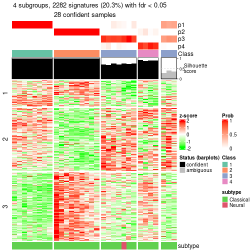</p>

</div>
</div>


Signature heatmaps where rows are not scaled:


<script>
$( function() {
	$( '#tabs-node-04-get-signatures-no-scale' ).tabs();
} );
</script>
<div id='tabs-node-04-get-signatures-no-scale'>
<ul>
<li><a href='#tab-node-04-get-signatures-no-scale-1'>k = 2</a></li>
<li><a href='#tab-node-04-get-signatures-no-scale-2'>k = 3</a></li>
<li><a href='#tab-node-04-get-signatures-no-scale-3'>k = 4</a></li>
</ul>
<div id='tab-node-04-get-signatures-no-scale-1'>
<pre><code class="r">get_signatures(res, k = 2, scale_rows = FALSE)
</code></pre>

<p>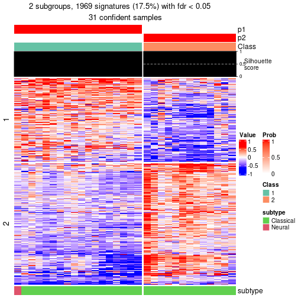</p>

</div>
<div id='tab-node-04-get-signatures-no-scale-2'>
<pre><code class="r">get_signatures(res, k = 3, scale_rows = FALSE)
</code></pre>

<p>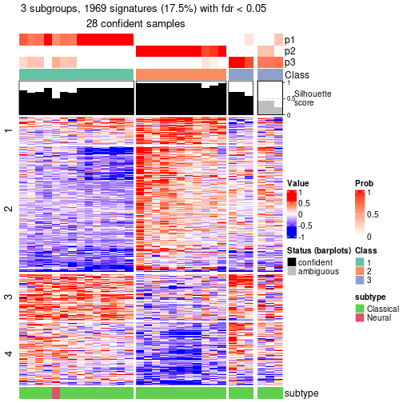</p>

</div>
<div id='tab-node-04-get-signatures-no-scale-3'>
<pre><code class="r">get_signatures(res, k = 4, scale_rows = FALSE)
</code></pre>

<p>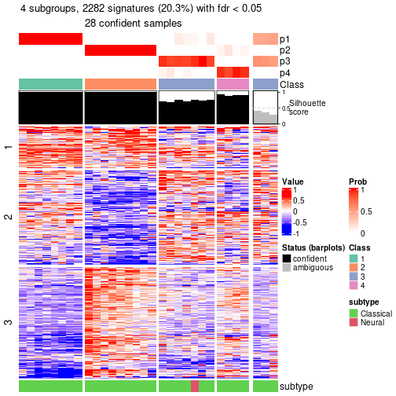</p>

</div>
</div>


Compare the overlap of signatures from different k:

```r
compare_signatures(res)
```

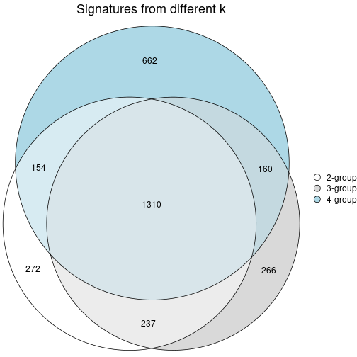

`get_signature()` returns a data frame invisibly. To get the list of signatures, the function
call should be assigned to a variable explicitly. In following code, if `plot` argument is set
to `FALSE`, no heatmap is plotted while only the differential analysis is performed.

```r
# code only for demonstration
tb = get_signature(res, k = ..., plot = FALSE)
```

An example of the output of `tb` is:

```
#>   which_row         fdr    mean_1    mean_2 scaled_mean_1 scaled_mean_2 km
#> 1        38 0.042760348  8.373488  9.131774    -0.5533452     0.5164555  1
#> 2        40 0.018707592  7.106213  8.469186    -0.6173731     0.5762149  1
#> 3        55 0.019134737 10.221463 11.207825    -0.6159697     0.5749050  1
#> 4        59 0.006059896  5.921854  7.869574    -0.6899429     0.6439467  1
#> 5        60 0.018055526  8.928898 10.211722    -0.6204761     0.5791110  1
#> 6        98 0.009384629 15.714769 14.887706     0.6635654    -0.6193277  2
...
```

The columns in `tb` are:

1. `which_row`: row indices corresponding to the input matrix.
2. `fdr`: FDR for the differential test. 
3. `mean_x`: The mean value in group x.
4. `scaled_mean_x`: The mean value in group x after rows are scaled.
5. `km`: Row groups if k-means clustering is applied to rows (which is done by automatically selecting number of clusters).

If there are too many signatures, `top_signatures = ...` can be set to only show the 
signatures with the highest FDRs:

```r
# code only for demonstration
# e.g. to show the top 500 most significant rows
tb = get_signature(res, k = ..., top_signatures = 500)
```

If the signatures are defined as these which are uniquely high in current group, `diff_method` argument
can be set to `"uniquely_high_in_one_group"`:

```r
# code only for demonstration
tb = get_signature(res, k = ..., diff_method = "uniquely_high_in_one_group")
```


UMAP plot which shows how samples are separated.


<script>
$( function() {
	$( '#tabs-node-04-dimension-reduction' ).tabs();
} );
</script>
<div id='tabs-node-04-dimension-reduction'>
<ul>
<li><a href='#tab-node-04-dimension-reduction-1'>k = 2</a></li>
<li><a href='#tab-node-04-dimension-reduction-2'>k = 3</a></li>
<li><a href='#tab-node-04-dimension-reduction-3'>k = 4</a></li>
</ul>
<div id='tab-node-04-dimension-reduction-1'>
<pre><code class="r">dimension_reduction(res, k = 2, method = &quot;UMAP&quot;)
</code></pre>

<p>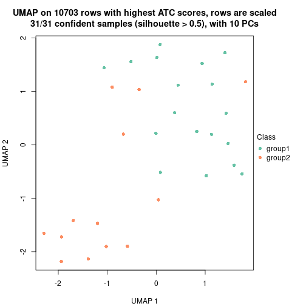</p>

</div>
<div id='tab-node-04-dimension-reduction-2'>
<pre><code class="r">dimension_reduction(res, k = 3, method = &quot;UMAP&quot;)
</code></pre>

<p>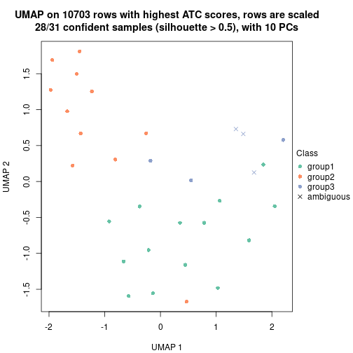</p>

</div>
<div id='tab-node-04-dimension-reduction-3'>
<pre><code class="r">dimension_reduction(res, k = 4, method = &quot;UMAP&quot;)
</code></pre>

<p>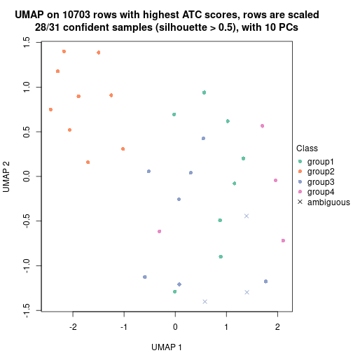</p>

</div>
</div>


Following heatmap shows how subgroups are split when increasing `k`:

```r
collect_classes(res)
```

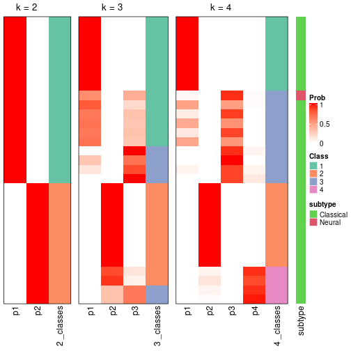


Test correlation between subgroups and known annotations. If the known
annotation is numeric, one-way ANOVA test is applied, and if the known
annotation is discrete, chi-squared contingency table test is applied.

```r
test_to_known_factors(res)
```

```
#>             n_sample subtype(p-value) k
#> ATC:skmeans       31            1.000 2
#> ATC:skmeans       28            0.595 3
#> ATC:skmeans       28            0.375 4
```


If matrix rows can be associated to genes, consider to use `functional_enrichment(res,
...)` to perform function enrichment for the signature genes. See [this vignette](https://jokergoo.github.io/cola_vignettes/functional_enrichment.html) for more detailed explanations.


 

## Session info


```r
sessionInfo()
```

```
#> R version 4.1.0 (2021-05-18)
#> Platform: x86_64-pc-linux-gnu (64-bit)
#> Running under: CentOS Linux 7 (Core)
#> 
#> Matrix products: default
#> BLAS/LAPACK: /usr/lib64/libopenblas-r0.3.3.so
#> 
#> locale:
#>  [1] LC_CTYPE=en_US.UTF-8       LC_NUMERIC=C               LC_TIME=en_US.UTF-8       
#>  [4] LC_COLLATE=en_US.UTF-8     LC_MONETARY=en_US.UTF-8    LC_MESSAGES=en_US.UTF-8   
#>  [7] LC_PAPER=en_US.UTF-8       LC_NAME=C                  LC_ADDRESS=C              
#> [10] LC_TELEPHONE=C             LC_MEASUREMENT=en_US.UTF-8 LC_IDENTIFICATION=C       
#> 
#> attached base packages:
#> [1] grid      stats     graphics  grDevices utils     datasets  methods   base     
#> 
#> other attached packages:
#> [1] genefilter_1.74.0     ComplexHeatmap_2.8.0  markdown_1.1          knitr_1.33           
#> [5] preprocessCore_1.54.0 RColorBrewer_1.1-2    cola_1.9.4           
#> 
#> loaded via a namespace (and not attached):
#>   [1] colorspace_2.0-2       rjson_0.2.20           ellipsis_0.3.2         mclust_5.4.7          
#>   [5] circlize_0.4.13        XVector_0.32.0         GlobalOptions_0.1.2    clue_0.3-59           
#>   [9] rstudioapi_0.13        bit64_4.0.5            AnnotationDbi_1.54.1   Polychrome_1.3.1      
#>  [13] RSpectra_0.16-0        fansi_0.5.0            xml2_1.3.2             codetools_0.2-18      
#>  [17] splines_4.1.0          doParallel_1.0.16      cachem_1.0.5           impute_1.66.0         
#>  [21] polyclip_1.10-0        jsonlite_1.7.2         Cairo_1.5-12.2         umap_0.2.7.0          
#>  [25] annotate_1.70.0        cluster_2.1.2          png_0.1-7              data.tree_1.0.0       
#>  [29] compiler_4.1.0         httr_1.4.2             assertthat_0.2.1       Matrix_1.3-4          
#>  [33] fastmap_1.1.0          tools_4.1.0            gtable_0.3.0           glue_1.4.2            
#>  [37] GenomeInfoDbData_1.2.6 dplyr_1.0.7            Rcpp_1.0.7             slam_0.1-48           
#>  [41] Biobase_2.52.0         eulerr_6.1.0           vctrs_0.3.8            Biostrings_2.60.1     
#>  [45] iterators_1.0.13       polylabelr_0.2.0       xfun_0.24              stringr_1.4.0         
#>  [49] lifecycle_1.0.0        irlba_2.3.3            XML_3.99-0.6           dendextend_1.15.1     
#>  [53] zlibbioc_1.38.0        scales_1.1.1           microbenchmark_1.4-7   parallel_4.1.0        
#>  [57] memoise_2.0.0          reticulate_1.20        gridExtra_2.3          ggplot2_3.3.5         
#>  [61] stringi_1.7.3          RSQLite_2.2.7          highr_0.9              S4Vectors_0.30.0      
#>  [65] foreach_1.5.1          BiocGenerics_0.38.0    shape_1.4.6            GenomeInfoDb_1.28.1   
#>  [69] rlang_0.4.11           pkgconfig_2.0.3        matrixStats_0.59.0     bitops_1.0-7          
#>  [73] evaluate_0.14          lattice_0.20-44        purrr_0.3.4            bit_4.0.4             
#>  [77] tidyselect_1.1.1       magrittr_2.0.1         R6_2.5.0               IRanges_2.26.0        
#>  [81] generics_0.1.0         DBI_1.1.1              pillar_1.6.1           survival_3.2-11       
#>  [85] KEGGREST_1.32.0        scatterplot3d_0.3-41   RCurl_1.98-1.3         tibble_3.1.2          
#>  [89] crayon_1.4.1           utf8_1.2.1             skmeans_0.2-13         viridis_0.6.1         
#>  [93] GetoptLong_1.0.5       blob_1.2.1             digest_0.6.27          xtable_1.8-4          
#>  [97] brew_1.0-6             openssl_1.4.4          stats4_4.1.0           munsell_0.5.0         
#> [101] viridisLite_0.4.0      askpass_1.1
```


